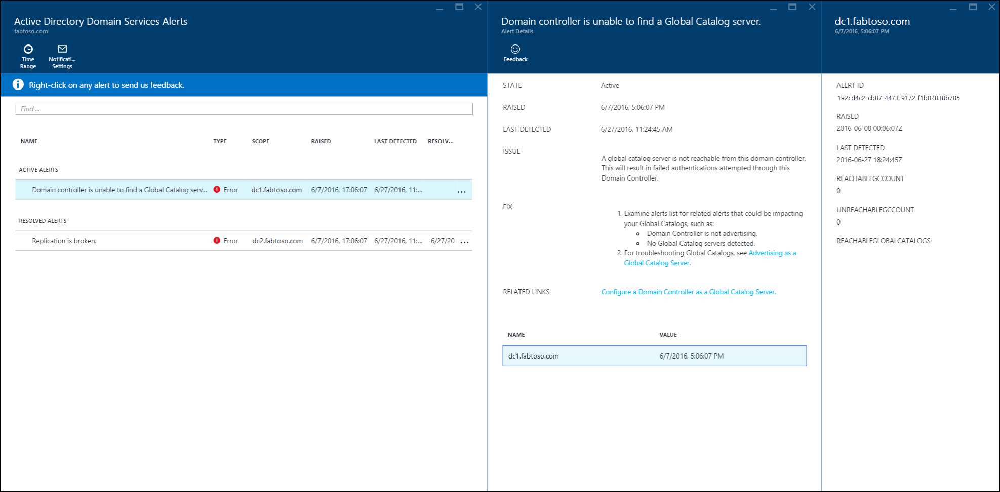

# Using Microsoft Entra Connect Health with AD DS
The following documentation is specific to monitoring Active Directory Domain Services with Microsoft Entra Connect Health. The supported versions of AD DS are: Windows Server 2008 R2, Windows Server 2012, Windows Server 2012 R2, and Windows Server 2016.

For more information on monitoring AD FS with Microsoft Entra Connect Health, see [Using Microsoft Entra Connect Health with AD FS](how-to-connect-health-adfs.md). Additionally, for information on monitoring Microsoft Entra Connect (Sync) with Microsoft Entra Connect Health see [Using Microsoft Entra Connect Health for Sync](how-to-connect-health-sync.md).

## Alerts for Microsoft Entra Connect Health for AD DS
The Alerts section within Microsoft Entra Connect Health for AD DS, provides you a list of active and resolved alerts, related to your domain controllers. Selecting an active or resolved alert opens a new blade with additional information, along with resolution steps, and links to supporting documentation. Each alert type can have one or more instances, which correspond to each of the domain controllers affected by that particular alert. Near the bottom of the alert blade, you can double-click an affected domain controller to open an additional blade with more details about that alert instance.

Within this blade, you can enable email notifications for alerts and change the time range in view. Expanding the time range allows you to see prior resolved alerts.

## Domain Controllers Dashboard
This dashboard provides a topological view of your environment, along with key operational metrics and health status of each of your monitored domain controllers. The presented metrics help to quickly identify, any domain controllers that might require further investigation. By default, only a subset of the columns is displayed. However, you can find the entire set of available columns, by double-clicking the columns command. Selecting the columns that you most care about, turns this dashboard into a single and easy place to view the health of your AD DS environment.

Domain controllers can be grouped by their respective domain or site, which is helpful for understanding the environment topology. Lastly, if you double-click the blade header, the dashboard maximizes to utilize the available screen real-estate. This larger view is helpful when multiple columns are displayed.

## Replication Status Dashboard
This dashboard provides a view of the replication status and replication topology of your monitored domain controllers. The status of the most recent replication attempt is listed, along with helpful documentation for any error that is found. You can double-click a domain controller with an error, to open a new blade with information such as: details about the error, recommended resolution steps, and links to troubleshooting documentation.

## Monitoring
This feature provides graphical trends of different performance counters, which are continuously collected from each of the monitored domain controllers. Performance of a domain controller can easily be compared across all other monitored domain controllers in your forest. Additionally, you can see various performance counters side by side, which is helpful when troubleshooting issues in your environment.

By default, we have preselected four performance counters; however, you can include others by clicking the filter command and selecting or deselecting any desired performance counters. Additionally, you can double-click a performance counter graph to open a new blade, which includes data points for each of the monitored domain controllers.

## Related links
* [Microsoft Entra Connect Health](./whatis-azure-ad-connect.md)
* [Microsoft Entra Connect Health Agent Installation](how-to-connect-health-agent-install.md)
* [Microsoft Entra Connect Health Operations](how-to-connect-health-operations.md)
* [Using Microsoft Entra Connect Health with AD FS](how-to-connect-health-adfs.md)
* [Using Microsoft Entra Connect Health for sync](how-to-connect-health-sync.md)
* [Microsoft Entra Connect Health FAQ](reference-connect-health-faq.yml)
* [Microsoft Entra Connect Health Version History](reference-connect-health-version-history.md)
