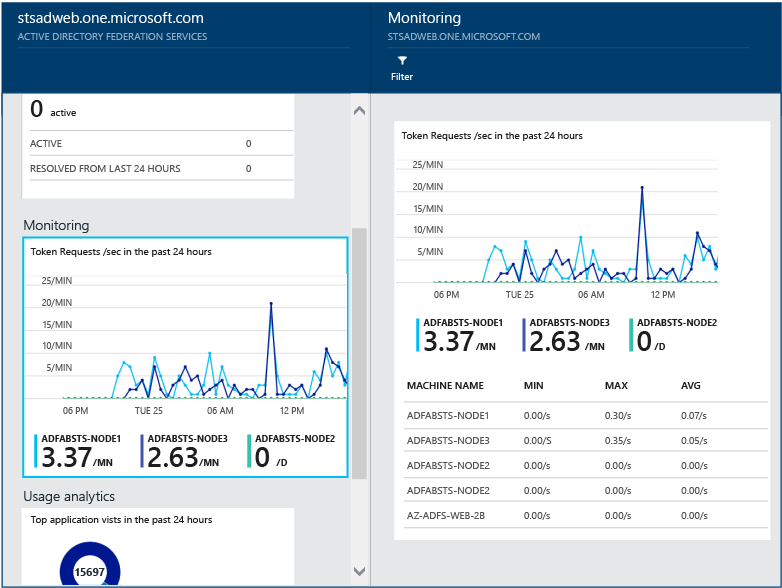
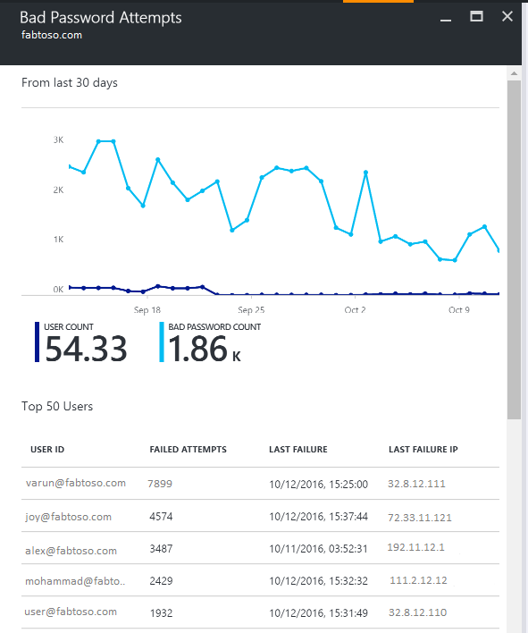

# Microsoft Entra Connect Health agents for AD FS

In this article, you learn how to install and configure the Microsoft Entra Connect Health agents.  The following documentation is specific to installation and monitoring your AD FS infrastructure with Microsoft Entra Connect Health. For information on monitoring Microsoft Entra Connect (Sync) with Microsoft Entra Connect Health, see [Using Microsoft Entra Connect Health for Sync](how-to-connect-health-sync.md). Additionally, for information on monitoring Active Directory Domain Services with Microsoft Entra Connect Health, see [Using Microsoft Entra Connect Health with AD DS](how-to-connect-health-adds.md).

Learn how to [download the agents](how-to-connect-install-roadmap.md#download-and-install-azure-ad-connect-health-agent).

> [!NOTE]
> Microsoft Entra Connect Health is not available in the China sovereign cloud.

## Requirements

The following table lists requirements for using Microsoft Entra Connect Health:

| Requirement | Description |
| --- | --- |
| You have a Microsoft Entra ID P1 or P2 subscription. |Microsoft Entra Connect Health is a feature of Microsoft Entra ID P1 or P2. For more information, see [Sign up for Microsoft Entra ID P1 or P2](~/fundamentals/get-started-premium.md). <br /><br />To start a free 30-day trial, see [Start a trial](https://azure.microsoft.com/trial/get-started-active-directory/). |
| You're a Global Administrator in Microsoft Entra ID. |Currently, only Global Administrator accounts can install and configure health agents. For more information, see [Administering your Microsoft Entra directory](~/fundamentals/whatis.md). <br /><br /> By using Azure role-based access control (Azure RBAC), you can allow other users in your organization to access Microsoft Entra Connect Health. For more information, see [Azure RBAC for Microsoft Entra Connect Health](how-to-connect-health-operations.md#manage-access-with-azure-rbac). <br /><br />**Important**: Use a work or school account to install the agents. You can't use a Microsoft account to install the agents. For more information, see [Sign up for Azure as an organization](~/fundamentals/sign-up-organization.md). |
| The Microsoft Entra Connect Health agent is installed on each targeted server. | Health agents must be installed and configured on targeted servers so that they can receive data and provide monitoring and analytics capabilities. <br /><br />For example, to get data from your Active Directory Federation Services (AD FS) infrastructure, you must install the agent on the AD FS server and on the Web Application Proxy server. Similarly, to get data from your on-premises AD Domain Services infrastructure, you must install the agent on the domain controllers. |
| The Azure service endpoints have outbound connectivity. | During installation and runtime, the agent requires connectivity to Microsoft Entra Connect Health service endpoints. If firewalls block outbound connectivity, add the [outbound connectivity endpoints](how-to-connect-health-agent-install.md#outbound-connectivity-to-azure-service-endpoints) to an allowlist. |
|Outbound connectivity is based on IP addresses. | For information about firewall filtering based on IP addresses, see [Azure IP ranges](https://www.microsoft.com/download/details.aspx?id=56519).|
| TLS inspection for outbound traffic is filtered or disabled. | The agent registration step or data upload operations might fail if there's TLS inspection or termination for outbound traffic at the network layer. For more information, see [Set up TLS inspection](/previous-versions/tn-archive/ee796230(v=technet.10)). |
| Firewall ports on the server are running the agent. |The agent requires the following firewall ports to be open so that it can communicate with the Microsoft Entra Connect Health service endpoints: <br />- TCP port 443 <br />- TCP port 5671 <br /><br />The latest version of the agent doesn't require port 5671. Upgrade to the latest version so that only port 443 is required. For more information, see [Hybrid identity required ports and protocols](./reference-connect-ports.md). |
| If Internet Explorer enhanced security is enabled, allow specified websites. |If Internet Explorer enhanced security is enabled, allow the following websites on the server where you install the agent:<br />- `https://login.microsoftonline.com` <br />- `https://secure.aadcdn.microsoftonline-p.com` <br />- `https://login.windows.net` <br />- `https://aadcdn.msftauth.net` <br />- The federation server for your organization that's trusted by Microsoft Entra ID (for example, `https://sts.contoso.com`). <br /><br />For more information, see [How to configure Internet Explorer](https://support.microsoft.com/help/815141/internet-explorer-enhanced-security-configuration-changes-the-browsing). If you have a proxy in your network, see the note that appears at the end of this table.|
| PowerShell version 5.0 or later is installed. | Windows Server 2016 includes PowerShell version 5.0. |

> [!IMPORTANT]
> Windows Server Core doesn't support installing the Microsoft Entra Connect Health agent.

> [!NOTE]
> If you have a highly locked-down and restricted environment, you need to add more URLs than the URLs the table lists for Internet Explorer enhanced security. Also add URLs that are listed in the table in the next section.

### New versions of the agent and auto upgrade

If a new version of the health agent is released, any existing, installed agents are automatically updated.

<a name="outbound-connectivity-to-the-azure-service-endpoints"></a>

### Outbound connectivity to Azure service endpoints

During installation and runtime, the agent needs connectivity to Microsoft Entra Connect Health service endpoints. If firewalls block outbound connectivity, make sure that the URLs in the following table aren't blocked by default.

Don't disable security monitoring or inspection of these URLs. Instead, allow them as you would allow other internet traffic.

These URLs allow communication with Microsoft Entra Connect Health service endpoints. Later in this article, you'll learn how to [check outbound connectivity](#test-connectivity-to-the-microsoft-entra-connect-health-service) by using `Test-AzureADConnectHealthConnectivity`.

| Domain environment | Required Azure service endpoints |
| --- | --- |
| General public | - `*.blob.core.windows.net` <br />- `*.aadconnecthealth.azure.com` <br />- `**.servicebus.windows.net` - Port: 5671 (If 5671 is blocked, the agent falls back to 443, but we recommend that you use port 5671. This endpoint isn't required in the latest version of the agent.)<br />- `*.adhybridhealth.azure.com/`<br />- `https://management.azure.com` <br />- `https://policykeyservice.dc.ad.msft.net/` <br />- `https://login.windows.net` <br />- `https://login.microsoftonline.com` <br />- `https://secure.aadcdn.microsoftonline-p.com` <br />- `https://www.office.com` (This endpoint is used only for discovery purposes during registration.)<br />- `https://aadcdn.msftauth.net` <br />- `https://aadcdn.msauth.net` <br />- `https://autoupdate.msappproxy.net` <br />- `https://www.microsoft.com` |
| Azure Government | - `*.blob.core.usgovcloudapi.net` <br />- `*.servicebus.usgovcloudapi.net` <br />- `*.aadconnecthealth.microsoftazure.us` <br />- `https://management.usgovcloudapi.net` <br />- `https://policykeyservice.aadcdi.azure.us` <br />- `https://login.microsoftonline.us` <br />- `https://secure.aadcdn.microsoftonline-p.com` <br />- `https://www.office.com` (This endpoint is used only for discovery purposes during registration.)<br />- `https://aadcdn.msftauth.net` <br />- `https://aadcdn.msauth.net` <br />- `https://autoupdate.msappproxy.us` <br />- `http://www.microsoft.com` <br />- `https://www.microsoft.com` |

## Download the agents

To download and install the Microsoft Entra Connect Health agent:

- Make sure that you satisfy the [requirements](how-to-connect-health-agent-install.md#requirements) to install Microsoft Entra Connect Health.
- Get started using Microsoft Entra Connect Health for AD FS:
  - [Download the Microsoft Entra Connect Health agent for AD FS](https://go.microsoft.com/fwlink/?LinkID=518973).
  - See the [installation instructions](#install-the-agent-for-ad-fs).
- Get started using Microsoft Entra Connect Health for sync:
  - [Download and install the latest version of Microsoft Entra Connect](https://go.microsoft.com/fwlink/?linkid=615771). The health agent for sync is installed as part of the Microsoft Entra Connect installation (version 1.0.9125.0 or later).
- Get started using Microsoft Entra Connect Health for AD Domain Services:
  - [Download the Microsoft Entra Connect Health agent for AD Domain Services](https://go.microsoft.com/fwlink/?LinkID=820540).
 

## Install the agent for AD FS

> [!NOTE]
> Your AD FS server should be separate from your sync server. Don't install the AD FS agent on your sync server.
>

> [!NOTE]
> The health agent for sync is installed as part of the Microsoft Entra Connect installation (version 1.0.9125.0 or later).  If you attempt to install an earlier version of the health agent for AD FS on the Microsoft Entra Connect server, you will get an error.  If you need to install the health agent for AD FS on the machine, you should [download the latest version](https://go.microsoft.com/fwlink/?LinkID=518973) and then uninstall the version that was installed during the Microsoft Entra Connect installation.


Before you install the agent, make sure your AD FS server host name is unique and isn't present in the AD FS service.

To start the agent installation, double-click the *.exe* file you downloaded. In the first dialog, select **Install**.

:::image type="content" source="media/how-to-connect-health-agent-install/install-1.png" alt-text="Screenshot that shows the installation window for the Microsoft Entra Connect Health AD FS agent.":::

When you're prompted, sign in by using a Microsoft Entra account that has permissions to register the agent. By default, the Hybrid Identity Administrator account has permissions.

:::image type="content" source="media/how-to-connect-health-agent-install/install3.png" alt-text="Screenshot that shows the sign-in window for Microsoft Entra Connect Health AD FS.":::

After you sign in, the installation process will complete and you can close the window.

:::image type="content" source="media/how-to-connect-health-agent-install/install2.png" alt-text="Screenshot that shows the confirmation message for the Microsoft Entra Connect Health AD FS agent installation.":::

At this point, the agent services should start to automatically allow the agent to securely upload the required data to the cloud service.

To verify that the agent was installed, look for the following services on the server. If you completed the configuration, they should already be running. Otherwise, they're stopped until the configuration is complete.

- Microsoft Entra Connect Agent Updater
- Microsoft Entra Connect Health Agent

:::image type="content" source="media/how-to-connect-health-agent-install/install5.png" alt-text="Screenshot that shows Microsoft Entra Connect Health AD FS services.":::

### Enable auditing for AD FS

> [!NOTE]
> This section applies only to AD FS servers. You don't have to complete these steps on Web Application Proxy servers.
>

The Usage Analytics feature needs to gather and analyze data, so the Microsoft Entra Connect Health agent needs the information in the AD FS audit logs. These logs aren't enabled by default. Use the following procedures to enable AD FS auditing and to locate the AD FS audit logs on your AD FS servers.

#### To enable auditing for AD FS 

 1. On the Start screen, open **Server Manager**, and then open **Local Security Policy**. Or, on the taskbar, open **Server Manager**, and then select **Tools/Local Security Policy**.
 2. Go to the *Security Settings\Local Policies\User Rights Assignment* folder. Double-click **Generate security audits**.
 3. On the **Local Security Setting** tab, verify that the AD FS service account is listed. If it's not listed, select **Add User or Group**, and add the AD FS service account to the list. Then select **OK**.
 4. To enable auditing, open a Command Prompt window as administrator, and then run the following command:
    `auditpol.exe /set /subcategory:"Application Generated" /failure:enable /success:enable`

 5. Close **Local Security Policy**.

    > [!IMPORTANT]
    > The remaining steps are required only for primary AD FS servers.

#### Enable audit properties on the AD FS server
1. Open the **AD FS Management** snap-in. (In **Server Manager**, select **Tools** > **AD FS Management**.)
2. In the **Actions** pane, select **Edit Federation Service Properties**.
3. In the **Federation Service Properties** dialog, select the **Events** tab.
4. Select the **Success audits** and **Failure audits** checkboxes, and then select **OK**. Success audits and failure audits should be enabled by default.

#### Enable audit properties on AD FS server
 
>[!IMPORTANT]
>This step is required only for primary AD FS servers.

1. Open a PowerShell window and run the following command:

   `Set-AdfsProperties -AuditLevel Verbose`

The "basic" audit level is enabled by default. For more information, see [AD FS audit enhancement in Windows Server 2016](/windows-server/identity/ad-fs/technical-reference/auditing-enhancements-to-ad-fs-in-windows-server).

#### Verify verbose logging

To verify verbose logging is enabled do the following.

1. Open a PowerShell window and run the following command:

   `Get-AdfsProperties`
 
2. Verify that the Auditlevel is set to verbose

#### Verify AD FS service account audit settings

1. Go to the *Security Settings\Local Policies\User Rights Assignment* folder. Double-click **Generate security audits**.
2. On the **Local Security Setting** tab, verify that the **AD FS service account** is listed. If it's not listed, select Add User or Group, and add the AD FS service account to the list. Then select **OK**.
3. Close **Local Security Policy**.

#### Review the AD FS audit logs

After enabling AD FS audit logs, you should be able to check the AD FS audit logs using Event viewer.

1. Open **Event Viewer**.
2. Go to **Windows Logs**, and then select **Security**.
3. In the right pane, select **Filter Current Logs**.
4. For **Event sources**, select **AD FS Auditing**.


For more information about audit logs, see [Operations questions](./reference-connect-health-faq.yml).

  :::image type="content" source="media/how-to-connect-health-agent-install/adfsaudit.png" alt-text="Screenshot that shows the Filter Current Log window, with AD FS auditing selected.":::

> [!WARNING]
> A group policy can disable AD FS auditing. If AD FS auditing is disabled, usage analytics about login activities are unavailable. Ensure that you have no group policy that disables AD FS auditing.

The following tables provide a list of common events that correspond to audit level events

##### Basic audit level events

|ID|Event Name|Event Description|
|-----|-----|-----|
|1200|AppTokenSuccessAudit|The Federation Service issued a valid token.| 
|1201|AppTokenFailureAudit|The Federation Service failed to issue a valid token.|
|1202|FreshCredentialSuccessAudit|The Federation Service validated a new credential.|
|1203|FreshCredentialFailureAudit|The Federation Service failed to validate a new credential.|


##### Verbose audit level events

|ID|Event Name|Event Description|
|-----|-----|-----|
|299|TokenIssuanceSuccessAudit|A token was successfully issued for the relying party.|
|403|RequestReceivedSuccessAudit|An HTTP request was received. See audit 510 with the same Instance ID for headers.|
|410|RequestContextHeadersSuccessAudit|Following request context headers present|
|411|SecurityTokenValidationFailureAudit|Token validation failed. See inner exception for more details.|
|412|AuthenticationSuccessAudit|A token of type '%3' for relying party '%4' was successfully authenticated. See audit 501 with the same Instance ID for caller identity.|
|500|IssuedIdentityClaims|More information for the event entry with Instance ID %1. There may be more events with the same Instance ID with more information.|
|501|CallerIdentityClaims|More information for the event entry with Instance ID %1. There may be more events with the same Instance ID with more information.|


## Test connectivity to the Microsoft Entra Connect Health service

Occasionally, the Microsoft Entra Connect Health agent loses connectivity with the Microsoft Entra Connect Health service. Causes of this connectivity loss might include network problems, permissions problems, and various other problems.

If the agent can't send data to the Microsoft Entra Connect Health service for longer than two hours, the following alert appears in the portal: **Health Service data is not up to date**.

You can find out whether the affected Microsoft Entra Connect Health agent can upload data to the Microsoft Entra Connect Health service by running the following PowerShell command:

```powershell
Test-AzureADConnectHealthConnectivity -Role ADFS
```

The `Role` parameter currently takes the following values:

- `ADFS`
- `Sync`
- `ADDS`

> [!NOTE]
> To use the connectivity tool, you must first register the agent. If you can't complete the agent registration, make sure that you meet all the [requirements](how-to-connect-health-agent-install.md#requirements) for Microsoft Entra Connect Health. Connectivity is tested by default during agent registration.

## Monitor AD FS using Microsoft Entra Connect Health


## Alerts for AD FS
The Microsoft Entra Connect Health Alerts section provides you the list of active alerts. Each alert includes relevant information, resolution steps, and links to related documentation.

You can double-click an active or resolved alert, to open a new blade with additional information, steps you can take to resolve the alert, and links to relevant documentation. You can also view historical data on alerts that were resolved in the past.


## Usage Analytics for AD FS
Microsoft Entra Connect Health Usage Analytics analyzes the authentication traffic of your federation servers. You can double-click the usage analytics box, to open the usage analytics blade, which shows you several metrics and groupings.

> [!NOTE]
> To use Usage Analytics with AD FS, you must ensure that AD FS auditing is enabled. For more information, see [Enable Auditing for AD FS](#enable-auditing-for-ad-fs).
>
>


To select additional metrics, specify a time range, or to change the grouping, right-click on the usage analytics chart and select Edit Chart. Then you can specify the time range, select a different metric, and change the grouping. You can view the distribution of the authentication traffic based on different "metrics" and group each metric using relevant "group by" parameters described in the following section:

**Metric : Total Requests** - Total number of requests processed by AD FS servers.

|Group By | What the grouping means and why it's useful? |
| --- | --- |
| All | Shows the count of total number of requests processed by all AD FS servers.|
| Application | Groups the total requests based on the targeted relying party. This grouping is useful to understand which application is receiving how much percentage of the total traffic. |
|  Server |Groups the total requests based on the server that processed the request. This grouping is useful to understand the load distribution of the total traffic.
| Workplace Join |Groups the total requests based on whether they are coming from devices that are workplace joined (known). This grouping is useful to understand if your resources are accessed using devices that are unknown to the identity infrastructure. |
|  Authentication Method | Groups the total requests based on the authentication method used for authentication. This grouping is useful to understand the common authentication method that gets used for authentication. Following are the possible authentication methods <ol> <li>Windows Integrated Authentication (Windows)</li> <li>Forms Based Authentication (Forms)</li> <li>SSO (Single Sign On)</li> <li>X509 Certificate Authentication (Certificate)</li> <br>If the federation servers receive the request with an SSO Cookie, that request is counted as SSO (Single Sign On). In such cases, if the cookie is valid, the user is not asked to provide credentials and gets seamless access to the application. This behavior is common if you have multiple relying parties protected by the federation servers. |
| Network Location | Groups the total requests based on the network location of the user. It can be either intranet or extranet. This grouping is useful to know what percentage of the traffic is coming from the intranet versus extranet. |


**Metric: Total Failed Request** - The total number failed requests processed by the federation service. (This metric is only available on AD FS for Windows Server 2012 R2)

|Group By | What the grouping means and why it's useful? |
| --- | --- |
| Error Type | Shows the number of errors based on predefined error types. This grouping is useful to understand the common types of errors. <ul><li>Incorrect Username or Password: Errors due to incorrect username or password.</li> <li>"Extranet Lockout": Failures due to the requests received from a user that was locked out from extranet </li><li> "Expired Password": Failures due to users logging in with an expired password.</li><li>"Disabled Account": Failures due to users logging with a disabled account.</li><li>"Device Authentication": Failures due to users failing to authenticate using Device Authentication.</li><li>"User Certificate Authentication": Failures due to users failing to authenticate because of an invalid certificate.</li><li>"MFA": Failures due to user failing to authenticate using multifactor authentication.</li><li>"Other Credential": "Issuance Authorization": Failures due to authorization failures.</li><li>"Issuance Delegation": Failures due to issuance delegation errors.</li><li>"Token Acceptance": Failures due to ADFS rejecting the token from a third-party Identity Provider.</li><li>"Protocol": Failure due to protocol errors.</li><li>"Unknown": Catch all. Any other failures that do not fit into the defined categories.</li> |
| Server | Groups the errors based on the server. This grouping is useful to understand the error distribution across servers. Uneven distribution could be an indicator of a server in a faulty state. |
| Network Location | Groups the errors based on the network location of the requests (intranet vs extranet). This grouping is useful to understand the type of requests that are failing. |
|  Application | Groups the failures based on the targeted application (relying party). This grouping is useful to understand which targeted application is seeing most number of errors. |

**Metric : User Count** - Average number of unique users actively authenticating using AD FS

|Group By | What the grouping means and why it's useful? |
| --- | --- |
|All |This metric provides a count of average number of users using the federation service in the selected time slice. The users are not grouped. <br>The average depends on the time slice selected. |
| Application |Groups the average number of users based on the targeted application (relying party). This grouping is useful to understand how many users are using which application. |

## Performance Monitoring for AD FS
Microsoft Entra Connect Health Performance Monitoring provides monitoring information on metrics. Selecting the Monitoring box, opens a new blade with detailed information on the metrics.



By selecting the Filter option at the top of the blade, you can filter by server to see an individual server’s metrics. To change metric, right-click on the monitoring chart under the monitoring blade and select Edit Chart (or select the Edit Chart button). From the new blade that opens up, you can select additional metrics from the drop-down and specify a time range for viewing the performance data.

## Top 50 Users with failed Username/Password logins
One of the common reasons for a failed authentication request on an AD FS server is a request with invalid credentials, that is, a wrong username or password. Usually happens to users due to complex passwords, forgotten passwords, or typos.

But there are other reasons that can result in an unexpected number of requests being handled by your AD FS servers, such as: An application that caches user credentials and the credentials expire or a malicious user attempting to sign into an account with a series of well-known passwords. These two examples are valid reasons that could lead to a surge in requests.

Microsoft Entra Connect Health for ADFS provides a report about top 50 Users with failed login attempts due to invalid username or password. This report is achieved by processing the audit events generated by all the AD FS servers in the farms.


Within this report you have easy access to the following pieces of information:

* Total # of failed requests with wrong username/password in the last 30 days
* Average # of users that failed with a bad username/password login per day.

Clicking this part takes you to the main report blade that provides additional details. This blade includes a graph with trending information to help establish a baseline about requests with wrong username or password. Additionally, it provides the list of top 50 users with the number of failed attempts during the past week. Notice top 50 users from the past week could help identify bad password spikes.  

The graph provides the following information:

* The total # of failed logins due to a bad username/password on a per-day basis.
* The total # of unique users that failed logins on a per-day basis.
* Client IP address of for last request



The report provides the following information:

| Report Item | Description |
| --- | --- |
| User ID |Shows the user ID that was used. This value is what the user typed, which in some cases is the wrong user ID being used. |
| Failed Attempts |Shows the total # of failed attempts for that specific user ID. The table is sorted with the most number of failed attempts in descending order. |
| Last Failure |Shows the time stamp when the last failure occurred. |
| Last Failure IP |Shows the Client IP address from the latest bad request. If you see more than one IP addresses in this value, it may include forward client IP together with user's last attempt request IP.  |

> [!NOTE]
> This report is automatically updated after every 12 hours with the new information collected within that time. As a result, login attempts within the last 12 hours may not be included in the report.

## Related links
* [Microsoft Entra Connect Health](./whatis-azure-ad-connect.md)
* [Microsoft Entra Connect Health Agent Installation](how-to-connect-health-agent-install.md)
* [Risky IP report](how-to-connect-health-adfs-risky-ip.md)
