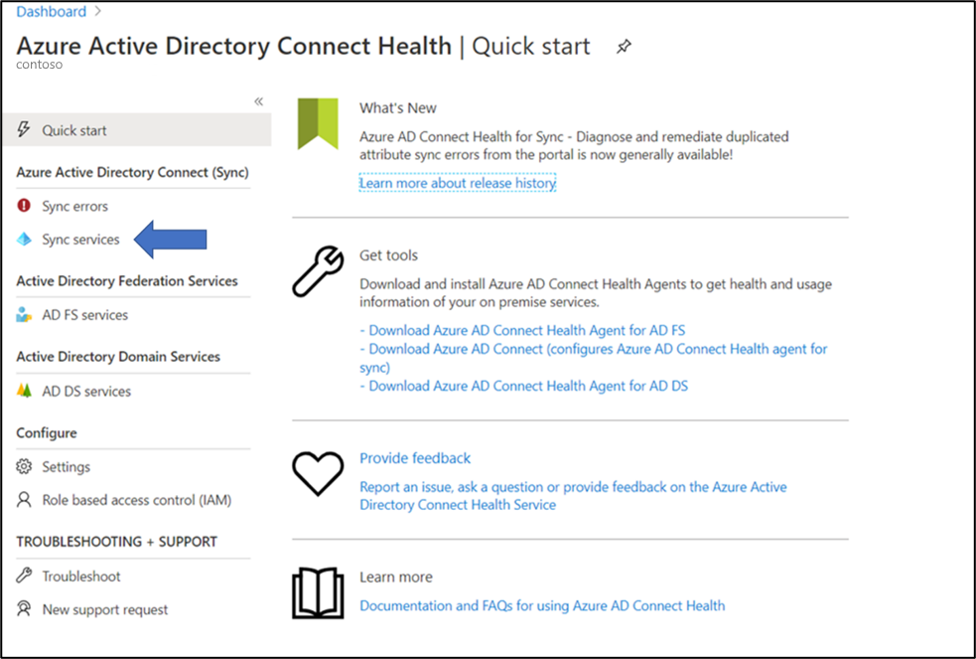
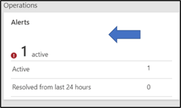
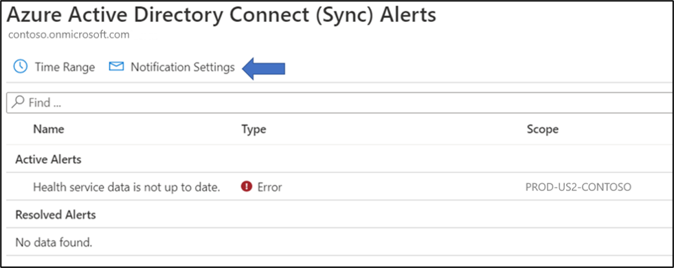
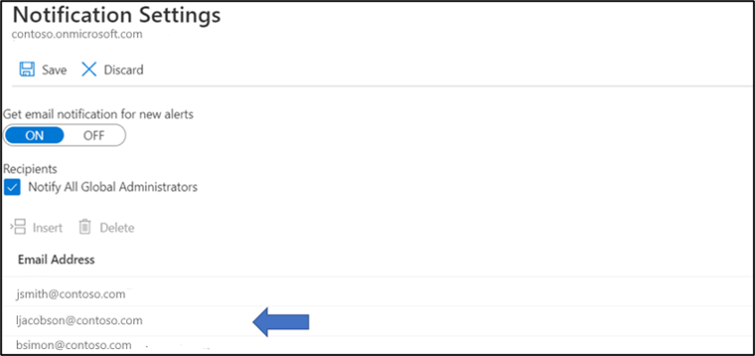
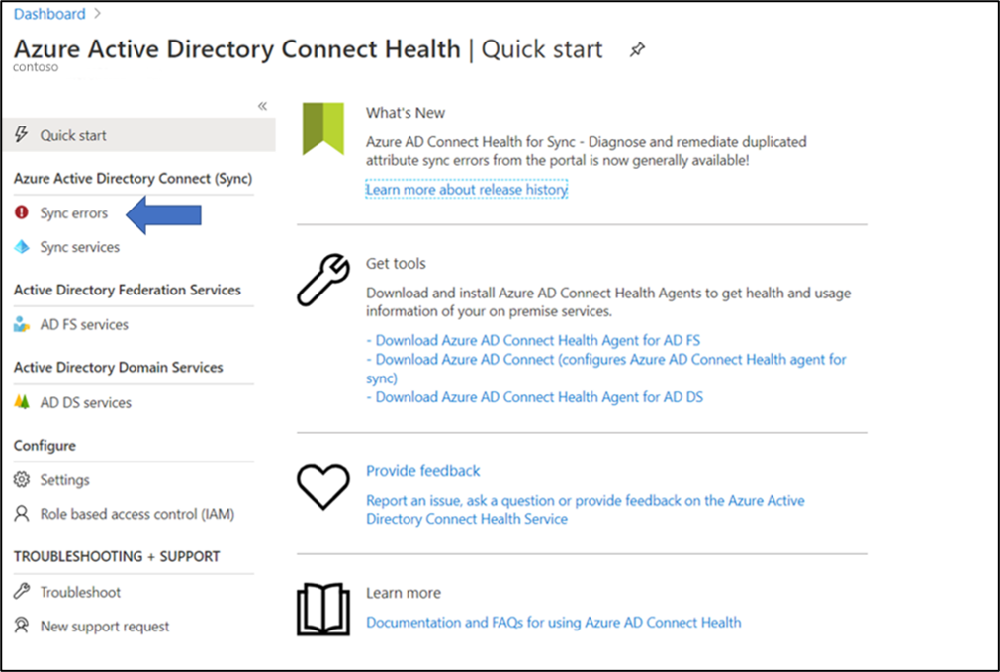
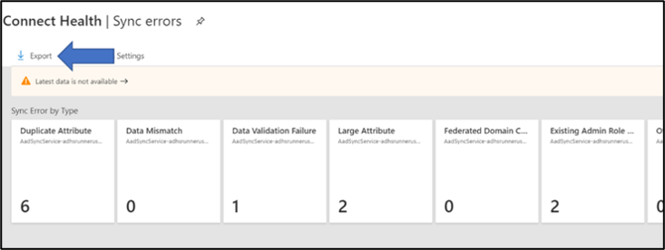

# Microsoft Entra Connect Health instructions for data retrieval

This document describes how to use Microsoft Entra Connect to retrieve data from Microsoft Entra Connect Health.

[!INCLUDE [active-directory-app-provisioning.md](~/includes/azure-docs-pr/gdpr-intro-sentence.md)]

## Retrieve all email addresses for users configured for health alerts.

To retrieve the email addresses for all of your users that are configured in Microsoft Entra Connect Health to receive alerts, use the following steps.

1. Start at the Microsoft Entra Connect Health blade and select **Sync Services** from the left-hand navigation bar.
 

2. Select on the **Alerts** tile. 
 

3. Select on **Notification Settings**.
 

4. On the **Notification Setting** blade, find the list of email addresses that are enabled as recipients for health Alert notifications.
 
 
## Retrieve all sync errors

To retrieve a list of all sync errors, use the following steps.

1. Starting on the Microsoft Entra Health blade, select **Sync Errors**.
 

2. In the **Sync Errors** blade, select on **Export**. This exports a list of the recorded sync errors.
 

## Next Steps
* [Microsoft Entra Connect Health](./whatis-azure-ad-connect.md)
* [Microsoft Entra Connect Health Agent Installation](how-to-connect-health-agent-install.md)
* [Microsoft Entra Connect Health Operations](how-to-connect-health-operations.md)
* [Microsoft Entra Connect Health FAQ](reference-connect-health-faq.yml)
* [Microsoft Entra Connect Health Version History](reference-connect-health-version-history.md)
