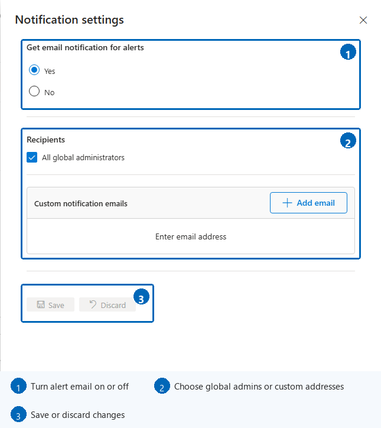
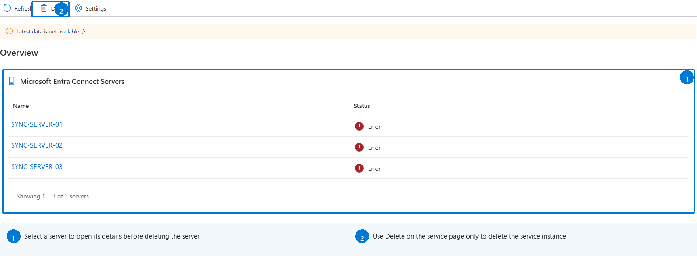
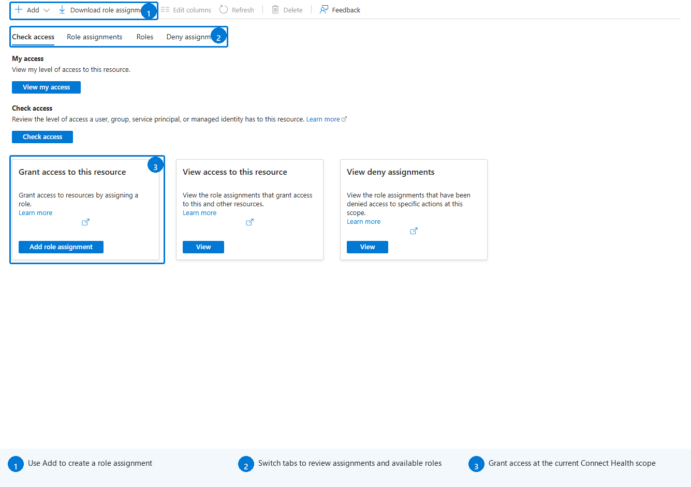

# Microsoft Entra Connect Health operations
This topic describes the various operations you can perform by using Microsoft Entra Connect Health.

## Enable email notifications
You can configure the Microsoft Entra Connect Health service to send email notifications when alerts indicate that your identity infrastructure isn't healthy. This occurs when an alert is generated, and when it is resolved.

> [!NOTE]
> Email notifications are enabled by default.
>

### To enable Microsoft Entra Connect Health email notifications
1. Open [Microsoft Entra Connect Health](https://aka.ms/aadconnecthealth), and then select **Sync errors**.
1. Select **Notification settings** on the command bar.
1. For **Get email notification for alerts**, select **Yes**.
1. Under **Recipients**, select **All global administrators** if you want all Global Administrators to receive notifications.
1. Under **Custom notification emails**, add any other email addresses that should receive notifications. Use **Remove email** to remove an address.
1. Select **Save**. Changes take effect only after you save them.

>[!NOTE] 
> When there are issues processing synchronization requests in our backend service, this service sends a notification email with the details of the error to the administrative contact email address(es) of your tenant. We heard feedback from customers that in certain cases the volume of these messages is prohibitively large so we are changing the way we send these messages. 
>
> Instead of sending a message for every sync error every time it occurs we will send out a daily digest of all errors the backend service has returned. Sync error emails are sent once a day, based on the previous day's unresolved errors. So if the customer triggers an error, but resolves it fairly quickly, they will not get an email the following day. This enables customers to process these errors in a more efficient manner and reduces the number of duplicate error messages.

## Delete a server or service instance

>[!NOTE] 
> Microsoft Entra ID P1 or P2 license is required for the deletion steps.

In some instances, you might want to remove a server from being monitored. Here's what you need to know to remove a server from the Microsoft Entra Connect Health service.

When you're deleting a server, be aware of the following:

* This action stops collecting any further data from that server. This server is removed from the monitoring service. After this action, you aren't able to view new alerts, monitoring, or usage analytics data for this server.
* This action doesn't uninstall the Health Agent from your server. If you haven't uninstalled the Health Agent before performing this step, you might see errors related to the Health Agent on the server.
* This action doesn't delete the data already collected from this server. That data is deleted in accordance with the Azure data retention policy.
* After performing this action, if you want to start monitoring the same server again, you must uninstall and reinstall the Health Agent on this server.

The service overview separates the two deletion paths. Select a server to open its details before deleting only that server. Use **Delete** on the service-level command bar only when you intend to delete the entire monitored service instance.

### Delete a server from the Microsoft Entra Connect Health service

>[!NOTE] 
> Microsoft Entra ID P1 or P2 license is required for the deletion steps.

Microsoft Entra Connect Health for Active Directory Federation Services (AD FS) and Microsoft Entra Connect (Sync):

1. Open [Microsoft Entra Connect Health](https://aka.ms/aadconnecthealth), select the applicable service type, and then select the service.
1. In the servers section, select the server that you want to remove. For AD FS, select **View all servers** first.
1. Select **Delete** on the command bar.
1. Confirm by typing the server name in the confirmation box.
1. Select **Delete**.

Microsoft Entra Connect Health for AD Domain Services:

1. Open the **Domain Controllers** dashboard.
2. Select the domain controller to be removed.
3. From the action bar, select **Delete Selected**.
4. Confirm the action to delete the server.
5. Select **Delete**.

### Delete a service instance from Microsoft Entra Connect Health service
In some instances, you might want to remove a service instance. Here's what you need to know to remove a service instance from the Microsoft Entra Connect Health service.

When you're deleting a service instance, be aware of the following:

* This action removes the current service instance from the monitoring service.
* This action doesn't uninstall or remove the Health Agent from any of the servers that were monitored as part of this service instance. If you haven't uninstalled the Health Agent before performing this step, you might see errors related to the Health Agent on the servers.
* All data from this service instance is deleted in accordance with the Azure data retention policy.
* After performing this action, if you want to start monitoring the service, uninstall and reinstall the Health Agent on all the servers. After performing this action, if you want to start monitoring the same server again, uninstall, reinstall, and register the Health Agent on that server.

#### To delete a service instance from the Microsoft Entra Connect Health service
1. Open [Microsoft Entra Connect Health](https://aka.ms/aadconnecthealth), and select the applicable service type.
1. Select the service identifier, such as the farm name, that you want to remove.
1. Select **Delete** on the command bar.
1. Confirm by typing the service name in the confirmation box, such as `sts.contoso.com`.
1. Select **Delete**.

[//]: # (Start of RBAC section)
## Manage access with Azure RBAC
[Azure role-based access control (Azure RBAC)](~/identity/role-based-access-control/permissions-reference.md) for Microsoft Entra Connect Health provides access to users and groups other than Hybrid Identity Administrators. Azure RBAC assigns roles to the intended users and groups, and provides a mechanism to limit the Hybrid Identity Administrators within your directory.

### Roles
Microsoft Entra Connect Health supports the following built-in roles:

| Role | Permissions |
| --- | --- |
| Owner |Owners can *manage access* (for example, assign a role to a user or group), *view all information* (for example, view alerts) from the portal, and *change settings* (for example, email notifications) within Microsoft Entra Connect Health.  By default, Microsoft Entra Hybrid Identity Administrators are assigned this role, and this can't be changed. |
| Contributor |Contributors can *view all information* (for example, view alerts) from the portal, and *change settings* (for example, email notifications) within Microsoft Entra Connect Health. |
| Reader |Readers can *view all information* (for example, view alerts) from the portal within Microsoft Entra Connect Health. |

All other roles (such as User Access Administrators or DevTest Labs Users) have no impact to access within Microsoft Entra Connect Health, even if the roles are available in the portal experience.

### Access scope
Microsoft Entra Connect Health supports managing access at two levels:

* **All service instances**: This is the recommended path in most cases. It controls access for all service instances (for example, an AD FS farm) across all role types that are being monitored by Microsoft Entra Connect Health.
* **Service instance**: In some cases, you might need to segregate access based on role types or by a service instance. In this case, you can manage access at the service instance level.  

Permission is granted if an end user has access either at the directory or service instance level.

### Allow users or groups access to Microsoft Entra Connect Health
The following steps show how to allow access.
#### Step 1: Select the appropriate access scope
To allow a user access at the *all service instances* level, open [Microsoft Entra Connect Health](https://aka.ms/aadconnecthealth), and then select **Role based access control (IAM)**.

To manage access for an individual service instance, open the service and select **Access Control** where available.

The IAM page lets you check existing access, review role assignments and roles, or create an assignment at the selected Connect Health scope.

#### Step 2: Add users and groups, and assign roles
1. Select **Add**, and then select **Add role assignment**.
1. Select a role, such as **Owner**, **Contributor**, or **Reader**.
1. Search for and select one or more users or groups.
1. Confirm the role assignment.
1. After the assignment is complete, the users and groups appear in the role assignments list.

Now the listed users and groups have access, according to their assigned roles.

> [!NOTE]
> * Global Administrators always have full access to all the operations, but Global Administrator accounts aren't present in the preceding list.
> * The Invite Users feature isn't supported within Microsoft Entra Connect Health.
>
>

#### Step 3: Share the Connect Health location
After you assign permissions, share the [Microsoft Entra Connect Health](https://aka.ms/aadconnecthealth) link with the users or groups.

### Remove users or groups
To remove access, select the user or group in the role assignments list, and then select **Remove**.

[//]: # (End of RBAC section)

## Next steps
* [Microsoft Entra Connect Health](./whatis-azure-ad-connect.md)
* [Microsoft Entra Connect Health Agent installation](how-to-connect-health-agent-install.md)
* [Using Microsoft Entra Connect Health with AD FS](how-to-connect-health-adfs.md)
* [Using Microsoft Entra Connect Health for sync](how-to-connect-health-sync.md)
* [Using Microsoft Entra Connect Health with AD DS](how-to-connect-health-adds.md)
* [Microsoft Entra Connect Health FAQ](reference-connect-health-faq.yml)
* [Microsoft Entra Connect Health version history](reference-connect-health-version-history.md)
