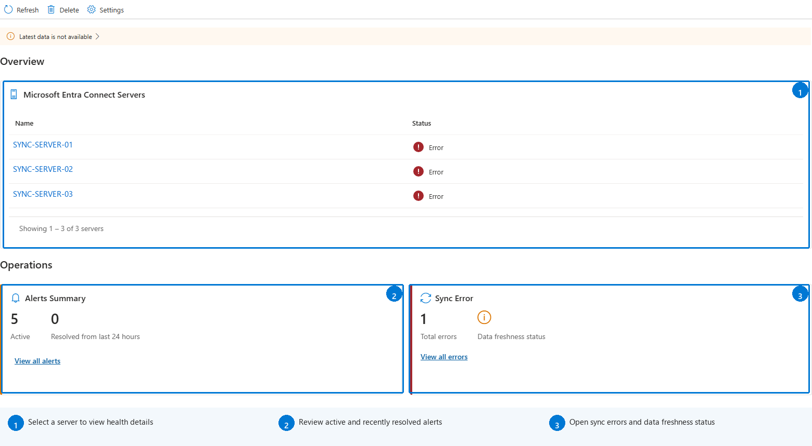
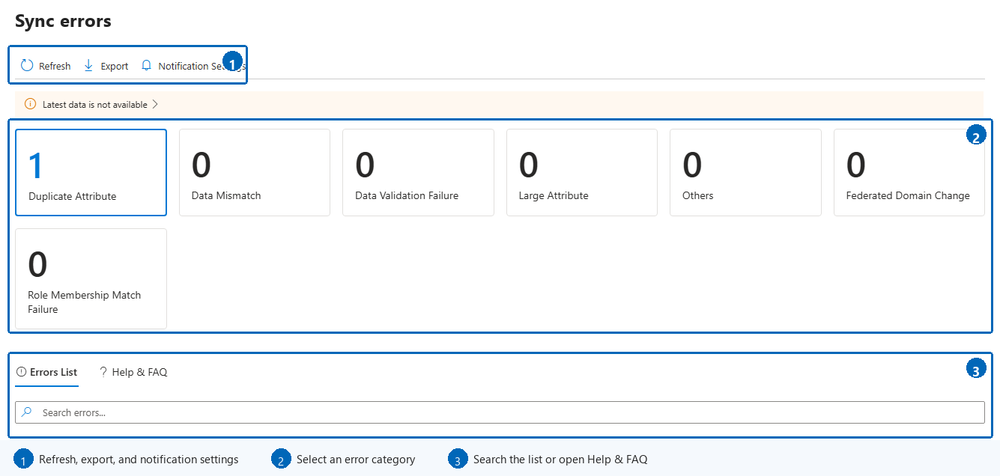

# Monitor Microsoft Entra Connect Sync with Microsoft Entra Connect Health
The following documentation is specific to monitoring Microsoft Entra Connect (Sync) with Microsoft Entra Connect Health. For information on monitoring AD FS with Microsoft Entra Connect Health see [Using Microsoft Entra Connect Health with AD FS](how-to-connect-health-adfs.md). Additionally, for information on monitoring Active Directory Domain Services with Microsoft Entra Connect Health see [Using Microsoft Entra Connect Health with AD DS](how-to-connect-health-adds.md).

## Prerequisites

Before you use Microsoft Entra Connect Health for sync, install the Microsoft Entra Connect Health agent on each Microsoft Entra Connect Sync server. The agent is supported on Windows Server 2016, 2019, 2022, and 2025. For installation steps, requirements, and the full list of supported Windows Server versions, see [Install the Microsoft Entra Connect Health agents](how-to-connect-health-agent-install.md).

> [!IMPORTANT]
> Microsoft Entra Connect Health for Sync requires Microsoft Entra Connect Sync V2. If you're still using Azure AD Connect V1, you must upgrade to the latest version. 
> Azure AD Connect V1 was retired on August 31, 2022. Microsoft Entra Connect Health for Sync stopped working with Azure AD Connect V1 in December 2022.
> 
Open [Microsoft Entra Connect Health](https://aka.ms/aadconnecthealth), select **Sync services**, and then select a service. The overview brings together server health, active and recently resolved alerts, synchronization errors, and data freshness status. Select a server, alert summary, or sync error card to open the corresponding details.

## Alerts for Microsoft Entra Connect Health for sync
The **Alerts** page lists active and resolved alerts. Use the time-range control to include older resolved alerts, and use search to filter the list. Select an alert row to open the details panel, which contains alert metadata, affected servers, resolution guidance, related documentation, and a feedback option.

### Limited Evaluation of Alerts
If Microsoft Entra Connect is NOT using the default configuration (for example, if Attribute Filtering is changed from the default configuration to a custom configuration), then the Microsoft Entra Connect Health agent won't upload the error events related to Microsoft Entra Connect.

This limits the evaluation of alerts by the service. You'll see a banner that indicates this condition in the [Microsoft Entra admin center](https://entra.microsoft.com) under your service.

To change this setting, open the sync service, select **Settings** on the command bar, enable monitoring in the settings panel, and select **Save**.

## Sync Insight
Admins frequently want to know how long it takes to synchronize changes to Microsoft Entra ID and how many changes occur. The server health page provides the following performance charts:

* Latency of sync operations
* Object Change trend

### Sync Latency
This feature provides a graphical trend of latency of the sync operations (such as import and export) for connectors. This provides a quick and easy way to understand the latency of your operations. The latency is larger if you have a large set of changes occurring. Additionally, it provides a way to detect anomalies in the latency that may require further investigation.

Select **View detailed monitoring** on the **Run profile latency** chart to open a larger view and change the displayed time range.

### Sync Object Changes
This feature provides a graphical trend of the number of changes that are being evaluated and exported to Microsoft Entra ID. Today, trying to gather this information from the sync logs is difficult. The chart gives you, not only a simpler way of monitoring the number of changes that are occurring in your environment, but also a visual view of the failures that are occurring.

Select **View detailed monitoring** on the **Export statistics** chart to open a larger view and change the displayed time range.

## Object Level Synchronization Error Report
This feature provides a report about synchronization errors that can occur when identity data is synchronized between Windows Server AD and Microsoft Entra ID using Microsoft Entra Connect.

* The report covers errors recorded by the sync client (Microsoft Entra Connect version [2.5.79.0 or higher](reference-connect-version-history.md))
* It includes the errors that occurred in the last synchronization operation on the sync engine. ("Export" on the Microsoft Entra Connector.)
* Microsoft Entra Connect Health agent for sync must have outbound connectivity to the required end points for the report to include the latest data.
* The report is **updated after every 30 minutes** using the data uploaded by Microsoft Entra Connect Health agent for sync.
  It provides the following key capabilities

  * Categorization of errors
  * List of objects with error per category
  * All the data about the errors at one place
  * Side by side comparison of Objects with error due to a conflict
  * Download the error report as a CSV file

### Categorization of Errors
The report categorizes the existing synchronization errors in the following categories:

| Category | Description |
| --- | --- |
| Duplicate Attribute |Errors when Microsoft Entra Connect attempts create or update objects with duplicated values of one or more attributes in Microsoft Entra ID that must be unique in a Tenant, such as proxyAddresses, UserPrincipalName. |
| Data Mismatch |Errors when the soft-match fails to match objects that result in synchronization errors. |
| Data Validation Failure |Errors due to invalid data, such as unsupported characters in critical attributes such as UserPrincipalName, format errors that fail validation before being written in Microsoft Entra ID. |
| Federated Domain Change | Errors when accounts use a different federated domain. |
| Large Attribute |Errors when one or more attributes are larger than the allowed size, length or count. |
| Other |All other errors that don't fit in the above categories. Based on feedback, this category splits into sub categories. |

### List of objects with error per category
Select a category tile to filter the error list. You can also search the selected category, sort supported columns, expand a row for more details, and change the number of results displayed per page.

### Error Details
Following data is available in the detailed view for each error

* Highlighted conflicting attribute
* Identifiers for the *AD Object* involved
* Identifiers for the *Microsoft Entra Object* involved (as applicable)
* Error description and how to fix

### Download the error report as CSV
Select **Export** on the command bar to download a CSV file that contains the recorded sync errors.

### Diagnose and remediate sync errors 
For supported duplicate-attribute sync error scenarios that involve a user source anchor update, select **Fix this error** for an item to start the guided **Fix Synchronization Error** experience. For more information, see [Diagnose and remediate duplicated attribute sync errors](how-to-connect-health-diagnose-sync-errors.md).

## Related content
* [Troubleshooting Errors during synchronization](tshoot-connect-sync-errors.md)
* [Duplicate Attribute Resiliency](how-to-connect-syncservice-duplicate-attribute-resiliency.md)
* [Microsoft Entra Connect Health](./whatis-azure-ad-connect.md)
* [Microsoft Entra Connect Health Agent Installation](how-to-connect-health-agent-install.md)
* [Microsoft Entra Connect Health Operations](how-to-connect-health-operations.md)
* [Using Microsoft Entra Connect Health with AD FS](how-to-connect-health-adfs.md)
* [Using Microsoft Entra Connect Health with AD DS](how-to-connect-health-adds.md)
* [Microsoft Entra Connect Health FAQ](reference-connect-health-faq.yml)
* [Microsoft Entra Connect Health Version History](reference-connect-health-version-history.md)
