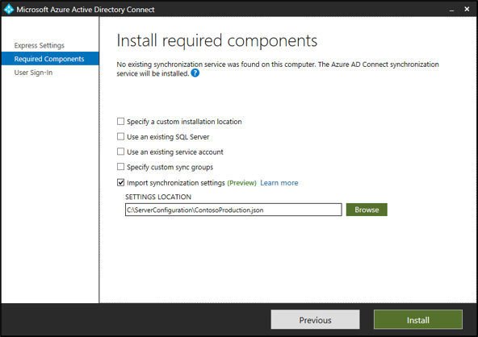
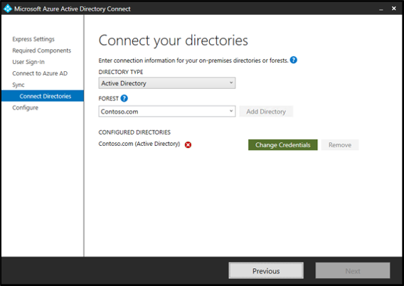
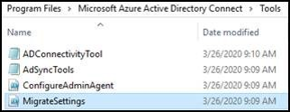
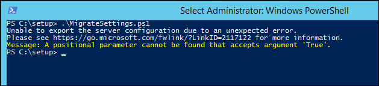
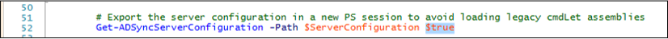
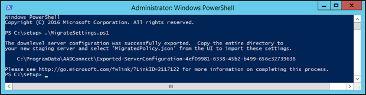
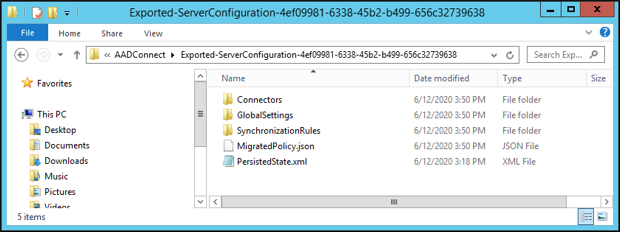
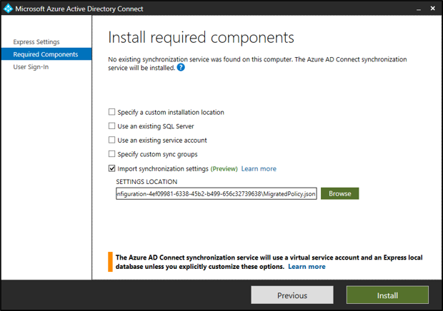

# Import and export Microsoft Entra Connect configuration settings

Microsoft Entra Connect deployments vary from a single forest Express mode installation to complex deployments that synchronize across multiple forests by using custom synchronization rules. Because of the large number of configuration options and mechanisms, it's essential to understand what settings are in effect and be able to quickly deploy a server with an identical configuration. This feature introduces the ability to catalog the configuration of a specific synchronization server and import the settings into a new deployment. You can compare different synchronization settings snapshots to easily visualize the differences between two servers or the same server over time.

Each time the configuration is changed from the Microsoft Entra Connect wizard, a new time-stamped JSON settings file is automatically exported to `%ProgramData%\AADConnect`. The settings file name is of the form `Applied-SynchronizationPolicy-*.JSON`, where the last part of the file name is a time stamp.

> [!IMPORTANT]
> Only changes made by Microsoft Entra Connect are automatically exported. Any changes made by using PowerShell, the Synchronization Service Manager, or the Synchronization Rules Editor must be exported on demand as needed to maintain an up-to-date copy. You can also use export on demand to place a copy of the settings in a secure location for disaster recovery purposes.

You can't use this feature if the Microsoft Entra Connect installation was modified to include the G-SQL connector or the G-LDAP connector. You also can't combine this feature when you use an existing Azure Active Directory Synchronization (ADSync) database. The use of import/export configuration and using an existing database are mutually exclusive.

## Export Microsoft Entra Connect settings

To view a summary of your configuration settings, open the Microsoft Entra Connect tool, and select the task named **View or Export Current Configuration**. A quick summary of your settings is shown along with the ability to export the full configuration of your server.

By default, the settings are exported to `%ProgramData%\AADConnect`. You can also choose to save the settings to a protected location to ensure availability if a disaster occurs. Settings are exported by using the JSON file format and shouldn't be hand-created or edited to ensure logical consistency. Importing a hand-created or edited file isn't supported and might lead to unexpected results.

## Import Microsoft Entra Connect settings

To import previously exported settings:

1. Install **Microsoft Entra Connect** on a new server.
1. After the **Welcome** page, select the **Customize** option.
1. Select **Import synchronization settings**. Browse for the previously exported JSON settings file.
1. Select **Install**.

   

Override settings on this page like the use of SQL Server instead of `LocalDB` or the use of an existing service account instead of a default virtual service account. These settings aren't imported from the configuration settings file. They're there for information and comparison purposes.

Modifying the exported JSON file to change the configuration isn't supported.

### Import installation experience

The import installation experience is intentionally kept simple with minimal inputs from the user to easily provide reproducibility of an existing server.

Here are the only changes that you can make during the installation experience. All other changes must be made after installation from the Microsoft Entra Connect wizard:

- **Microsoft Entra credentials**: The account name for the Global administrator used to configure the original server is suggested by default. It *must* be changed if you want to synchronize information to a new directory.
- **User sign-in**: The sign-on options configured for your original server are selected by default and automatically prompt for credentials or other information that's needed during configuration. In rare cases, you might need to set up a server with different options to avoid changing the behavior of the active server. Otherwise, select **Next** to use the same settings.
- **On-premises directory credentials**: For each on-premises directory included in your synchronization settings, you must provide credentials to create a synchronization account or supply a precreated custom synchronization account. This procedure is identical to the clean install experience with the exception that you can't add or remove directories.
- **Configuration options**: As with a clean install, you might choose to configure the initial settings for whether to start automatic synchronization or enable Staging mode. The main difference is that Staging mode is intentionally enabled by default to allow comparison of the configuration and synchronization results before actively exporting the results to Microsoft Entra ID.

Only one synchronization server can be in the primary role and actively exporting configuration changes to Microsoft Entra ID. All other servers must be placed in Staging mode.

## Migrate settings from an existing server

If an existing server doesn't support settings management, you can either choose to upgrade the server in place or migrate the settings for use on a new staging server.

Migration requires running a PowerShell script that extracts the existing settings for use in a new installation. Use this method to catalog the settings of your existing server and then apply them to a newly installed staging server. Comparing the settings for the original server to a newly created server quickly visualizes the changes between the servers. As always, follow your organization's certification process to ensure that no other configuration is required.

### Migration process

To migrate the settings:

1. Start `AzureADConnect.msi` on the new staging server, and stop at the **Welcome** page of Microsoft Entra Connect.

1. Copy `MigrateSettings.ps1` from the Microsoft Entra Connect\Tools directory to a location on the existing server. An example is C:\setup, where setup is a directory that was created on the existing server.

    

    If you see `Message: A positional parameter cannot be found that accepts argument 'True'.`:

    

    Then edit the `MigrateSettings.ps1` file and remove `$true` and run the script:

    

1. Run the script as shown here, and save the entire downlevel server configuration directory. Copy this directory to the new staging server. You must copy the entire `Exported-ServerConfiguration-*` folder to the new server.

    

    

1. Start **Microsoft Entra Connect** by double-clicking the icon on the desktop. Accept the Microsoft Software License Terms, and on the next page, select **Customize**.
1. Select the **Import synchronization settings** checkbox. Select **Browse** to browse the copied-over `Exported-ServerConfiguration-*` folder. Select `MigratedPolicy.json` to import the migrated settings.

    

## Post-installation verification

Comparing the originally imported settings file with the exported settings file of the newly deployed server is an essential step in understanding any differences between the intended versus the resulting deployment. Using your favorite side-by-side text comparison application yields an instant visualization that quickly highlights any desired or accidental changes.

Although many formerly manual configuration steps are now eliminated, you should still follow your organization's certification process to ensure that no other configuration is required. This configuration might occur if you use advanced settings, which aren't currently captured in this release of settings management.

Here are known limitations:

- **Synchronization rules**: The precedence for a custom rule must be in the reserved range of 0 to 99 to avoid conflicts with Microsoft's standard rules. Placing a custom rule outside the reserved range might result in your custom rule being shifted around as standard rules are added to the configuration. A similar issue occurs if your configuration contains modified standard rules. Modifying a standard rule is discouraged, and rule placement is likely to be incorrect.
- **Device writeback**: These settings are cataloged. They aren't currently applied during configuration. If device writeback was enabled for your original server, you must manually configure the feature on the newly deployed server.
- **Synchronized object types**: Although it's possible to constrain the list of synchronized object types (such as users, contacts, and groups) by using the Synchronization Service Manager, this feature isn't currently supported via synchronization settings. After you finish the installation, you must manually reapply the advanced configuration.
- **Selected attributes**: Although it's possible to constrain the list of synchronized attributes (such as extension attributes) by using the Synchronization Service Manager, this feature isn't currently supported via synchronization settings. After you finish the installation, you must manually reapply the advanced configuration.
- **Custom run profiles**: Although it's possible to modify the default set of run profiles by using the Synchronization Service Manager, this feature isn't currently supported via synchronization settings. After you finish the installation, you must manually reapply the advanced configuration.
- **Configuring the provisioning hierarchy**: This advanced feature of the Synchronization Service Manager isn't supported via synchronization settings. It must be manually reconfigured after you finish the initial deployment.
- **Active Directory Federation Services (AD FS) and PingFederate authentication**: The sign-on methods associated with these authentication features are automatically preselected. You must interactively supply all other required configuration parameters.

## Related content

- [Hardware and prerequisites](how-to-connect-install-prerequisites.md)
- [Express settings](how-to-connect-install-express.md)
- [Customized settings](how-to-connect-install-custom.md)
- [Install Microsoft Entra Connect Health agents](how-to-connect-health-agent-install.md)
