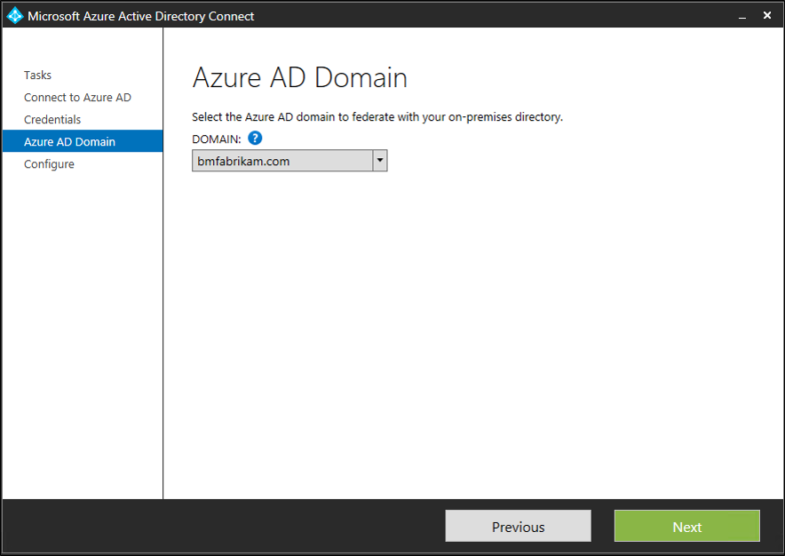
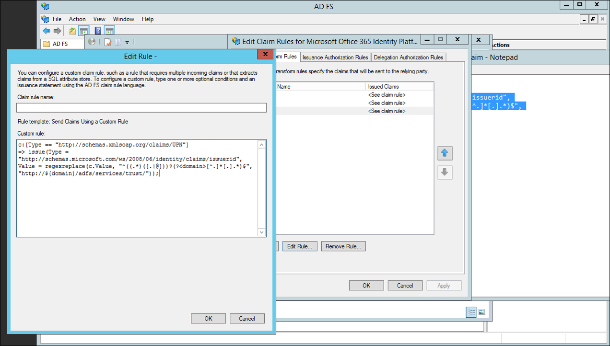

# Multiple Domain Support for Federating with Microsoft Entra ID
The following documentation provides guidance on how to use multiple top-level domains and subdomains when federating with Microsoft 365 or Microsoft Entra domains.

## Multiple top-level domain support
Federating multiple, top-level domains with Microsoft Entra ID requires some extra configuration that isn't required when federating with one top-level domain.

When a domain is federated with Microsoft Entra ID, several properties are set on the domain in Azure. One important one is IssuerUri. This property is a URI that is used by Microsoft Entra ID to identify the domain that the token is associated with. The URI doesn’t need to resolve to anything but it must be a valid URI. By default, Microsoft Entra ID sets the URI to the value of the federation service identifier in your on-premises AD FS configuration.

> [!NOTE]
> The federation service identifier is a URI that uniquely identifies a federation service. The federation service is an instance of AD FS that functions as the security token service.
>
>

You can view the IssuerUri by using the PowerShell command `Get-EntraDomainFederationSettings -DomainName <your domain>`.

A problem arises when you add more than one top-level domain. For example, let's say you have set up federation between Microsoft Entra ID and your on-premises environment. For this document, the domain, bmcontoso.com is being used. Now a second, top-level domain, bmfabrikam.com has been added.


When you attempt to convert the bmfabrikam.com domain to be federated, an error occurs. The reason is, Microsoft Entra ID has a constraint that doesn't allow the IssuerUri property to have the same value for more than one domain. 

### SupportMultipleDomain Parameter

> [!NOTE]
> SupportMultipleDomain paramer is no longer available and does not work with the following modules:
> * `Microsoft.Graph`
>* `Microsoft.Entra`
>


> [!IMPORTANT]
> In order to federate multiple domains you may have to go one by one and start making the changes since the -SupportMultipleDomain is no longer available.
>
>

<a name='how-to-update-the-trust-between-ad-fs-and-azure-ad'></a>

## How to update the trust between AD FS and Microsoft Entra ID

If you have successfully added a new domain in the [Microsoft Entra admin center](https://entra.microsoft.com) and changed the Token Signing Certificate you are just one step away from updating your federation information against EntraID. 

Use the steps below to update your federation information on EntraID:

1. Open a new PowerShell session and run the below commands to install the Entra module:
   >**Note:** "-allowclobber" will override warning messages about installation conflicts and overwrite existing commands that have the same name as commands being installed by a module. Use this value if you already have installed Microsoft.Graph module:
  
3. * `Install-Module -Name Microsoft.Entra -allowClobber`
   * `Import-Module -Name Microsoft.Entra.DirectoryManagement`
   * `Connect-Entra -Scopes 'Domain.Read.All'`
   * `Get-EntraFederationProperty -domainname domain.com`


Once you have copied the ID displayed in the second column from the output, run:
* `Update-MgDomainFederationConfiguration -DomainID domain.com -InternalDomainFederationId 0f6ftrte-xxxx-xxxx-xxxx-19xxxxxxxx23'`

Use the following steps to add the new top-level domain using PowerShell

1. On a machine that has [Azure AD PowerShell module](/previous-versions/azure/jj151815(v=azure.100)) installed on it run the following PowerShell: `$cred=Get-Credential`.
2. Enter the username and password of a Hybrid Identity Administrator for the Microsoft Entra domain you're federating with
3. In PowerShell, enter `Connect-Entra -Scopes 'Domain.ReadWrite.All'`
4. Enter all the values as the below example to add a new domain:

>  New-MgDomainFederationConfiguration -DomainId "contoso.com" -ActiveSigninUri " https://sts.contoso.com/adfs/services/trust/2005/usernamemixed" -DisplayName "Contoso" -IssuerUri " http://contoso.com/adfs/services/trust" -MetadataExchangeUri " https://sts.contoso.com/adfs/services/trust/mex" -PassiveSigninUri " https://sts.contoso.com/adfs/ls/" -SignOutUri " https://sts.contoso.com/adfs/ls/" -SigningCertificate <*Base64 Encoded Format cert*> -FederatedIdpMfaBehavior "acceptIfMfaDoneByFederatedIdp" -PreferredAuthenticationProtocol "wsFed


Use the following steps to add the new top-level domain using Microsoft Entra Connect.

1. Launch Microsoft Entra Connect from the desktop or start menu
2. Choose “Add an additional Microsoft Entra Domain”
  
3. Enter your Microsoft Entra ID and Active Directory credentials
4. Select the second domain you wish to configure for federation.
  
5. Click Install

### Verify the new top-level domain
By using the PowerShell command `Get-MgDomainFederationConfiguration -DomainName <your domain>`you can view the updated IssuerUri. The screenshot below shows the federation settings were updated on the original domain `http://bmcontoso.com/adfs/services/trust`


And the IssuerUri on the new domain has been set to `https://bmcontoso.com/adfs/services/trust`

## Support for subdomains
When you add a subdomain, because of the way Microsoft Entra ID handled domains, it inherits the settings of the parent. So, the IssuerUri, needs to match the parents.

So lets say, for example, that I have bmcontoso.com and then add corp.bmcontoso.com. The IssuerUri for a user from corp.bmcontoso.com needs to be **`http://bmcontoso.com/adfs/services/trust`**. However the standard rule implemented above for Microsoft Entra ID, generates a token with an issuer as **`http://corp.bmcontoso.com/adfs/services/trust`**, which won't match the domain's required value and authentication fails.

### How To enable support for subdomains
In order to work around this behavior, the AD FS relying party trust for Microsoft Online needs to be updated. To do this, you must configure a custom claim rule so that it strips off any subdomains from the user’s UPN suffix when constructing the custom Issuer value.

Use the following claim:

```  
c:[Type == "http://schemas.xmlsoap.org/claims/UPN"] => issue(Type = "http://schemas.microsoft.com/ws/2008/06/identity/claims/issuerid", Value = regexreplace(c.Value, "^.*@([^.]+\.)*?(?<domain>([^.]+\.?){2})$", "http://${domain}/adfs/services/trust/"));
```

[!NOTE]
The last number in the regular expression set is how many parent domains there are in your root domain. Here bmcontoso.com is used, so two parent domains are necessary. If three parent domains were to be kept (that is, corp.bmcontoso.com), then the number would have been three. Eventually a range can be indicated, the match is made to match the maximum of domains. "{2,3}" matches two to three domains (that is, bmfabrikam.com and corp.bmcontoso.com).

Use the following steps to add a custom claim to support subdomains.

1. Open AD FS Management
2. Right-click the Microsoft Online RP trust and choose Edit Claim rules
3. Select the third claim rule, and replace
  
4. Replace the current claim:

  ```
  c:[Type == "http://schemas.xmlsoap.org/claims/UPN"] => issue(Type = "http://schemas.microsoft.com/ws/2008/06/identity/claims/issuerid", Value = regexreplace(c.Value, ".+@(?<domain>.+)","http://${domain}/adfs/services/trust/"));
  ```
  with

  ```
  c:[Type == "http://schemas.xmlsoap.org/claims/UPN"] => issue(Type = "http://schemas.microsoft.com/ws/2008/06/identity/claims/issuerid", Value = regexreplace(c.Value, "^.*@([^.]+\.)*?(?<domain>([^.]+\.?){2})$", "http://${domain}/adfs/services/trust/"));
  ```

  

5. Click Ok. Click Apply. Click Ok. Close AD FS Management.

## Next steps
Now that you have Microsoft Entra Connect installed you can [verify the installation and assign licenses](how-to-connect-post-installation.md).

Learn more about these features, which were enabled with the installation: [Automatic upgrade](how-to-connect-install-automatic-upgrade.md), [Prevent accidental deletes](how-to-connect-sync-feature-prevent-accidental-deletes.md), and [Microsoft Entra Connect Health](how-to-connect-health-sync.md).

Learn more about these common topics: [scheduler and how to trigger sync](how-to-connect-sync-feature-scheduler.md).

Learn more about [Integrating your on-premises identities with Microsoft Entra ID](../whatis-hybrid-identity.md).
