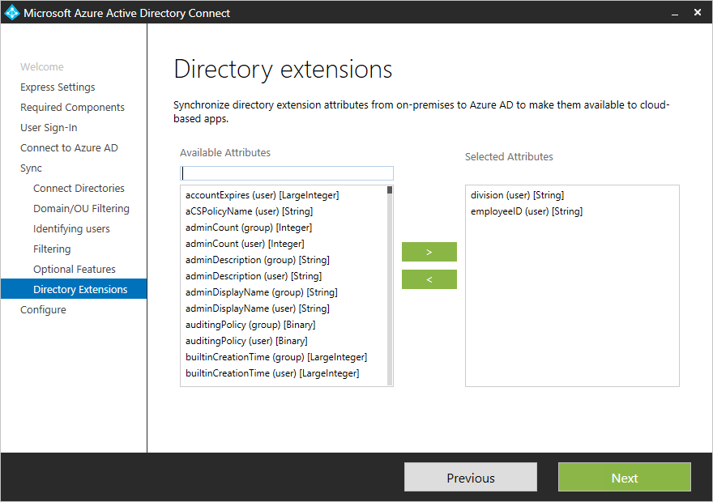
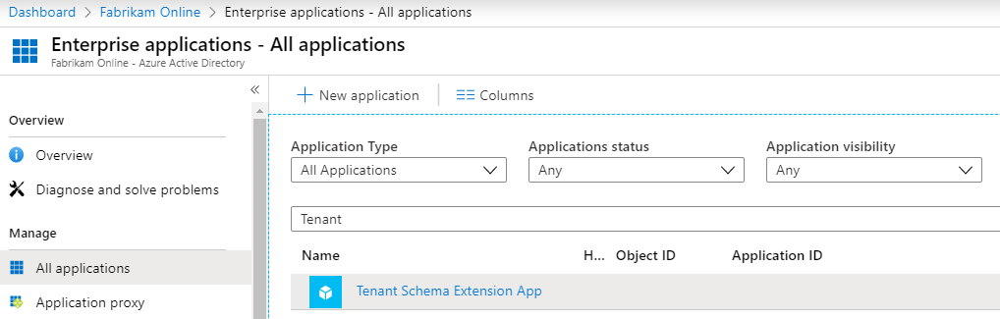
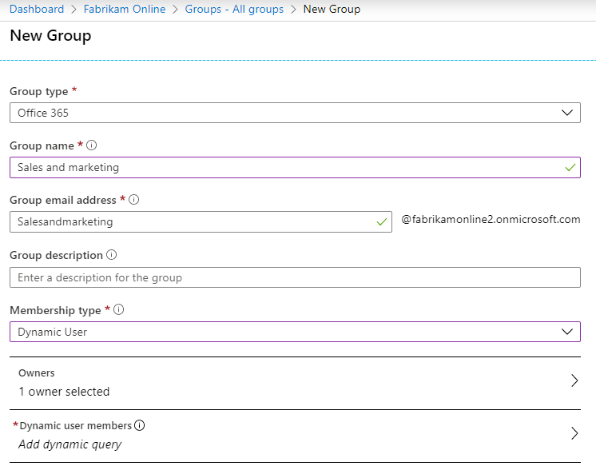
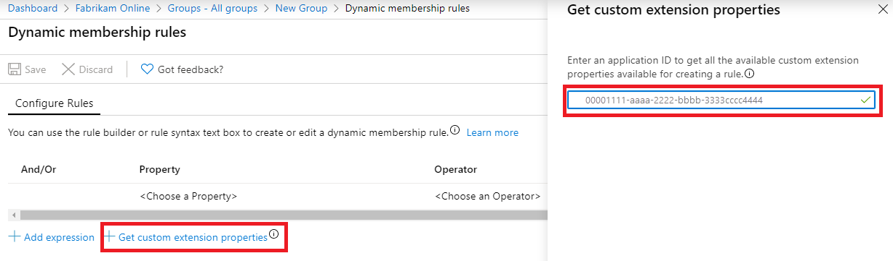
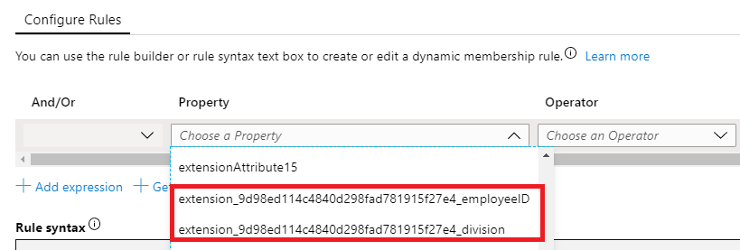
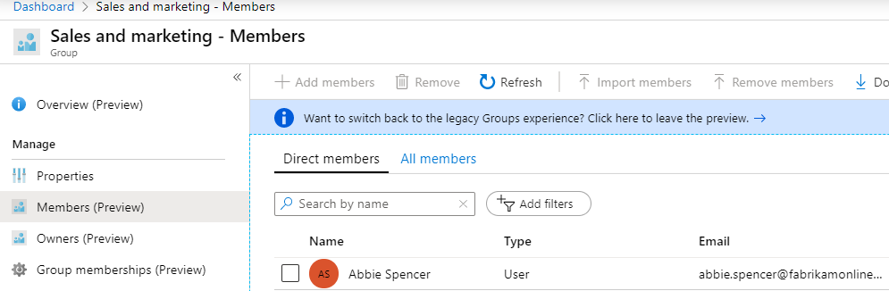

# Microsoft Entra Connect Sync: Directory extensions
You can use directory extensions to extend the schema in Microsoft Entra ID with your own attributes from on-premises Active Directory. This feature enables you to build LOB apps by consuming attributes that you continue to manage on-premises. These attributes can be consumed through [extensions](/graph/extensibility-overview). You can see the available attributes by using [Microsoft Graph Explorer](https://developer.microsoft.com/graph/graph-explorer), [Microsoft Graph PowerShell SDK](/powershell/microsoftgraph/overview) or [Microsoft Entra PowerShell](/powershell/entra-powershell/overview). 
Currently, no Microsoft 365 workload consumes these attributes, but you can use this feature with dynamic group memberships in Microsoft Entra ID.

## Select which attributes to synchronize with Microsoft Entra ID

You configure which extended attributes you want to synchronize using Microsoft Entra Connect configuration wizard, in the custom settings.

  

The wizard shows the attributes that are valid candidates to be used with Directory Extensions:

* User and Group object types
* Single-valued attributes: String, Boolean, Integer, Binary
* Multi-valued attributes: String, Binary

## Important considerations when using Directory Extensions

- <a name='configuration-changes-in-azure-ad-made-by-the-wizard'></a>The list of attributes is read from the Active Directory schema during initial installation of Microsoft Entra Connect. If you extend the Active Directory schema with more custom attributes, you must [refresh the schema](how-to-connect-installation-wizard.md#refresh-directory-schema) before these new attributes are visible.

- If you exported a configuration that contains a custom rule used to synchronize directory extension attributes and you attempt to import this rule into a new or existing installation of Microsoft Entra Connect, the rule is created during import, but the directory extension attributes won't be mapped.  You need to re-select the directory extension attributes and re-associate them with the rule or recreate the rule entirely to fix this.

- Not all features in Microsoft Entra ID support multi-valued extension attributes. Refer to the documentation of the feature in which you plan to use these attributes to confirm they're supported. 

- An object in Microsoft Entra ID can have up to 100 attributes for directory extensions. The maximum length is 250 characters. If an attribute value is longer, the sync engine truncates it.

- It's not supported to sync constructed attributes, such as msDS-UserPasswordExpiryTimeComputed. If you upgrade from an old version of Microsoft Entra Connect you may still see these attributes show up in the installation wizard, you shouldn't enable them as its value won't sync to Microsoft Entra ID. [Learn mode](/openspecs/windows_protocols/ms-adts/a3aff238-5f0e-4eec-8598-0a59c30ecd56).

- It's not supported to sync non-replicated attributes, such as badPwdCount, Last-Logon, and Last-Logoff, as their values don't sync to Microsoft Entra ID.

- It's not supported to manage on-premises Directory Extensions outside of Microsoft Entra Connect wizard. Manually editing or cloning the sync rules for Directory Extensions can cause synchronization issues.

- It's not supported to sync attribute values from Microsoft Entra Connect to extension attributes that aren't created by Microsoft Entra Connect. Doing so may produce performance issues and unexpected results.

## Configuration changes in Microsoft Entra ID made by the wizard

During installation of Microsoft Entra Connect, an application is registered where these attributes are configured. You can see this application in the [Microsoft Entra admin center](https://entra.microsoft.com), with the name **Tenant Schema Extension App**. Make sure you select **All Applications** to see this app.



> [!NOTE]
> The **Tenant Schema Extension App** is a system-only application that can't be deleted. 
> Deleting the Service Principal associated with **Tenant Schema Extension App** breaks the synchronization. To recover Directory Extensions synchronization, restore the soft-deleted Service Principal or re-create a new one.

## Viewing extended attributes in Microsoft Entra ID

The format of extended attributes is `extension_{ApplicationId}_<attributeName>`, where ApplicationId is the application identifier of your *Tenant Schema Extension App*. You need this value for all other scenarios in this topic.

### Using the Microsoft Graph API

These attributes are available through Microsoft Graph API, by using [Microsoft Graph Explorer](https://developer.microsoft.com/graph/graph-explorer#).

In the Microsoft Graph API, you need to ask for the attributes to be returned. Explicitly select the attributes like this: 

```
https://graph.microsoft.com/beta/users/abbie.spencer@fabrikamonline.com?$select=extension_9d98ed114c4840d298fad781915f27e4_employeeID,extension_9d98ed114c4840d298fad781915f27e4_division
```
  
For more information, see [Microsoft Graph: Use query parameters](/graph/query-parameters#select-parameter).

### Using the Microsoft Graph PowerShell SDK

1. Get the **Tenant Schema Extension App** application:

```powershell
Get-MgApplication -Filter "DisplayName eq 'Tenant Schema Extension App'"
```

2. List all extension attributes for the **Tenant Schema Extension App**:

```powershell
Get-MgDirectoryObjectAvailableExtensionProperty
```

3. List all extension attributes for a user object:

```powershell
(Get-MgBetaUser -UserId "<Id or UserPrincipalName>").AdditionalProperties

```


### Using the Microsoft Entra PowerShell

1. Get the **Tenant Schema Extension App** application identifier:

```powershell
Get-EntraApplication -SearchString "Tenant Schema Extension App"
```

2. List all extension attributes for **Tenant Schema Extension App** application:

```powershell
Get-EntraExtensionProperty | Where-Object {$_.AppDisplayName -eq 'Tenant Schema Extension App'}
```

3. List all extension attributes for a user object:

```powershell
Get-EntraUserExtension -UserId "<Id or UserPrincipalName>"
```

## Use the attributes in dynamic membership groups

One of the most useful scenarios is to use extension attributes in dynamic security or Microsoft 365 groups.

1. Create a new group in Microsoft Entra ID. Give it a name and make sure the **Membership type** is **Dynamic User**.

      
   
1. Select to **Add dynamic query**. When you look at the properties, these extended attributes are missing because you need to add them first. Click **Get custom extension properties**, enter the Application ID, and click **Refresh properties**.

    
   
1. Open the property drop-down and note that the attributes you added are now visible.

   
   
4. To suit your requirements, complete the expression. In our example, the rule is set to:

    `(user.extension_9d98ed114c4840d298fad781915f27e4_division -eq "Sales and marketing")`

1. After the group is created, give Microsoft Entra some time to populate the members and then review the members.

     
   
## Next steps
Learn more about the [Microsoft Entra Connect Sync](how-to-connect-sync-whatis.md) configuration.

Learn more about [Integrating your on-premises identities with Microsoft Entra ID](../whatis-hybrid-identity.md).
