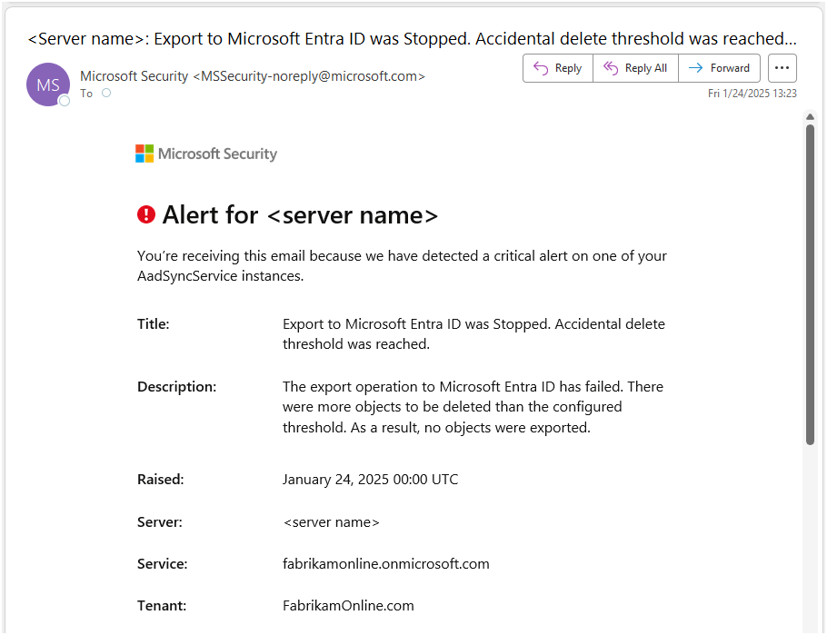

# Microsoft Entra Connect Sync: Prevent accidental deletes
This topic describes the feature to prevent accidental deletes (preventing accidental deletions) in Microsoft Entra Connect.

When installing Microsoft Entra Connect, the feature to prevent accidental deletes is enabled by default and configured to not allow an export with more than 500 deletes. This feature is designed to protect you from accidental configuration changes and changes to your on-premises directory that would affect many users and other objects.

## What is preventing accidental deletes

Common scenarios involving many object deletions include:

* Changes to [filtering](how-to-connect-sync-configure-filtering.md) where an entire [OU](how-to-connect-sync-configure-filtering.md#organizational-unitbased-filtering) or [domain](how-to-connect-sync-configure-filtering.md#domain-based-filtering) is unselected.
* All objects in an OU are moved or deleted.

* An OU is renamed so all its child objects become out of scope for synchronization.

The default value of 500 objects can be changed with PowerShell using `Enable-ADSyncExportDeletionThreshold`, which is part of the AD Sync module installed with Microsoft Entra Connect. You should configure this value to fit the size of your organization. 


## Notifications for preventing accidental deletes

If there are too many deletes staged to be exported to Microsoft Entra ID, then the export stops before deleting any object and you receive an email like this:




| From:         | Microsoft Security <MSSecurity-noreply@microsoft.com>                                                                                                               |
|---------------|---------------------------------------------------------------------------------------------------------------------------------------------------------------------|
| Title:        | Export to Microsoft Entra ID was Stopped. Accidental delete threshold was reached.                                                                                  |
| Description:  | The export operation to Microsoft Entra ID has failed. There were more objects to be deleted than the configured threshold. As a result, no objects were exported.  |
| Raised:       | January 24, 2025 00:00 UTC                                                                                                                                          |
| Server:       | \<server name\>                                                                                                                                                       |
| Service:      | fabrikamonline.onmicrosoft.com                                                                                                                                      |
| Tenant:       | FabrikamOnline.com                                                                                                                                                  |


From [Microsoft Entra Connect Health](https://portal.azure.com/#blade/Microsoft_Azure_ADHybridHealth/AadHealthMenuBlade) portal, navigate to Sync services, select your tenant, then select your active Entra Connect server and select Alerts to see the list of events where the accidental delete threshold is reported.


From the Application event viewer logs you can see a Warning event ID 116 as the following sample:

```
Log Name:      Application
Source:        Directory Synchronization
Date:          <Date/Time>
Event ID:      116
Task Category: None
Level:         Warning
Keywords:      Classic
User:          N/A
Computer:      <server name>
Description:   Prevent Accidental Deletes: The number of deletions for this sync cycle (100 pending deletes) has exceeded the current threshold of 50 objects. Deletions will be suppressed for this sync cycle. Please visit http://go.microsoft.com/fwlink/?LinkId=390655 for more information.
```

## Determine which objects are pending deletion

You can see the run profile status `stopped-deletion-threshold-exceeded` when you look in the **Synchronization Service Manager** UI for the Export step.


To see which objects are about to be deleted, do the following steps:

1. Start __Synchronization Service__ from the Start Menu.

1. Go to __Connectors__.

1. Select the Connector type __Windows Azure Active Directory__.

1. Under __Actions__ to the right, select __Search Connector Space__.

1. In the dropdown box under __Scope__, select __Pending Export__ and enable the check box for __Delete__.

1. Select Search to view a list of all objects about to be deleted. By opening each item, you can get additional information about the object. You can also select Column Settings to add more attributes to be visible in the grid, for instance, the onPremisesDistinguishedName.

    

### If the deletions are unexpected

If you aren't sure that all deletes are desired, and wish to go down a safer route, you can use a more detailed method to [Verify](/entra/identity/hybrid/connect/how-to-connect-sync-staging-server) all the objects pending delete from a spreadsheet.

Unexpected deletions are usually caused by changes in the OU structure or [Domain/OU scope filtering](/entra/identity/hybrid/connect/how-to-connect-sync-configure-filtering), so make sure the objects pending delete are in sync scope. For example, renaming an OU in Active Directory can cause unexpected mass deletions in Microsoft Entra ID unless you re-select the OU in Microsoft Entra Connect Wizard.
If you're using attribute scoping filters, adjust the necessary sync rules in the Synchronization Rules Editor to make sure the objects are back in sync scope.
> [!IMPORTANT]
> Domain/OU scoping filter and sync rule changes don't take effect until you run a full sync cycle: `Start-ADSyncSyncCycle -PolicyType Initial`.

### If all deletions are desired

If all the objects pending deletion are supposed to be deleted in Microsoft Entra ID, then using your Entra Global Administrator or Hybrid Identity Administrator credential, do the following steps:

> [!WARNING]
> This action may result in the permanent deletion of objects in Microsoft Entra ID.

1. To temporarily disable this protection and let all the deletions go through, run the PowerShell cmdlet: `Disable-ADSyncExportDeletionThreshold -AADUserName "<UserPrincipalName>"`.

1. With the Microsoft Entra Connector still selected, select the action __Run__ and select __Export__.

1. To protect against unexpected deletions in the future, ensure the deletion threshold feature isn't permanently disabled. To re-enable the protection with the default value, run: `Enable-ADSyncExportDeletionThreshold -DeletionThreshold 500 -AADUserName "<UserPrincipalName>"`.

If a higher number of expected deletions are frequent in your organization, it's advisable to increase the deletion threshold rather than disabling this protection, as this could allow undesired deletions causing loss of critical data and disruption of services. Evaluate your specific desired number of deletions and use the following PowerShell cmdlet to set a new limit, for instance, to set a deletion threshold of 1000, use: `Enable-ADSyncExportDeletionThreshold -DeletionThreshold 1000 -AADUserName "<UserPrincipalName>"`.

To confirm the current deletion threshold, run: `Get-ADSyncExportDeletionThreshold -AADUserName "<UserPrincipalName>"`.

## Next steps
**Overview topics**

* [Microsoft Entra Connect Sync: Understand and customize synchronization](how-to-connect-sync-whatis.md)

* [Integrating your on-premises identities with Microsoft Entra ID](../whatis-hybrid-identity.md)
