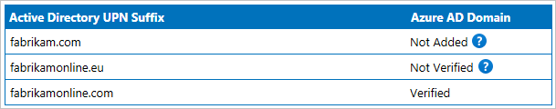

# Microsoft Entra Connect Sync service shadow attributes
Most attributes are represented the same way in Microsoft Entra ID as they are in your on-premises Active Directory. But some attributes have some special handling and the attribute value in Microsoft Entra ID might be different than what Microsoft Entra Connect synchronizes.

## Introducing shadow attributes
Some attributes have two representations in Microsoft Entra ID. Both the on-premises value and a calculated value are stored. These extra attributes are called shadow attributes. The two most common attributes where you see this behavior are **userPrincipalName** and **proxyAddress**. The sync engine in Microsoft Entra Connect and cloud sync exports the value to the shadow attribute and then Microsoft Entra ID processes this attribute to calculate the final value. The sync engine also imports values from the shadow attribute, so even if the final calculated value is different, from the sync engine perspective, it's able to confirm the original value that was exported.
You can't see the shadow attributes using the [Microsoft Entra admin center](https://entra.microsoft.com) or with PowerShell, but understanding this concept helps you to troubleshoot certain scenarios where the attribute has different values on-premises and in the cloud.

To better understand the behavior, look at this example from Fabrikam:  
  
They have multiple UserPrincipalName (UPN) suffixes in their on-premises Active Directory, but only one is verified in Microsoft Entra ID.

### userPrincipalName
A user has the following attribute values in a nonverified domain:

| Attribute | Value |
| --- | --- |
| on-premises userPrincipalName | lee.sperry@fabrikam.com |
| Microsoft Entra shadowUserPrincipalName | lee.sperry@fabrikam.com |
| Microsoft Entra userPrincipalName | lee.sperry@fabrikam.onmicrosoft.com |

The userPrincipalName attribute is the value you see when using PowerShell.

Since the real on-premises attribute value is stored in Microsoft Entra ID, when you verify the fabrikam.com domain, Microsoft Entra ID updates the userPrincipalName attribute with the value from the shadowUserPrincipalName. You don't have to synchronize any changes from Microsoft Entra Connect or cloud sync for these values to be updated.

### proxyAddresses
The same process for only including verified domains also occurs for proxyAddresses, but with some extra logic. The check for verified domains only happens for mailbox users. A mail-enabled user or contact represent a user in another Exchange organization and you can add any values in proxyAddresses to these objects.

For a mailbox user, either on-premises or in Exchange Online, only values for verified domains appear. It could look like this:

| Attribute | Value |
| --- | --- |
| on-premises proxyAddresses | SMTP:abbie.spencer@fabrikamonline.com</br> smtp:abbie.spencer@fabrikam.com</br> smtp:abbie@fabrikamonline.com |
| Exchange Online proxyAddresses | SMTP:abbie.spencer@fabrikamonline.com</br> smtp:abbie@fabrikamonline.com</br> SIP:abbie.spencer@fabrikamonline.com |

In this case, **smtp:abbie.spencer\@fabrikam.com** was removed since that domain isn't verified. But Exchange also added **SIP:abbie.spencer\@fabrikamonline.com**. Fabrikam might not be using on-premises Lync/Skype for Business, but Microsoft Entra ID and Exchange Online prepare for it.

This logic for proxyAddresses is referred to as **ProxyCalc**. ProxyCalc is invoked with every change on a user when:

- The user gets a service plan assigned that includes Exchange Online even if the user wasn't licensed for an Exchange mailbox. For example, if the user is assigned the Office E3 SKU, but only  SharePoint Online service is selected. This condition is true even if the user's mailbox is still on-premises.
- The attribute msExchRecipientTypeDetails have a value.
- You make a change to proxyAddresses or userPrincipalName.

ProxyCalc process sanitizes an address if ShadowProxyAddresses contains a nonverified domain and the user has one of the following properties configured. 
- User is licensed with an EXO service type plan enabled (Excluding MyAnalytics)  
- User has MSExchRemoteRecipientType set (not null)  
- User is considered a shared resource

The user is considered a shared resource when its CloudMSExchRecipientDisplayType attribute has one of the following values:

|Object Display Type|Value (Decimal)|
|-----|-----|
|MailboxUser|	0|
|PublicFolder|	2|
|ConferenceRoomMailbox|	7|
|EquipmentMailbox|	8|
|ArbitrationMailbox|	10|
|RoomList|	15|
|TeamMailboxUser|	16|
|GroupMailbox|	17|
|SchedulingMailbox|	18|
|ACLableMailboxUser|	1073741824|
|ACLableTeamMailboxUser|	1073741840|


>[!NOTE]
> CloudMSExchRecipientDisplayType isn't visible from the Microsoft Entra ID side and can only be viewed using Exchange Online cmdlet [Get-Recipient](/powershell/module/exchange/get-recipient).  
>
>Example:
> ```PowerShell
>   Get-Recipient admin | fl *type*
> ```
>

ProxyCalc might take some time to process a change on a user and isn't synchronous with the Microsoft Entra Connect export process.

> [!NOTE]
> The ProxyCalc logic has some additional behaviors for advanced scenarios not documented in this topic. This topic is provided for you to understand the behavior and not document all internal logic.

### Quarantined attribute values
Shadow attributes are also used when there are duplicate attribute values. For more information, see [duplicate attribute resiliency](how-to-connect-syncservice-duplicate-attribute-resiliency.md).

## See also
* [Microsoft Entra Connect Sync](how-to-connect-sync-whatis.md)
* [Integrating your on-premises identities with Microsoft Entra ID](../whatis-hybrid-identity.md).
