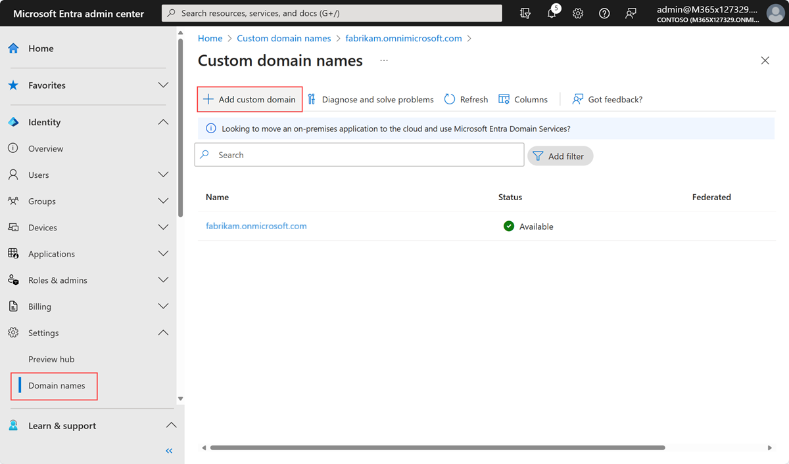
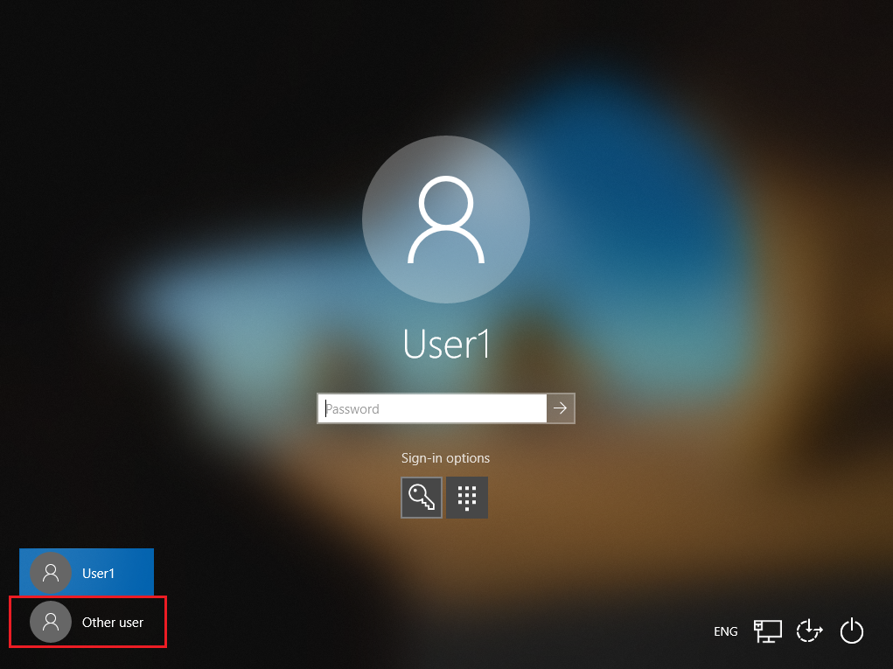

# Plan and troubleshoot UserPrincipalName changes in Microsoft Entra ID

The UserPrincipalName (UPN) attribute is an internet communication standard for user accounts. A UPN consists of: 

* **Prefix**: User account name
* **Suffix**: Domain name server (DNS) domain name 

The prefix joins the suffix using the "\@" symbol. For example, someone@example.com. During planning, ensure the UPN is unique among security principal objects in a directory forest. 

   > [!NOTE]
   >This article assumes the UPN is the user identifier. The article addresses UPN-change planning, and recovery from issues that might result from changes. We recommend developers use the user objectID as the immutable identifier, rather than UPN or email addresses.

## Reasons for UPN changes

When the value is the user UPN, sign-in pages often prompt users to enter an email address. Therefore, when the user's primary email address changes, change the user UPN. Generally, a user's primary email address changes for the following reasons:

* Employee name change
* Employee move
* Restructuring changes that affect the suffix
* Merger and/or acquisition changes

### UPN prefix and suffix changes

We recommend you change user UPN when their primary email address changes. During initial synchronization from Active Directory to Microsoft Entra ID, ensure user emails and UPNs are identical. See the following example prefix and suffix changes. 

Prefix change examples:

* From **BSimon**@contoso.com to **BJohnson**@contoso.com
* From **Bsimon**@contoso.com to **Britta.Simon**@contoso.com

Suffix change examples:

* From Britta.Simon@**contoso.com** to Britta.Simon@**contosolabs.com**
* From Britta.Simon@corp.**contoso.com** to Britta.Simon@**labs.contoso.com**

### UPNs in Active Directory

In Active Directory, the default UPN suffix is the DNS where you created the user account. In most cases, register this domain name as the enterprise domain. If you create the user account in the contoso.com domain, the default UPN is: username@contoso.com. Add more UPN suffixes with Active Directory domains and trusts. For example, if you add labs.contoso.com and change the user UPNs and email to reflect that, the result is: username@labs.contoso.com.

You can [add your custom domain name to your tenant](/entra/fundamentals/add-custom-domain).

   >[!IMPORTANT]
   > If you change the suffix in Active Directory, add and verify a matching custom domain name in Microsoft Entra ID. 

   

### UPNs in Microsoft Entra ID

Users sign in to Microsoft Entra ID with their userPrincipalName attribute value. 

When you use Microsoft Entra ID with on-premises Active Directory, user accounts are synchronized with the Microsoft Entra Connect service. The Microsoft Entra Connect wizard uses the userPrincipalName attribute from the on-premises Active Directory as the UPN in Microsoft Entra ID. You can change it to a different attribute in a custom installation.

> [!NOTE]
> Define a process for updating a UserPrincipalName for users and your organization. 

When you synchronize user accounts from Active Directory to Microsoft Entra ID, ensure the UPNs in Active Directory map to verified domains in Microsoft Entra ID. If the userPrincipalName attribute value doesn't correspond to a verified domain in Microsoft Entra ID, synchronization replaces the suffix with .onmicrosoft.com.

### Bulk UPN change rollout

To test bulk UPN changes, create a tested roll-back plan to revert UPNs. For the pilot, target small user sets with organizational roles, and sets of apps or devices. This process helps you understand the user experience. Include this information in change communications to stakeholders and users.

Learn more about [Microsoft Entra deployment plans](~/architecture/deployment-plans.md).

We recommend you create a procedure to change UPNs for individual users. Include documentation about known issues and workarounds. For more information, see the following sections. 

## SaaS and LoB apps issues

Software as a service (SaaS) and line of business (LoB) applications often rely on UPNs to find users and store user profile information, including roles. Applications potentially affected by UPN changes use just-in-time (JIT) provisioning to create a user profile when users initially sign in to the app.

Learn more:

* [What is SaaS?](https://azure.microsoft.com/overview/what-is-saas/)
* [What is app provisioning in Microsoft Entra ID?](~/identity/app-provisioning/user-provisioning.md)

### Known issues: Broken relationship, new profile

User UPN changes can break the relationship between the Microsoft Entra user and the user profile on the application. If the application uses JIT provisioning, it can create a new user profile. Then, the application Administrator makes manual changes to fix the relationship.

**Workarounds: Automated provisioning**

In supported cloud applications, to create, maintain, and remove user identities, use automated app provisioning in Microsoft Entra ID. To update UPNs on the application, configure automated user provisioning on your applications. Test applications to validate successful UPN changes. To enable automatic user provisioning, developers can add System for Cross-domain Identity Management (SCIM) support to applications. 

Learn more:

* [What is app provisioning in Microsoft Entra ID?](~/identity/app-provisioning/user-provisioning.md)
* [Tutorial: Develop and plan provisioning for a SCIM endpoint in Microsoft Entra ID](~/identity/app-provisioning/use-scim-to-provision-users-and-groups.md)

## Managed devices issues

To maximize user productivity with single sign-on (SSO) across cloud and on-premises resources, bring devices into Microsoft Entra ID. 

Learn more on [what is a device identity?](~/identity/devices/overview.md)

### Microsoft Entra joined devices

Regardless of size or industry, organizations can deploy Microsoft Entra joined devices. Microsoft Entra join works in hybrid environments, enabling access to cloud and on-premises apps and resources. Microsoft Entra joined devices are joined to Microsoft Entra ID. Users sign in to the device using their organization identity.

Learn more about [Microsoft Entra joined devices](~/identity/devices/concept-directory-join.md).

**Known issues: SSO**

Users might experience SSO issues with applications that depend on Microsoft Entra ID for authentication. This issue was fixed in the Windows 10 May-2020 update.

**Workaround**

1. Allow time for the UPN change to sync to Microsoft Entra ID.
2. Verify the new UPN appears in the [Microsoft Entra admin center](https://entra.microsoft.com).
3. Tell users to select **Other user** to sign in with a new UPN.
1. Verify with [Get-MgUser](/powershell/module/microsoft.graph.users/get-mguser) in Microsoft Graph PowerShell.

      >[!NOTE]
   > After users sign in with a new UPN, references to the previous UPN might appear on the **Access work or school** Windows setting.

   
   

### Microsoft Entra hybrid joined devices issues

Microsoft Entra hybrid joined devices are joined to Active Directory and Microsoft Entra ID. Implement Microsoft Entra hybrid join if your environment has an on-premises Active Directory footprint.
 
Learn more about [Microsoft Entra hybrid joined devices](~/identity/devices/concept-hybrid-join.md).

**Known issues: Windows 10 Microsoft Entra hybrid joined devices**

Windows 10 Microsoft Entra hybrid joined devices experience unexpected restarts and access issues. If users sign in to Windows before the new UPN synchronizes with Microsoft Entra ID, they might experience SSO issues with apps that use Microsoft Entra ID for authentication. This scenario can occur if users are in a Windows session. This situation occurs if Conditional Access is configured to enforce use of hybrid joined devices to access resources. In addition, the following message can force a restart after one minute:

*Your PC automatically restarts in one minute. Windows ran into a problem and needs to restart. You should close this message now and save your work.*

This issue was fixed in the Windows 10 May-2020 update.

**Workaround**

1. Unjoin the device from Microsoft Entra ID.
2. Restart. 
3. The device joins Microsoft Entra ID.
4. To sign in, the user selects **Other user**. 

To unjoin a device from Microsoft Entra ID, run the following command at a command prompt: dsregcmd/leave

   >[!NOTE]
   >If you use Windows Hello for Business, users re-enroll for Windows Hello for Business. 

   >[!TIP]
   >Windows 7 and 8.1 devices aren't affected by this issue.

## Microsoft Authenticator issues

If your organization requires Authenticator to sign in and access applications and data, a username might appear in the app. However, the account isn't a verification method until users complete registration. 

Learn [how to use Authenticator](https://support.microsoft.com/account-billing/how-to-use-the-microsoft-authenticator-app-9783c865-0308-42fb-a519-8cf666fe0acc).

Authenticator app has four main functions:

* **Multifactor authentication** with push notification or verification code
* **Authentication broker** on iOS and Android devices for SSO on applications using brokered authentication
  * [Enable cross-app SSO on Android using Microsoft Authentication Library (MSAL)](~/identity-platform/msal-android-single-sign-on.md)
* **Device registration** or workplace join, to Microsoft Entra ID, which is a requirement for Intune App Protection and Device Enrolment/Management
* **Phone sign in**, which requires MFA and device registration

### Multifactor authentication with Android devices

Use Authenticator for out-of-band verification. Multifactor authentication pushes a notification to Authenticator on the user device, instead of an automated call or short-message service (SMS) to the user. 

1. The user selects **Approve**, enters a PIN, or enters a biometric.
2. The user selects **Authenticate**.

Learn [how it works: Microsoft Entra multifactor authentication](~/identity/authentication/concept-mfa-howitworks.md).

**Known issues: Notification not received**

When you change user UPN, the previous UPN appears on the user account. Notification might not be received. Instead, use verification codes.

See a list of [common questions about Authenticator](https://prod.support.services.microsoft.com/account-billing/common-questions-about-the-microsoft-authenticator-app-12d283d1-bcef-4875-9ae5-ac360e2945dd).

**Workaround**

1. If notification appears, instruct the user to dismiss it.
2. Open Authenticator.
3. Select **Check for notifications**.
4. Approve the MFA prompt.
5. The UPN on the account updates.

> [!NOTE]
> The updated UPN might appear as a new account. This change is due to other Authenticator functionality.

### Brokered authentication

On Android and iOS, brokers like Authenticator enable:

* SSO: Users don't sign in to each application
* Device identification: The broker accesses the device certificate created on the device when it was workplace-joined
* Application identification verification: When an application calls the broker, it passes its redirect URL, and the broker verifies it

Learn more:

* [Microsoft Entra Conditional Access documentation](~/identity/conditional-access/index.yml)

**Known issues: user prompts**

Due to a mismatch between the `login_hint` passed by the application, and the UPN on the broker, the user experiences more authentication prompts with broker-assisted sign-in.

**Workaround**

The user manually removes the account from Authenticator and starts a new sign-in from a broker-assisted application. After initial authentication, the account is added.

### Device registration

Authenticator registers the device in Microsoft Entra ID, which allows the device to authenticate to Microsoft Entra ID. This registration is a requirement for:

* Intune app protection
* Intune device enrollment
* Phone sign-in

**Known issues: New account appears**

If you change UPN, a new account with the new UPN appears on the Authenticator. The account with the previous UPN remains. Also, the previous UPN appears on Device Registration in app settings. There's no change in functionality of Device Registration or dependent scenarios.

**Workaround**

To remove references to the previous UPN on Authenticator, the user removes the previous and new accounts from Authenticator. The user re-registers for MFA, and rejoins the device.

### Phone sign-in

Use phone sign-in to sign in to Microsoft Entra ID without a password. With Authenticator, the user registers for MFA and then enables phone sign-in. The device registers with Microsoft Entra ID.

**Known issues: No notification**

Users can't use phone sign-in because they didn't receive notification. If the user selects **Check for Notifications**, an error appears.

**Workaround**

On the account enabled for phone sign-in, on the drop-down menu, the user selects **Disable phone sign-in**. 

## Mobile Device Management
 
### Known issues: Device re-registration required
 
If your organization uses Mobile Device Management and the Intune App or the Company Portal app to manage your devices, device registration isn’t resilient during UPN changes. Upon changing the UPN, the device will be detected as unregistered with Entra, and users will be required to sign in and register the device again for management and Conditional Access to continue to work. Until registration is complete, the user may not be able to access any corporate resources on this device.  
 
Learn more:
 
* [Device enrollment guide for Microsoft Intune](/mem/intune/fundamentals/deployment-guide-enrollment)
* [Use Conditional Access with Microsoft Intune compliance policies](/mem/intune/protect/conditional-access)
 
**Workaround**
 
After UPN changes, the end users are required to sign in and follow the in-app prompts to register again.

## Security key (FIDO2) issues

### Known issues: Account selection

When multiple users are registered on the same key, account selection appears where the previous UPN appears. UPN changes don't affect sign-in with security keys.  

**Workaround**

To remove references to previous UPNs, users reset the security key and re-register.

You can [enable passwordless security key sign-in, known issue, UPN changes](~/identity/authentication/howto-authentication-passwordless-security-key.md#known-issues).

## OneDrive issues

OneDrive users might experience issues after UPN changes. 

Learn [how UPN changes affect the OneDrive URL and OneDrive features](/sharepoint/upn-changes).

## Teams Meeting Notes issues

Use Teams Meeting Notes to take and share notes.  

**Known issues: Inaccessible notes**

When a user UPN changes, meeting notes created with the previous UPN aren't accessible with Microsoft Teams or the Meeting Notes URL.   

**Workaround**

After the UPN change, users can download notes from OneDrive. 

1. Go to **My Files**.
2. Select **Microsoft Teams Data**.
3. Select **Wiki**. 

New meeting notes created after the UPN change aren't affected.  

## Next steps

* [Microsoft Entra Connect: Design concepts](./plan-connect-design-concepts.md)
* [Microsoft Entra UserPrincipalName population](./plan-connect-userprincipalname.md)
* [Microsoft identity platform ID tokens](~/identity-platform/id-tokens.md)
