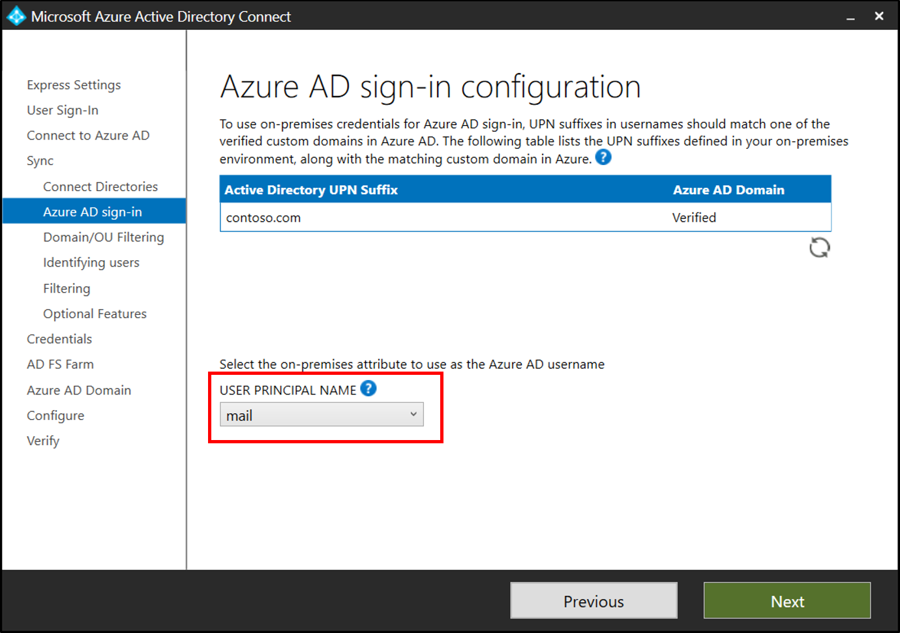
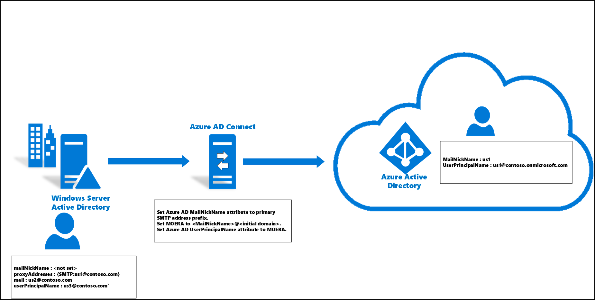

# Microsoft Entra UserPrincipalName population

This article describes how the UserPrincipalName attribute is populated in Microsoft Entra ID.
The UserPrincipalName attribute value is the Microsoft Entra username for the user accounts.

## UPN terminology
The following terminology is used in this article:

|Term|Description|
|-----|-----|
|Initial domain|The default domain (onmicrosoft.com) in the Microsoft Entra tenant. For example, "contoso.onmicrosoft.com".|
|Microsoft Online Email Routing Address (MOERA)|Microsoft Entra ID calculates the MOERA from Microsoft Entra MailNickName attribute and Microsoft Entra initial domain as "&lt;MailNickName&gt;&#64;&lt;initial domain&gt;".|
|On-premises mailNickName attribute|An attribute in Active Directory, the value of which represents the alias of a user in an Exchange organization.|
|On-premises mail attribute|An attribute in Active Directory, the value of which represents the email address of a user|
|Primary SMTP Address|The primary email address of an Exchange recipient object. For example, "SMTP:user\@contoso.com".|
|Alternate login ID|An on-premises attribute other than UserPrincipalName, such as mail attribute, used for login.|

## What is UserPrincipalName?
UserPrincipalName is an attribute that is an Internet-style login name for a user based on the Internet standard [RFC 822](https://datatracker.ietf.org/doc/html/rfc2822). 

### UPN format
A UPN consists of a UPN prefix (the user account name) and a UPN suffix (a DNS domain name). The prefix is joined with the suffix using the "\@" symbol. For example, "someone\@example.com". A UPN must be unique among all security principal objects within a directory forest. 

## UPN in Microsoft Entra ID 
The UPN is used by Microsoft Entra ID to allow users to log in. The UPN that a user can use, depends on whether or not the domain is verified. If the domain is verified, then a user with that suffix is allowed to log in to Microsoft Entra ID.  

The attribute is synchronized by Microsoft Entra Connect. During installation, you can view the domains that are verified and the ones that aren't.

    

## Alternate login ID
In some environments, end users may only be aware of their email address and not their UPN. The use of email address may be due to a corporate policy or an on-premises line-of-business application dependency.

Alternate login ID allows you to configure a login experience where users can log in with an attribute other than their UPN, such as mail.

To enable Alternate login ID with Microsoft Entra ID, no extra configurations steps are needed when using Microsoft Entra Connect. Alternate ID can be configured directly from the wizard. See Microsoft Entra login configuration for your users under the section Sync. Under the **User Principal Name** drop-down, select the attribute for Alternate login ID.

  

For more information, see [Configure Alternate login ID](/windows-server/identity/ad-fs/operations/configuring-alternate-login-id) and [Microsoft Entra login configuration](how-to-connect-install-custom.md#azure-ad-sign-in-configuration).

## Nonverified UPN Suffix

If the on-premises UserPrincipalName attribute/Alternate login ID suffix isn't verified with Microsoft Entra tenant, then the Microsoft Entra UserPrincipalName attribute value can't have this domain suffix. Microsoft Entra ID calculates a new UPN based on the Microsoft Entra MailNickName attribute value as the prefix, and the Microsoft Entra initial domain as the domain suffix (&lt;MailNickName&gt;&#64;&lt;initial domain&gt;.

## Verified UPN suffix

If the on-premises UserPrincipalName attribute/Alternate login ID suffix is verified with the Microsoft Entra tenant, then the Microsoft Entra UserPrincipalName attribute value is going to be the same as the on-premises UserPrincipalName attribute/Alternate login ID value.

> [!WARNING]
> Any invalid characters (for example, white space, line break, etc.) present in the on-premises UserPrincipalName invalidates the synchronized UPN value. In such cases, Microsoft Entra ID calculates a new UPN, similar to the scenario where the domain suffix isn't verified with the Microsoft Entra tenant.

## Microsoft Entra MailNickName attribute value calculation
Because the Microsoft Entra UserPrincipalName attribute value can be recalculated to `<MailNickName>@<initial domain>`, it's important to understand how the Microsoft Entra MailNickName attribute value, which becomes the UPN prefix, is calculated.

When a user object is synchronized to a Microsoft Entra tenant for the first time, Microsoft Entra ID checks the following items in the given order and sets the MailNickName attribute value to the first existing one:

- On-premises mailNickName attribute
- Prefix of primary SMTP address
- Prefix of on-premises mail attribute
- Prefix of on-premises userPrincipalName attribute/Alternate login ID
- Prefix of secondary smtp address

When the updates to a user object are synchronized to the Microsoft Entra tenant, Microsoft Entra ID updates the MailNickName attribute value only in case there's an update to the on-premises mailNickName attribute value.

> [!IMPORTANT]
> Microsoft Entra ID recalculates the UserPrincipalName attribute value only in case an update to the on-premises UserPrincipalName attribute/Alternate login ID value is synchronized to the Microsoft Entra tenant.
> 
> Whenever Microsoft Entra ID recalculates the UserPrincipalName attribute and the user has an Exchange license assigned, the new UserPrincipalName value is also added as a secondary smtp proxy address. 
> 
> In case of a verified domain change operation (for example, adding a new verified domain or removing an existent domain), Microsoft Entra ID also recalculates the UserPrincipalName attribute for all the users on the tenant. For more information, see [Troubleshoot: Audit data on verified domain change](~/identity/monitoring-health/troubleshoot-audit-data-verified-domain.md)

## UPN scenarios
The following are example scenarios of how the UPN is calculated based on the given scenario.

### Scenario 1: Nonverified UPN suffix – initial synchronization

On-premises user object:
- mailNickName: &lt;not set&gt;
- proxyAddresses: {SMTP:user1@contoso.com}

- mail: user2@contoso.com

- userPrincipalName: user3@contoso.com

Synchronized the user object to Microsoft Entra tenant for the first time
- Set Microsoft Entra MailNickName attribute to primary SMTP address prefix.
- Set MOERA to  &lt;MailNickName&gt;&#64;&lt;initial domain&gt;.
- Set Microsoft Entra UserPrincipalName attribute to MOERA.

Microsoft Entra tenant user object:
- MailNickName	: user1

- UserPrincipalName: user1@contoso.onmicrosoft.com

### Scenario 2: Nonverified UPN suffix – set on-premises mailNickName attribute

On-premises user object:
- mailNickName: user4

- proxyAddresses: {SMTP:user1@contoso.com}

- mail: user2@contoso.com

- userPrincipalName: user3@contoso.com

Synchronize update on on-premises mailNickName attribute to Microsoft Entra tenant
- Update Microsoft Entra MailNickName attribute with on-premises mailNickName attribute.
- Because there's no update to the on-premises userPrincipalName attribute, there's no change to the Microsoft Entra UserPrincipalName attribute.

Microsoft Entra tenant user object:
- MailNickName: user4

- UserPrincipalName: user1@contoso.onmicrosoft.com

### Scenario 3: Nonverified UPN suffix – update on-premises userPrincipalName attribute

On-premises user object:
- mailNickName: user4

- proxyAddresses: {SMTP:user1@contoso.com}

- mail: user2@contoso.com

- userPrincipalName: user5@contoso.com

Synchronize update on on-premises userPrincipalName attribute to Microsoft Entra tenant
- Update on on-premises userPrincipalName attribute triggers recalculation of MOERA and Microsoft Entra UserPrincipalName attribute.
- Set MOERA to &lt;MailNickName&gt;&#64;&lt;initial domain&gt;.
- Set Microsoft Entra UserPrincipalName attribute to MOERA.

Microsoft Entra tenant user object:
- MailNickName: user4

- UserPrincipalName: user4@contoso.onmicrosoft.com

### Scenario 4: Nonverified UPN suffix – update primary SMTP address and on-premises mail attribute

On-premises user object:
- mailNickName: user4

- proxyAddresses: {SMTP:user6@contoso.com}

- mail: user7@contoso.com

- userPrincipalName: user5@contoso.com

Synchronize update on on-premises mail attribute and primary SMTP address to Microsoft Entra tenant
- After the initial synchronization of the user object, updates to the on-premises mail attribute and the primary SMTP address won't affect the Microsoft Entra MailNickName or the UserPrincipalName attribute.

Microsoft Entra tenant user object:
- MailNickName: user4

- UserPrincipalName: user4@contoso.onmicrosoft.com

### Scenario 5: Verified UPN suffix – update on-premises userPrincipalName attribute suffix

On-premises user object:
- mailNickName: user4

- proxyAddresses: {SMTP:user6@contoso.com}

- mail: user7@contoso.com

- userPrincipalName: user5@verified.contoso.com

Synchronize update on on-premises userPrincipalName attribute to the Microsoft Entra tenant
- Update on on-premises userPrincipalName attribute triggers recalculation of Microsoft Entra UserPrincipalName attribute.
- Set Microsoft Entra UserPrincipalName attribute to on-premises userPrincipalName attribute as the UPN suffix is verified with the Microsoft Entra tenant.

Microsoft Entra tenant user object:
- MailNickName: user4

- UserPrincipalName: user5@verified.contoso.com

## Next Steps
- [Integrate your on-premises directories with Microsoft Entra ID](../whatis-hybrid-identity.md)
- [Custom installation of Microsoft Entra Connect](how-to-connect-install-custom.md)
