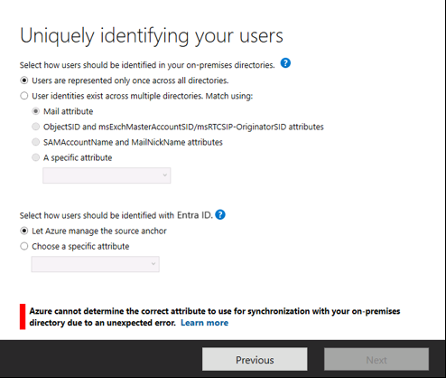
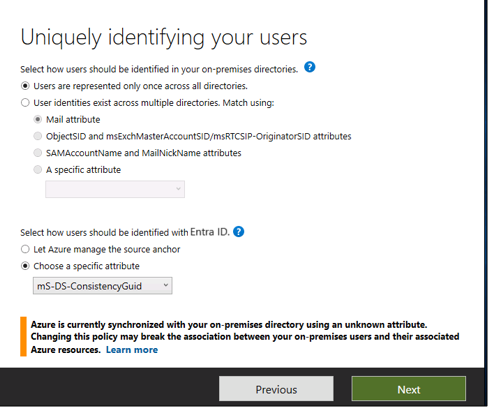
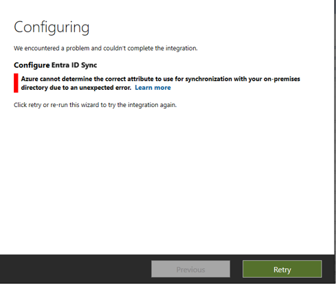
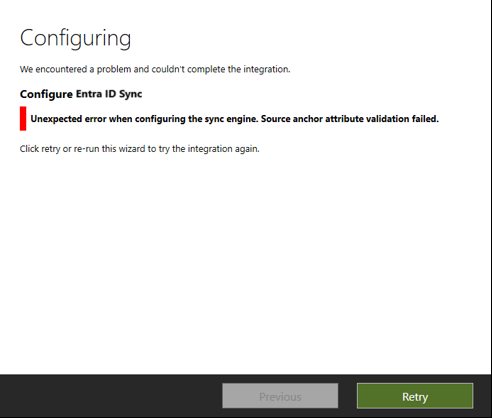

# Troubleshooting Source Anchor Issues during Installation
This article explains the different source anchor related issues that may occur during installation and offers ways to resolve these issues.

## Invalid Source Anchor in Microsoft Entra ID

### Custom Installation

During custom installation, Microsoft Entra Connect reads the source anchor policy from Microsoft Entra ID. If the policy exists in Microsoft Entra ID, Microsoft Entra Connect applies it unless the customer overrides it. The wizard informs you which attribute is read. Additionally, the wizard warns if you try to override the source anchor policy.

During this read operation, it's possible that the source anchor policy in Microsoft Entra ID is unexpected. In this case, Microsoft Entra Connect doesn't know what the source anchor to use and needs manual override. 

To resolve this issue, you can manually override the source anchor by selecting a specific attribute. Proceed with this option if and only if you're certain of which attribute to select. If you're not certain, contact [Microsoft support](https://support.microsoft.com/contactus/) for guidance. If you change the source anchor policy, it can break the association between your on-premises users and their associated Azure resources. 

### Express Installation
During express installation, Microsoft Entra Connect reads the source anchor policy from Microsoft Entra ID. If the policy exists in Microsoft Entra ID, Microsoft Entra Connect applies the same policy. There's no option for a manual override.

During this read operation, it's possible that the source anchor policy in Microsoft Entra ID is unexpected. In this case, Microsoft Entra Connect doesn't know what the source anchor should be. 

To resolve this issue, you need to reinstall using the custom mode and manually override the source anchor by selecting a specific attribute. Proceed with this option if and only if you're certain of which attribute to select. If you're not certain, contact [Microsoft support](https://support.microsoft.com/contactus/) for guidance. If you change the source anchor policy, it can break the association between your on-premises users and their associated Azure resources.

### Invalid Source Anchor in Sync Engine
During installation, it's possible Microsoft Entra Connect attempts to configure the sync engine using an invalid source anchor. This operation is most likely a product issue and the installation of Microsoft Entra Connect fails. Contact [Microsoft support](https://support.microsoft.com/contactus/) if you run in to this issue. 

## Next steps
Learn more about [Integrating your on-premises identities with Microsoft Entra ID](../whatis-hybrid-identity.md).
