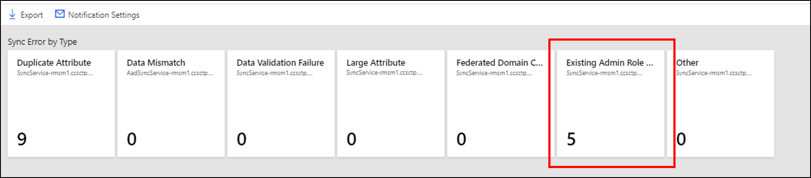

# Understanding errors during Microsoft Entra synchronization

Errors can occur when identity data is synced from Windows Server Active Directory to Microsoft Entra ID. This article provides an overview of different types of sync errors, some of the possible scenarios that cause those errors, and potential ways to fix the errors. This article includes common error types and might not cover all possible errors.

 This article assumes you're familiar with the underlying [design concepts of Microsoft Entra ID and Microsoft Entra Connect](plan-connect-design-concepts.md).

>[!IMPORTANT]
>This article attempts to address the most common synchronization errors.  Unfortunately, covering every scenario in one document isn't possible.  For more information including in-depth troubleshooting steps, see [End-to-end troubleshooting of Microsoft Entra Connect objects and attributes](/troubleshoot/azure/active-directory/troubleshoot-aad-connect-objects-attributes) and the [User Provisioning and Synchronization](/troubleshoot/azure/active-directory/welcome-azure-ad) section under the Microsoft Entra troubleshooting documentation.

With the latest version of Microsoft Entra Connect \(August 2016 or higher\), a Synchronization Errors Report is available in the [Microsoft Entra admin center](https://entra.microsoft.com) as part of Microsoft Entra Connect Health for sync.

Starting September 1, 2016, [Microsoft Entra ID duplicate attribute resiliency](how-to-connect-syncservice-duplicate-attribute-resiliency.md) is enabled by default for all the *new* Microsoft Entra tenants. This feature is automatically enabled for existing tenants.

Microsoft Entra Connect performs three types of operations from the directories it keeps in sync: Import, Synchronization, and Export. Errors can occur in all three operations. This article mainly focuses on errors during export to Microsoft Entra ID.

<a name='errors-during-export-to-azure-ad'></a>

## Errors during export to Microsoft Entra ID

The following section describes different types of synchronization errors that can occur during the export operation to Microsoft Entra ID by using the Microsoft Entra connector. You can identify this connector by the name format contoso.*onmicrosoft.com*.
Errors during export to Microsoft Entra ID indicate that an operation like add, update, or delete attempted by Microsoft Entra Connect \(sync engine\) on Microsoft Entra ID failed.


## Data mismatch errors

This section discusses data mismatch errors.

### InvalidHardMatch

#### Description

An InvalidHardMatch error occurs during synchronization when there’s an attempt to [hard match](./how-to-connect-install-existing-tenant.md#hard-match-vs-soft-match) objects present in Microsoft Entra ID with a new incoming object that have the same sourceAnchor value, but *BlockCloudObjectTakeoverThroughHardMatchEnabled* feature is enabled on the tenant.

#### Example scenarios for an InvalidHardMatch error

* DirSync is re-enabled on the tenant and objects with the same sourceAnchor are synchronized again, however *BlockCloudObjectTakeoverThroughHardMatchEnabled* feature is enabled and prevents the hard match to occur.
* User was excluded from sync scope and restored from Microsoft Entra ID Recycle Bin. Later, the user is re-added to sync scope and tries to take over the object already present in Microsoft Entra ID based on the same sourceAnchor value, however *BlockCloudObjectTakeoverThroughHardMatchEnabled* feature is enabled and prevents the hard match from occurring.

#### Example case

1. Bob Smith is a synced user in Microsoft Entra ID from the on-premises Active Directory of contoso.com.
1. By default, the SourceAnchor value of **"abcdefghijklmnopqrstuv=="** is calculated by Microsoft Entra Connect by using Bob Smith's **MsDs-ConsistencyGUID** attribute (or ObjectGUID depending on the configuration) from on-premises Active Directory. This attribute value is the **immutableId** for Bob Smith in Microsoft Entra ID.
1. Admin removes Bob Smith from sync scope and Microsoft Entra Connect exports a deletion of the object.
1. Bob Smith's object becomes soft-deleted in Microsoft Entra ID and its DirSyncEnabled attribute is switched to False. This process however doesn't convert the object to cloud managed, it’s still considered an object synchronized from on-premises Active Directory. The DirSyncEnabled value is False to indicate that it’s currently out of sync scope and is available to be matched again.
1. Admin re-adds Bob Smith into sync scope and Microsoft Entra Connect re-synchronizes the object.
1. Normally, a hard match takes over the object present in Microsoft Entra ID based on the same SourceAnchor and switches DirSyncEnabled attribute back to 'True’, however, when *BlockCloudObjectTakeoverThroughHardMatchEnabled* is enabled, this operation isn't allowed and an InvalidHardMatch is thrown.

#### Fix the InvalidHardMatch error

We advise customers to enable *BlockCloudObjectTakeoverThroughHardMatchEnabled* unless they need it to take over existent accounts in Microsoft Entra ID.

If you need to clear an **InvalidHardMatch** error and match the account successfully, you can enable hard match again as described in [Hard-match vs Soft-match](./how-to-connect-install-existing-tenant.md#hard-match-vs-soft-match).

### InvalidSoftMatch

#### Description

* The InvalidSoftMatch error occurs when the hard match doesn't find any matching object *and* the [soft match](./how-to-connect-install-existing-tenant.md#hard-match-vs-soft-match) finds a matching object, but that object has a different **immutableId** value than the incoming object's **sourceAnchor**. This mismatch suggests that the matching object was synced from another object from on-premises Active Directory.

For the soft match to work, the object to be soft-matched with shouldn't have any value for the **immutableId** attribute. The operation results in an InvalidSoftMatch synchronization error when the object with the **immutableId** attribute set with a value, fails the hard match but satisfies the soft match criteria.

Microsoft Entra schema doesn't allow two or more objects to have the same value of the following attributes. This list isn't exhaustive:

* proxyAddresses
* userPrincipalName
* onPremisesSecurityIdentifier
* objectId
* immutableId

[Microsoft Entra attribute duplicate attribute resiliency](how-to-connect-syncservice-duplicate-attribute-resiliency.md) is also being rolled out as the default behavior of Microsoft Entra ID. This feature reduces the number of synchronization errors seen by Microsoft Entra Connect and other sync clients. It makes Microsoft Entra more resilient in the way it handles duplicated **proxyAddresses** and **userPrincipalName** attributes present in on-premises Active Directory environments. 

This feature doesn't fix the duplication errors, so the data still needs to be fixed. But it allows provisioning of new objects that are otherwise blocked from being provisioned because of duplicated values in Microsoft Entra ID. This capability also reduces the number of synchronization errors returned to the synchronization client.

> [!NOTE]
> If Microsoft Entra attribute duplicate attribute resiliency is enabled for your tenant, you won't see the InvalidSoftMatch synchronization errors seen during provisioning of new objects.
>

#### Example scenarios for an InvalidSoftMatch error

- Two or more objects with the same value for the **proxyAddresses** attribute exist in on-premises Active Directory. Only one is getting provisioned in Microsoft Entra ID.
- Two or more objects with the same value for the **userPrincipalName** attribute exist in on-premises Active Directory. Only one is getting provisioned in Microsoft Entra ID.
- An object was added in on-premises Active Directory with the same value for the **proxyAddresses** attribute as that of an existing object in Microsoft Entra ID. The object added on-premises isn't getting provisioned in Microsoft Entra ID.
- An object was added in on-premises Active Directory with the same value for the **userPrincipalName** attribute as that of an account in Microsoft Entra ID. The object isn't getting provisioned in Microsoft Entra ID.
- A synced account was moved from Forest A to Forest B. Microsoft Entra Connect (sync engine) was using the **objectGUID** attribute to compute the **sourceAnchor** attribute. After the forest move, the value of the **sourceAnchor** attribute is different. The new object from Forest B fails to sync with the existing object in Microsoft Entra ID.
- A synced object was accidentally deleted from on-premises Active Directory and a new object was created in Active Directory for the same entity (such as user) without deleting the account in Microsoft Entra ID. The new account fails to sync with the existing Microsoft Entra object.
- Microsoft Entra Connect was uninstalled and reinstalled. During the reinstallation, a different attribute was chosen as the **sourceAnchor** attribute. All the previously synced objects stop syncing with the InvalidSoftMatch error.

#### Example case

1. Bob Smith is a synced user in Microsoft Entra ID from the on-premises Active Directory of *contoso.com*.
1. Bob Smith's user principal name is set as bobs\@contoso.com.
1. The **sourceAnchor** attribute of **"abcdefghijklmnopqrstuv=="** is calculated by Microsoft Entra Connect by using Bob Smith's **objectGUID** attribute from on-premises Active Directory. This attribute is the **immutableId** attribute for Bob Smith in Microsoft Entra ID.
1. Bob also has the following values for the **proxyAddresses** attribute:
   * smtp: bobs@contoso.com
   * smtp: bob.smith@contoso.com
   * smtp: bob\@contoso.com
1. A new user, Bob Taylor, is added to the on-premises Active Directory.
1. Bob Taylor's user principal name is set as bobt\@contoso.com.
1. The **sourceAnchor** attribute of **"abcdefghijkl0123456789=="** is calculated by Microsoft Entra Connect by using Bob Taylor's **objectGUID** attribute from on-premises Active Directory.
1. Bob Taylor has the following values for the **proxyAddresses** attribute:
   * smtp: bobt@contoso.com
   * smtp: bob.taylor@contoso.com
   * smtp: bob\@contoso.com
1. During sync, Microsoft Entra Connect recognizes the addition of Bob Taylor in on-premises Active Directory and asks Microsoft Entra ID to make the same change.
1. Microsoft Entra first performs a hard match. That is, it searches for any object with the **immutableId** attribute equal to **"abcdefghijkl0123456789=="**. The hard match fails because no other object in Microsoft Entra ID has that **immutableId** attribute.
1. Microsoft Entra ID then performs a soft match to find Bob Taylor. That is, it searches to see if there's any object with **proxyAddresses** attributes equal to the three values, including smtp: bob@contoso.com.
1. Microsoft Entra ID finds Bob Smith's object to match the soft-match criteria. But this object has the value of **immutableId = "abcdefghijklmnopqrstuv=="**, which indicates this object was synced from another object from on-premises Active Directory. Microsoft Entra ID can't soft match these objects so an InvalidSoftMatch sync error is thrown.

#### Fix the InvalidSoftMatch error

The most common reason for the InvalidSoftMatch error is two objects with different **sourceAnchor** \(**immutableId**\) attributes that have the same value for the **proxyAddresses** or **userPrincipalName** attributes, which are used during the soft-match process on Microsoft Entra ID. To fix the InvalidSoftMatch error:

1. Identify the duplicated **proxyAddresses**, **userPrincipalName**, or other attribute value that's causing the error. Also identify which two or more objects are involved in the conflict. The report generated by [Microsoft Entra Connect Health for sync](./how-to-connect-health-sync.md) can help you identify the two objects.
1. Identify which object should continue to have the duplicated value and which object shouldn't.
1. Remove the duplicated value from the object that should *not* have that value. Make the change in the directory from where the object is sourced. In some cases, you might need to delete one of the objects in conflict.
1. If you made the change in on-premises Active Directory, let Microsoft Entra Connect Sync the change.

Sync error reports within Microsoft Entra Connect Health for sync are updated every 30 minutes and include the errors from the latest synchronization attempt.

> [!NOTE]
> The **ImmutableId** attribute, by definition, shouldn't change in the lifetime of the object. But maybe Microsoft Entra Connect wasn't configured with some of the scenarios in mind from the preceding list. In that case, Microsoft Entra Connect might calculate a different value of the **sourceAnchor** attribute for the Active Directory object that represents the same entity (same user, group, or contact) that has an existing Microsoft Entra object that you want to continue using.
>
>

#### Related article

[Duplicate or invalid attributes prevent directory synchronization in Microsoft 365](https://support.microsoft.com/kb/2647098)

### ObjectTypeMismatch

#### Description

When Microsoft Entra ID attempts to soft match two objects, it's possible that two objects of different "object type," like user, group, or contact, have the same values for the attributes used to perform the soft match. Because duplication of these attributes isn't permitted in Microsoft Entra ID, the operation can result in an ObjectTypeMismatch sync error.

#### Example scenario for an ObjectTypeMismatch error

A mail-enabled security group is created in Microsoft 365. The admin adds a new user or contact in on-premises Active Directory that isn't synced to Microsoft Entra ID yet with the same value for the **proxyAddresses** attribute as that of the Microsoft 365 group.

#### Example case

1. An admin creates a new mail-enabled security group in Microsoft 365 for the Tax department and provides an email address as tax@contoso.com. This group is assigned the **proxyAddresses** attribute value of **smtp: tax\@contoso.com**.
1. A new user joins Contoso.com and an account is created for the user on-premises with the **proxyAddresses** attribute as **smtp: tax\@contoso.com**.
1. When Microsoft Entra Connect syncs the new user account, it gets the ObjectTypeMismatch error.

#### Fix the ObjectTypeMismatch error

The most common reason for the ObjectTypeMismatch error is that two objects of different type, like user, group, or contact, have the same value for the **proxyAddresses** attribute. To fix the ObjectTypeMismatch error:

1. Identify the duplicated **proxyAddresses** (or other attribute) value that's causing the error. Also identify which two or more objects are involved in the conflict. The report generated by [Microsoft Entra Connect Health for sync](./how-to-connect-health-sync.md) can help you identify the two objects.
1. Identify which object should continue to have the duplicated value and which object shouldn't.
1. Remove the duplicated value from the object that should *not* have that value. Make the change in the directory where the object is sourced from. In some cases, you might need to delete one of the objects in conflict.
1. If you made the change in the on-premises AD, let Microsoft Entra Connect Sync the change. The sync error report in Microsoft Entra Connect Health for sync is updated every 30 minutes. The report includes the errors from the latest synchronization attempt.

## Duplicate attributes

This section discusses duplicate attribute errors.

### AttributeValueMustBeUnique

#### Description

Microsoft Entra schema doesn't allow two or more objects to have the same value of the following attributes. Each object in Microsoft Entra ID is forced to have a unique value of these attributes at a given instance:

* mail
* proxyAddresses
* signInName
* userPrincipalName

If Microsoft Entra Connect attempts to add a new object or update an existing object with a value for the preceding attributes that's already assigned to another object in Microsoft Entra ID, the operation results in the AttributeValueMustBeUnique sync error.

#### Possible scenario

A duplicate value is assigned to an already synced object, which conflicts with another synced object.

#### Example case

1. Bob Smith is a synced user in Microsoft Entra ID from the on-premises Active Directory of contoso.com.
1. Bob Smith's user principal name on-premises is set as bobs\@contoso.com.
1. Bob also has the following values for the **proxyAddresses** attribute:
   * smtp: bobs@contoso.com
   * smtp: bob.smith@contoso.com
   * smtp: bob\@contoso.com
1. A new user, Bob Taylor, is added to on-premises Active Directory.
1. Bob Taylor's user principal name is set as bobt\@contoso.com.
1. Bob Taylor has the following values for the **proxyAddresses** attribute:
    * smtp: bobt@contoso.com
    * smtp: bob.taylor@contoso.com
1. Bob Taylor's object is synced with Microsoft Entra ID successfully.
1. The admin decided to update Bob Taylor's **proxyAddresses** attribute with the following value:
    * smtp: bob\@contoso.com
1. Microsoft Entra ID attempts to update Bob Taylor's object in Microsoft Entra ID with the preceding value, but that operation fails because that **proxyAddresses** value is already assigned to Bob Smith. The result is an AttributeValueMustBeUnique error.

#### Fix the AttributeValueMustBeUnique error

The most common reason for the AttributeValueMustBeUnique error is that two objects with different **sourceAnchor** \(**immutableId**\) attributes have the same value for the **proxyAddresses** or **userPrincipalName** attributes. To fix the AttributeValueMustBeUnique error:

1. Identify the duplicated **proxyAddresses**, **userPrincipalName**, or other attribute value that's causing the error. Also identify which two or more objects are involved in the conflict. The report generated by [Microsoft Entra Connect Health for sync](./how-to-connect-health-sync.md) can help you identify the two objects.
1. Identify which object should continue to have the duplicated value and which object shouldn't.
1. Remove the duplicated value from the object that should *not* have that value. Make the change in the directory from where the object is sourced. In some cases, you might need to delete one of the objects in conflict.
1. If you made the change in on-premises Active Directory, let Microsoft Entra Connect Sync the change for the error to get fixed.

#### Related article

[Duplicate or invalid attributes prevent directory synchronization in Microsoft 365](https://support.microsoft.com/kb/2647098)

## Data validation failures

This section discusses data validation failures.

### IdentityDataValidationFailed

#### Description

Microsoft Entra ID enforces various restrictions on the data itself before allowing that data to be written into the directory. These restrictions are to ensure that end users get the best possible experience while using the applications that depend on this data.

#### Scenarios

- The **userPrincipalName** attribute value has invalid or unsupported characters.
- The **userPrincipalName** attribute doesn't follow the required format.

The result of the preceding scenarios is an IdentityDataValidationFailed error.

#### Fix the IdentityDataValidationFailed error

Ensure that the **userPrincipalName** attribute has supported characters and the required format.

#### Related article

[Prepare to provision users through directory synchronization to Microsoft 365](https://support.office.com/article/Prepare-to-provision-users-through-directory-synchronization-to-Office-365-01920974-9e6f-4331-a370-13aea4e82b3e)

## Deletion access violation and password access violation errors

Microsoft Entra ID protects cloud-only objects from being updated through Microsoft Entra Connect. While it isn't possible to update these objects through Microsoft Entra Connect, calls can be made directly to Microsoft Entra back-end to attempt to change cloud-only objects. When doing so, the following errors can be returned:

* This synchronization operation, Delete, isn't valid. Contact Technical Support (Error Type 114).
* Unable to process this update because one or more cloud-only users' credential update is included in the current request.
* Deleting a cloud-only object isn't supported. Contact Microsoft Customer Support.
* The password change request can't be executed because it contains changes to one or more cloud-only user objects, which aren't supported. Contact Microsoft Customer Support.

### Resolve DeletingCloudOnlyObjectNotAllowed (Error Type 114)

This section discusses potential causes and solutions to resolving the error DeletingCloudOnlyObjectNotAllowed (Error Type 114).

[!INCLUDE [emergency-access-accounts](../../../includes/definitions/emergency-access-accounts.md)]

#### Description

This is a scenario when a customer wants to migrate from hybrid to cloud-only. The admin initiates a call to Microsoft Entra Connect in attempt to move users out of scope, but Microsoft Entra Connect returns the error DeletingCloudOnlyObjectNotAllowed (or Error Type 114): "This synchronization operation, Delete, isn't valid. Contact Technical Support."

Possible causes of this error include: 

- The call from Microsoft Entra Connect has no UPN, a new or unique GUID, or other required information.
- Microsoft Entra Connect is trying to export data, but it has `DirSyncEnabled` set to False.
- Microsoft Entra Connect is trying to delete a restored user or other object. This is usually because a user or other object reference has been moved out of sync scope or to Lost & Found container. 

#### Possible scenarios

The Microsoft Entra Connect client is failing to delete users during migration from hybrid to cloud only, resulting in Error Type 114. 

Potential reasons for users not to be deleted include: 

- The rule created by the customer to move users out of scope is based on the `Admin` attribute. 
- Error Type 114 is being returned during the synchronization (Azure AD Sync) operation, resulting in a failure to delete users.
- Synchronization fails for specific features, resulting in users not being deleted accordingly.

#### Error example 

Example of the export error:

```
TimeOccurred (UTC) 2021-10-20 23:51:28
MachineId 321d15e1-4ad6-49c7-918b-40a62a5140bd
Connector Name IDEXX.onmicrosoft.com - AAD
ErrorType 114
ErrorCode 0x8023134a
ErrorLiteral This synchronization operation, Delete, is not valid. Contact Technical Support. Tracking Id: 09fb1e9b-3ff7-4163-9731-581785e347e5
ServerErrorDetail N/A
CsObjectIdentifier {aaaaaaaa-0000-1111-2222-bbbbbbbbbbbb}
Dn CN={783456306961654236304B58786A66746377643748773D3D}
```

#### Fix the error

To resolve this issue:

1. Identify the problem object reference. 
1. Use PowerShell to soft-delete the cloud account:
1. Run `Start-ADSyncSyncCycle -PolicyType Delta` which should successfully import the account deletion.
1. Confirm that the deletion was successful.
1. Restore the user from the Recycle Bin.
1. Run `Start-ADSyncSyncCycle -PolicyType Delta` on the server to confirm the error doesn't occur again.

> [!WARNING]
> When a user is excluded from sync scope the object becomes soft-deleted in Microsoft Entra ID and its DirSyncEnabled attribute is switched to False. This process however doesn't convert the object to cloud managed, as it still contains attributes and values synchronized from on-premises Active Directory that can't be managed in the cloud. The DirSyncEnabled value is False to indicate that it’s currently out of sync scope and is available to be matched again.

## LargeObject or ExceededAllowedLength

This section discusses LargeObject or ExceededAllowedLength errors.

### Description

When an attribute exceeds the allowed size limit, length limit, or count limit set by Microsoft Entra schema, the synchronization operation results in a LargeObject or ExceededAllowedLength sync error. Typically, this error occurs for the following attributes:

* userCertificate
* userSMIMECertificate
* thumbnailPhoto
* proxyAddresses

Microsoft Entra ID doesn't impose limits per attribute, except for a hard-coded limit of 15 certificates in the **userCertificate** attribute and up to 100 attributes for [Directory extensions](how-to-connect-sync-feature-directory-extensions.md) with a maximum of 250 characters for each directory extension. There's a size limit for the whole object. When Microsoft Entra Connect tries to sync an object that exceeds this object size limit, an export error is thrown.

All attributes contribute to the object's final size. Some attributes have different weight multipliers because of additional processing overhead. An example is indexed values. Also, different cloud services, service plans, and licenses might be assigned to the account, which consume even more attributes and contribute to the overall size of the object.

It isn't possible to determine exactly how many entries an attribute can hold in Microsoft Entra ID, for example, how many SMTP addresses can fit in the **proxyAddresses** attribute. The amount depends on the size and multiplying factors of all the attributes populated in the object.

### Possible scenarios

- Bob's **userCertificate** attribute is storing too many certificates assigned to Bob. These certificates might include older, expired certificates. The hard limit is 15 certificates. For more information on how to handle LargeObject errors with the **userCertificate** attribute, see [Handling LargeObject errors caused by userCertificate attribute](tshoot-connect-largeobjecterror-usercertificate.md).
- Bob's **userSMIMECertificate** attribute is storing too many certificates assigned to Bob. These certificates might include older, expired certificates. The hard limit is 15 certificates.
- Bob's **thumbnailPhoto** attribute set in Active Directory is too large to be synced in Microsoft Entra ID.
- During automatic population of the **proxyAddresses** attribute in Active Directory, an object has too many **proxyAddresses** attributes assigned.

The following examples demonstrate the different weights of attributes like **userCertificate** and **proxyAddresses**:

- A synced user that doesn't have any attributes populated other than the mandatory Active Directory attributes and Mail might be able to sync up to 332 proxy addresses.
- For a similar synced user that has a **mailNickName** attribute, plus 10 user certificates, the maximum number of proxy addresses decreases to 329.
- If a similar synced user with 10 user certificates plus, for instance, 4 subscriptions assigned (with all service plans enabled), the maximum number of proxy addresses decreases to 311.
- Now let's take the preceding user, which already holds the maximum number of proxy addresses, and say you need to add one more SMTP address. To achieve 312 proxy addresses, you would need to remove at least three user certificates (depending on the size of the certificate).

>[!NOTE]
> These numbers can vary slightly. As a rule of thumb, it's safer to assume that the limit of SMTP addresses in the **proxyAddresses** attribute is approximately 300 addresses to leave room for future growth of the object and its populated attributes.

### Fix the LargeObject or ExceededAllowedLength error

Review the user properties and remove attribute values that might no longer be required. Examples include revoked or expired certificates and outdated or unnecessary addresses, such as SMTP, X.400, X.500, MSMail, and CcMail.

## Existing Admin Role Conflict

### Description

An Existing Admin Role Conflict sync error occurs on a user object during synchronization when that user object has:

- Administrative permissions.
- The same **userPrincipalName** attribute as an existing Microsoft Entra object.

Microsoft Entra Connect isn't allowed to soft match a user object from on-premises AD with a user object in Microsoft Entra ID that has an administrative role assigned to it. For more information, see [Microsoft Entra userPrincipalName population](plan-connect-userprincipalname.md).



### Fix the Existing Admin Role Conflict error

To resolve this issue:

1. Remove the Microsoft Entra account (owner) from all admin roles.
1. Hard delete the quarantined object in the cloud.
1. The next sync cycle will take care of soft-matching the on-premises user to the cloud account because the cloud user is now no longer a Hybrid Identity Administrator.
1. Restore the role memberships for the owner.

>[!NOTE]
>You can assign the administrative role to the existing user object again after the soft match between the on-premises user object and the Microsoft Entra user object has finished.

## Related links

* [Locate Active Directory objects in Active Directory Administrative Center](/previous-versions/windows/it-pro/windows-server-2008-R2-and-2008/dd560661(v=ws.10))
* [Query Microsoft Entra ID for an object by using Microsoft Graph PowerShell](/powershell/microsoftgraph/overview)
* [End-to-end troubleshooting of Microsoft Entra Connect objects and attributes](/troubleshoot/azure/active-directory/troubleshoot-aad-connect-objects-attributes)
* [Microsoft Entra Troubleshooting](/troubleshoot/azure/active-directory/welcome-azure-ad)
