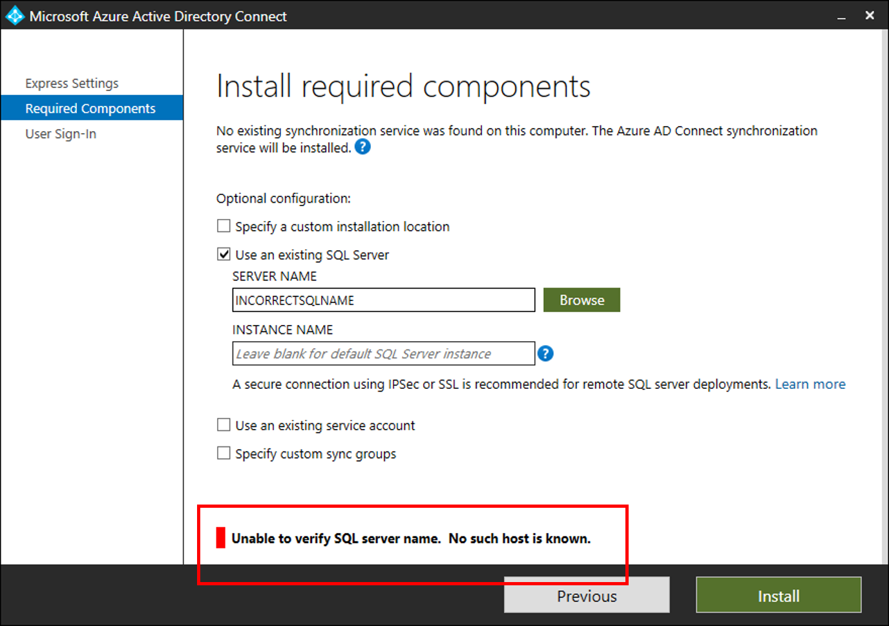

# Troubleshoot SQL connectivity issues with Microsoft Entra Connect
This article explains how to troubleshoot connectivity issues between Microsoft Entra Connect and SQL Server. 

The following screenshot shows a typical error, if the SQL Server can't be found.



## Troubleshooting steps
Open a PowerShell window with "Run as Administrator" and Install/Import ADSyncTools PowerShell module.

``` powershell
[Net.ServicePointManager]::SecurityProtocol = [Net.SecurityProtocolType]::Tls12
Install-PackageProvider -Name NuGet -MinimumVersion 2.8.5.201 -Force
Install-Module ADSyncTools
Import-Module ADSyncTools
```

>[!NOTE]
>Install-Module requires updating to [PowerShell 5.0 (WMF 5.0)](https://www.microsoft.com/download/details.aspx?id=50395) or later;  
Or install [PackageManagement PowerShell module preview - March 2016 for PowerShell 3.0/4.0](/powershell/module/packagemanagement/)

- **Show all commands**: `Get-Command *Sql* -Module ADSyncTools` 
- **Execute the PowerShell function**: `Connect-ADSyncToolsSqlDatabase` with the following parameters:
  - Server: The SQL Server name.
  - Instance (Optional): The SQL Server Instance name and optionally Port number, that you would like to use. Don't specify this parameter to use the default instance.
  - Port (Optional): The SQL Server port
  - Username (Optional): The user account to connect with, if left blank the current logged-on account is used. If you're connecting to a remote SQL Server, this username should be the custom service account created for Microsoft Entra Connect SQL Connectivity. Microsoft Entra Connect uses the Microsoft Entra Connect Sync service account to authenticate to a remote SQL server.
  - Password (Optional): Password for the UserName provided.

This PowerShell function attempts to bind to the specified SQL Server and Instance using the credentials passed in or use the credentials of the current user. If the SQL Server can't be found, the script attempts to connect to the SQL Browser service to determine enabled protocols and ports.

Example using just a Server name:

``` powershell

PS C:\> Connect-ADSyncToolsSqlDatabase -Server SQL1.contoso.com
Resolving server address : SQL1.contoso.com
    InterNetworkV6 : fe80::6c90:a995:3e70:ef74%17
    InterNetworkV6 : 2001:4898:e0:66:6c90:a995:3e70:ef74
    InterNetwork : 10.91.26.143

Attempting to connect to SQL1 using a TCP binding for the default instance.
   Data Source=tcp:SQL1.contoso.com\;Integrated Security=True.ConnectionString
   Successfully connected.


StatisticsEnabled                : False
AccessToken                      : 
ConnectionString                 : Data Source=tcp:SQL1\;Integrated Security=True
ConnectionTimeout                : 15
Database                         : master
DataSource                       : tcp:SQL1.contoso.com\
PacketSize                       : 8000
ClientConnectionId               : 23e06ef2-0a38-4f5f-9291-da931de40375
ServerVersion                    : 13.00.4474
State                            : Open
WorkstationId                    : SQL1
Credential                       : 
FireInfoMessageEventOnUserErrors : False
Site                             : 
Container                        : 

```
Example using a Server name and a SQL named instance:

``` powershell

PS C:\> Connect-ADSyncToolsSqlDatabase -Server SQL1.contoso.com -Instance SQLINSTANCE1
Resolving server address : SQL1.contoso.com
   InterNetwork: 10.0.100.24 

Attempting to connect to SQL1.contoso.com\SQLINSTANCE1 using a TCP binding.
   Data Source=tcp:SQL1.contoso.com\SQLINSTANCE1;Integrated Security=True
   Successfully connected.


StatisticsEnabled                : False
AccessToken                      : 
ConnectionString                 : Data Source=tcp:SQL1.contoso.com\SQLINSTANCE1;Integrated Security=True
ConnectionTimeout                : 15
Database                         : master
DataSource                       : tcp:SQL1.contoso.com\SQLINSTANCE1
PacketSize                       : 8000
ClientConnectionId               : 2b365b7a-4348-45f6-9314-d6b56db36dbd
ServerVersion                    : 13.00.4259
State                            : Open
WorkstationId                    : SQL1
Credential                       : 
FireInfoMessageEventOnUserErrors : False
Site                             : 
Container                        : 


```

Example using a SQL Instance that can't be reached. It tries to query SQL Server Browser service and display the available SQL Instances and respective ports.

``` powershell

PS C:\> Connect-ADSyncToolsSqlDatabase -Server SQL01.Contoso.com -Instance DEFAULT
Resolving server address : SQL01.Contoso.com
   InterNetwork: 10.0.100.24 

Attempting to connect to SQL01.Contoso.com\SQL using a TCP binding.
   Data Source=tcp:SQL01.Contoso.com\SQL;Integrated Security=True
Connect-ADSyncToolsSqlDatabase : Unable to connect using a TCP binding.  A network-related or instance-specific error occurred while establishing a connection to SQL Server. The server was not found or was 
not accessible. Verify that the instance name is correct and that SQL Server is configured to allow remote connections. (provider: SQL Network Interfaces, error: 26 - Error Locating Server/Instance 
Specified) 
At line:1 char:1
+ Connect-ADSyncToolsSqlDatabase -Server SQL01.Contoso.com -Insta ...
+ ~~~~~~~~~~~~~~~~~~~~~~~~~~~~~~~~~~~~~~~~~~~~~~~~~~~~~~~~~~~~~~~~~~~~~
    + CategoryInfo          : ConnectionError: (:) [Write-Error], WriteErrorException
    + FullyQualifiedErrorId : Microsoft.PowerShell.Commands.WriteErrorException,Connect-ADSyncToolsSqlDatabase
 
TROUBLESHOOTING: Attempting to query the SQL Server Browser service configuration on SQL01.Contoso.com. 

SQL browser response contained 2 instances.
Verifying protocol bindings and port connectivity...
SQLINSTANCE1    : Enabled - port 49823 is assigned and reachable through the firewall
SQL2019         : Enabled - port 50631 is assigned and reachable through the firewall

WHAT TO TRY NEXT: 

Each SQL instance must be bound to an explicit static TCP port and paired with an inbound firewall rule on SQL01.Contoso.com to allow connection. Review the TcpStatus field for each instance and take cor
rective action. 


InstanceName : SQLINSTANCE1
tcp          : 49823
TcpStatus    : Enabled - port 49823 is assigned and reachable through the firewall

InstanceName : SQL2019
tcp          : 50631
TcpStatus    : Enabled - port 50631 is assigned and reachable through the firewall


```

## Next Steps
- [Integrating your on-premises identities with Microsoft Entra ID](../whatis-hybrid-identity.md)
- [Microsoft Entra connectivity with Microsoft Entra Connect](tshoot-connect-connectivity.md)

