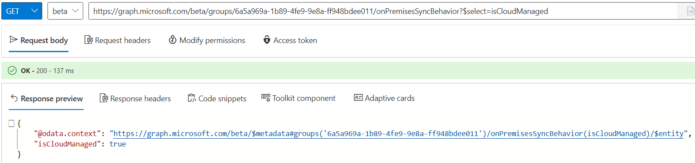
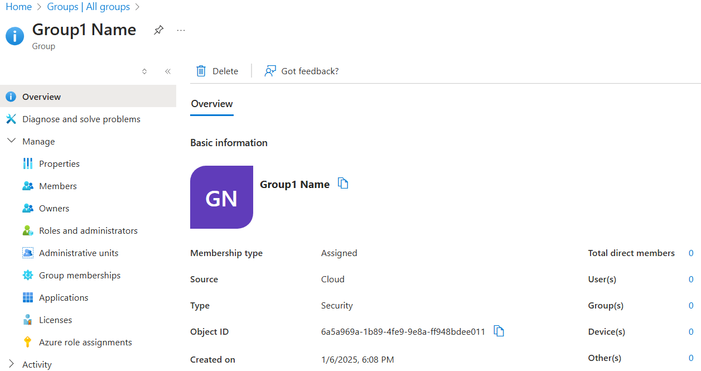
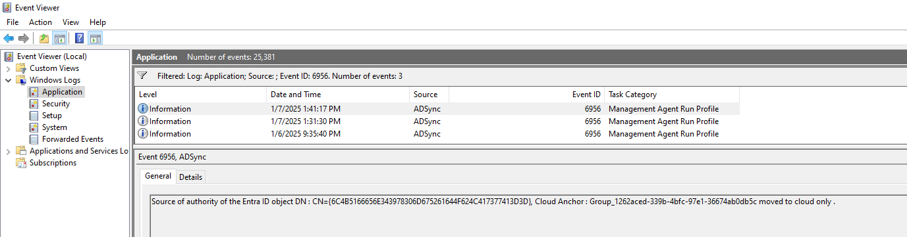
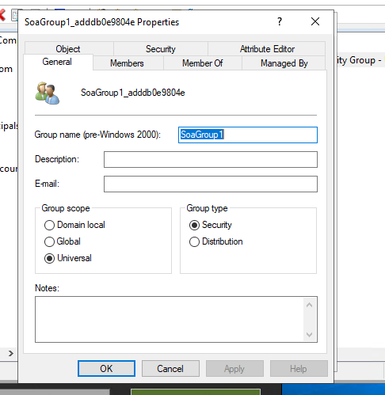
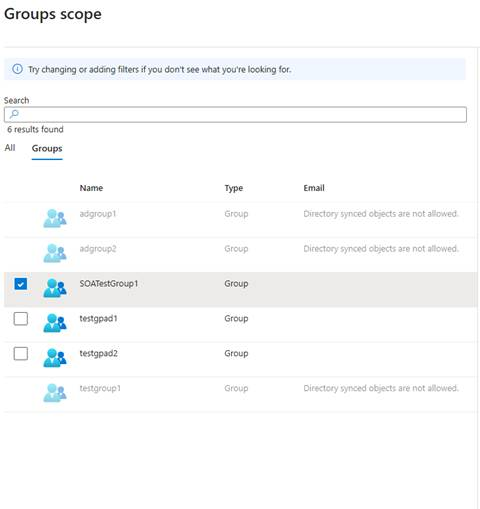
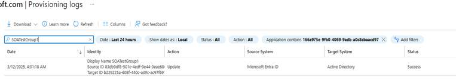
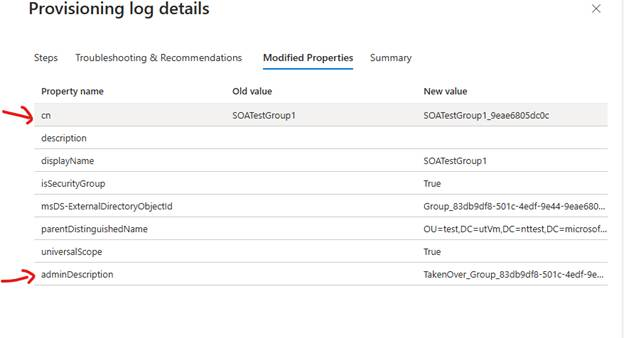
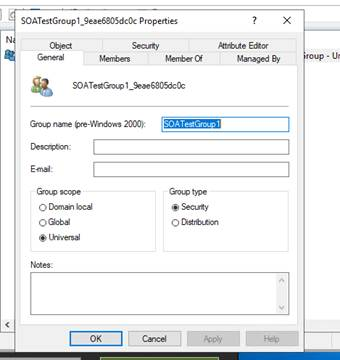
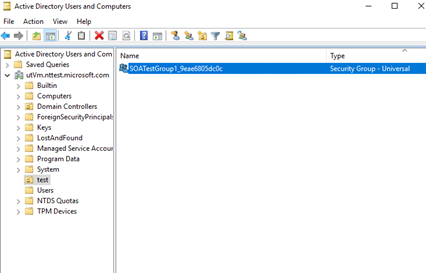
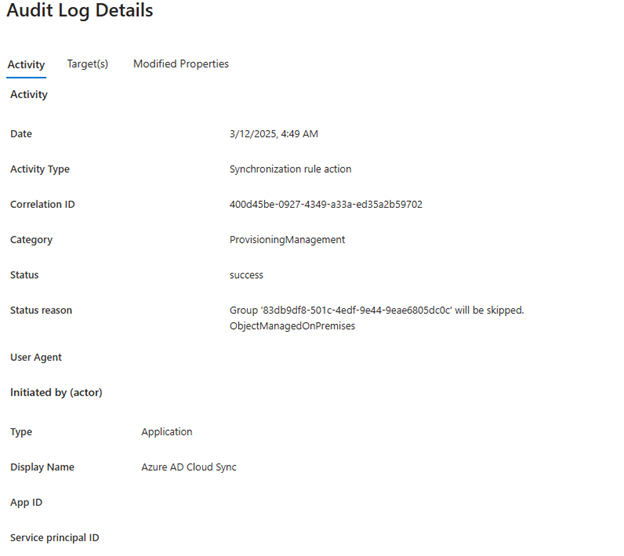

# Manage Group Source of Authority (SOA) 

Source of Authority “SOA” (at an object level) is a feature that enables
IT Administrators to transition the management of a specific objects
from Active Directory (AD) to Microsoft Entra ID. When SOA is applied to
an object synced from AD, it converts the object to a cloud object that
can be edited & deleted in Entra ID, and Connect Sync (and soon Cloud
Sync) honor the conversion and no longer attempt to sync the object from
AD. By granting administrators the ability to selectively migrate
objects to be cloud-managed, we facilitate a phased approach for the
migration process. Instead of switching the entire directory at once to
the cloud and discontinuing AD – an action that necessitates substantial
redesign and re-platforming of applications – this feature allows for a
gradual reduction of AD dependencies. This phased approach ensures
seamless operations with minimal impact on end users as well as helping
organizations secure their identities using capabilities in Entra ID and
Entra ID Governance. There are important caveats and implications, so be
sure to thoroughly understand and test prior to using this capability.

## When can you use SOA?

Group Source of Authority (SOA) at object level allows you to convert an
on-prem AD group into a cloud group and manage the group from the cloud.
If you no longer require the groups on-prem, you can delete them. If you
do still need them, you can enable [cloud security group provisioning to
AD](https://learn.microsoft.com/en-us/entra/identity/hybrid/cloud-sync/tutorial-group-provisioning).
If you have one or more of the following customer scenarios, you can use
Group SOA:

1.  You have begun your
    "[Cloud-first](https://learn.microsoft.com/entra/architecture/road-to-the-cloud-posture#state-3-cloud-first)"
    journey by creating all new groups in the and want to migrate your
    existing on-premises AD groups to the cloud. This strategy enables
    you to use Microsoft Entra Governance to control access to
    applications through these groups. With Group Provisioning to AD,
    you can provision only the necessary groups back to AD and govern
    their membership using features like dynamic groups, entitlement
    management, and access reviews.

2.  You no longer have any on-premises Exchange dependencies or require
    Distribution Lists (DLs), and Mail Enabled Security Groups (MESGs)
    to be present in Active Directory (AD), and you wish to transition
    the management of these groups to Exchange Online (EXO).

3.  You have modernized your apps and no longer need Active Directory
    groups for access (E.g., For instance, your apps now rely on group
    claims via SAML or OpenID Connect from Microsoft Entra, rather than
    ADFS). Using Microsoft Entra ID Governance, you want to manage these
    apps with Entra features. With SOA, instead of creating new cloud
    groups, you can migrate existing ones. After SOA conversion, app
    functionality remains as group properties stay the same, enabling
    you to manage app access using Microsoft Entra features that update
    group membership.

## When should you not use SOA?

If you are a customer who has any of the following scenarios, we
recommend that you review your group management strategy and determine
which groups can migrate to the cloud so you can reduce your AD
dependencies. For the ones that can’t, think about how you can remove or
modernize apps tied to these groups so you can remove them eventually.

| Customer scenario                                                                                          | What’s not supported                                                                                                                                                                                                                                                                                                                                                                                                             |
|------------------------------------------------------------------------------------------------------------|----------------------------------------------------------------------------------------------------------------------------------------------------------------------------------------------------------------------------------------------------------------------------------------------------------------------------------------------------------------------------------------------------------------------------------|
| You are using group management tools, such as MIM, for approval and complex group management capabilities. | In this scenario, you may be using these tools to provide self-service group management capabilities, with multiple approval stages or other complex group management features such as dynamic groups populated based on attributes not in the Entra ID directory. Such capabilities are currently not supported through Microsoft Entra ID cloud-hosted services. These groups are not candidates yet to move to cloud managed. |
| You have on-prem groups tied to Exchange, such as Distribution Lists or Mail-Enabled security groups.      | You can apply SOA to these objects, but you must maintain membership through Exchange Online and not through Entra ID. As such, Entra ID Governance cannot be applied to them. They are also not able to be provisioned back to Active Directory. If you want to govern them from the cloud, we recommend you modernize the underlying apps and remove the groups from AD after you shift their SOA to the cloud.                |
| Support for managing and governing AD based apps tied to M365 groups (Universal groups).                   | Currently, there are no plans to enable selective provisioning of M365 groups to Active Directory. Our goal is to help customers clean up their groups in AD and remove any groups tied to apps that have exchange features rather than continue to keep these apps, thereby keeping these groups in AD.                                                                                                                         |

## Scenarios in scope for preview

This preview supports the ability to switch the SOA of ***any
synced group*** in Active Directory to a cloud group (assuming the sync
is via Connect Sync). We are targeting this as the first scenario
enabled by Group SOA’s preview:

- **Minimize on-premises groups in AD:** Migrate on-premises groups to the
cloud and manage them from the cloud without having to re-create these
groups in Entra ID. By leveraging Group SOA at object level feature, you
can switch the SOA of an on-premises AD group to be a cloud group. If
you have already modernized the underlying apps tied to this group, you
can just remove these groups in AD once you have shifted your SOA. If
you are using Entra Connect Sync, you can do this without having to make
any configuration changes to your sync.

- **Seamless switching of AD Security Group to the Cloud (via SOA) and enabling provisioning back to the same AD Security Group:** Currently,
Cloud Security Group Provisioning to AD creates a *new* on-prem AD
security group when provisioning from the cloud. Provisioning is supported by the *existing* AD security
group that SOA was applied for (retaining the SID so existing
applications tied to the security group continue to function).

## Supported features for Group SOA

- Entra Connect Sync customers can apply SOA groups at the object
    level (sync client will understand the SOA switch and will stop
    syncing the object from AD to Entra ID).

- Transfer the source of authority of **any** group from AD to Entra
    ID. This means, once the group is transferred, it becomes a cloud
    group and will be mapped to the corresponding group type in the
    cloud.

- Once the group is a cloud group, it will no longer be in scope for
    the AD to Entra ID sync flow. This means, the group will not be
    synced from AD to Entra ID using Connect Sync. We recommend you
    delete the group instead of removing it as out of scope in your
    scoping filters if you no longer need the group in AD.

- You can roll back the SOA switch at an object level the same way
    you set it up (by toggling the appropriate attribute value).
    However, rolling back the change is not instantaneous – the cloud
    object instantly becomes eligible again to be “taken over” by
    Connect Sync, but it only actually happens **when the next sync
    runs.** The Connect Sync client will again take over the cloud
    object, assuming the AD object remains in scope for sync.

- **Cloud sync** customers can use SOA switch for groups at object
    level (Cloud sync client will understand the SOA switch and will
    stop syncing the object from AD to Entra ID)

- If the cloud security group needs to be provisioned back to AD,
    Admins can add the group to the Group Provision to AD scoping
    configuration. They can use "Selected Groups" or "All groups with
    attribute value scoping. Dynamic groups can also be used.

- When provisioning security groups back to AD, Cloud Sync provisions
    to the same AD group that SOA had applied for (retaining the same
    SID) and will not create a new on-prem group.

## Limitations

- **No reconciliation support for local AD groups:** An AD admin (or
    other application with sufficient permissions) can directly modify
    an AD group. If SOA had been applied to the object and/or if cloud
    security group provisioning to AD is enabled, those local AD changes
    will not be reflected in Entra ID. When a change to the cloud
    security group is made, any local AD changes will be overwritten if
    group provisioning to AD is enabled.

- **No Dual write allowed:** Once you start managing a group’s
    memberships from Entra ID for the transferred group (say cloud
    group A) and you provision this group to AD using Group Provision to
    AD as a nested group under another AD group (OnPremGroupB) in scope
    for AD to Entra ID sync, the membership reference of Group A will
    not be synced when AD2EntraID sync happens for OnPremGroupB. This is
    because the sync client will not know the cloud group membership
    references. This is by Design.

- **SOA transfer of nested groups:** If you have nested groups in AD
    and want to transfer the SOA of the parent or top group from AD to
    Entra ID, only the parent group’s SOA will be switched. All the
    groups underneath the parent group will continue to be AD groups.
    You need to switch the SOA of these nested groups one by one. We
    recommend you start with the group in the lowest hierarchy and move
    up the tree.

- **Extension Attributes (1-**1**5):** Extension attributes 1 – 15 are
    not supported on cloud security groups and will not be supported
    once SOA is converted.** **

## Prerequisites

| Requirement | Description |
|-------------|-------------|
| **Roles** | - Groups Administrator role is allowed to call the OnPremisesSyncBehavior Graph API for Groups. - Cloud Application Administrator role is allowed to consent to the required permissions for apps to call the OnPremisesSyncBehavior Graph API for Groups. |
| **Permissions** | For apps calling into the OnPremisesSyncBehavior Graph API, Group-OnPremisesSyncBehavior.ReadWrite.All permission scope needs to be granted. See [below](#granting-permission-to-apps) on how to grant this permission to Graph Explorer or an existing app in your tenant. |
| **License needed** | Microsoft Entra Free or Basic license. |
| **Connect Sync client** | Minimum version is 255.0.4.0 (see below on how to install the latest version of Connect Sync) |

## Setup

### [**Connect Sync client**](#tab/connect)

1. Download the latest version of the Connect Sync build.

1. Verify the Connect Sync build has been successfully installed. Go to “Add remove programs” in the control panel and check version of “Microsoft Entra Connect Sync,” minimum version is **255.0.4.0.**

> [!NOTE]
> There will be no upgrade path from this private build of the Connect Sync client to the ultimate public version. So, plan to uninstall this private build in the future before installing the eventual public build.

### [**Cloud Sync client**](#tab/cloud-sync)

Download the Provisioning agent with build version [1.1.1373.0](/entra/identity/hybrid/cloud-sync/reference-version-history#1113730) or later.

1. [Instructions for download](/entra/identity/hybrid/cloud-sync/reference-version-history#download-link)

1. Learn how to [identify the agent's current version](/azure/active-directory/hybrid/cloud-sync/how-to-automatic-upgrade).

---

### Prerequisites to call Microsoft Graph API

- A Microsoft Entra ID tenant with on-premises sync enabled at the tenant level.

- A user account in the tenant with the following roles assigned:

   - [Cloud Application Administrator](/entra/identity/role-based-access-control/permissions-reference#cloud-application-administrator): To grant user consent to the required permissions to Microsoft Graph Explorer or the app used to call the Graph APIs.

   - [Groups Administrator](/entra/identity/role-based-access-control/permissions-reference#groups-administrator): To call the Microsoft Graph APIs to read and update SOA of groups.

## Granting Permission to Apps

1. Sign in to the [Microsoft Entra admin center](https://entra.microsoft.com) as at least an [Cloud Application Administrator](/entra/identity/role-based-access-control/permissions-reference#cloud-application-administrator).

1. In the **Enterprise Applications** blade in the Microsoft Entra portal, find the appId of the app that needs permission to be granted, such as Graph Explorer. For Graph Explorer, the AppId is *de8bc8b5-d9f9-48b1-a8ad-b748da725064*.

1. In the same browser where you signed in, open the following URL to consent to the **Group-OnPremisesSyncBehavior.ReadWrite.All** permission. Replace *appId* in URL below with the appId of the app that needs permission to be granted. For Graph Explorer, the URL is:

   `https://login.microsoftonline.com/common/oauth2/v2.0/authorize?client_id=de8bc8b5-d9f9-48b1-a8ad-b748da725064&response_type=code&scope=https://graph.microsoft.com/Group-OnPremisesSyncBehavior.ReadWrite.All`

1. Click **Accept** to grant consent.

   > [!NOTE]
   > Consenting on behalf of the entire organization isn't required.

   :::image type="content" source="media/how-to-use-source-of-authority/image1.png" alt-text="Screenshot of the consent screen for granting permissions in Microsoft Entra portal.":::

   > [!NOTE]
   > Ignore this error if see it after you click **Accept**: `AADSTS9002325: Proof Key for Code Exchange is required for cross-origin authorization code redemption.`

1. To verify the permission is granted, open **Enterprise Applications** > **AppName** > **Security** > **Permissions** > **User consent in Microsoft Entra portal**. It may take a minute or two for the permission to appear.

   :::image type="content" source="media/how-to-use-source-of-authority/image2.png" alt-text="Screenshot of the permissions page in Microsoft Entra portal showing granted permissions.":::

## Switch the SOA of the group

1.  You can either create a security group or mail-enabled distribution
    group for your testing purposes in Active Directory and add some
    group members (or) if you have an existing group that you are
    already syncing to Entra ID, you can use that. Make sure the group
    is in-scope for Connect Sync.

2.  Run sync in connect sync by running “Start-ADSyncSyncCycle” in
    PowerShell window.

3.  Ensure that either the new group or your existing AD group is
    showing up in the Entra Portal as a synced group.

4.  Now change the SOA (CloudManaged=true) on the group object using
    graph API.

### Calling the Graph API

> Open Graph explorer and login with an appropriate user role (Groups
> admin): <https://developer.microsoft.com/en-us/graph/graph-explorer>

## Check existing SoA

> **GET**

| *https://graph.microsoft.com/beta/groups/**\<**groupId**\>**/onPremisesSyncBehavior?\$select=isCloudManaged* |
|--------------------------------------------------------------------------------------------------------------|

> 
>
> Since we haven’t updated the SoA yet, isCloudManaged should be false.

##  Check synced group is read only 

> PATCH
> https://graph.microsoft.com/v1.0/groups/\<groupId\>
>
> {
>
> "DisplayName": "Group1 Name Updated"
>
> }
>
> Since the Group is on-prem mastered as of now, any writes to the Group
> in the cloud will fail.
>
> 
>
> If the group is mail enabled, the error message will be slightly
> different, but updates will not be allowed.
>
> Note: If this API fails with 403, the ‘Modify permissions’ tab can be
> used to grant consent to the required permission: Group.ReadWrite.All

## Entra Portal Check

> Check Microsoft Entra portal for the group to verify that all the
> fields for the group are greyed out and that source is Windows Server
> AD:  
>  alt="A screenshot of a computer Description automatically generated" />
>
>  alt="A screenshot of a computer Description automatically generated" />

# Update SOA of group to be cloud managed

Run the following API in the Graph Explorer for the group object you
want to switch to the cloud:

> PATCH
> https://graph.microsoft.com/beta/groups/\<groupId\>/onPremisesSyncBehavior
>
> {
>
> "isCloudManaged": true
>
> }
>
>  alt="A screenshot of a computer Description automatically generated" />

# Validation Steps

## Call GET on the API to verify isCloudManaged is true.

| **GET** *https://graph.microsoft.com/beta/groups/\<groupId\>/onPremisesSyncBehavior?\$select=isCloudManaged* |
|--------------------------------------------------------------------------------------------------------------|
|                                                                                                              |

## Check Audit logs

Audit logs can be accessed from Azure Portal -\> Manage Microsoft Entra
ID -\> Monitoring -\> Audit Logs or by searching for “audit logs” in the
search bar.

Select activity as "**Change Source of Authority from AD to cloud**.”

## Validate that properties on the group can be updated

> **PATCH**
> *[https://graph.microsoft.com/v1.0/groups/\<groupId](https://graph.microsoft.com/v1.0/groups/%3cgroupId)\>*
>
> {
>
> "DisplayName": "Group1 Name Updated"
>
> }

**Check Microsoft Entra portal to confirm source as cloud**  

## Connect Sync Client

1.  Run sync in connect sync by running “Start-ADSyncSyncCycle” in
    PowerShell window.

2.  To look at the group object you switched SOA of, in the
    “Synchronization Service Manager,” go to "Connectors":

3.  Right click on the “Active Directory Domain Services Connector”:

Search the group by RDN setting CN=\<GroupName\>

>  alt="A screenshot of a computer Description automatically generated" />

4.  Double click on the searched entry and click on “Lineage-\>Metaverse
    Object Properties”

5.  Click on “Connectors” and double click on the **Entra ID object**
    with “CN={\<Alpha Numeric Characters\>}”

6.  You will notice “blockOnPremisesSync” property is set to true on the
    Entra ID object, which means any changes made in the corresponding
    Active Directory object will not flow to the Entra ID object:

>  alt="A screenshot of a computer Description automatically generated" />

7.  Let’s update the on-premises group object, change the group name
    from SecGroup1 to SecGroup1.1:

>  alt="A screenshot of a computer Description automatically generated" />

8.  Run sync in connect sync by running “Start-ADSyncSyncCycle” in
    PowerShell window.

9.  Open event viewer and filter the application event logs with event
    id “6956”, this event id is reserved to inform the customers that
    the object has not been synced to the cloud because the source of
    authority of object is in the cloud.

## Roll back SOA update

**PATCH**
*https://graph.microsoft.com/beta/groups/\<groupId\>/onPremisesSyncBehavior*

{

"isCloudManaged": false

}

***Note:*** This change to “isCloudManaged: false” simply allows the
object to be taken over by Connect Sync the next time it runs (assuming
the AD object remains in scope). Until Connect Sync runs next, the
object remains cloud editable. So, the full “rollback of SOA” when the
object becomes synched from on-prem again only happens after *both* the
API call and the next run of Connect Sync (scheduled or forced).

### Check audit logs to validate the revert operation

Select activity as "**Undo changes to Source of Authority from AD to
cloud**"

## VALIDATE IN CONNECT SYNC CLIENT

1.  Run sync in connect sync by running “Start-ADSyncSyncCycle” in
    PowerShell window.

2.  Open the object in the “Synchronization Server Manager”, details are
    given above in the [“CONNECT SYNC CLIENT”](#connect-sync-client)
    section above, you can notice the state of the Entra ID connector
    object as “Awaiting Export Confirmation” and blockOnPremisesSync =
    false, means the object is taken over by the on-premises again.

> 

## Cloud sync - provisioning logs 

If you attempt to edit an attribute of a group in AD while **SOA is in
the cloud**, the **Cloud sync will skip this object**.

> **Example: SOAGroup3 Attribute Update**

Let's say we have a group **SOAGroup3**, and we update its group name to
**SOA Group3.1**.

>  alt="Inserting image..." />

- In the **Provisioning Logs** of the **AD2AAD job**, you will see that
  **SOAGroup3 was skipped**.

>  alt="Inserting image..." />

- The details will confirm:

  - *"As the SOA of this group is in the cloud, this object will not
    sync."*

## How GPAD behaves with SOA converted groups

## Cloud sync

When you flip the **Source of Authority (SOA)** to cloud for an on-prem
group, that group becomes eligible for **Group Provisioning to Active
Directory (GPAD)**.

- If you are running **Sync All**, then the group will automatically
  come into scope for Group Provisioning to AD.

- If you are running **Sync Selected**, then you must manually select
  the SOA-flipped group.

## Known issue

- If you sync a group which is not universal, i.e global group and then
  try to flip SOA and then run a GPAD job on that, then it will give an
  Entry level error. Make sure the group has universal scope.  

  

## Use GPAD to provision groups to AD

**Example: SOAGroup2 Provisioning**

In the diagram below, **SOATestGroup1** has been flipped to the cloud.
As a result, it has become available for the **GPAD job scope**.

- When a **GPAD job** runs, the SOA-converted group is provisioned
  successfully.

- In the **Provisioning Logs**, you can search for the group name and
  verify that the group was provisioned.

- The details will show that the group was matched with an existing
  target group.

- Additionally, you can confirm that the **Admin Description** and **CN
  (Common Name)** of the target group have been updated.

- When you look at AD, you can find that the Original AD group has been
  updated.

>  alt="A screenshot of a computer AI-generated content may be incorrect." />

## Status of attributes after SOA switch

The following table explains the status for **isCloudManaged** and **dirSyncEnabled** attributes when an admin acts to switch the source of authority (SOA) of an object.

Admin step | isCloudManaged value | dirSyncEnabled value | Description  
-----|----------------------|----------------------|------------
Admin syncs an object from AD to Microsoft Entra ID | `false` | `true` | When an object is originally synchronized to Microsoft Entra ID, the **dirSyncEnabled** attribute is set to` true` and **isCloudManaged** is set to `false`.  
Admin switches the source of authority (SOA) of the object to the cloud | `true` | `null` | After an admin switches the SOA of an object to the cloud, the **isCloudManaged** attribute becomes set to `true` and the **dirSyncEnabled** attribute value is set to `null`. 
Admin rolls back the SOA operation | `false` | `null` | If an admin switches the SOA back to AD, the **isCloudManaged** is set to `false` and **dirSyncEnabled** is set to `null` until the sync client takes over the object.    

## Roll back group soa and group provision to AD

- Flip back the SOA of the group SOATestGroup1.

<!-- -->

- When SOA transfer is rolled back to on-prem, **Group Provisioning to
  AD** (GPAD) stops syncing changes without deleting the on-prem group.
  It also removes the group from GPAD configuration scope. The on-prem
  group remains intact and resumes control in the next sync cycle.

<!-- -->

- You can verify in audit logs that sync will not happen for this object
  as it is managed on premises. Further you can go and check in AD that
  the group is still intact and is not deleted.  
    
    
  

  ## Related content
