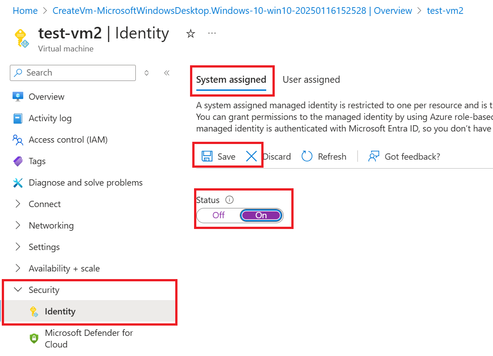

In this article, you learn how to enable and disable system and user-assigned managed identities for an Azure Virtual Machine (VM), using the Azure portal. 

## Prerequisites

- If you're unfamiliar with managed identities for Azure resources, check out the [overview section](~/identity/managed-identities-azure-resources/overview.md).
- If you don't already have an Azure account, [sign up for a free account](https://azure.microsoft.com/free/) before continuing.

## System-assigned managed identity

In this section, you learn how to enable and disable the system-assigned managed identity for VM using the Azure portal.

### Enable system-assigned managed identity during creation of a VM

To enable system-assigned managed identity on a VM during its creation, your account needs the [Virtual Machine Contributor](/azure/role-based-access-control/built-in-roles#virtual-machine-contributor) role assignment.  No other Microsoft Entra directory role assignments are required.

- Under the **Management** tab in the **Identity** section, switch **Managed service identity** to **On**.  

:::image type="content" source="../media/msi-qs-configure-portal-windows-vm/enable-system-assigned-identity-vm-creation.png" alt-text="Screenshot showing how to enable system-assigned identity during VM creation.":::

Refer to the following Quickstarts to create a VM: 

- [Create a Windows virtual machine with the Azure portal](/azure/virtual-machines/windows/quick-create-portal#create-virtual-machine) 
- [Create a Linux virtual machine with the Azure portal](/azure/virtual-machines/linux/quick-create-portal#create-virtual-machine)

### Enable system-assigned managed identity on an existing VM

[!INCLUDE [portal updates](~/includes/portal-update.md)]

To enable system-assigned managed identity on a VM that was originally provisioned without it, your account needs the [Virtual Machine Contributor](/azure/role-based-access-control/built-in-roles#virtual-machine-contributor) role assignment.  No other Microsoft Entra directory role assignments are required.

1. Sign in to the [Azure portal](https://portal.azure.com) using an account associated with the Azure subscription that contains the VM.

2. Navigate to the desired Virtual Machine and select **Identity**.

3. Under **System assigned**, **Status**, select **On** and then click **Save**:

    

### Remove system-assigned managed identity from a VM

To remove system-assigned managed identity from a VM, your account needs the [Virtual Machine Contributor](/azure/role-based-access-control/built-in-roles#virtual-machine-contributor) role assignment.  No other Microsoft Entra directory role assignments are required.

If you have a Virtual Machine that no longer needs system-assigned managed identity:

1. Sign in to the [Azure portal](https://portal.azure.com) using an account associated with the Azure subscription that contains the VM. 

2. Navigate to the desired Virtual Machine and select **Identity**.

3. Under **System assigned**, **Status**, select **Off** and then click **Save**:

   :::image type="content" source="../media/msi-qs-configure-portal-windows-vm/create-windows-vm-portal-configuration-blade-disable.png" alt-text="Screenshot of the configuration page.":::

## User-assigned managed identity

 In this section, you learn how to add and remove a user-assigned managed identity from a VM using the Azure portal.

### Assign a user-assigned identity during the creation of a VM

To assign a user-assigned identity to a VM, your account needs the [Virtual Machine Contributor](/azure/role-based-access-control/built-in-roles#virtual-machine-contributor) and [Managed Identity Operator](/azure/role-based-access-control/built-in-roles#managed-identity-operator) role assignments. No other Microsoft Entra directory role assignments are required.

Currently, the Azure portal does not support assigning a user-assigned managed identity during the creation of a VM. Instead, refer to one of the following VM creation Quickstart articles to first create a VM, and then proceed to the next section for details on assigning a user-assigned managed identity to the VM:

- [Create a Windows virtual machine with the Azure portal](/azure/virtual-machines/windows/quick-create-portal#create-virtual-machine)
- [Create a Linux virtual machine with the Azure portal](/azure/virtual-machines/linux/quick-create-portal#create-virtual-machine)

### Assign a user-assigned managed identity to an existing VM

To assign a user-assigned identity to a VM, your account needs the [Virtual Machine Contributor](/azure/role-based-access-control/built-in-roles#virtual-machine-contributor) and [Managed Identity Operator](/azure/role-based-access-control/built-in-roles#managed-identity-operator) role assignments. No other Microsoft Entra directory role assignments are required.

1. Sign in to the [Azure portal](https://portal.azure.com) using an account associated with the Azure subscription that contains the VM.
2. Navigate to the desired VM and click **Identity**, **User assigned** and then **\+Add**.

   :::image type="content" source="../media/msi-qs-configure-portal-windows-vm/add-user-assigned-identity-vm-screenshot1.png" alt-text="Screenshot that shows the Identity page with User assigned selected and the Add button highlighted.":::

3. Click the user-assigned identity you want to add to the VM and then click **Add**.

    :::image type="content" source="../media/msi-qs-configure-portal-windows-vm/add-user-assigned-identity-vm-screenshot2.png" alt-text="Screenshot showing adding a  user-assigned managed identity to VM.":::

### Remove a user-assigned managed identity from a VM

To remove a user-assigned identity from a VM, your account needs the [Virtual Machine Contributor](/azure/role-based-access-control/built-in-roles#virtual-machine-contributor) role assignment. No other Microsoft Entra directory role assignments are required.

1. Sign in to the [Azure portal](https://portal.azure.com) using an account associated with the Azure subscription that contains the VM.
2. Navigate to the desired VM and select **Identity**, **User assigned**, the name of the user-assigned managed identity you want to delete and then click **Remove** (click **Yes** in the confirmation pane).

   :::image type="content" source="../media/msi-qs-configure-portal-windows-vm/remove-user-assigned-identity-vm-screenshot.png" alt-text="Screenshot showing how to remove user-assigned managed identity from a VM":::

## Next steps

- Using the Azure portal, give an Azure VM's managed identity [access to another Azure resource](~/identity/managed-identities-azure-resources/howto-assign-access-portal.md).
