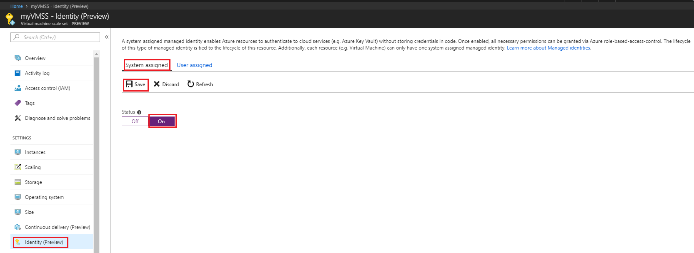

In this article, using the Azure portal, you learn how to perform the following managed identities for Azure resources operations on a virtual machine scale set:

- If you're unfamiliar with managed identities for Azure resources, check out the [overview section](~/identity/managed-identities-azure-resources/overview.md).
- If you don't already have an Azure account, [sign up for a free account](https://azure.microsoft.com/free/) before continuing.
- To perform the management operations in this article, your account needs the following Azure role assignments:

    > [!NOTE]
    > No additional Microsoft Entra directory role assignments required.

    - [Virtual Machine Contributor](/azure/role-based-access-control/built-in-roles#virtual-machine-contributor) to enable and remove system-assigned managed identity from a virtual machine scale set.

## System-assigned managed identity

In this section, you will learn how to enable and disable the system-assigned managed identity using the Azure portal.

### Enable system-assigned managed identity during creation of a virtual machine scale set

Currently, the Azure portal does not support enabling system-assigned managed identity during the creation of a virtual machine scale set. First create a [Virtual Machine Scale Set](/azure/virtual-machine-scale-sets/quick-create-portal), then enable a system-assigned managed identity on the scale set:

- [Create a Virtual Machine Scale Set in the Azure portal](/azure/virtual-machine-scale-sets/quick-create-portal)  

### Enable system-assigned managed identity on an existing virtual machine scale set

To enable the system-assigned managed identity on a virtual machine scale set that was originally provisioned without it:

1. Sign in to the [Azure portal](https://portal.azure.com) using an account associated with the Azure subscription that contains the virtual machine scale set.

2. Navigate to the desired virtual machine scale set.

3. Under **System assigned**, **Status**, select **On** and then click **Save**:

     

### Remove system-assigned managed identity from a virtual machine scale set

If you have a virtual machine scale set that no longer needs a system-assigned managed identity:

1. Sign in to the [Azure portal](https://portal.azure.com) using an account associated with the Azure subscription that contains the virtual machine scale set. Also make sure your account belongs to a role that gives you write permissions on the virtual machine scale set.

2. Navigate to the desired virtual machine scale set.

3. Under **System assigned**, **Status**, select **Off** and then click **Save**:

   :::image type="content" source="../media/msi-qs-configure-portal-windows-vmss/disable-windows-vmss-portal-configuration-blade.png" alt-text="Screenshot showing the configuration page.":::

## User-assigned managed identity

In this section, you learn how to add and remove a user-assigned managed identity from a virtual machine scale set using the Azure portal.

### Assign a user-assigned managed identity during the creation of a virtual machine scale set

Currently, the Azure portal does not support assigning a user-assigned managed identity during the creation of a virtual machine scale set. First create a [Virtual Machine Scale Set](/azure/virtual-machine-scale-sets/quick-create-portal), then assign a user assigned managed identity to the scale set.

### Assign a user-assigned managed identity to an existing virtual machine scale set

1. Sign in to the [Azure portal](https://portal.azure.com) using an account associated with the Azure subscription that contains the virtual machine scale set.

2. Navigate to the desired virtual machine scale set and click **Security** > **Identity**, **User assigned** and then **\+Add**.

3. Select the previously created [user assigned managed identity](../how-manage-user-assigned-managed-identities.md#create-a-user-assigned-managed-identity) from the list.

   :::image type="content" source="../media/msi-qs-configure-portal-windows-vmss/add-user-assigned-identity-vm-screenshot-1.png" alt-text="Screenshot that shows the Identity page with User assigned selected and the Add button highlighted.":::

### Remove a user-assigned managed identity from a virtual machine scale set

Sign in to the [Azure portal](https://portal.azure.com) using an account associated with the Azure subscription that contains the VM.

Navigate to the desired virtual machine scale set and click **Identity**, **User assigned**, the name of the user-assigned managed identity you want to delete and then click **Remove** (click **Yes** in the confirmation pane).

:::image type="content" source="../media/msi-qs-configure-portal-windows-vmss/remove-user-assigned-identity-vmss-screenshot.png" alt-text="A screenshot showing how to remove user-assigned identity from a virtual machine scale set.":::

## Next steps

- Using the Azure portal, give an Azure virtual machine scale set managed identity [access to another Azure resource](~/identity/managed-identities-azure-resources/howto-assign-access-portal.md).
