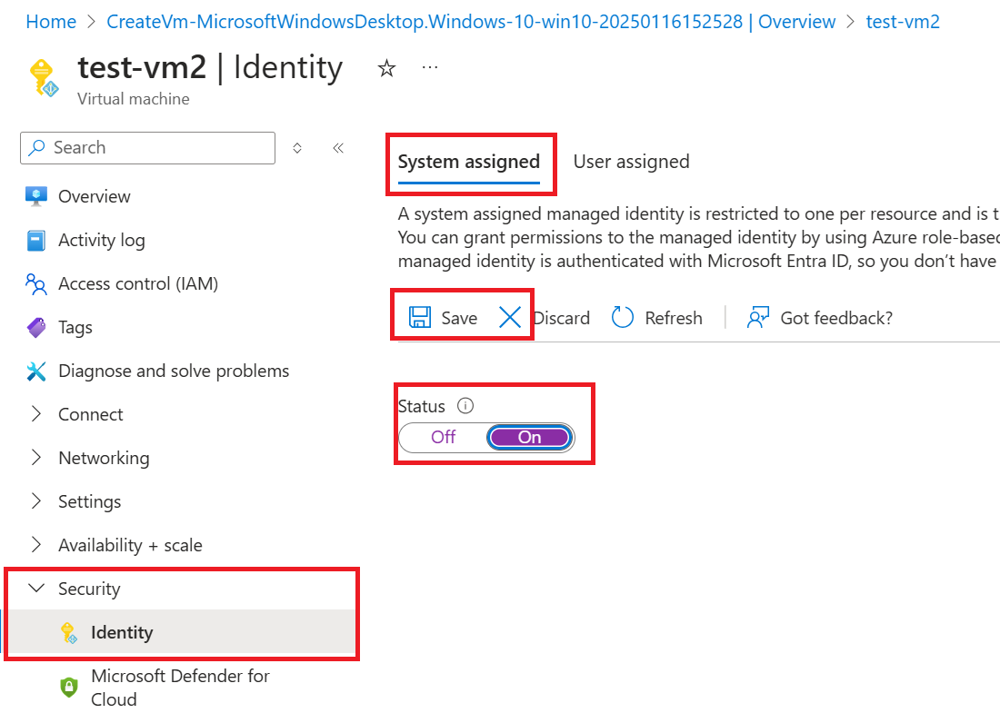

# Configure managed identities for Azure resources on a VM using the Azure portal

[!INCLUDE [preview-notice](~/includes/entra-msi-preview-notice.md)]

Managed identities for Azure resources provides Azure services with an automatically managed identity in Microsoft Entra ID. You can use this identity to authenticate to any service that supports Microsoft Entra authentication, without having credentials in your code. 

In this article, you learn how to enable and disable system and user-assigned managed identities for an Azure Virtual Machine (VM), using the Azure portal. 

## Prerequisites

- If you're unfamiliar with managed identities for Azure resources, check out the [overview section](overview.md).
- If you don't already have an Azure account, [sign up for a free account](https://azure.microsoft.com/free/) before continuing.

## System-assigned managed identity

In this section, you learn how to enable and disable the system-assigned managed identity for VM using the Azure portal.

### Enable system-assigned managed identity during creation of a VM

To enable system-assigned managed identity on a VM during its creation, your account needs the [Virtual Machine Contributor](/azure/role-based-access-control/built-in-roles#virtual-machine-contributor) role assignment.  No other Microsoft Entra directory role assignments are required.

- Under the **Management** tab in the **Identity** section, switch **Managed service identity** to **On**.  

:::image type="content" source="./media/msi-qs-configure-portal-windows-vm/enable-system-assigned-identity-vm-creation.png" alt-text="Screenshot showing how to enable system-assigned identity during VM creation.":::

Refer to the following Quickstarts to create a VM: 

- [Create a Windows virtual machine with the Azure portal](/azure/virtual-machines/windows/quick-create-portal#create-virtual-machine) 
- [Create a Linux virtual machine with the Azure portal](/azure/virtual-machines/linux/quick-create-portal#create-virtual-machine)

### Enable system-assigned managed identity on an existing VM

[!INCLUDE [portal updates](~/includes/portal-update.md)]

To enable system-assigned managed identity on a VM that was originally provisioned without it, your account needs the [Virtual Machine Contributor](/azure/role-based-access-control/built-in-roles#virtual-machine-contributor) role assignment.  No other Microsoft Entra directory role assignments are required.

1. Sign in to the [Azure portal](https://portal.azure.com) using an account associated with the Azure subscription that contains the VM.

2. Navigate to the desired Virtual Machine and select **Identity**.

3. Under **System assigned**, **Status**, select **On** and then click **Save**:

    

### Remove system-assigned managed identity from a VM

To remove system-assigned managed identity from a VM, your account needs the [Virtual Machine Contributor](/azure/role-based-access-control/built-in-roles#virtual-machine-contributor) role assignment.  No other Microsoft Entra directory role assignments are required.

If you have a Virtual Machine that no longer needs system-assigned managed identity:

1. Sign in to the [Azure portal](https://portal.azure.com) using an account associated with the Azure subscription that contains the VM. 

2. Navigate to the desired Virtual Machine and select **Identity**.

3. Under **System assigned**, **Status**, select **Off** and then click **Save**:

   :::image type="content" source="./media/msi-qs-configure-portal-windows-vm/create-windows-vm-portal-configuration-blade-disable.png" alt-text="Screenshot of the configuration page.":::

## User-assigned managed identity

 In this section, you learn how to add and remove a user-assigned managed identity from a VM using the Azure portal.

### Assign a user-assigned identity during the creation of a VM

To assign a user-assigned identity to a VM, your account needs the [Virtual Machine Contributor](/azure/role-based-access-control/built-in-roles#virtual-machine-contributor) and [Managed Identity Operator](/azure/role-based-access-control/built-in-roles#managed-identity-operator) role assignments. No other Microsoft Entra directory role assignments are required.

Currently, the Azure portal does not support assigning a user-assigned managed identity during the creation of a VM. Instead, refer to one of the following VM creation Quickstart articles to first create a VM, and then proceed to the next section for details on assigning a user-assigned managed identity to the VM:

- [Create a Windows virtual machine with the Azure portal](/azure/virtual-machines/windows/quick-create-portal#create-virtual-machine)
- [Create a Linux virtual machine with the Azure portal](/azure/virtual-machines/linux/quick-create-portal#create-virtual-machine)

### Assign a user-assigned managed identity to an existing VM

To assign a user-assigned identity to a VM, your account needs the [Virtual Machine Contributor](/azure/role-based-access-control/built-in-roles#virtual-machine-contributor) and [Managed Identity Operator](/azure/role-based-access-control/built-in-roles#managed-identity-operator) role assignments. No other Microsoft Entra directory role assignments are required.

1. Sign in to the [Azure portal](https://portal.azure.com) using an account associated with the Azure subscription that contains the VM.
2. Navigate to the desired VM and click **Identity**, **User assigned** and then **\+Add**.

   :::image type="content" source="./media/msi-qs-configure-portal-windows-vm/add-user-assigned-identity-vm-screenshot1.png" alt-text="Screenshot that shows the Identity page with User assigned selected and the Add button highlighted.":::

3. Click the user-assigned identity you want to add to the VM and then click **Add**.

    :::image type="content" source="./media/msi-qs-configure-portal-windows-vm/add-user-assigned-identity-vm-screenshot2.png" alt-text="Screenshot showing adding a  user-assigned managed identity to VM.":::

### Remove a user-assigned managed identity from a VM

To remove a user-assigned identity from a VM, your account needs the [Virtual Machine Contributor](/azure/role-based-access-control/built-in-roles#virtual-machine-contributor) role assignment. No other Microsoft Entra directory role assignments are required.

1. Sign in to the [Azure portal](https://portal.azure.com) using an account associated with the Azure subscription that contains the VM.
2. Navigate to the desired VM and select **Identity**, **User assigned**, the name of the user-assigned managed identity you want to delete and then click **Remove** (click **Yes** in the confirmation pane).

   :::image type="content" source="./media/msi-qs-configure-portal-windows-vm/remove-user-assigned-identity-vm-screenshot.png" alt-text="Screenshot showing how to remove user-assigned managed identity from a VM":::

## Next steps

- Using the Azure portal, give an Azure VM's managed identity [access to another Azure resource](howto-assign-access-portal.md).
