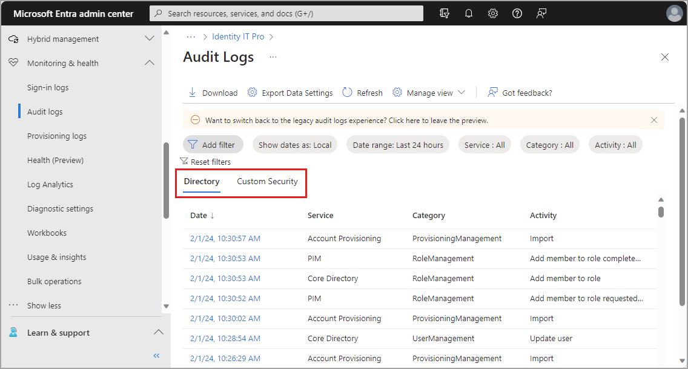

# What are Microsoft Entra audit logs?

Microsoft Entra activity logs include audit logs, which is a comprehensive report on every logged event in Microsoft Entra ID. Changes to applications, groups, users, and licenses are all captured in the Microsoft Entra audit logs.

Three other activity logs are also available to help monitor the health of your tenant:

- **[Sign-ins](concept-sign-ins.md)** – Information about sign-ins and how your resources are used by your users.
- **[Sign-ups](concept-sign-ups.md)** - For [external tenants](../../external-id/tenant-configurations.md) only, information about all self-service sign-up attempts, including successful sign-ups and failed attempts.
- **[Provisioning](concept-provisioning-logs.md)** – Activities performed by the provisioning service, such as the creation of a group in ServiceNow or a user imported from Workday.

This article gives you an overview of the audit logs, including what's required to access them and what information they provide.

## License and role requirements

[!INCLUDE [Microsoft Entra monitoring and health](../../includes/licensing-monitoring-health.md)]

## What can you do with audit logs?

Audit logs in Microsoft Entra ID provide access to system activity records, often needed for compliance. You can get answers to questions related to users, groups, and applications.

**Users:**

- What types of changes were recently applied to users?
- How many users were changed?
- How many passwords were changed?

**Groups:**

- What groups were recently added?
- Have the owners of group been changed?
- What licenses are to a group or a user?

**Applications:**

- What applications were, updated, or removed?
- Has a service principal for an application changed?
- Have the names of applications been changed?

**Custom security attributes:**

- What changes were made to [custom security attribute](../../fundamentals/custom-security-attributes-overview.md) definitions or assignments?
- What updates were made to attribute sets?
- What custom attribute values were assigned to a user?

> [!NOTE]
> Entries in the audit logs are system generated and can't be changed or deleted.

## What do the logs show?

Audit logs default to the **Directory** tab, which displays the following information:

- Date and time of the occurrence
- Service that logged the occurrence
- Category and name of the activity (*what*) 
- Status of the activity (success or failure)

A second tab for **Custom Security** displays audit logs for custom security attributes. To view data on this tab, you must have the [Attribute Log Administrator](../../identity/role-based-access-control/permissions-reference.md#attribute-log-administrator) or [Attribute Log Reader](../../identity/role-based-access-control/permissions-reference.md#attribute-log-reader) role. This audit log shows all activities related to custom security attributes. For more information, see [What are custom security attributes](../../fundamentals/custom-security-attributes-overview.md).

## Microsoft 365 activity logs

You can view Microsoft 365 activity logs from the [Microsoft 365 admin center](/microsoft-365/admin/admin-overview/admin-center-overview). Even though Microsoft 365 activity and Microsoft Entra activity logs share many directory resources, only the Microsoft 365 admin center provides a full view of the Microsoft 365 activity logs.

You can also access the Microsoft 365 activity logs programmatically by using the [Office 365 Management APIs](/office/office-365-management-api/office-365-management-apis-overview).

Most standalone or bundled Microsoft 365 subscriptions have back-end dependencies on some subsystems within the Microsoft 365 datacenter boundary. The dependencies require some information write-back to keep directories in sync and essentially to help enable hassle-free onboarding in a subscription opt-in for Exchange Online. For these write-backs, audit log entries show actions taken by “Microsoft Substrate Management”. These audit log entries refer to create/update/delete operations executed by Exchange Online to Microsoft Entra ID. The entries are informational and don't require any action.
