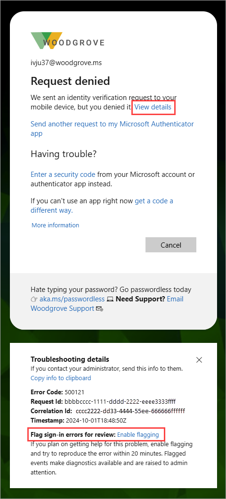
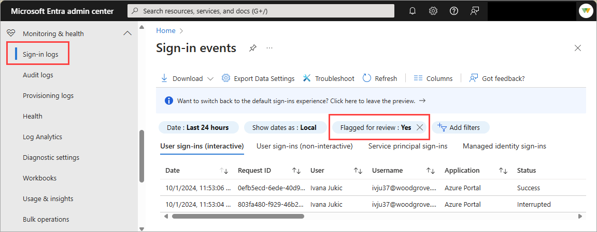

# Microsoft Entra flagged sign-ins

As an IT admin, you want to resolve sign-in issues as soon as possible to unblock your users. Due to the amount of available data in the sign-in log, locating the right information can be a challenge.

This article gives you an overview of the flagged sign-ins feature that can significantly improve the time it takes to resolve user sign-in problems by making the related problems easier to find.

## What are flagged sign-ins?

Microsoft Entra sign-in events are critical to understanding what happened with user sign-ins and the authentication configurations in your tenant. However, Microsoft Entra ID processes over 8 billion authentications a day, which can result in so many sign-in events that admins might find it difficult to find the ones that matter.

The flagged sign-ins feature is intended to improve the signal to noise ratio for user sign-ins that require your support. The feature allows users to raise awareness about sign-in errors they need help with. Admins and help desk workers also benefit from finding the right events more efficiently. Flagged sign-in events contain the same information as other sign-in events but they also indicate that a user flagged the event for review.

You can use flagged sign-ins to:

- **Empower** users to proactively indicate which sign-in errors require IT admin support.

- **Simplify** the process of locating sign-in errors.

- **Enable**  help desk personnel to find sign-in errors without the end user having to do anything other than flag the event.

## How it works

When users see a sign-in error, they can choose to enable flagging. For the next 20 minutes, any sign-in event from that user, on the same browser and client device or computer, displays *Flagged for Review: Yes* in the sign-in logs. After 20 minutes, the flagging automatically turns off.

- Any user signing into Microsoft Entra ID can flag sign-ins for review, including member and guest users. 
- Reviewing flagged sign-in events requires permissions to read the sign-in logs. For more information, see [How to access activity logs](howto-access-activity-logs.md#prerequisites).
- While the names are similar, **flagged sign-ins** and **risky sign-ins** are different capabilities:
    - Flagged sign-ins are sign-in error events users are asking assistance on. 
    - A risky sign-in is a functionality of Microsoft Entra ID Protection. For more information, see [What is Microsoft Entra ID Protection](~/id-protection/overview-identity-protection.md).

### [How to flag an error](#tab/how-to-flag-an-error)

The user must complete this first step to enable flagging for sign-in errors.

1. The user receives an error during sign-in.
1. The user selects **View details** in the error message.
1. In the **Troubleshooting details** section of the error message, the user selects **Enable flagging**.
    - The text changes to **Disable Flagging** and flagging is now enabled.
    - The user must use the same browser and client or the events aren't flagged.
    
        

1. Open a *new* browser window (in the same browser application) and attempt the same sign-in that failed. 

If the sign-in error is reproduced, the flagged diagnostics are sent to the sign-in logs.

### [Find flagged events in the admin center](#tab/find-flagged-events-in-the-admin-center)

The sign-in logs might take several minutes for the flagged sign-in events to appear.

1. Sign in to the [Microsoft Entra admin center](https://entra.microsoft.com) as at least a [Reports Reader](../../identity/role-based-access-control/permissions-reference.md#reports-reader).
1. Browse to **Entra ID** > **Monitoring & health** > **Sign-in logs**.
1. Open the **Add filters** menu and select **Flagged for review**. All flagged events are shown.

    

1. If needed, apply more filters to refine the event view.
1. Select the event to review what happened.

### [Find flagged events using Microsoft Graph](#tab/find-flagged-events-using-microsoft-graph)

You can find flagged sign-ins using the Microsoft Graph API. For more information, see the [signIn resource type](/graph/api/resources/signin) Microsoft Graph documentation.

Show all Flagged Sign-ins:

- `https://graph.microsoft.com/beta/auditLogs/signIns?&$filter=flaggedforReview eq true`

Flagged Sign-ins query for specific user by UPN (for example: user@contoso.com):

- `https://graph.microsoft.com/beta/auditLogs/signIns?&$filter=flaggedforReview eq true and userPrincipalname eq 'user@contoso.com'`

Flagged Sign-ins query for specific user and date greater than:

- `https://graph.microsoft.com/beta/auditLogs/signIns?&$filter=flaggedforReview eq true and createdDateTime ge 2021-10-01 and userPrincipalname eq 'user@contoso.com'`
 
## Related content

- [Sign-in logs in Microsoft Entra ID](concept-sign-ins.md)
- [Sign-in diagnostics for Microsoft Entra scenarios](concept-sign-in-diagnostics-scenarios.md)
