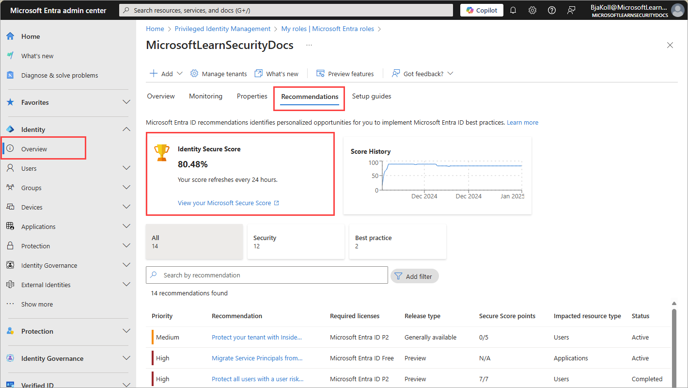
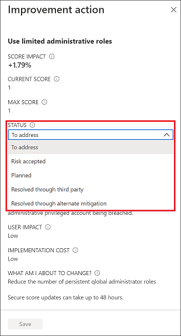

# What is Identity Secure Score?

The Identity Secure Score is shown as a percentage that functions as an indicator for how aligned you are with Microsoft's recommendations for security. Each improvement action in Identity Secure Score is tailored to your configuration. You can access the score and view individual recommendations related to your score in Microsoft Entra recommendations. You can also see how your score has changed over time. 

The following recommendations are included in the Identity Secure Score:

- Require multifactor authentication (MFA) for administrative roles
- Ensure all users can complete MFA
- Enable policy to block legacy authentication
- Do not expire passwords
- Protect all users with a user risk policy
- Protect all users with a sign-in risk policy
- Enable password hash sync if hybrid
- Do not allow users to grant consent to unreliable applications
- Use least privileged administrative roles
- Designate more than one Global Administrator
- Enable self-service password reset

## How does the Identity Secure Score benefit me?

This score helps to:

- Objectively measure your identity security posture
- Plan identity security improvements
- Review the success of your improvements

By following the improvement actions in the Microsoft Entra recommendations, you can:

- Improve your security posture and your score
- Take advantage the features available to your organization as part of your identity investments

## How does it work?

Every 24 hours, we look at your security configuration and compare your settings with the recommended best practices. Based on the outcome of this evaluation, a new score is calculated for your directory. It’s possible that your security configuration isn’t fully aligned with the best practice guidance and the improvement actions are only partially met. In these scenarios, you're awarded a portion of the max score available for the control.

## Prerequisites

- Identity Secure Score is available to free and paid customers.
- Some recommendations require a paid license to view and act on. For more information, see [What are Microsoft Entra recommendations](overview-recommendations.md).
- To update the status of an improvement action, you need to have [Security Administrator](../role-based-access-control/permissions-reference.md#security-administrator), [Exchange Administrator](../role-based-access-control/permissions-reference.md#exchange-administrator), or [SharePoint Administrator](../role-based-access-control/permissions-reference.md#sharepoint-administrator) permissions.
- To view the improvement action but not update, you need to have [Helpdesk Administrator](../role-based-access-control/permissions-reference.md#helpdesk-administrator), [User Administrator](../role-based-access-control/permissions-reference.md#user-administrator), [Service Support Administrator](../role-based-access-control/permissions-reference.md#service-support-administrator), [Security Reader](../role-based-access-control/permissions-reference.md#security-reader), [Security Operator](../role-based-access-control/permissions-reference.md#security-operator), or [Global Reader](../role-based-access-control/permissions-reference.md#global-reader) permissions.

## How do I use the Identity Secure Score?

To access the Identity Secure Score:

1. Sign in to the [Microsoft Entra admin center](https://entra.microsoft.com) as at least a [Global Reader](~/identity/role-based-access-control/permissions-reference.md#global-reader).
1. Browse to **Entra ID** > **Identity Secure Score** to view the dashboard.

The score and related recommendations are also found at **Entra ID** > **Overview** > **Recommendations**.

Each recommendation is measured based on your configuration. If you're using non-Microsoft products to enable a best practice recommendation, you can indicate this configuration in the settings of an improvement action. You might set recommendations to be ignored if they don't apply to your environment. An ignored recommendation doesn't contribute to the calculation of your score.

- **To address** - You recognize that the improvement action is necessary and plan to address it at some point in the future. This state also applies to actions that are detected as partially, but not fully completed.
- **Risk accepted** - Security should always be balanced with usability, and not every recommendation works for everyone. When that is the case, you can choose to accept the risk, or the remaining risk, and not enact the improvement action. You aren't awarded any points, and the action isn't visible in the list of improvement actions. You can view this action in history or undo it at any time.
- **Planned** - There are concrete plans in place to complete the improvement action.
- **Resolved through third party** and **Resolved through alternate mitigation** - The improvement action was addressed by a non-Microsoft application or software, or an internal tool. You're awarded the points the action is worth, so your score better reflects your overall security posture. If a non-Microsoft or internal tool no longer covers the control, you can choose another status. Keep in mind, Microsoft has no visibility into the completeness of implementation if the improvement action is marked as either of these statuses.

## Frequently asked questions

Many factors can affect your score. Here are some frequently asked questions about the Identity Secure Score.

### How are the recommendations scored?

Recommendations can be scored in two ways. Some are scored in a binary fashion, so you get 100% of the score if you have the feature or setting configured based on our recommendation. Other scores are calculated as a percentage of the total configuration. For example, the recommendation states there's a maximum of 10.71% increase if you protect all your users with MFA. You have 5 of 100 total users protected, so you're given a partial score around 0.53% (5 protected / 100 total * 10.71% maximum = 0.53% partial score).

### What does [Not Scored] mean?

Actions labeled as [Not Scored] are ones you can perform in your organization but aren't scored. So, you can still improve your security, but you aren't given credit for those actions right now.

### My score changed. How do I figure out why?

The [Microsoft 365 Defender portal](https://security.microsoft.com/) shows your complete Microsoft secure score. You can easily see all the changes to your secure score by reviewing the in-depth changes on the history tab.

### Does the score measure my risk of getting breached?

No, score doesn't express an absolute measure of how likely you're to get breached. It expresses the extent to which you adopted features that can *offset* risk. No service can guarantee protection, and the score shouldn't be interpreted as a guarantee in any way.

### Is there a minimum score I should aim for?

Instead of focusing on a specific score, you should focus on the high importance recommendations that are relevant to your organization. It's more beneficial to have a high score on the high importance recommendations than a high score on low importance recommendations. 

### How should I interpret my score?

Your score improves for configuring recommended security features or performing security-related tasks (like reading reports). Some actions are scored for partial completion, like enabling multifactor authentication (MFA) for your users. Your secure score is directly representative of the Microsoft security services you use. Remember that security must be balanced with usability. All security controls have a user impact component. Controls with low user impact should have little to no effect on your users' day-to-day operations.

### How does the Identity Secure Score relate to the Microsoft 365 secure score?

The [Microsoft secure score](/microsoft-365/security/defender/microsoft-secure-score) contains five distinct control and score categories:

- Identity
- Data
- Devices
- Infrastructure
- Apps

The Identity Secure Score represents the identity part of the Microsoft secure score. This overlap means that your recommendations for the Identity Secure Score and the identity score in Microsoft are the same.
