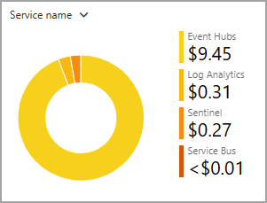
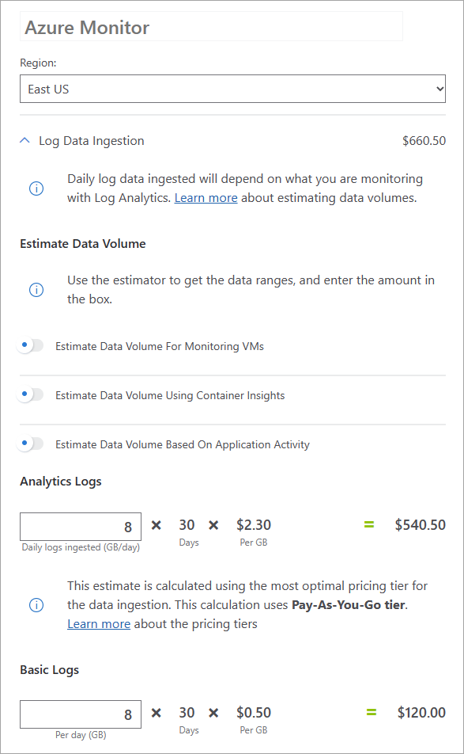

# What are the Microsoft Entra activity log integration options?

Using **Diagnostic settings** in Microsoft Entra ID, you can route activity logs to several endpoints for long term data retention and insights. You can archive logs for storage, route to Security Information and Event Management (SIEM) tools, and integrate logs with Azure Monitor logs.

With these integrations, you can enable rich visualizations, monitoring, and alerting on the connected data. This article describes the recommended uses for each integration type or access method. Cost considerations for sending Microsoft Entra activity logs to various endpoints are also covered.

## Supported reports

The following logs can be integrated with one of many endpoints:

* The [**audit logs activity report**](concept-audit-logs.md) gives you access to the history of every task that's performed in your tenant.
* With the [**sign-in activity report**](concept-sign-ins.md), you can see when users attempt to sign in to your applications or troubleshoot sign-in errors.
* With the [**provisioning logs**](~/identity/app-provisioning/application-provisioning-log-analytics.md), you can monitor which users were, updated, and deleted in all your third-party applications.
* The [**risky users logs**](~/id-protection/howto-identity-protection-investigate-risk.md#risky-users) helps you monitor changes in user risk level and remediation activity.
* With the [**risk detections logs**](~/id-protection/howto-identity-protection-investigate-risk.md#risk-detections), you can monitor user's risk detections and analyze trends in risk activity detected in your organization.

## Integration options

To help choose the right method for integrating Microsoft Entra activity logs for storage or analysis, think about the overall task you're trying to accomplish. We've grouped the options into three main categories:

* Troubleshooting
* Long-term storage
* Analysis and monitoring

### Troubleshooting

If you're performing troubleshooting tasks but you don't need to retain the logs for more than 30 days, we recommend using the Azure portal or Microsoft Graph to access activity logs. You can filter the logs for your scenario and export or download them as needed.

If you're performing troubleshooting tasks *and* you need to retain the logs for more than 30 days, take a look at the long-term storage options.

### Long-term storage

If you're performing troubleshooting tasks *and* you need to retain the logs for more than 30 days, you can export your logs to an Azure storage account. This option is ideal of you don't plan on querying that data often.

If you need to query the data that you're retaining for more than 30 days, take a look at the analysis and monitoring options.

### Analysis and monitoring

If your scenario requires that you retain data for more than 30 days *and* you plan on querying that data regularly, you've got a few options to integrate your data with SIEM tools for analysis and monitoring.

If you have a third party SIEM tool, we recommend setting up an Event Hubs namespace and event hub that you can stream your data through. With an event hub, you can stream logs to one of the supported SIEM tools.

If you don't plan on using a third-party SIEM tool, we recommend sending your Microsoft Entra activity logs to Azure Monitor logs. With this integration, you can query your activity logs with Log Analytics. In Addition to Azure Monitor logs, Microsoft Sentinel provides near real-time security detection and threat hunting. If you decide to integrate with SIEM tools later, you can stream your Microsoft Entra activity logs along with your other Azure data through an event hub.

## Cost considerations

There's a cost for sending data to a Log Analytics workspace, archiving data in a storage account, or streaming logs to an event hub. The amount of data and the cost incurred can vary significantly depending on the tenant size, the number of policies in use, and even the time of day. Changing an existing diagnostic setting might incur new charges.

Because the size and cost for sending logs to an endpoint is difficult to predict, the most accurate way to determine your expected costs is to route your logs to an endpoint for day or two. With this snapshot, you can get an accurate prediction for your expected costs. You can also get an estimate of your costs by downloading a sample of your logs and multiplying accordingly to get an estimate for one day.

Other considerations for sending Microsoft Entra logs to Azure Monitor logs are covered in the following Azure Monitor cost details articles:

* [Azure Monitor logs cost calculations and options](/azure/azure-monitor/logs/cost-logs)
* [Azure Monitor cost and usage](/azure/azure-monitor/usage-estimated-costs)
* [Optimize costs in Azure Monitor](/azure/azure-monitor/best-practices-cost)

Azure Monitor provides the option to exclude whole events, fields, or parts of fields when ingesting logs from Microsoft Entra ID. Learn more about this cost saving feature in [Data collection transformation in Azure Monitor](/azure/azure-monitor/essentials/data-collection-transformations).

## Estimate your costs

To estimate the costs for your organization, you can estimate either the daily log size or the daily cost for integrating your logs with an endpoint.

The following factors could affect costs for your organization:

* Audit log events use around 2 KB of data storage
* Sign-in log events use on average 11.5 KB of data storage
* A tenant of about 100,000 users could incur about 1.5 million events per day
* Events are batched into about 5-minute intervals and sent as a single message that contains all the events within that time frame

### Daily log size

To estimate the daily log size, gather a sample of your logs, adjust the sample to reflect your tenant size and settings, then apply that sample to the [Azure pricing calculator](https://azure.microsoft.com/pricing/calculator/).

If you haven't downloaded logs from the Microsoft Entra admin center before, review the [How to download logs in Microsoft Entra ID](howto-download-logs.md) article. Depending on the size of your organization, you might need to choose a different sample size to start your estimation. The following sample sizes are a good place to start:

* 1000 records
* For large tenants, 15 minutes of sign-ins
* For small to medium tenants, 1 hour of sign-ins

You should also consider the geographic distribution and peak hours of your users when you capture your data sample. If your organization is based in one region, it's likely that sign-ins peak around the same time. Adjust your sample size and when you capture the sample accordingly.

With the data sample captured, multiply accordingly to find out how large the file would be for one day.

### Estimate the daily cost

To get an idea of how much a log integration could cost for your organization, you can enable an integration for a day or two. Use this option if your budget allows for the temporary increase.

To enable a log integration, follow the steps in the [Integrate activity logs with Azure Monitor logs](./howto-integrate-activity-logs-with-azure-monitor-logs.yml) article. If possible, create a new resource group for the logs and endpoint you want to try out. Having a devoted resource group makes it easy to view the cost analysis and then delete it when you're done.

With the integration enabled, navigate to **Azure portal** > **Cost Management** > **Cost analysis**. There are several ways to analyze costs. This [Cost Management quickstart](/azure/cost-management-billing/costs/quick-acm-cost-analysis) should help you get started. The figures in the following screenshot are used for example purposes and aren't intended to reflect actual amounts.

Make sure you're using your new resource group as the scope. Explore the daily costs and forecasts to get an idea of how much your log integration could cost.

## Calculate estimated costs

From the [Azure pricing calculator](https://azure.microsoft.com/pricing/calculator/) landing page, you can estimate the costs for various products.

* [Azure Monitor](https://azure.microsoft.com/pricing/details/monitor/)
* [Azure storage](https://azure.microsoft.com/pricing/details/storage/blobs/)
* [Azure Event Hubs](https://azure.microsoft.com/pricing/details/event-hubs/)
* [Microsoft Sentinel](https://azure.microsoft.com/pricing/details/microsoft-sentinel/)

Once you have an estimate for the GB/day that will be sent to an endpoint, enter that value in the [Azure pricing calculator](https://azure.microsoft.com/pricing/calculator/). The figures in the following screenshot are used for example purposes and aren't intended to reflect actual prices.

