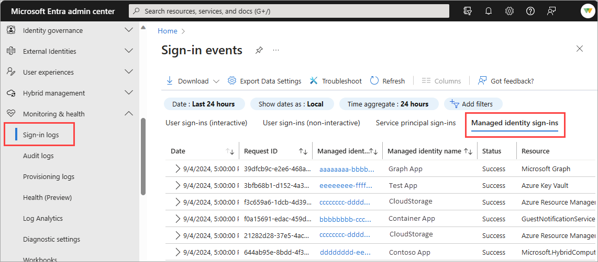

# What are managed identity sign-ins in Microsoft Entra?

Managed identities for Azure resources sign-ins are sign-ins that were performed by resources that have their secrets managed by Azure to simplify credential management. A VM with managed credentials uses Microsoft Entra ID to get an Access Token.

You can't customize the fields shown in this report.

To make it easier to digest the data, these sign-in events are grouped together. Sign-ins from the same entity are aggregated into a single row. You can expand the row to see all the different sign-ins and their different time stamps. Sign-ins are aggregated in the managed identities report when all of the following data matches:

- Managed identity name or ID
- Status
- Resource name or ID

Select an item in the list view to display all sign-ins that are grouped under a node. Select a grouped item to see all details of the sign-in.

> [!NOTE]
> Entries in the sign-in logs are system generated and can't be changed or deleted.
