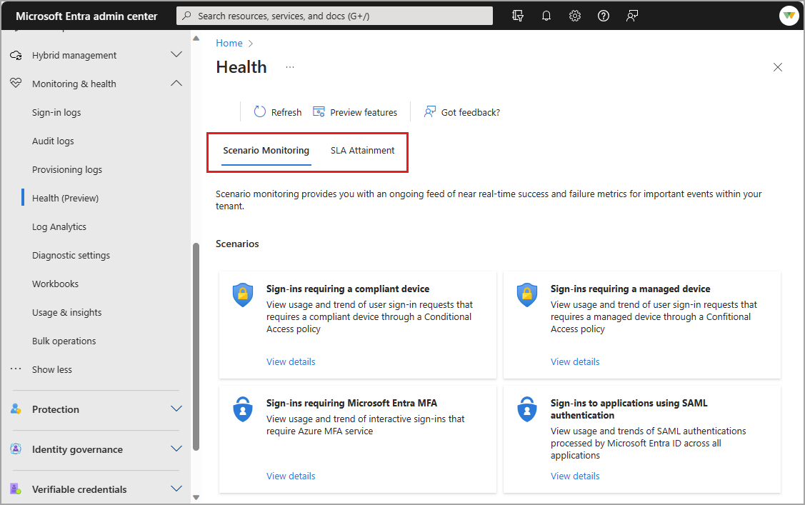
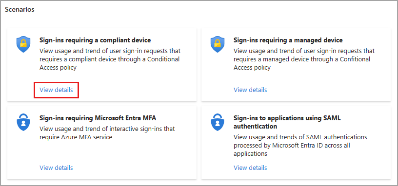

# What is Microsoft Entra Health?

Microsoft Entra Health (preview) provides you with the ability to view the health of your Microsoft Entra tenant through a report of service level agreement (SLA) attainment and a set of health metrics you can monitor for key Microsoft Entra ID scenarios.

Metrics and data are gathered, processed, and converted into meaningful signals displayed in Microsoft Entra Health Scenario Monitoring. All the data is provided at the tenant level. The scenario monitoring solution is currently in public preview and can be enabled or disabled in the Preview Hub; the SLA Attainment report is available by default.

## How to access Microsoft Entra Health

You can view the Microsoft Entra Health SLA attainment and Scenario monitoring (preview) from the Microsoft Entra admin center.

1. Sign into the [Microsoft Entra admin center](https://entra.microsoft.com) as at least a [Reports Reader](../role-based-access-control/permissions-reference.md#reports-reader).
1. Browse to **Identity** > **Monitoring and health** > **Health (preview)**.

You can also view these metric streams using [Microsoft Graph](/graph/api//resources/serviceactivity?view=graph-rest-beta&preserve-view=true). 

[Enable the Scenario monitoring preview](https://entra.microsoft.com/?feature.tokencaching=true&feature.internalgraphapiversion=true#view/Microsoft_AAD_IAM/FeaturePreviewsListBlade). Enabling the preview might take up to 24 hours to populate. Enabling the preview only changes your view, not the entire tenant. You can disable the preview at any time.

## SLA attainment

In addition to providing global SLA performance, Microsoft Entra ID provides tenant-level SLA performance for organizations with at least 5000 monthly active users. The Service Level Agreement (SLA) attainment is the user authentication availability for Microsoft Entra ID. For the current availability target and details on how SLA is calculated, see [SLA for Microsoft Entra ID](https://azure.microsoft.com/support/legal/sla/active-directory/v1_1/).

Hover your mouse over the bar for a month to view the percentage for that month. A table with the same details appears below the graph.

You can also view SLA attainment using [Microsoft Graph](/graph/api/resources/serviceactivity?view=graph-rest-beta&preserve-view=true).

## Scenario monitoring (preview) 

Many IT administrators spend a considerable amount of time investigating the health of the following key scenarios:

- Interactive user sign-in requests that require Microsoft Entra multifactor authentication.
- User sign-in requests that require a managed device through a Conditional Access policy.
- User sign-in requests that require a compliant device through a Conditional Access policy.
- User sign-in requests to applications using SAML authentication.

The data associated with each of these scenarios is aggregated into a view that's specific to that scenario. If you're only interested in sign-ins from compliant devices, you can dive into that scenario without noise from other sign-in activities. 

Each scenario detail page provides trends and totals for that scenario for the last 30 days. You can set the date range to 24 hours, 7 days, or 1 month. This data is aggregated every 15 minutes, for low latency insights into your tenant's health. 

## Scenario health alerts

Microsoft Entra health monitoring now provides alerts for some of the scenarios. Alerts are generated when our anomaly detection service identifies a significant change to the pattern in the signal. For more information, see [How to use Microsoft Entra scenario health alerts](howto-use-health-scenario-alerts.md).

The following scenarios also provide health monitoring alerts:

- [Sign-ins requiring a compliant or managed device](scenario-health-sign-ins-compliant-device.md)
- [Sign-ins requiring multifactor authentication (MFA)](scenario-health-sign-ins-mfa.md)

### Sign-ins to applications using SAML authentication

This scenario looks at SAML 2.0 authentication attempts that the Microsoft Entra cloud service for your tenant successfully processed. This metric currently excludes WS-FED/SAML 1.1 apps integrated with Microsoft Entra ID. This scenario is currently only available for scenario monitoring.

- [Learn how the Microsoft Identity platform uses the SAML protocol](../../identity-platform/saml-protocol-reference.md)
- [Use a SAML 2.0 IdP for single sign on](../hybrid/connect/how-to-connect-fed-saml-idp.md).

