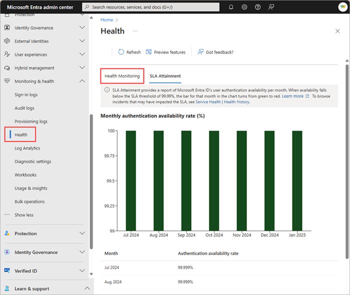

# What is Microsoft Entra Health?

Microsoft Entra Health provides you with observability of your Microsoft Entra tenant through continuous low-latency health monitoring and look-back reporting on Service Level Agreements (SLA). The low-latency health monitoring solution includes a set of health metric data streams, known as signals, with built-in alerts designed to help IT operations teams maintain high levels of uptime and service on common Microsoft Entra scenarios. The SLA Attainment is a monthly look-back solution that shows the core authentication availability of Microsoft Entra ID each month.

The Scenario monitoring and SLA Attainment features are currently in preview. For more information about preview features, see [Microsoft Entra ID preview features](~/fundamentals/whats-new.md).

## Access Microsoft Entra Health

Scenario monitoring and SLA Attainment are available in the Microsoft Entra Health area of the Microsoft Entra admin center.

1. Sign in to the [Microsoft Entra admin center](https://entra.microsoft.com) as at least a [Reports Reader](../role-based-access-control/permissions-reference.md#reports-reader).
1. Browse to **Identity** > **Monitoring & health** > **Health**.

The page opens to the SLA Attainment page.

## How Microsoft Entra Scenario monitoring (preview) works

Scenario Monitoring in Microsoft Entra Health is built on two key components: signals and alerts. Here's a high-level look at how they both work together:

1. Metrics and data are gathered, processed, and converted into meaningful signals displayed in Microsoft Entra Health monitoring.

    

1. These signals are fed into our anomaly detection service.

1. When the anomaly detection service identifies a significant change to a pattern in the signal, it triggers an alert. 

1. When the alert is triggered, an email notification is sent to a set of users, preselected by the tenant admin. This email notification prompts recipients to investigate and determine if there's a problem.

1. After you see an alert, you need to research possible root causes, determine the next steps, and take action to mitigate the root cause. Each health alert contains an impact assessment and links to resources to help you through the process.

## Microsoft Entra Health monitoring signals

Many IT administrators spend a considerable amount of time investigating several key scenarios, such as sign-ins requiring multifactor authentication (MFA) or sign-ins requiring a compliant or managed device. Microsoft Entra Health provides a visualization of the data associated with these metrics, so you can quickly identify trends and potential issues.

The following key scenarios can be monitored in Microsoft Entra Health:

- Interactive user sign-in requests that require Microsoft Entra multifactor authentication (MFA).
- User sign-in requests that require a managed device through a Conditional Access policy.
- User sign-in requests that require a compliant device through a Conditional Access policy.
- User sign-in requests to applications using SAML authentication.

The data associated with each of these scenarios is aggregated into a view that's specific to that scenario. If you're only interested in sign-ins from compliant devices, you can dive into that scenario without noise from other sign-in activities. 

Each scenario detail page provides trends and totals for that scenario for the last 30 days. This data is aggregated every 15 minutes, for low latency insights into your tenant's health.

## Microsoft Entra Health monitoring alerts

In addition to providing health signals, Microsoft Entra Health monitoring also has an anomaly detection service that looks at the data and develops dynamic alerting thresholds based on the pattern specific to your tenant. When the service identifies a significant change to that pattern at the tenant level, it triggers an alert. By monitoring these scenarios and reviewing the alerts, you can more effectively monitor and improve the health of your tenant.

Alerts are specific to your tenant and to the scenario being monitored. Machine learning requires at least four weeks of data to establish a pattern for your tenant. The more data we collect on the signal, the more accurate the anomaly detection service becomes. The service looks back 25-30 minutes on the timeline and triggers an alert if the signal deviates from the pattern.

The service provides alerts for the following scenarios:

- [Sign-ins requiring a Conditional Access compliant device](scenario-health-sign-ins-compliant-managed-device.md)
- [Sign-ins requiring a Conditional Access managed device](scenario-health-sign-ins-compliant-managed-device.md)
- [Sign-ins requiring multifactor authentication (MFA)](scenario-health-sign-ins-mfa.md)

At this time, alerts are only available through the Microsoft Graph API. With the Microsoft Graph health monitoring alerts APIs, you can view the alerts, configure email notifications, and update the state of the alert. You can run the API calls on a recurring cadence (for example, daily or hourly) or configure email notifications. For more information, see [How to use Microsoft Entra scenario health alerts](howto-use-health-scenario-alerts.md) and the [Microsoft Graph health monitoring alerts API documentation](/graph/api/resources/healthmonitoring-overview?view=graph-rest-beta&preserve-view=true).

## Next steps

