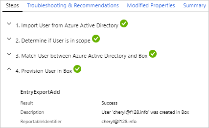

# What are the Microsoft Entra user provisioning logs?

Microsoft Entra ID integrates with several non-Microsoft services to provision users into your tenant. If you need to troubleshoot an issue with a provisioned user, you can use the information captured in the Microsoft Entra provisioning logs to help find a solution.

Two other activity logs are also available to help monitor the health of your tenant:

- **[Sign-ins](concept-sign-ins.md)** – Information about sign-ins and how your resources are used by your users.
- **[Audit](concept-audit-logs.md)** – Information about changes applied to your tenant such as users and group management or updates applied to your tenant’s resources.

This article gives you an overview of the logs that capture user provisioning through non-Microsoft services.

## What can you do with the provisioning logs?

You can use the provisioning logs to find answers to questions like:

- What groups were successfully created in ServiceNow?
- What users were successfully removed from Adobe?
- What users from Workday were successfully created in Active Directory?

> [!NOTE]
> Entries in the provisioning logs are system generated and can't be changed or deleted.

## What do the logs show?

The logs display the identity, action taken, source system, target system, and the status of the provisioning event. Other columns can be added for further troubleshooting, but the following details are standard.

:::image type="content" source="media/concept-provisioning-logs/provisioning-logs.png" alt-text="Screenshot of the provisioning logs showing a variety of details." lightbox="media/concept-provisioning-logs/provisioning-logs-expanded.png":::

- **Identity**: The display name and source ID of the identity being provisioned appear in this column.
- **Action**: Possible values include Create, Update, Delete, Disable, StagedDelete, and Other.
    - Examples of Other include if the source and target system details already match, so no change was made.
- **Source System** and **Target System**: Paired together, these details show which system the identity is coming from and where it's being provisioned.
- **Status**: Possible values include Success, Failure, Skipped, and Warning.
    - There are several scenarios that could trigger the Skipped status. For details on these scenarios, see [No users are being provisioned](../app-provisioning/application-provisioning-config-problem-no-users-provisioned.md)

Select an item from the provisioning logs to see more details about this item, such as the steps taken to provision the user and tips for troubleshooting issues. The details are grouped into four tabs.

- **Steps**: This tab outlines the steps taken to provision an object. Provisioning an object can include the following steps, but not all steps are applicable to all provisioning events.
  
  - Import the object.
  - Match the object between source and target.
  - Determine if the object is in scope.
  - Evaluate the object before synchronization.
  - Provision the object (create, update, delete, or disable).

  

- **Troubleshooting & Recommendations**: If there was an error, this tab provides the error code and reason. In many cases, a detailed description of the error is provided. Review this information to understand the issue and follow the guidance provided to resolve it. Review the following troubleshooting articles:
    - [Troubleshoot HR user creation issues](../app-provisioning/hr-user-creation-issues.md)
    - [Troubleshoot HR user update issues](../app-provisioning/hr-user-update-issues.md)
    - [Troubleshoot insufficient access rights error](../app-provisioning/insufficient-access-rights-error-troubleshooting.md)

- **Modified Properties**: If there were changes, this tab shows the old value and the new value.

- **Summary**: Provides an overview of what happened and identifiers for the object in the source and target systems.

## Using provisioning logs workbooks and Log Analytics

With the querying and alerting capabilities of Log Analytics and workbooks, you can create custom reports and alerts. To get started, you need to [create a Log Analytics workspace](tutorial-configure-log-analytics-workspace.md#create-a-log-analytics-workspace). Once you have a workspace, you can stream your logs to that workspace, which allows you to query and analyze the data in Log Analytics and workbooks.

For more information, see [Integrating provisioning logs with Azure Monitor logs](../app-provisioning/application-provisioning-log-analytics.md).

There are two workbook templates available for provisioning logs:

- **Provisioning Analysis** provides a high-level overview of the provisioning events in your tenant.
- **Provisioning Insights** provides details on events related to syncing users from other sources so you can see analyze these events in one place. For more information, see [Provisioning insights workbook](../app-provisioning/provisioning-workbook.md).

## Related content

- [Integrating provisioning logs with Azure Monitor logs](../app-provisioning/application-provisioning-log-analytics.md)
- [Reporting on automatic user account provisioning](../app-provisioning/check-status-user-account-provisioning.md)