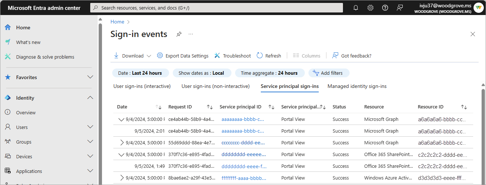

# What are service principal sign-ins in Microsoft Entra?

Unlike interactive and non-interactive user sign-ins, service principal sign-ins don't involve a user. Instead, they're sign-ins by any nonuser account, such as apps or service principals (except managed identity sign-in, which are in included only in the managed identity sign-in log). In these sign-ins, the app or service provides its own credential, such as a certificate or app secret to authenticate or access resources.

## Log details

**Report size:** Large  
**Examples:**

- A service principal uses a certificate to authenticate and access the Microsoft Graph.
- An application uses a client secret to authenticate in the OAuth Client Credentials flow.

You can't customize the fields shown in this report.

## How does it work?

To make it easier to digest the data in the service principal sign-in logs, service principal sign-in events are grouped. Sign-ins from the same entity under the same conditions are aggregated into a single row. You can expand the row to see all the different sign-ins and their different time stamps. Sign-ins are aggregated in the service principal report when the following data matches:

- Service principal name or ID
- Status
- IP address
- Resource name or ID