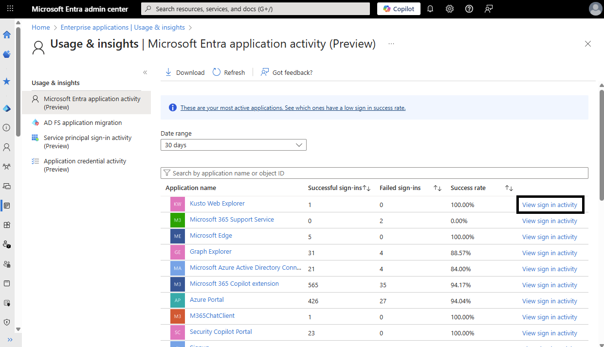
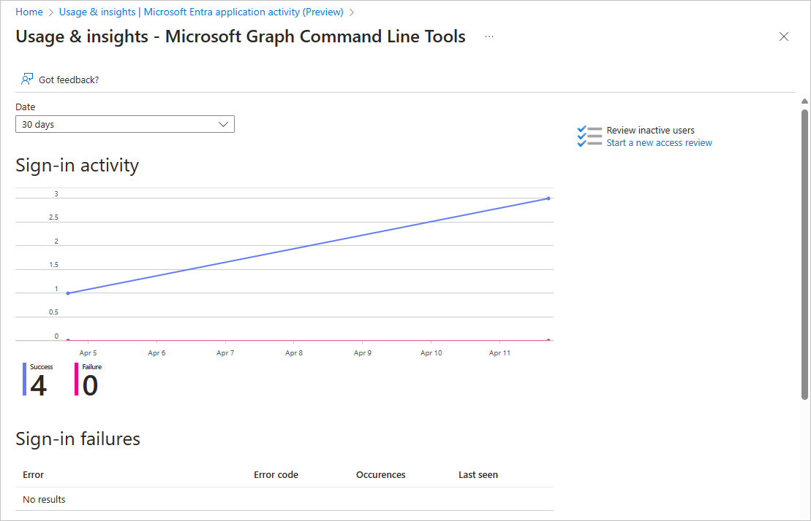

# What is the Usage and insights report in Microsoft Entra ID?

With the Microsoft Entra **Usage and insights** reports, you can get an application-centric view of your sign-in data. Usage & insights includes a report on authentication methods, service principal sign-ins, and application credential activity. You can find answers to the following questions:

* What are the top used applications in my organization?
* What applications have the most failed sign-ins?
* What are the top sign-in errors for each application?
* What was the date of the last sign-in for an application?

## Prerequisites

To access the data from Usage and insights you must have:

* A Microsoft Entra tenant
* A Microsoft Entra ID P1 or P2 license to view the sign-in data
* A user in the Reports Reader, Security Reader, or Security Administrator role.

## Access Usage and insights

You can access the Usage and insights reports from the Azure portal and using Microsoft Graph.

### [Microsoft Entra admin center](#tab/microsoft-entra-admin-center)

1. Sign in to the [Microsoft Entra admin center](https://entra.microsoft.com) as at least a [Reports Reader](~/identity/role-based-access-control/permissions-reference.md#reports-reader).
1. Browse to **Identity** > **Monitoring & health** > **Usage & insights**.

The **Usage & insights** reports are also available from the **Enterprise applications** area of Microsoft Entra ID. All users can access their own sign-ins at the [My Sign-Ins portal](https://mysignins.microsoft.com/security-info).

### [Microsoft Graph](#tab/microsoft-graph)

The reports can be viewed and managed using Microsoft Graph on the `/beta` endpoint in Graph Explorer.

1. Sign in to [Graph Explorer](https://aka.ms/ge).
1. Select **GET** as the HTTP method from the dropdown.
1. Set the API version to **beta**.

Refer to the section on each report in this article for the specific objects and parameters to include. For more information, see the [Microsoft Graph documentation for Identity and access reports](/graph/api/resources/report-identity-access).

---

## Microsoft Entra application activity (preview)
<a name='azure-ad-application-activity-preview'></a>

The **Microsoft Entra application activity (preview)** report shows the list of applications with one or more sign-in attempts. Any application activity during the selected date range appears in the report. The report allows you to sort by the number of successful sign-ins, failed sign-ins, and the success rate.

It's possible that activity for a deleted application might appear in the report if the activity took place during the selected date range *and* before the application was deleted. Other scenarios could include a user attempting to sign in to an application that doesn't have a service principal associated with the app. For these types of scenarios, you might need to review the audit logs or sign-in logs to investigate further.

To view the details of the sign-in activity for an application, select the **View sign-in activity** link for the application.



The sign-in activity graph uses interactive user sign-ins. Select a day in the application usage graph to see a detailed list of the sign-in activities for the application. This detailed list is actually the sign-in log with the filter set to the selected application and date. The details of any sign-in failures appear below the table.



### Application activity using Microsoft Graph

You can view the `applicationSignInSummary` or `applicationSignInDetailedSummary` of Microsoft Entra application activity with Microsoft Graph.

Add the following query to view the **sign-in summary**, then select the **Run query** button.

   ```http
   GET https://graph.microsoft.com/beta/reports/getAzureADApplicationSignInSummary(period='{period}')
   ```

Add the following query to view the **sign-in details**, then select the **Run query** button.

   ```http
   GET https://graph.microsoft.com/beta/reports/applicationSignInDetailedSummary/{id}
   ```

For more information, see [Application sign-in in Microsoft Graph](/graph/api/resources/applicationsigninsummary?view=graph-rest-beta&preserve-view=true).

## AD FS application activity

The **AD FS application activity** report in Usage & insights lists all Active Directory Federated Services (AD FS) applications in your organization that had an active user sign-in to authenticate in the last 30 days. These applications haven't been migrated to Microsoft Entra ID for authentication.

Viewing the AD FS application activity using Microsoft Graph retrieves a list of the `relyingPartyDetailedSummary` objects, which identifies the relying party to a particular Federation Service.

Add the following query, then select the **Run query** button.

   ```http
   GET https://graph.microsoft.com/beta/reports/getRelyingPartyDetailedSummary(period='{period}')
   ```

For more information, see [AD FS application activity in Microsoft Graph](/graph/api/resources/relyingpartydetailedsummary?view=graph-rest-beta&preserve-view=true).

## Authentication methods activity

The **Authentication methods activity** in Usage & insights displays visualizations of the different authentication methods used by your organization. The **Registration tab** displays statistics of users registered for each of your available authentication methods. Select the **Usage** tab at the top of the page to see actual usage for each authentication method.

You can also access several other reports and tools related to authentication.

Are you planning on running a registration campaign to nudge users to sign up for MFA? Use the **Registration campaign** option from the side menu to set up a registration campaign. For more information, see [Nudge users to set up Microsoft Authenticator](~/identity/authentication/how-to-mfa-registration-campaign.md).

Looking for the details of a user and their authentication methods? Look at the **User registration details** report from the side menu and search for a name or UPN. The default MFA method and other methods registered are displayed. You can also see if the user is capable of registering for one of the authentication methods.

Looking for the status of an authentication registration or reset event of a user? Look at the **Registration and reset events** report from the side menu and then search for a name or UPN. You can see the method used to attempt to register or reset an authentication method.

## Service principal sign-in activity (preview)

The Service principal sign-in activity (preview) report provides the last activity date for every service principal. The report provides you with information on the usage of the service principal - whether it was used as a client or resource app and whether it was used in an app-only or delegated context. The report shows the last time the service principal was used.

:::image type="content" source="media/concept-usage-insights-report/service-principal-sign-ins.png" alt-text="Screenshot of the service principal sign-in activity report." lightbox="media/concept-usage-insights-report/service-principal-sign-ins.png":::

Select the **View more details** link to locate the client and object IDs for the application and specific service principal sign-in activity.

:::image type="content" source="media/concept-usage-insights-report/service-principal-sign-in-activity-details.png" alt-text="Screenshot of the service principal sign-in activity details." lightbox="media/concept-usage-insights-report/service-principal-sign-in-activity-details.png":::

### Service principal sign-in activity using Microsoft Graph

The `servicePrincipalSignInActivity` reports can be viewed using Microsoft Graph.

Add the following query in Graph Explorer to retrieve the service principal sign-in activity, then select the **Run query** button.

```http
GET https://graph.microsoft.com/beta/reports/servicePrincipalSignInActivities/{id}
```

Example response:

```json
{
     "@odata.context": "https://graph.microsoft.com/beta/$metadata#reports/servicePrincipalSignInActivities",
     "id": "A1bC2dE3fH4iJ5kL6mN7oP8qR9sT0u",
     "appId": "00001111-aaaa-2222-bbbb-3333cccc4444",    
     "delegatedClientSignInActivity": {
          "lastSignInDateTime": "2021-01-01T00:00:00Z",
          "lastSignInRequestId": "2d245633-0f48-4b0e-8c04-546c2bcd61f5"
     },
     "delegatedResourceSignInActivity": {
          "lastSignInDateTime": "2021-02-01T00:00:00Z",
          "lastSignInRequestId": "d2b4c623-f930-42b5-9519-7851ca604b16"
     },
     "applicationAuthenticationClientSignInActivity": {
          "lastSignInDateTime": "2021-03-01T00:00:00Z",
          "lastSignInRequestId": "b71f24ec-f212-4306-b2ae-c229e15805ea"
     },
     "applicationAuthenticationResourceSignInActivity": {
          "lastSignInDateTime": "2021-04-01T00:00:00Z",
          "lastSignInRequestId": "53e6981f-2272-4deb-972c-c8272aca986d"
     },
     "lastSignInActivity": {
          "lastSignInDateTime": "2021-04-01T00:00:00Z",
          "lastSignInRequestId": "cd9733e8-d75a-468f-a63d-6e82bd48c05e"
     }
}
```

For more information, see [List service principal activity in Microsoft Graph](/graph/api/reportroot-list-serviceprincipalsigninactivities?view=graph-rest-beta&preserve-view=true).

## Application credential activity (preview)

The Application credential activity (preview) report provides the last credential activity date for every application credential. The report provides the credential type (certificate or client secret), the last used date, and the expiration date. With this report, you can view the expiration dates of all your applications in one place.

To view the details of the application credential activity, select the **View more details** link. These details include the application object, service principal, and resource IDs. You can also see if the credential origin is the application or the service principal.

:::image type="content" source="media/concept-usage-insights-report/app-credential-activity.png" alt-text="Screenshot of the app credential activity report." lightbox="media/concept-usage-insights-report/app-credential-activity.png":::

When you select the **View more details** link, you can see the application object ID and resource ID, in addition to the details visible in the report.

:::image type="content" source="media/concept-usage-insights-report/app-credential-activity-details.png" alt-text="Screenshot of the app credential activity details." lightbox="media/concept-usage-insights-report/app-credential-activity-details.png":::

### Application credential activity using Microsoft Graph

Application credential activity can be viewed and managed using Microsoft Graph on the `/beta` endpoint. You can get the application credential sign-in activity by entity `id`, `keyId`, and `appId` .

To get started, follow these instructions to work with `appCredentialSignInActivity` using Microsoft Graph in Graph Explorer.

1. Sign in to [Graph Explorer](https://aka.ms/ge).
1. Select **GET** as the HTTP method from the dropdown.
1. Set the API version to **beta**.
1. Add the following query to retrieve recommendations, then select the **Run query** button.

    ```http
    GET https://graph.microsoft.com/beta/reports/appCredentialSignInActivities/{id}
    ```

Example response:

```json
{
 "@odata.type": "#microsoft.graph.appCredentialSignInActivity",
 "id": "A1bC2dE3fH4iJ5kL6mN7oP8qR9sT0u",
 "keyId": "aaaaaaaa-0b0b-1c1c-2d2d-333333333333",
 "keyType": "certificate",
 "keyUsage": "sign",
 "appId": "11112222-bbbb-3333-cccc-4444dddd5555",
 "appObjectId": "aaaaaaaa-0000-1111-2222-bbbbbbbbbbbb",
 "servicePrincipalObjectId": "aaaaaaaa-0000-1111-2222-bbbbbbbbbbbb",
 "resourceId": "a0a0a0a0-bbbb-cccc-dddd-e1e1e1e1e1e1",
 "credentialOrigin": "application",
 "expirationDate": "2021-04-01T21:36:48-8:00",
 "signInActivity": {
     "lastSignInDateTime": "2021-04-01T00:00:00-8:00",
     "lastSignInRequestId": "b0a282a3-68ec-4ec8-aef0-290ed4350271"
 }
}   
```

For more information, see [Application credential activity in Microsoft Graph](/graph/api/resources/appcredentialsigninactivity?view=graph-rest-beta&preserve-view=true).
