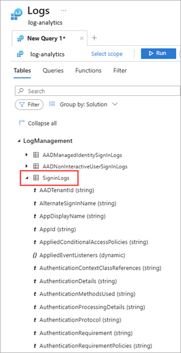

# Analyze Microsoft Entra activity logs with Log Analytics

After you [integrate Microsoft Entra activity logs with Azure Monitor logs](./howto-integrate-activity-logs-with-azure-monitor-logs.yml), you can use the power of Log Analytics and Azure Monitor logs to gain insights into your environment.

* Compare your Microsoft Entra sign-in logs against security logs published by Microsoft Defender for Cloud.
  
* Troubleshoot performance bottlenecks on your application’s sign-in page by correlating application performance data from Azure Application Insights.

* Analyze the Identity Protection risky users and risk detections logs to detect threats in your environment.

This article describes to analyze the Microsoft Entra activity logs in your Log Analytics workspace. 

## Prerequisites

To analyze activity logs with Log Analytics, you need:

* A working Microsoft Entra tenant with a Microsoft Entra ID P1 or P2 license associated with it.
* A Log Analytics workspace *and* access to that workspace
* The appropriate roles for Azure Monitor *and* Microsoft Entra ID

### Log Analytics workspace

You must create a [Log Analytics workspace](/azure/azure-monitor/logs/quick-create-workspace). There are several factors that determine access to Log Analytics workspaces. You need the right roles for the workspace *and* the resources sending the data.

For more information, see [Manage access to Log Analytics workspaces](/azure/azure-monitor/logs/manage-access).

### Azure Monitor roles

Azure Monitor provides [two built-in roles](/azure/azure-monitor/roles-permissions-security#monitoring-reader) for viewing monitoring data and editing monitoring settings. Azure role-based access control (RBAC) also provides two Log Analytics built-in roles that grant similar access.

* **View**:
  * Monitoring Reader
  * Log Analytics Reader

* **View and modify settings**:
  * Monitoring Contributor
  * Log Analytics Contributor

For more information on the Azure Monitor built-in roles, see [Roles, permissions, and security in Azure Monitor](/azure/azure-monitor/roles-permissions-security#monitoring-reader).

For more information on the Log Analytics roles, see [Azure built-in roles](/azure/role-based-access-control/built-in-roles#log-analytics-contributor)

### Microsoft Entra roles
<a name='azure-ad-roles'></a>

Read only access allows you to view Microsoft Entra ID log data inside a workbook, query data from Log Analytics, or read logs in the Microsoft Entra admin center. Update access adds the ability to create and edit diagnostic settings to send Microsoft Entra data to a Log Analytics workspace.

* **Read**:
  * Reports Reader
  * Security Reader
  * Global Reader

* **Update**:
  * Security Administrator

For more information on Microsoft Entra built-in roles, see [Microsoft Entra built-in roles](../role-based-access-control/permissions-reference.md).

## Access Log Analytics

To view the Microsoft Entra ID Log Analytics, you must already be sending your activity logs from Microsoft Entra ID to a Log Analytics workspace. This process is covered in the [How to integrate activity logs with Azure Monitor](howto-integrate-activity-logs-with-azure-monitor-logs.yml) article.


1. Sign in to the [Microsoft Entra admin center](https://entra.microsoft.com) as at least a [Reports Reader](../role-based-access-control/permissions-reference.md#reports-reader).

1. Browse to **Entra ID** > **Monitoring & health** > **Log Analytics**. A default search query runs.

    

1. Expand the **LogManagement** category to view the list of log related queries.

1. Select or hover over the name of a query to view a description and other useful details.

1. Expand a query from the list to view the schema.

    

## Query activity logs

You can run queries against the activity logs being routed to a Log Analytics workspace. For example, to get a list of applications with the most sign-ins from last week, enter the following query and select the **Run** button.

```kusto
SigninLogs 
| where CreatedDateTime >= ago(7d)
| summarize signInCount = count() by AppDisplayName
| sort by signInCount desc 
```

To find risky sign-in events, use the following query:

```kusto
SigninLogs
| where RiskState contains "atRisk"
```

To get the top audit events over the last week, use the following query:

```kusto
AuditLogs 
| where TimeGenerated >= ago(7d)
| summarize auditCount = count() by OperationName 
| sort by auditCount desc 
```

To summarize the count of provisioning events per day, by action:
```kusto
AADProvisioningLogs
| where TimeGenerated > ago(7d)
| summarize count() by Action, bin(TimeGenerated, 1d)
```

Take 100 provisioning events and project key properties:
```kusto
AADProvisioningLogs
| extend SourceIdentity = parse_json(SourceIdentity)
| extend TargetIdentity = parse_json(TargetIdentity)
| extend ServicePrincipal = parse_json(ServicePrincipal)
| where tostring(SourceIdentity.identityType) == "Group"
| project tostring(ServicePrincipal.Id), tostring(ServicePrincipal.Name), ModifiedProperties, JobId, Id, CycleId, ChangeId, Action, SourceIdentity.identityType, SourceIdentity.details, TargetIdentity.identityType, TargetIdentity.details, ProvisioningSteps
| take 100
```

## Related content

* [Get started with queries in Azure Monitor logs](/azure/azure-monitor/logs/get-started-queries)
* [Create and manage alert groups in the Azure portal](/azure/azure-monitor/alerts/action-groups)
* [Create a new alert rule](/azure/azure-monitor/alerts/alerts-create-new-alert-rule)