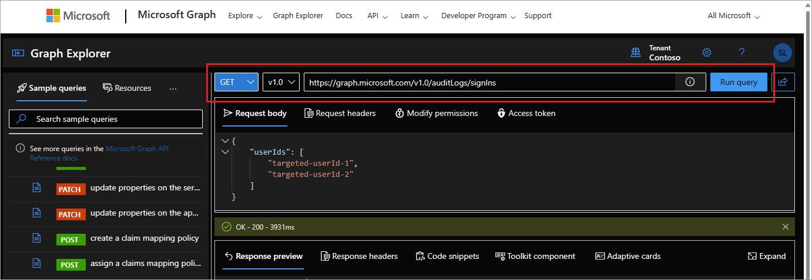

# How to analyze activity logs with Microsoft Graph

The Microsoft Entra [reporting APIs](/graph/api/resources/azure-ad-auditlog-overview) provide you with programmatic access to the data through a set of REST APIs. You can call these APIs from many programming languages and tools.

This article describes how to analyze Microsoft Entra activity logs with Microsoft Graph Explorer and Microsoft Graph PowerShell.

## Prerequisites

- A working Microsoft Entra tenant with a Microsoft Entra ID P1 or P2 license associated with it.
- To consent to the required permissions, you need the [Privileged Role Administrator](../../identity/role-based-access-control/permissions-reference.md#privileged-role-administrator).

## Access reports using Microsoft Graph Explorer

With all the prerequisites configured, you can run activity log queries in Microsoft Graph. The Microsoft Graph API isn't designed for pulling large amounts of activity data. Pulling large amounts of activity data using the API might lead to issues with pagination and performance. For more information on Microsoft Graph queries for activity logs, see [Activity reports API overview](/graph/api/resources/azure-ad-auditlog-overview).

1. Start [Microsoft Graph Explorer tool](https://aka.ms/ge).

1. Select your profile and then select **Modify permissions**.

1. Consent to the following required permissions:
    - `AuditLog.Read.All`
    - `Directory.Read.All`

1. Use one of the following queries to start using Microsoft Graph for accessing activity logs:
    - GET `https://graph.microsoft.com/v1.0/auditLogs/directoryAudits`
    - GET `https://graph.microsoft.com/v1.0/auditLogs/signIns`
    - GET `https://graph.microsoft.com/v1.0/auditLogs/provisioning`
    - GET `https://graph.microsoft.com/beta/auditLogs/signUps`

    

### Fine-tune your queries

To search for specific activity log entries, use the $filter and createdDateTime query parameters with one of the available properties. Some of the following queries use the `beta` endpoint. The beta endpoint is subject to change and isn't recommended for production use.

- [Sign-in log properties](/graph/api/resources/signin#properties)
- [Sign-up log properties (preview)](/graph/api/resources/selfservicesignup#properties)
- [Audit log properties](/graph/api/resources/directoryaudit#properties)

#### Sample sign-in queries

Try using the following queries for sign-in activity:

- For sign-in attempts where Conditional Access failed:
  - GET `https://graph.microsoft.com/v1.0/auditLogs/signIns?$filter=conditionalAccessStatus eq 'failure'`
  - Consider using a date filter so the request doesn't time out.

- To find sign-ins to a specific application during a specific time frame:
  - GET `https://graph.microsoft.com/v1.0/auditLogs/signIns?$filter=(createdDateTime ge 2024-01-13T14:13:32Z and createdDateTime le 2024-01-14T17:43:26Z) and appId eq 'APP ID'`

- For non-interactive sign-ins:
  - GET `https://graph.microsoft.com/beta/auditLogs/signIns?$filter=(createdDateTime ge 2024-01-13T14:13:32Z and createdDateTime le 2024-01-14T17:43:26Z) and signInEventTypes/any(t: t eq 'nonInteractiveUser')`

- For service principal sign-ins: 
  - GET `https://graph.microsoft.com/beta/auditLogs/signIns?$filter=(createdDateTime ge 2024-01-13T14:13:32Z and createdDateTime le 2024-01-14T17:43:26Z) and signInEventTypes/any(t: t eq 'servicePrincipal')`

- For managed identity sign-ins: 
  - GET `https://graph.microsoft.com/beta/auditLogs/signIns?$filter=(createdDateTime ge 2024-01-13T14:13:32Z and createdDateTime le 2024-01-14T17:43:26Z) and signInEventTypes/any(t: t eq 'managedIdentity')`

- To get the authentication method of a user:
  - GET `https://graph.microsoft.com/beta/users/{userObjectId}/authentication/methods`
  - Requires `UserAuthenticationMethod.Read.All` permission

- To see the user registration details report:
  - GET `https://graph.microsoft.com/beta/reports/authenticationMethods/userRegistrationDetails`
  - Requires `UserAuthenticationMethod.Read.All` permission

- For the registration details of specific user:
  - GET `https://graph.microsoft.com/beta/reports/authenticationMethods/userRegistrationDetails/{userId}`
  - Requires `UserAuthenticationMethod.Read.All` permission

#### Sample sign-up queries (preview)

Try using the following queries for sign-up activity in your [external tenant](../../external-id/tenant-configurations.md):

- To find sign-up attempts that failed or were interrupted during a specific step, such as user object creation:
  - GET `https://graph.microsoft.com/beta/auditLogs/signUps?$filter=status/errorCode ne 0 and signUpStage eq 'userCreation'`

- To find sign-up attempts that failed during email validation:

  - GET `https://graph.microsoft.com/beta/auditLogs/signUps?$filter=status/errorCode eq 1002013 and signUpStage eq 'credentialValidation'`

   > [!NOTE]
   > Error code 1002013 indicates an expected (and successful) interrupt of the sign-up flow. [Learn more](howto-troubleshoot-sign-up-errors.md#sign-up-error-codes)

- For sign-ups during a date range:
  - GET `https://graph.microsoft.com/beta/auditLogs/signUps?&$filter=(createdDateTime ge 2024-01-13T14:13:32Z and createdDateTime le 2024-01-14T17:43:26Z)`

- For sign-ups for a specific application:
  - GET `https://graph.microsoft.com/beta/auditLogs/signUps?$filter=appId eq 'AppId'`

- For local account sign-ups:
  - GET `https://graph.microsoft.com/beta/auditLogs/signUps?$filter=signUpIdentityProvider eq 'Email OTP' or signUpIdentityProvider eq 'Email Password'`

- For social account sign-ups (Google in this example):
  - GET `https://graph.microsoft.com/beta/auditLogs/signUps?$filter=signUpIdentityProvider eq ‘Google'`

- To see entries for a specific user, for example `user@contoso.com`:
  - GET `https://graph.microsoft.com/beta/auditLogs/signUps?$filter=signUpIdentity/signUpIdentifier eq 'user@contoso.com'`

- To find entries matching a specific correlation ID:  
  - GET `https://graph.microsoft.com/beta/auditLogs/signUps?$filter=correlationId eq 'CorrelationId'`

- To find the sign-in log entries corresponding to a specific sign-up using the correlation ID:
  - GET `https://graph.microsoft.com/v1.0/auditLogs/signIns?$filter=correlationId eq 'CorrelationId'`

### Related APIs

Once you're familiar with the standard sign-in and audit logs, try exploring these other APIs:

- [Identity Protection APIs](/graph/api/resources/identityprotection-overview)
- [Provisioning logs API](/graph/api/resources/provisioningobjectsummary)

## Access reports using Microsoft Graph PowerShell

You can use PowerShell to access the Microsoft Entra reporting API. For more information, see [Microsoft Graph PowerShell overview](/powershell/microsoftgraph/overview). 

Microsoft Graph PowerShell cmdlets:

- **Audit logs:** `Get-MgAuditLogDirectoryAudit`
- **Sign-in logs:** `Get-MgAuditLogSignIn`
- **Provisioning logs:** `Get-MgAuditLogProvisioning`
- Explore the full list of [reporting-related Microsoft Graph PowerShell cmdlets](/powershell/module/microsoft.graph.reports/).

## Common errors

**Error: Neither tenant is B2C or tenant doesn't have premium license**: Accessing sign-in reports requires a Microsoft Entra ID P1 or P2 license. If you see this error message while accessing sign-ins, make sure that your tenant is licensed with a Microsoft Entra ID P1 license.

**Error: User isn't in the allowed roles**: If you see this error message while trying to access audit logs or sign-ins using the API, make sure that your account is part of the **Security Reader** or **Reports Reader** role in your Microsoft Entra tenant.

**Error: Application missing Microsoft Entra ID 'Read directory data' or 'Read all audit log data' permission**: The application must have either the `AuditLog.Read.All` or `Directory.Read.All` permission to access the activity logs with Microsoft Graph.

## Related content

- [Get started with Microsoft Entra ID Protection and Microsoft Graph](../../id-protection/howto-identity-protection-graph-api.md)
- [Audit API reference](/graph/api/resources/directoryaudit)
- [API signIn reference](/graph/api/resources/signin)
- [API signUp reference](/graph/api/resources/selfservicesignup)
