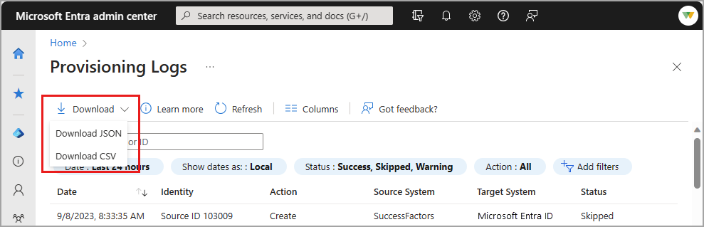

# How to download and analyze the Microsoft Entra provisioning logs

The Microsoft Entra provisioning logs provide details about the provisioning events that occur in your tenant. You can use the information captured in the provisioning logs to help troubleshoot issues with a provisioned user.

This article describes the options for downloading the provisioning logs from the Microsoft Entra admin center and how to analyze the logs. Error codes and special considerations are also included.

## Prerequisites

To view the provisioning logs, your tenant must have a Microsoft Entra ID P1 or P2 license associated with it. To upgrade your Microsoft Entra edition, see [Getting started with Microsoft Entra ID P1 or P2](~/fundamentals/get-started-premium.md).

Application owners can view logs for their own applications. The following roles are required to view provisioning logs:

- Reports Reader
- Security Reader
- Security Operator
- Security Administrator
- Application Administrator
- Cloud Application Administrator
- Users in a custom role with the [provisioningLogs permission](../role-based-access-control/custom-enterprise-app-permissions.md#full-list-of-permissions)

## How to view the provisioning logs

There are several ways to view or analyze the Provisioning logs:

- View in the Microsoft Entra admin center.
- Stream logs to [Azure Monitor](../app-provisioning/application-provisioning-log-analytics.md) through diagnostic settings.
- Analyze logs through [Workbook](howto-use-workbooks.md) templates.
- Access logs programmatically through the [Microsoft Graph API](/graph/api/resources/provisioningobjectsummary).
- [Download the logs](howto-download-logs.md) as a CSV or JSON file.

[!INCLUDE [portal update](../../includes/portal-update.md)]

To access the logs in the Microsoft Entra admin center:

1. Sign in to the [Microsoft Entra admin center](https://entra.microsoft.com) as at least a [Reports Reader](../role-based-access-control/permissions-reference.md#reports-reader).
1. Browse to **Identity** > **Monitoring & health** > **Provisioning logs**.

## How to download the provisioning logs

To download the provisioning logs, select **Download** from the **Provisioning logs** page. Set the filters as specific as possible to reduce the size and time of the download.



### CSV format

The CSV download includes three files:

- **ProvisioningLogs**: Downloads all the logs, except the provisioning steps and modified properties.
- **ProvisioningLogs_ProvisioningSteps**: Contains the provisioning steps and the change ID. You can use the change ID to join the event with the other two files.
- **ProvisioningLogs_ModifiedProperties**: Contains the attributes that were changed and the change ID. You can use the change ID to join the event with the other two files.

### JSON format

To open the JSON file, use a text editor such as [Microsoft Visual Studio Code](https://aka.ms/vscode). Visual Studio Code makes the file easier to read by providing syntax highlighting. You can also open the JSON file by using browsers in an uneditable format, such as [Microsoft Edge](https://aka.ms/msedge).

#### Prettify the JSON file

The JSON file is downloaded in a format to reduce the size of the download. This format can make the payload hard to read. To prettify the file, there are two options:

- Use [Visual Studio Code to format the JSON](https://code.visualstudio.com/docs/languages/json#_formatting).

- Use PowerShell to format the JSON. This script produces a JSON output in a format that includes tabs and spaces:

  ` $JSONContent = Get-Content -Path "<PATH TO THE PROVISIONING LOGS FILE>" | ConvertFrom-JSON`

  `$JSONContent | ConvertTo-Json > <PATH TO OUTPUT THE JSON FILE>`

#### Parse the JSON file

You can use any programming language that you're comfortable with. The following examples are in PowerShell.

- [Read the JSON file](/powershell/module/microsoft.powershell.utility/convertfrom-json):

    ` $JSONContent = Get-Content -Path "<PATH TO THE PROVISIONING LOGS FILE>" | ConvertFrom-JSON`

Now you can parse the data according to your scenario. Here are a couple of examples:

- Output all job IDs in the JSON file:

  `foreach ($provitem in $JSONContent) { $provitem.jobId }`

- Output all change IDs for events where the action was "create":

  `foreach ($provitem in $JSONContent) { `
  `   if ($provItem.action -eq 'Create') {`
  `       $provitem.changeId `
  `   }`
  `}`

## What you should know

Here are some tips and considerations for analyzing the provisioning logs:

- The Microsoft Entra admin center stores reported provisioning data for 30 days if you have a premium edition and 7 days if you have a free edition. You can route the provisioning logs to [Azure Monitor logs](../app-provisioning/application-provisioning-log-analytics.md) for retention beyond 30 days.

- You can use the change ID attribute as unique identifier, which can be helpful when you're interacting with product support, for example.

- You might see skipped events for users who aren't in scope. 
  - Example 1: If the scope is set to `all users and groups` and setup scoping filters, you might see skipped logs for users that don't meet the scoping criteria.   
  - Example 2: If the scope is set to `assigned users and groups`, you might continue to see users in the logs as skipped, even though they aren't assigned to the application. The way the provisioning service receives changes from the directory causes these users to appear. 
 
- The provisioning logs don't show role imports (applies to Amazon Web Services, Salesforce, and Zendesk). You can find the logs for role imports in the audit logs.

## Error codes

Use the following table to better understand how to resolve errors that you find in the provisioning logs.

| Error code | Description |
|---|---|
| Conflict,<br>EntryConflict | Correct the conflicting attribute values in either Microsoft Entra ID or the application.<br><br>Or, review your matching attribute configuration if the conflicting user account was supposed to be matched and taken over. For more information on configuring matching attributes, see  [Customize user provisioning attribute-mappings for SaaS applications in Microsoft Entra ID](../app-provisioning/customize-application-attributes.md). |
| TooManyRequests |The target app rejected this attempt to update the user because the app is receiving too many requests. There's nothing to do. This attempt is automatically retried and Microsoft was notified of this issue.|
| InternalServerError | The target app returned an unexpected error. A service issue with the target application might be preventing it from working. This attempt is automatically retried in 40 minutes.|
| InsufficientRights,<br>MethodNotAllowed,<br>NotPermitted,<br>Unauthorized | Microsoft Entra ID authenticated with the target application but wasn't authorized to perform the update. Review any instructions that the target application provided, along with the respective application. For more information, see [Tutorials for integrating applications with Microsoft Entra ID](../saas-apps/tutorial-list.md). |
| UnprocessableEntity | The target application returned an unexpected response. The configuration of the target application might not be correct, or a service issue with the target application might be preventing it from working. |
| WebExceptionProtocolError | An HTTP protocol error occurred while connecting to the target application. There's nothing to do. This attempt is automatically retried in 40 minutes. |
| InvalidAnchor | A user that was previously created or matched by the provisioning service no longer exists. Ensure that the user exists. To force a new matching of all users, use the Microsoft Graph API to [restart the job](/graph/api/synchronization-synchronizationjob-restart?tabs=http&view=graph-rest-beta&preserve-view=true).<br><br>Restarting provisioning triggers an initial cycle, which can take time to complete. Restarting provisioning also deletes the cache that the provisioning service uses to operate. That means all users and groups in the tenant must be evaluated again, and certain provisioning events might be dropped. |
| NotImplemented | The target app returned an unexpected response. The configuration of the app might not be correct, or a service issue with the target app might be preventing it from working. Review any instructions that the target application provided, along with the respective application. For more information, see [Tutorials for integrating applications with Microsoft Entra ID](../saas-apps/tutorial-list.md). |
| MandatoryFieldsMissing,<br>MissingValues |The user couldn't be created because required values are missing. Correct the missing attribute values in the source record, or review your matching attribute configuration to ensure that the required fields aren't omitted. For more information, see [Customize user provisioning attribute-mappings for SaaS applications in Microsoft Entra ID](../app-provisioning/customize-application-attributes.md). |
| SchemaAttributeNotFound |The operation couldn't be performed because an attribute was specified that doesn't exist in the target application. Ensure that your configuration is correct by referring to  [Customize user provisioning attribute-mappings for SaaS applications in Microsoft Entra ID](../app-provisioning/customize-application-attributes.md). |
| InternalError | An internal service error occurred within the Microsoft Entra provisioning service. There's nothing to do. This attempt is automatically retried in 40 minutes. |
| InvalidDomain | The operation couldn't be performed because an attribute value contains an invalid domain name. Update the domain name on the user or add it to the permitted list in the target application. |
| Timeout | The operation couldn't be completed because the target application took too long to respond. There's nothing to do. This attempt is automatically retried in 40 minutes. |
| LicenseLimitExceeded | The user couldn't be created in the target application because there are no available licenses for this user. Procure more licenses for the target application.<br><br>Or, review your user assignments and attribute mapping configuration to ensure that the correct users are assigned with the correct attributes.|
| DuplicateTargetEntries | The operation couldn't be completed because more than one user in the target application was found with the configured matching attributes. Remove the duplicate user from the target application, or reconfigure your attribute mappings. For more information, see [Customize user provisioning attribute-mappings for SaaS applications in Microsoft Entra ID](../app-provisioning/customize-application-attributes.md). |
| DuplicateSourceEntries | The operation couldn't be completed because more than one user was found with the configured matching attributes. Remove the duplicate user, or reconfigure your attribute mappings. For more information, see [Customize user provisioning attribute-mappings for SaaS applications in Microsoft Entra ID](../app-provisioning/customize-application-attributes.md). |
| ImportSkipped | When each user is evaluated, the system tries to import the user from the source system. This error commonly occurs when the user who's being imported is missing the matching property defined in your attribute mappings. Without a value present on the user object for the matching attribute, the system can't evaluate scoping, matching, or export changes. The presence of this error doesn't indicate that the user is in scope, because you haven't yet evaluated scoping for the user. |
| EntrySynchronizationSkipped | The provisioning service successfully queried the source system and identified the user. No further action was taken on the user and they were skipped. The user might have been out of scope or already existed in the target system with no further changes required. |
| SystemForCrossDomainIdentity<br>ManagementMultipleEntriesInResponse | A GET request to retrieve a user or group received multiple users or groups in the response. The system expects to receive only one user or group in the response. For example, if you do a [GET Group request](../app-provisioning/use-scim-to-provision-users-and-groups.md#get-group) to retrieve a group, provide a filter to exclude members, and your System for Cross-Domain Identity Management (SCIM) endpoint returns the members, this error appears. |
| SystemForCrossDomainIdentity<br>ManagementServiceIncompatible | The Microsoft Entra provisioning service is unable to parse the response from the non-Microsoft application. Work with the application developer to ensure that the SCIM server is compatible with the [Microsoft Entra SCIM client](../app-provisioning/use-scim-to-provision-users-and-groups.md#understand-the-azure-ad-scim-implementation). |
| SchemaPropertyCanOnlyAcceptValue | The property in the target system can only accept one value, but the property in the source system has multiple. Ensure that you either map a single-valued attribute to the property that is throwing an error, update the value in the source to be single-valued, or remove the attribute from the mappings. |

## Error codes for cross-tenant synchronization

Use the following table to better understand how to resolve errors that you find in the provisioning logs for [cross-tenant synchronization](../multi-tenant-organizations/cross-tenant-synchronization-configure.md).

| Error code | Cause | Solution |
| --- | --- | --- |
| AzureActiveDirectoryCannot<br/>UpdateObjectsOriginated<br/>InExternalService |The source of authority for the user is Exchange Online. The provisioning service can't update one or more exchange attributes on the user (ex: extensionAttribute 1 - 15). This impacts users that existed in the target tenant when the dirSyncEnabled property changed from "True" to "False." | Update the attribute directly in the target tenant's [exchange online](/powershell/module/exchange/set-mailuser?view=exchange-ps&preserve-view=true). For example: ```Set-MailUser -Identity CloudMailUser5 -CustomAttribute2 "Updated with EXO PowerShell"``` |
| Microsoft Entra ID<br/>CannotUpdateObjectsOriginated<br/>InExternalService | The synchronization engine couldn't update one or more user properties in the target tenant.<br/><br/>The operation failed in Microsoft Graph API because of Source of Authority (SOA) enforcement. Currently, the following properties show up in the list:<br/>`Mail`<br/>`showInAddressList` | In some cases (for example when `showInAddressList` property is part of the user update), the synchronization engine might automatically retry the (user) update without the offending property. Otherwise, you need to update the property directly in the target tenant. |
| AzureDirectory<br/>B2BManagementPolicy<br/>CheckFailure | The cross-tenant synchronization policy allowing automatic redemption failed.<br/><br/>The synchronization engine checks to ensure that the administrator of the target tenant created an inbound cross-tenant synchronization policy allowing automatic redemption. The synchronization engine also checks if the administrator of the source tenant enabled an outbound policy for automatic redemption. | Ensure that the automatic redemption setting was enabled for both the source and target tenants. For more information, see [Automatic redemption setting](../multi-tenant-organizations/cross-tenant-synchronization-overview.md#automatic-redemption-setting). |
| Microsoft Entra ID<br/>QuotaLimitExceeded | The number of objects in the tenant exceeds the directory limit.<br/><br/>Microsoft Entra ID has limits for the number of objects that can be created in a tenant. | Check whether the quota can be increased. For information about the directory limits and steps to increase the quota, see [Microsoft Entra service limits and restrictions](../users/directory-service-limits-restrictions.md). |
| InvitationCreationFailure | The Microsoft Entra provisioning service attempted to invite the user in the target tenant. That invitation failed.| Further investigation likely requires contacting support.|
| InvitationCreationFailureUserAccountDisabled | The Microsoft Entra provisioning service attempted to invite the user in the target tenant. That invitation failed.| The user exists in the target tenant, but the account is disabled and invitation is pending. Enable the user account in the target tenant and attempt to provision the user again.|
| Microsoft Entra ID<br/>Forbidden | External collaboration settings blocked invitations.|Navigate to user settings and ensure that [external collaboration settings](~/external-id/external-collaboration-settings-configure.md) are permitted.|
| InvitationCreation<br/>FailureInvalidPropertyValue | Potential causes:<br/>* The Primary SMTP Address is an invalid value.<br/>* UserType isn't guest or member<br/>* Group email Address isn't supported | Potential solutions:<br/>* The Primary SMTP Address has an invalid value. Resolving this issue likely requires updating the mail property of the source user. For more information, see [Prepare for directory synchronization to Microsoft 365](https://aka.ms/DirectoryAttributeValidations)<br/>* Ensure that the userType property is provisioned as type guest or member. Check your attribute mappings to understand how the userType attribute is mapped.<br/>* The email address of the user matches with the email address of a group in the tenant. Update the email address for one of the two objects.|
| InvitationCreation<br/>FailureAmbiguousUser| The invited user has a proxy address that matches an internal user in the target tenant. The proxy address must be unique. | To resolve this error, delete the existing internal user in the target tenant or remove this user from sync scope.|
| Microsoft Entra ID<br/>CannotUpdateObjects<br/>MasteredOnPremises| If the user in the target tenant was originally synchronized from AD to Microsoft Entra ID and converted to an external user, the source of authority is still on-premises and the user can't be updated.| The user can't be updated with cross-tenant synchronization. |
| EntityTypeNotSupported|Groups can be used to determine what users are in scope for provisioning. Groups objects cannot be synchronized. | No customer action is required. This is a skipped event. If you are using the provisioning on-demand, ensure that you choose a user rather than a group to provision.|

## Next steps

- [Check the status of user provisioning](../app-provisioning/application-provisioning-when-will-provisioning-finish-specific-user.md)
- [Problem configuring user provisioning to a Microsoft Entra Gallery application](../app-provisioning/application-provisioning-config-problem.md)
- [Graph API for provisioning logs](/graph/api/resources/provisioningobjectsummary)
