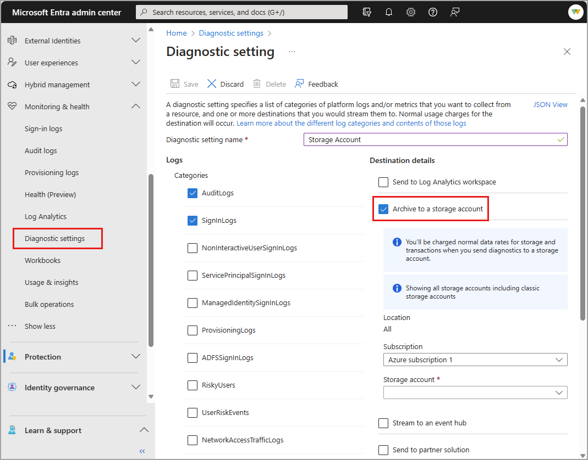

# How to archive Microsoft Entra activity logs to an Azure storage account

If you need to store Microsoft Entra activity logs for longer than the [default retention period](reference-reports-data-retention.md), you can archive your logs to a storage account. We recommend that you use a general storage account and not a Blob storage account. For storage pricing information, see the [Azure Storage pricing calculator](https://azure.microsoft.com/pricing/calculator/?service=storage).

## Prerequisites

To use this feature, you need:

* An Azure subscription. If you don't have an Azure subscription, you can [sign up for a free trial](https://azure.microsoft.com/free/).
* An Azure storage account you have `ListKeys` permissions for. Learn how to [create a storage account](/azure/storage/common/storage-account-create).
* A user who's a [Security Administrator](../role-based-access-control/permissions-reference.md#security-administrator) for the Microsoft Entra tenant.

## Archive logs to an Azure storage account

[!INCLUDE [diagnostic-settings-include](../../includes/diagnostic-settings-include.md)]

6. Under **Destination Details** select the **Archive to a storage account** check box.

7. Select the appropriate **Subscription** and **Storage account** from the menus.

    

  > [!NOTE]
  > The Diagnostic settings storage retention feature has been deprecated. If you're editing a diagnostic setting created when the retention option was available, those fields are still visible. For details on this change, see [**Migrate from diagnostic settings storage retention to Azure Storage lifecycle management**](/azure/azure-monitor/essentials/migrate-to-azure-storage-lifecycle-policy).
 
8. Select **Save** to save the setting.

9. Close the window to return to the diagnostic settings page.

## Related content

* [Manually download activity logs](howto-download-logs.md)
* [Integrate activity logs with Azure Monitor logs](howto-integrate-activity-logs-with-azure-monitor-logs.yml)
* [Stream logs to an event hub](howto-stream-logs-to-event-hub.md)
