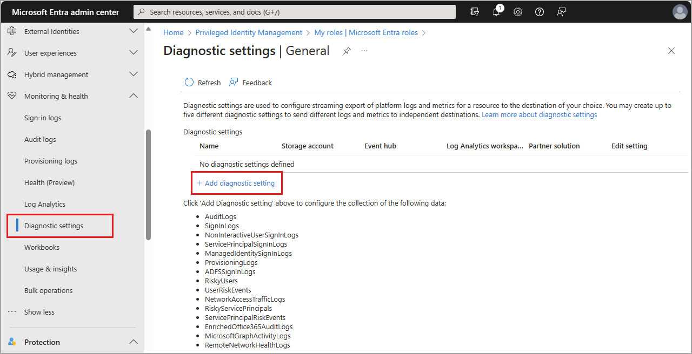
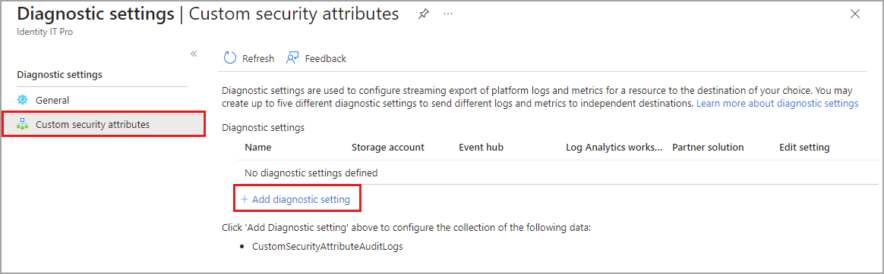
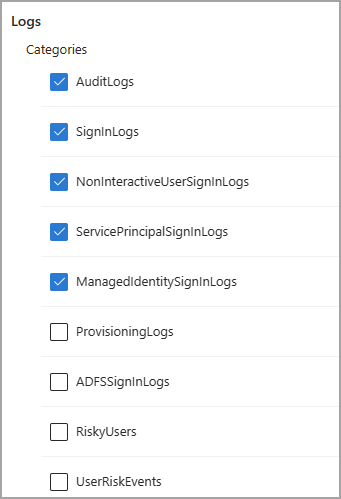
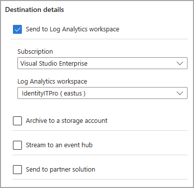
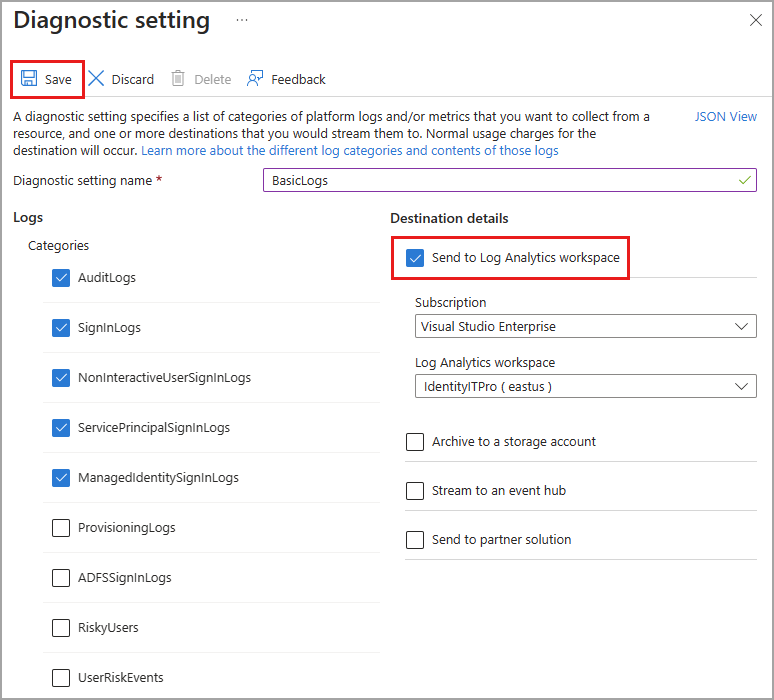

# Configure Microsoft Entra diagnostic settings for activity logs

Using **diagnostic settings** in Microsoft Entra ID, you can integrate logs with Azure Monitor, stream logs to an event hub, or archive logs to a storage account. You can create multiple diagnostic settings to send activity logs to different destinations. 

This article provides the steps to configure Microsoft Entra diagnostic settings for activity logs.

## Prerequisites

To configure diagnostic settings, you need:

- An Azure subscription. If you don't have an Azure subscription, you can [sign up for a free trial](https://azure.microsoft.com/free/).
- **Security Administrator** access to create general diagnostic settings for the Microsoft Entra tenant.
- **Attribute Log Administrator** access to create diagnostic settings for [custom security attribute](../../fundamentals/custom-security-attributes-overview.md) logs.
- A destination that is already set up. For example, if you want to stream logs to an event hub, you need to create the event hub before you can configure the diagnostic settings.

## How to access diagnostic settings

This article provides the steps to access diagnostic settings for the Microsoft Entra logs. If you need to configure diagnostic settings for Azure Monitor or Azure resources outside of Microsoft Entra ID, see [Diagnostic settings in Azure Monitor](/azure/azure-monitor/essentials/diagnostic-settings).

1. Sign in to the [Microsoft Entra admin center](https://entra.microsoft.com) as at least a [Security Administrator](../role-based-access-control/permissions-reference.md#security-administrator).
1. Browse to **Identity** > **Monitoring & health** > **Diagnostic settings**. The **General** settings appear by default.
1. Any existing diagnostic settings appear in the table. Select **edit settings** to change an existing setting, or select **Add diagnostic setting** to create a new setting.

    

### Custom security attributes

The custom security attributes logs are a subset of the standard audit logs. You must have the **Attribute Log Administrator** role active to configure diagnostic settings for the custom security attributes. For more information, see [Custom security attributes overview](../../fundamentals/custom-security-attributes-overview.md).

To configure diagnostic settings for the custom security attribute audit logs, select **Custom security attributes**. The process to configure diagnostic settings is the same for both categories of logs.

> [!TIP]
> Microsoft recommends that you keep your custom security attribute audit logs separate from your directory audit logs so that attribute assignments are not revealed inadvertently.

## Select the logs and destination

When you create or edit a diagnostic setting, you can choose which logs to include and where to send them. 

### Log categories

You can select one, some, or all of the available logs. Some logs might be part of a preview feature. Even if you select a log category, you might not see any data until the feature is generally available. For a description of the available logs, see [Log options for streaming to endpoints](concept-diagnostic-settings-logs-options.md).

### Destination details

You can send logs to a Log Analytics workspace, stream logs to an event hub, or archive logs to a storage account. Through Azure Native ISV services, you can send logs to services through the Azure Marketplace. For more information, see [Azure Native ISV services overview](/azure/partner-solutions/overview).

To send your logs to one of the destinations, you must have already configured that destination. 

- [Configure a Log Analytics workspace](tutorial-configure-log-analytics-workspace.md)
- [Create an event hub](/azure/event-hubs/event-hubs-create)
- [Create a storage account](/azure/storage/common/storage-account-create)

When you select a destination, more fields appear. Select the appropriate subscription and destination from the fields that appear.

For details on configuring diagnostic settings for a specific destination, see the following articles:

- [Integrate logs with Azure monitor logs](howto-integrate-activity-logs-with-azure-monitor-logs.yml)
- [Stream logs to an event hub](howto-stream-logs-to-event-hub.md)
- [Archive logs to an Azure storage account](howto-archive-logs-to-storage-account.md)

## Basic process

The basic steps for configuring diagnostics settings are as follows:

1. To create a new diagnostic setting, select **Add diagnostic setting**.
1. Provide a name.
1. Select the logs you want to include.
1. Select the destinations you want to send the logs to.
1. Select the subscription and the destination from the dropdown menus that appear.
1. Select the **Save** button.

    

> [!NOTE]
> It might take up to three days for the logs to start appearing in the destination.
