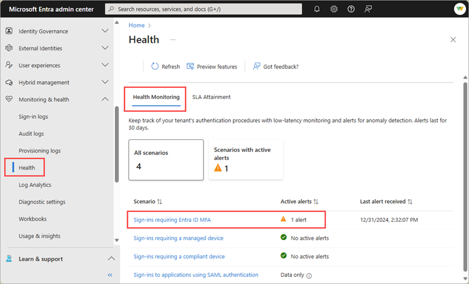
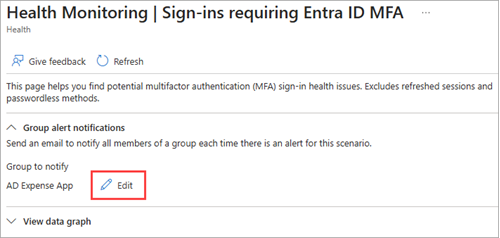

# How to configure email notifications for Microsoft Entra Health monitoring alerts (preview)

Microsoft Entra Health provides tenant-level metrics and health signals for several key identity scenarios. These signals are fed into an anomaly detection service, which triggers alerts when significant changes are detected. You can configure email notifications for when an alert is triggered.

This article describes how to configure email notifications for Microsoft Entra Health monitoring alerts.

> [!IMPORTANT]
> Microsoft Entra Health scenario monitoring and alerts are currently in PREVIEW.
> This information relates to a prerelease product that might be substantially modified before release. Microsoft makes no warranties, expressed or implied, with respect to the information provided here.

## Prerequisites

There are different roles, permissions, and license requirements to view health monitoring signals and configure and receive alerts. We recommend using a role with least privilege access to align with the [Zero Trust guidance](/security/zero-trust/zero-trust-overview).

- A tenant with a [Microsoft Entra P1 or P2 license](../../fundamentals/get-started-premium.md) is required to *view* the Microsoft Entra health scenario monitoring signals.
- A tenant with both a [Microsoft Entra P1 or P2 license](../../fundamentals/get-started-premium.md) *and* at least 100 monthly active users is required to *view alerts* and *receive alert notifications*.
- The [Reports Reader](../role-based-access-control/permissions-reference.md#reports-reader) role is the least privileged role required to *view scenario monitoring signals, alerts, and alert configurations*.
- The [Helpdesk Administrator](../role-based-access-control/permissions-reference.md#helpdesk-administrator) is the least privileged role required to *update alerts* and *update alert notification configurations*.
- The `HealthMonitoringAlert.Read.All` permission is required to *view the alerts using the Microsoft Graph API*.
- The `HealthMonitoringAlert.ReadWrite.All` permission is required to *view and modify the alerts using the Microsoft Graph API*.
- For a full list of roles, see [Least privileged role by task](../role-based-access-control/delegate-by-task.md#monitoring-and-health---audit-and-sign-in-logs).

### Known limitations

- Newly onboarded tenants might not have enough data to generate alerts for about 30 days.
- Currently, alerts are only available with the Microsoft Graph API.

## Determine email notification recipients

With the Microsoft Graph health monitoring alerts API, you can run the API calls on a regular cadence (for example, daily or hourly) and configure email notifications for when an alert is triggered. We recommend daily monitoring of the scenario monitoring signals and alerts.

Email notifications are sent to the [Microsoft Entra group](../../fundamentals/concept-learn-about-groups.md) of your choice. We recommend sending alerts to users with the appropriate access to investigate and take action on the alerts. Not every role can take the same action, so consider including a group with the following roles: 

- [Security Reader](../role-based-access-control/permissions-reference.md#security-reader)
- [Security Administrator](../role-based-access-control/permissions-reference.md#security-administrator)
- [Intune Administrator](../role-based-access-control/permissions-reference.md#intune-administrator)
- [Conditional Access Administrator](../role-based-access-control/permissions-reference.md#conditional-access-administrator)

## Configure the email notifications

Email notification settings can be configured for each scenario in the Microsoft Entra admin center or using the Microsoft Graph API.

### [Microsoft Entra admin center](#tab/microsoft-entra-admin-center)

1. Sign in to the [Microsoft Entra admin center](https://entra.microsoft.com) as at least a [Helpdesk Administrator](../role-based-access-control/permissions-reference.md#helpdesk-administrator).

1. Browse to **Identity** > **Monitoring & health** > **Health** and select the **Health monitoring** tab.

1. Select the scenario you want to configure email notifications for.

    

1. From the **Group alert notifications** section, select either the **+Select** or **Edit** button.
    - If no group is selected, the **+Select** button is displayed.
    - If a group is already selected, the **Edit** button is displayed.

    

1. From the panel that opens, select the group you want to receive the alerts and select the **Select** button. 
    - Only one group can be selected.
    - The group is updated in the **Group alert notifications** section.

    

### [Microsoft Graph API](#tab/microsoft-graph-api)

To configure alert notifications, you need the ID of the Microsoft Entra group you want to receive the alerts AND the scenario alert ID. 

#### Locate the group's Object ID

From the Microsoft Entra admin center:

1. Sign in to the [Microsoft Entra admin center](https://entra.microsoft.com) as at least a [User Administrator](../role-based-access-control/permissions-reference.md#user-administrator).
1. Browse to **Groups** > **All groups** > and select the group you want to receive the alerts.
1. Select **Properties** and copy the `Object ID` of the group. 

      

Using the Microsoft Graph API:
1. Sign in to [Microsoft Graph Explorer](https://developer.microsoft.com/en-us/graph/graph-explorer) as at least a [Helpdesk Administrator](../role-based-access-control/permissions-reference.md#helpdesk-administrator) and consent to the appropriate permissions.
1. Select **GET** as the HTTP method from the dropdown and set the API version to **v1.0**.
1. Run the following query to retrieve the list of alerts for your tenant.

    ```
    GET https://graph.microsoft.com/v1.0/groups
    ```
1. Locate and save the `id` of the group you want to receive the alerts.

#### Locate the scenario alert type

1. Select **GET** as the HTTP method from the dropdown and set the API version to **beta**.
1. Run the following query to retrieve the list of alerts for your tenant.

    ```http
    GET https://graph.microsoft.com/beta/reports/healthMonitoring/alerts
    ```
1. Locate and save the `alertType` of the alert you want to be notified about, for example `alertType: "mfaSignInFailure`.

#### Configure the email notifications

In Microsoft Graph Explorer, run the following PATCH query to configure email notifications for alerts.

- Replace `{alertType}` with the specific `alertType` you want to configure.
- Replace `Object ID of the group` with the `Object ID` of the group you want to receive the alerts.
- For more information, see [configure email notifications for alerts](/graph/api/healthmonitoring-alertconfiguration-update?view=graph-rest-beta&preserve-view=true).

```http
PATCH https://graph.microsoft.com/beta/reports/healthMonitoring/alertConfigurations/{alertType}
Content-Type: application/json

{
  "emailNotificationConfigurations": [
    {
      "groupId":"Object ID of the group",
      "isEnabled": true
    }
  ]
}
```

---

