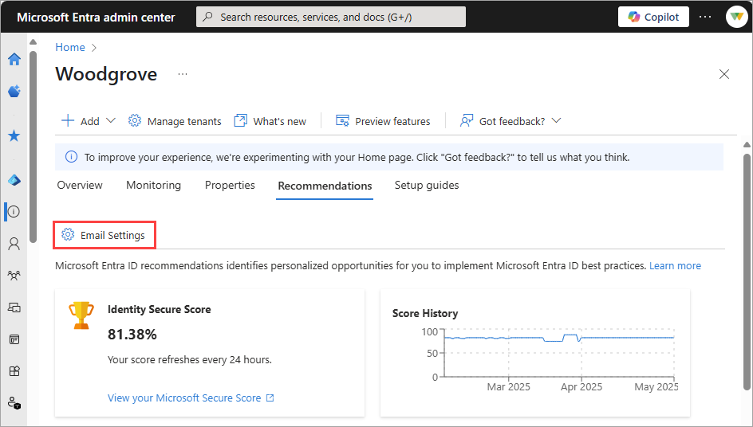

# How to configure Microsoft Entra recommendation email notification settings

Microsoft Entra recommendations are a powerful resource to monitor and maintain the health and security of your tenant. Email notifications are sent to specific tenant administrative roles when a new recommendation is available for your tenant. These emails help administrators stay on top of the latest recommendations so they can take quick action, but you can turn off these emails for the tenant.

> [!IMPORTANT]
> Microsoft Entra recommendation emails are currently in PREVIEW.
> This information relates to a prerelease product that might be substantially modified before release. Microsoft makes no warranties, expressed or implied, with respect to the information provided here.

## Prerequisites

To update the Microsoft Entra recommendation email notification settings for your tenant, you need to have the [Security Administrator](../role-based-access-control/permissions-reference.md#security-administrator) role.

## What do the recommendation emails contain?

The email notifications provide a basic summary of the specific recommendation with a link to the related area of the Microsoft Entra admin center. The email also includes a link to related documentation so you can learn more about the recommendation and how to resolve it. These emails are enabled by default, aren't promotional or marketing emails, and don't contain any upselling content. These emails are purely informational and designed to help you act quickly when a new recommendation is available.

## How to update your email notification settings

Tenants are opted in to receive Microsoft Entra recommendation emails by default. To turn off these emails, follow these steps:

1. Sign in to the [Microsoft Entra admin center](https://entra.microsoft.com) as at least a [Security Administrator](../role-based-access-control/permissions-reference.md#security-administrator).
1. Browse to **Identity** > **Overview** > **Recommendations**.
1. Select **Email settings**.

    

1. In the **Recommendation email settings** panel that opens, uncheck the **Send email notifications for new recommendations** box.

All email notifications for all Microsoft Entra recommendations are now blocked for the entire tenant and are no longer sent to the tenant's administrative roles.