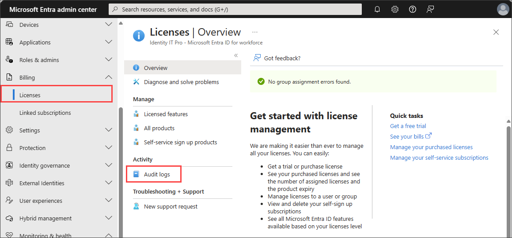

# How to download logs in Microsoft Entra ID

The Microsoft Entra admin center gives you access to three types of activity logs:

- **[Sign-ins](concept-sign-ins.md)**: Information about sign-ins and how your resources are used by your users.
- **[Audit](concept-audit-logs.md)**: Information about changes applied to your tenant such as users and group management or updates applied to your tenant’s resources.
- **[Provisioning](concept-provisioning-logs.md)**: Activities performed by a provisioning service, such as the creation of a group in ServiceNow or a user imported from Workday.

Microsoft Entra ID stores activity logs for a specific period, depending on your license. For more information, see [Microsoft Entra data retention](reference-reports-data-retention.md). By downloading the logs, you can control how long logs are stored. This article explains how to download activity logs in Microsoft Entra ID.

## Prerequisites

- For license and role requirements, see [Microsoft Entra monitoring and health licensing](../../fundamentals/licensing.md#microsoft-entra-monitoring-and-health).
- The option to download logs is available in all editions of Microsoft Entra ID.
- Downloading logs programmatically with Microsoft Graph requires a [premium license](../../fundamentals/licensing.md#microsoft-entra-monitoring-and-health).
- **Reports Reader** is the least privileged role required to view Microsoft Entra activity logs.

## Log download considerations

Before you download logs, review the following considerations and tips:

- Microsoft Entra ID supports the following formats for your download:
  - **CSV**
  - **JSON**
- Timestamps in the downloaded files are based on UTC.
- You can download up to 100,000 sign-in or provisioning records per file.
- You can download up to 250,000 audit records per file.
- Set your filter before you download the logs to narrow the dataset.

> [!NOTE]
> The Microsoft Entra admin center download service will time out if you attempt to download large data sets. Generally, data sets smaller than 250,000 for audit logs and 100,000 for sign-in and provisioning logs work well with the browser download feature.
>
>If you face issues completing large downloads in the browser, use the [**reporting API**](/graph/api/resources/azure-ad-auditlog-overview) to download the data or [**send the logs to an endpoint through diagnostic settings**](howto-configure-diagnostic-settings.md).

> [!NOTE]
>The columns in the downloaded logs do not change. The output contains all details of the audit or sign-in log, *regardless of the columns you customized in the Microsoft Entra admin center*. If you set a custom filter, however, the output in the downloaded logs contain only the results that match the filter.

## How to download activity logs

You can access the activity logs from the **Monitoring and health** section of Microsoft Entra ID or from the area of Microsoft Entra ID where you're working.

For example, if you're in the **Groups** or **Licenses** section of Microsoft Entra ID, you can access the audit logs for those specific activities directly from that area. When you access the audit logs in this way, the filter categories are automatically set. If you're in **Groups**, the audit log filter category is set to **GroupManagement**.

### Audit logs

[!INCLUDE [portal update](../../includes/portal-update.md)]

1. Sign in to the [Microsoft Entra admin center](https://entra.microsoft.com) as at least a [Reports Reader](../role-based-access-control/permissions-reference.md#reports-reader).
1. Browse to **Identity** > **Monitoring & health** > **Audit logs**.
1. Select **Download**.
1. In the panel that opens, select the **Format**.
1. Optionally provide a unique file name.
1. Select the **Download** button. The download processes and sends the file to your default download location.

    

### Sign-in logs

The options covered in this section align with the preview experience for sign-in logs.

1. Sign in to the [Microsoft Entra admin center](https://entra.microsoft.com) as at least a [Reports Reader](../role-based-access-control/permissions-reference.md#reports-reader).
1. Browse to **Identity** > **Monitoring & health** > **Sign-in logs**.
1. Select the **Download** button and select either **JSON** or **CSV**.

    

1. Optionally provide a unique file name for each file you need to download.
1. Select the **Download** button for one or more of the logs. The download processes and sends the file to your default download location.

    - Interactive sign-ins
    - Interactive sign-ins with only the [authentication details](concept-sign-in-log-activity-details.md#) included
    - Non-interactive sign-ins
    - Non-interactive sign-ins with only the [authentication details](concept-sign-in-log-activity-details.md#authentication-details) included
    - Application sign-ins
    - Managed identity

    

### Provisioning logs

1. Sign in to the [Microsoft Entra admin center](https://entra.microsoft.com) as at least a [Reports Reader](../role-based-access-control/permissions-reference.md#reports-reader).
1. Browse to **Identity** > **Monitoring & health** > **Provisioning logs**.
1. Select the **Download** button and select either **JSON** or **CSV**.
1. Optionally provide a unique file name for each file you need to download.
1. Select the **Download** button for one or more of the logs. The download processes and sends the file to your default download location.

    - Provisioning logs
    - Provisioning logs with the provisioning steps
    - Provisioning logs with modified properties

    
