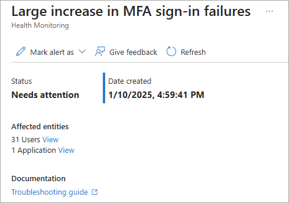

# How to investigate Microsoft Entra Health monitoring alerts (preview)

Microsoft Entra Health monitoring helps you monitor the health of your Microsoft Entra tenant through a set of health metrics and intelligent alerts. Health metrics are fed into our anomaly detection service, which uses machine learning to understand the patterns for your tenant. When the anomaly detection service identifies a significant change in one of the tenant-level patterns, it triggers an alert.

The signals and alerts provided by Microsoft Entra Health provide you with the starting point for investigating potential issues in your tenant. Because there's a wide range of scenarios and even more data points to consider, it's important to understand how to investigate these alerts effectively. This article provides guidance on how to investigate alerts, in general. For scenario-specific guidance, see the related content at the end of this article.

> [!IMPORTANT]
> Microsoft Entra Health scenario monitoring and alerts are currently in PREVIEW.
> This information relates to a prerelease product that might be substantially modified before release. Microsoft makes no warranties, expressed or implied, with respect to the information provided here.

## Prerequisites

There are different roles, permissions, and license requirements to view health monitoring signals and configure and receive alerts. We recommend using a role with least privilege access to align with the [Zero Trust guidance](/security/zero-trust/zero-trust-overview).

- A tenant with a [Microsoft Entra P1 or P2 license](../../fundamentals/get-started-premium.md) is required to *view* the Microsoft Entra health scenario monitoring signals.
- A tenant with both a non-trial [Microsoft Entra P1 or P2 license](../../fundamentals/get-started-premium.md) *and* at least 100 monthly active users is required to *view alerts* and *receive alert notifications*.
- The [Reports Reader](../role-based-access-control/permissions-reference.md#reports-reader) role is the least privileged role required to *view scenario monitoring signals, alerts, and alert configurations*.
- The [Helpdesk Administrator](../role-based-access-control/permissions-reference.md#helpdesk-administrator) is the least privileged role required to *update alerts* and *update alert notification configurations*.
- The `HealthMonitoringAlert.Read.All` permission is required to *view the alerts using the Microsoft Graph API*.
- The `HealthMonitoringAlert.ReadWrite.All` permission is required to *view and modify the alerts using the Microsoft Graph API*.
- For a full list of roles, see [Least privileged role by task](../role-based-access-control/delegate-by-task.md#monitoring-and-health---audit-and-sign-in-logs-least-privileged-roles).

> [!NOTE]
> Newly onboarded tenants might not have enough data to generate alerts for about 30 days.

## Investigate the signals and alerts

You can view the Microsoft Entra Health monitoring signals from the Microsoft Entra admin center. You can also view the properties of the signals and the public preview of health monitoring alerts, using [Microsoft Graph APIs](/graph/api/resources/healthmonitoring-overview?view=graph-rest-beta&preserve-view=true).

When you receive an alert, you typically need to investigate the following data sets:

- **Metrics**: The data stream, or health signal, that caused the alert. 
- **Affected entities**: Total number of affected entities. Could include users and applications. 
- **Activity logs**: Sign-in logs provide details around affected users. Audit logs provide insights into application configuration changes.
- **Scenario-specific resources**: Depending on the scenario, you might need to investigate other sources of information from different services. For example, for device-related scenarios, you might need to review Intune device compliance policies.

### [Admin center](#tab/admin-center)

The signals and alerts are available in the Microsoft Entra Health area of the Microsoft Entra admin center. Whether you're investigating an alert or just monitoring the health of your tenant, you can view the signals and alerts from the Microsoft Entra admin center.

#### View the signals

1. Sign into the [Microsoft Entra admin center](https://entra.microsoft.com) as at least a [Reports Reader](../role-based-access-control/permissions-reference.md#reports-reader).

1. Browse to **Entra ID** > **Monitoring & health** > **Health**. The page opens to the Service Level Agreement (SLA) Attainment page.

1. Select the **Health Monitoring** tab.

    :::image type="content" source="media/howto-investigate-health-scenario-alerts/health-monitoring-landing-page.png" alt-text="Screenshot of the Microsoft Entra Health landing page." lightbox="media/howto-investigate-health-scenario-alerts/health-monitoring-landing-page-expanded.png":::


1. Select a scenario from the list. The page opens to the scenarios with active alerts, but if you want to view the signals for a different scenario, select the **All scenarios** filter button.

1. View the signal in the **View data graph** section. You might need to expand this section if you're viewing a scenario with an active alert.
    - The date range can be changed to view the last 24 hours, seven days, or previous month.
    - Hover your mouse over the graph to see the data points for a particular point in time.
    - The value at the bottom of the graph is the total count for that scenario for the selected time frame.

:::image type="content" source="media/howto-investigate-health-scenario-alerts/scenario-health-mfa-signal.png" alt-text="Screenshot of the sign-ins requiring multifactor authentication (MFA) scenario." lightbox="media/howto-investigate-health-scenario-alerts/scenario-health-mfa-signal-expanded.png":::

#### Investigate the alerts

To view these details from the **Health monitoring** landing page: 

1. Select the active alert you want to investigate.

    :::image type="content" source="media/howto-investigate-health-scenario-alerts/scenario-health-active-alert.png" alt-text="Screenshot of the Health monitoring page with active alert scenarios." lightbox="media/howto-investigate-health-scenario-alerts/scenario-health-active-alert-expanded.png":::


1. From the **Affected entities** section of the selected scenario, select **View** for the type of affected entity you want to investigate.
    - Possible entities include users and applications.
    - A link is provided to a scenario-specific article for more information on how to investigate the issue.

    

1. From the details that appear in the panel that opens, select an entity to explore further.
    - The top 10 most affected entities appear.
    - Selecting an item from the list navigates you to the user or application's profile page for further investigation.

1. The signal for the alert appears under the **Signals** section. Review the signal to understand the pattern and identify anomalies.
    - The time frame shows the time during which the anomaly occurred. 

    

1. After investigating and potentially resolving the root cause of the issue, you can dismiss the alert. From the active alert page, select the checkbox for that alert then select the **Mark alert as** menu and select **Dismissed**.
    - The equivalent action using the Microsoft Graph API is to update the alert status to `resolved`.

    :::image type="content" source="media/howto-investigate-health-scenario-alerts/mark-alert-as.png" alt-text="Screenshot of the alert page with the Mark alert as menu highlighted." lightbox="media/howto-investigate-health-scenario-alerts/mark-alert-as-expanded.png":::


### [Microsoft Graph API](#tab/microsoft-graph-api)

With the Microsoft Graph APIs, you can view the metrics that make up the health signals and alerts and review the impact summary for a health alert.

For sample requests and responses, see [Health monitoring List alert objects](/graph/api/healthmonitoring-healthmonitoringroot-list-alerts?view=graph-rest-beta&preserve-view=true).
- The portion of the response after `impacts` make up the impact summary for the alert.
- The `supportingData` portion includes the full query used to generate the alert.
- The results of the query include everything identified by the anomaly detection service, but there might be results that aren't directly related to the alert.

#### View the signals

The `serviceActivity` resource gets the metrics that feed into the Microsoft Entra Health monitoring signals, which are visualized in the Microsoft Entra admin center. For more information, see [serviceActivity resource type](/graph/api/resources/serviceactivity?view=graph-rest-beta&preserve-view=true).

1. Sign in to [Microsoft Graph Explorer](https://developer.microsoft.com/en-us/graph/graph-explorer) as at least a [Helpdesk Administrator](../role-based-access-control/permissions-reference.md#helpdesk-administrator) and consent to the appropriate permissions.
1. Select **GET** as the HTTP method from the dropdown and set the API version to **beta**.
1. Run the following query to retrieve the multifactor authentication (MFA) sign-in success metrics during a specific interval.

**Request**:

```http
GET https://graph.microsoft.com/beta/reports/serviceActivity/getMetricsForMfaSignInFailure(inclusiveIntervalStartDateTime=2023-01-01T00:00:00Z,exclusiveIntervalEndDateTime=2023-01-01T00:20:00Z,aggregationIntervalInMinutes=10)
```

**Response**:

The response shows how many successful sign-ins occurred during the specific time frame, aggregated in ten-minute intervals. 

```http
HTTP/1.1 200 OK
Content-Type: application/json

{
  "@odata.context": "https://graph.microsoft.com/beta/networkAccess/reports/$metadata#Collection(serviceActivityValueMetric)",
  "value": [
    {
      "intervalStartDateTime": "2023-01-10T00:00:00Z",
      "value": 4
    },
    {
      "intervalStartDateTime": "2023-01-10T00:10:00Z",
      "value": 5
    },
    {
      "intervalStartDateTime": "2023-01-10T00:20:00Z",
      "value": 4
    }
  ]
}
```

#### Investigate the alerts

The `alert` resource type provides details about the health monitoring alerts, including the impact summary for the alert. For more information, see [alert resource type](/graph/api/resources/healthmonitoring-alert?view=graph-rest-beta&preserve-view=true).

Run the following query to retrieve all active alerts for your tenant.

  **Request**:

```http
GET https://graph.microsoft.com/beta/reports/healthMonitoring/alerts?$filter=state eq microsoft.graph.healthmonitoring.alertState'active'&$select=id, alertType
```

  **Response**:

```http
HTTP/1.1 200 OK
Content-Type: application/json
{
  "@odata.context": "https://graph.microsoft.com/beta/$metadata#reports/healthMonitoring/alerts(id,alertType)",
  "value": [
    {
      "id": "aaaaaaaa-0000-1111-2222-bbbbbbbbbbbb",
      "alertType": "mfaSignInFailure"
    },
    {
      "id": "bbbbbbbb-1111-2222-3333-cccccccccccc",
       "alertType": "managedDeviceSignInFailure"
    },
  ]
}    
```

Locate and save the `id` of the alert you want to investigate and run the following query, using `id` as the `alertId`. The following query retrieves the alert details, expanding the `resourceSampling` property to get the user IDs of the affected entities.

**Request**:
    
For this example, we're using the `mfaSignInFailure` alert type, but the `id` value is a placeholder value. Replace it with the `id` of the alert you want to investigate.

```http
GET https://graph.microsoft.com/beta/reports/healthMonitoring/alerts/{id}?$expand=enrichment/impacts/microsoft.graph.healthmonitoring.directoryobjectimpactsummary/resourceSampling&$select=alertType, createdDateTime, enrichment'
```

**Response**:

The response is shortened for readability. The response includes the User IDs of the affected entities, which can be used in further inquiries into the user's sign-in activity. The response also includes queries for the related reports.

```http
{
  "@odata.context": "https://graph.microsoft.com/beta/$metadata#reports/healthMonitoring/alerts(enrichment/impacts/microsoft.graph.healthMonitoring.directoryObjectImpactSummary/resourceSampling())/$entity",
  "id": "aaaaaaaa-0000-1111-2222-bbbbbbbbbbbb",
  "alertType": "mfaSignInFailure",
  "scenario": "mfa",
  "category": "authentication",
  "createdDateTime": "2025-01-10T23:59:41.1216288Z",
  "state": "resolved",
  "enrichment": {
      "state": "enriched",
      "supportingData": null,
      "impacts": [
          {
              "@odata.type": "#microsoft.graph.healthMonitoring.userImpactSummary",
              "resourceType": "User",
              "impactedCount": "4",
              "impactedCountLimitExceeded": false,
              "resourceSampling": [
                  {
                      "id": "00aa00aa-bb11-cc22-dd33-44ee44ee44ee"
                  },
                  {
                      "id": "66aa66aa-bb77-cc88-dd99-00ee00ee00ee"
                  },
                  {
                      "id": "11bb11bb-cc22-dd33-ee44-55ff55ff55ff"
                  },
                  {
                      "id": "55ff55ff-aa66-bb77-cc88-99dd99dd99dd"
                  }
          ]    
          },
      ]
      "signals": {
          "mfaSignInFailure": "https://graph.microsoft.com//beta/reports/serviceActivity/getMetricsForMfaSignInFailure/(inclusiveIntervalStartDateTime=2024-12-26T23:59:41Z,exclusiveIntervalEndDateTime=2025-01-10T23:59:41Z)",
          "mfaSignInSuccess": "https://graph.microsoft.com//beta/reports/serviceActivity/getMetricsForMfaSignInSuccess/(inclusiveIntervalStartDateTime=2024-12-26T23:59:41Z,exclusiveIntervalEndDateTime=2025-01-10T23:59:41Z)"
      }
    }
  }    
```
    
Once you have the details for the affected entities, you can begin to troubleshoot things like sign-in activity, audit logs, and Conditional Access.

#### Update the status

After investigating and potentially resolving the root cause of the issue, you can mark the alert as resolved. Run the following PATCH request. The equivalent action using the Microsoft Entra admin center is to update the alert status to **Dismissed**.

```http
PATCH https://graph.microsoft.com/beta/reports/healthMonitoring/alerts/{alertId}
Content-Type: application/json
{
  "state": "resolved"
}
```

---

## Related content

- [Sign-ins requiring a compliant or managed device](scenario-health-sign-ins-compliant-managed-device.md)
- [Sign-ins requiring MFA](scenario-health-sign-ins-mfa.md)
- [Microsoft Graph Health monitoring alerts API documentation](/graph/api/resources/healthmonitoring-overview?view=graph-rest-beta&preserve-view=true)
