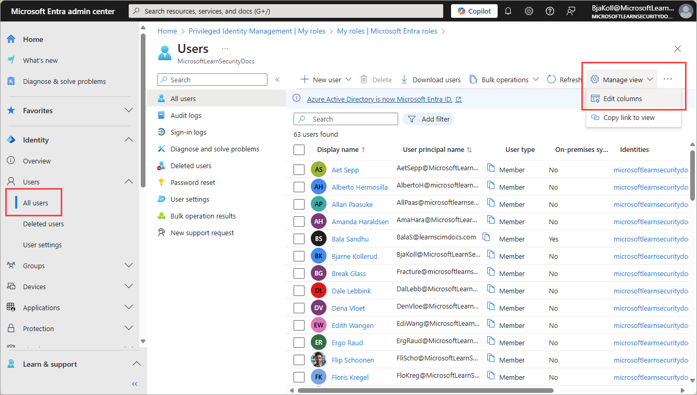
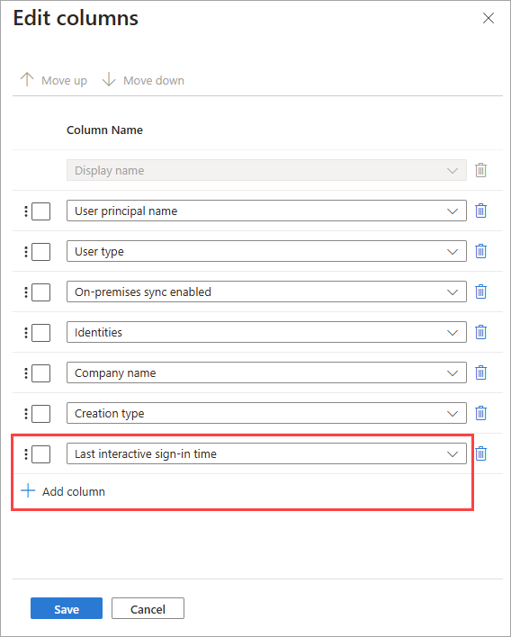
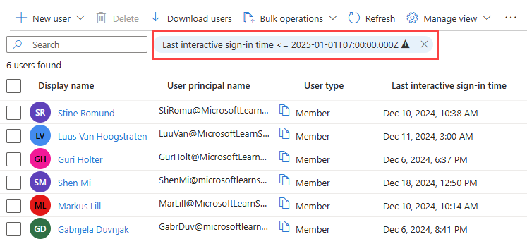

# How to detect and investigate inactive user accounts

In large environments, user accounts aren't always deleted when employees leave an organization. As an IT administrator, you want to detect and resolve these obsolete user accounts because they represent a security risk.

This article explains a method to handle obsolete user accounts in Microsoft Entra ID.

> [!NOTE]
> This article applies only to finding inactive user accounts in Microsoft Entra ID. It doesn't apply to finding inactive accounts in [Azure AD B2C](/azure/active-directory-b2c/overview).

## Prerequisites

- To access the `lastSuccessfulSignInDateTime` property using Microsoft Graph, you need a Microsoft Entra ID P1 or P2 license.
- You need to grant the app the following Microsoft Graph permissions:
  - AuditLog.Read.All
  - User.Read.All
- [Reports Reader](../../identity/role-based-access-control/permissions-reference.md#reports-reader) is the least privileged role required to access the activity logs.
    - For a full list of roles, see [Least privileged role by task](../role-based-access-control/delegate-by-task.md#monitoring-and-health---audit-and-sign-in-logs-least-privileged-roles).

## What are inactive user accounts?

Inactive accounts are user accounts that aren't required anymore by members of your organization to gain access to your resources. One key identifier for inactive accounts is that they haven't been used *for a while* to sign in to your environment. Because inactive accounts are tied to the sign-in activity, you can use the timestamp of the last time an account attempted to sign in to detect inactive accounts.

The challenge of this method is to define what *for a while* means for your environment. For example, users might not sign in to an environment *for a while*, because they are on vacation. You need to consider all legitimate reasons for not signing in to your environment. In many organizations, a reasonable window for inactive user accounts is between 90 and 180 days.

The last sign-in date provides potential insights into a user's continued need for access to resources. It can help with determining if group membership or app access is still needed or could be removed. For external user management, you can determine if an external user is still active within the tenant or should be removed.

## How to find and investigate inactive user accounts

You can use the Microsoft Entra admin center or the Microsoft Graph API to find inactive user accounts. While there isn't a built-in report for inactive user accounts, you can use the last sign-in date and time to determine if a user account is inactive.

## [Admin center](#tab/admin-center)

To find the last sign-in time for a user, you can look at your user list in the Microsoft Entra admin center. While all users can see the list of users, some columns and details are only available to users with the appropriate permissions.

### Find the last sign-in time for all users

1. Sign in to the [Microsoft Entra admin center](https://entra.microsoft.com) as at least a [Reports Reader](../role-based-access-control/permissions-reference.md#reports-reader).
1. Browse to **Entra ID** > **Users**.
1. Select **Manage view** and then **Edit columns**.

    

1. From the list, select **+ Add column**, select **Last interactive sign-in time** from the list, then select **Save**.

    

1. With the column now visible in the all users list, select **Add filter** and set a time frame for your search using the filter options.
    - Select **< =** as the **Operator**, then select the date to find the last sign-in *before* that selected date.



### Investigate a single user

If you need to view the latest sign-in activity for a user, you can view the user's sign-in details in Microsoft Entra ID. You can also use the Microsoft Graph API described in the [Users by name section](#users-by-name).

1. Sign in to the [Microsoft Entra admin center](https://entra.microsoft.com) as at least a [Reports Reader](~/identity/role-based-access-control/permissions-reference.md#reports-reader).
1. Browse to **Entra ID** > **Users**.
1. Select a user from the list.
1. In the **My Feed** area of the user's Overview, locate the **Sign-ins** tile.

    :::image type="content" source="media/howto-manage-inactive-user-accounts/user-last-sign-in-tile.png" alt-text="Screenshot of the user overview page with the sign-in activity tile highlighted." lightbox="media/howto-manage-inactive-user-accounts/user-last-sign-in-tile-expanded.png":::

The last sign-in date and time shown on this tile might take up to 24 hours to update, which means the date and time might not be current. If you need to see the activity in near real time, select the **See all sign-ins** link on the **Sign-ins** tile to view all sign-in activity for that user.

## [Microsoft Graph](#tab/microsoft-graph)

<a name="how-to-detect-inactive-user-accounts"></a>

You can detect inactive accounts by evaluating several properties. The `lastSignInDateTime` property is exposed by the `signInActivity` resource type of the **Microsoft Graph API**. The `lastSignInDateTime` property shows the last time a user attempted to make an interactive sign-in attempt in Microsoft Entra ID.

Using this property, you can implement a solution for the following scenarios:

### Last sign-in date and time for all users

Generate a report of the last sign-in date of *all users*. The response provides a list of all users, and the last `lastSignInDateTime` for each respective user.
  - `https://graph.microsoft.com/v1.0/users?$select=displayName,signInActivity`

### Last successful sign-in date and time

This query is similar to adding the last sign-in date to the user list and filtering by a specific date in the Microsoft Entra admin center. You can request a list of users with a `lastSuccessfulSignInDateTime` or `lastSignInDateTime` *before* a specified date. The response for this query provides the user's details, but doesn't provide the user's sign-in activity. To see those details, try the query in the **Users by name** scenario.

  - `https://graph.microsoft.com/v1.0/users?$filter=signInActivity/lastSuccessfulSignInDateTime le 2024-06-01T00:00:00Z`
  - `https://graph.microsoft.com/v1.0/users?$filter=signInActivity/lastSignInDateTime le 2024-06-01T00:00:00Z`

### Users by name

In this scenario, you search for a specific user by name. The response for this query includes the date, time, and request ID for their last sign-ins.

**Request**:
```http
GET `https://graph.microsoft.com/v1.0/users?$filter=startswith(displayName,'Isabella Simonsen')&$select=displayName,signInActivity`
```

**Response**:

```json
{
    "@odata.context": "https://graph.microsoft.com/v1.0/$metadata#users(displayName,signInActivity)",
    "value": [
        {
            "displayName": "Stine Romund",
            "id": "00aa00aa-bb11-cc22-dd33-44ee44ee44ee",
            "signInActivity": {
                "lastSignInDateTime": "2024-12-10T17:38:26Z",
                "lastSignInRequestId": "20a94b1b-ade2-4f4e-9c55-609f7cd97600",
                "lastNonInteractiveSignInDateTime": "2024-12-10T17:38:11Z",
                "lastNonInteractiveSignInRequestId": "94c369e6-249e-4595-bb86-495ea9a81e00",
                "lastSuccessfulSignInDateTime": "2024-12-10T17:38:26Z",
                "lastSuccessfulSignInRequestId": "20a94b1b-ade2-4f4e-9c55-609f7cd97600"
            }
        }
    ]
}
```
  - `lastSignInDateTime`: The date and time of the last interactive sign-in attempt, including sign-in failures. In the case where the last sign-in attempt was successful, the date and time of this property are the same as the `lastSuccessfulSignInDateTime`.
  - `lastNonInteractiveSignInDateTime`: The date and time of the last non-interactive sign-in attempt.
  - `lastSuccessfulSignInDateTime`: The date and time of the last successful interactive sign-in.

> [!NOTE]
> The `signInActivity` property supports `$filter` (`eq`, `ne`, `not`, `ge`, `le`) *but not with any other filterable properties*. You must specify `$select=signInActivity` or `$filter=signInActivity` while [listing users](/graph/api/user-list?view=graph-rest-beta&preserve-view=true), as the signInActivity property isn't returned by default.

### Considerations for the lastSignInDateTime property

The following details relate to the `lastSignInDateTime` property.

- The `lastSignInDateTime` property is exposed by the [signInActivity resource type](/graph/api/resources/signinactivity) of the [Microsoft Graph API](/graph/overview#whats-in-microsoft-graph).

- The property is *not* available through the Get-MgAuditLogDirectoryAudit cmdlet.

- Each interactive sign-in attempt results in an update of the underlying data store. Typically, sign-ins show up in the related sign-in report within 6 hours.

- To generate a `lastSignInDateTime` timestamp, you must attempt a sign-in. Either a failed or successful sign-in attempt, as long as it's recorded in the [Microsoft Entra sign-in logs](./concept-sign-ins.md), generates a `lastSignInDateTime` timestamp. The value of the `lastSignInDateTime` property might be blank if:
  - The last attempted sign-in of a user took place before April 2020.
  - The affected user account was never used for a sign-in attempt.

- The last sign-in date is associated with the user object. The value is retained until the next sign-in of the user. It might take up to 24 hours to update.

---

## How to address inactive users

After identifying inactive users, start by asking the following questions:

- Is the user still employed by the organization?
- Does the user still need access to the resources they have access to?
- Is the user account still needed for any other reason?

How you address inactive users depends on your scenario, but cleaning up unused accounts or over-privileged accounts should be your priority to reduce security risks. The following features and options are a great place to start, but note that some of these features might require additional licensing.

- [Clean up stale guest accounts](../users/clean-up-stale-guest-accounts.md)
- Consider dynamic membership group to automatically add or remove users from groups based on their user properties.
    - [Create a dynamic membership group](../users/groups-create-rule.md)
- Use Microsoft Entra ID Governance access reviews to audit your users' access.
    - [What are access reviews?](../../id-governance/access-reviews-overview.md)
    - [Review recommendations for access reviews](../../id-governance/review-recommendations-access-reviews.md)

## Related content

- [Audit API reference](/graph/api/resources/directoryaudit)
- [Sign-in activity report API reference](/graph/api/resources/signin)
