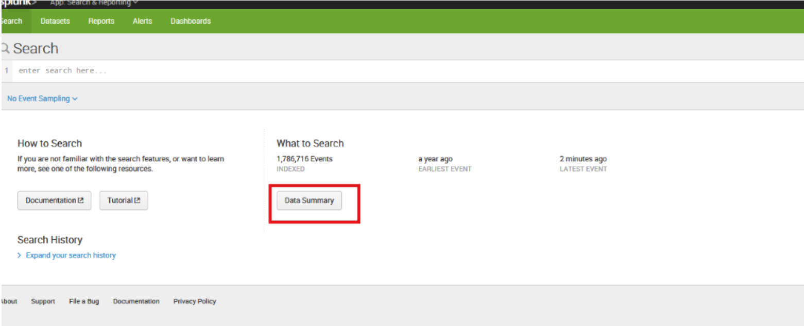
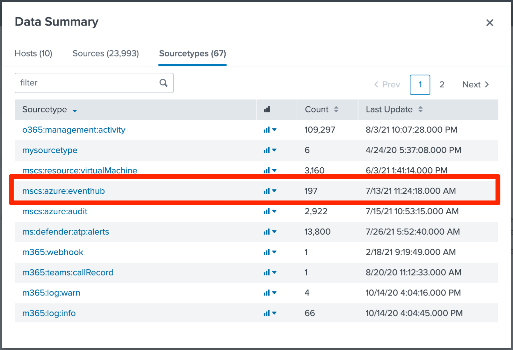
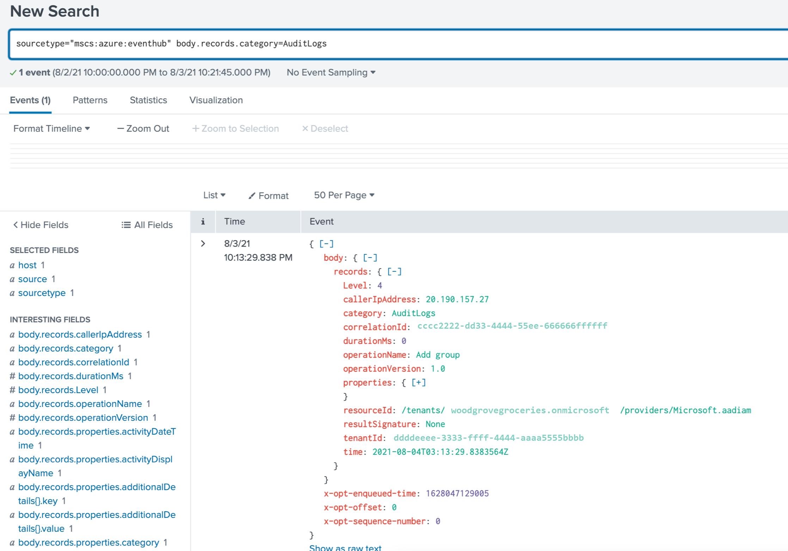
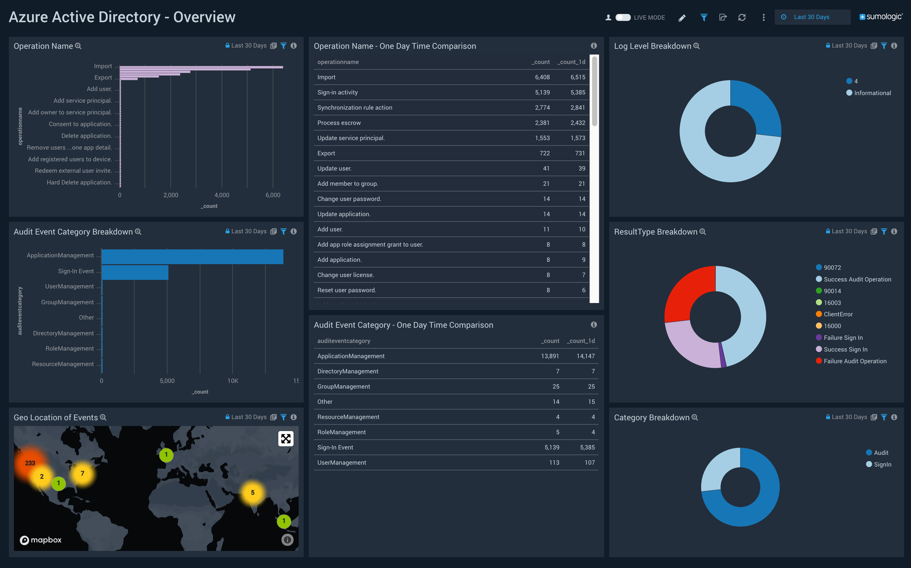

# How to stream activity logs to an event hub

Your Microsoft Entra tenant produces large amounts of data every second. Sign-in activity and logs of changes made in your tenant add up to so much data that it can be hard to analyze. Integrating with Security Information and Event Management (SIEM) tools can help you gain insights into your environment.

This article shows how you can stream your logs to an event hub, to integrate with one of several SIEM tools.

## Prerequisites

- An Azure subscription. If you don't have an Azure subscription, you can [sign up for a free trial](https://azure.microsoft.com/free/).
- An **Azure event hub** that is already set up. Learn how to [create an event hub](/azure/event-hubs/event-hubs-create).
- [Security Administrator](../role-based-access-control/permissions-reference.md#security-administrator) access to create general diagnostic settings for the Microsoft Entra tenant.
- [Attribute Log Administrator](../role-based-access-control/permissions-reference.md#attribute-log-administrator) access to create diagnostic settings for [custom security attribute](../../fundamentals/custom-security-attributes-overview.md) logs.

## Stream logs to an event hub

[!INCLUDE [portal update](../../includes/portal-update.md)]

[!INCLUDE [diagnostic-settings-include](../../includes/diagnostic-settings-include.md)]

6. Select the **Stream to an event hub** check box.

7. Select the Azure subscription, Event Hubs namespace, and optional event hub where you want to route the logs.

The subscription and Event Hubs namespace must both be associated with the Microsoft Entra tenant from where you're streaming the logs.

Once you have the Azure event hub ready, navigate to the SIEM tool you want to integrate with the activity logs. The process is finished in the SIEM tool.

We currently support Splunk, SumoLogic, and ArcSight. Select a tab to get started. Refer to the tool's documentation.

# [Splunk](#tab/splunk)

To use this feature, you need the [Splunk Add-on for Microsoft Cloud Services](https://splunkbase.splunk.com/app/3110/#/details).

### Integrate Microsoft Entra logs with Splunk

1. Open your Splunk instance and select **Data Summary**.

    

1. Select the **Sourcetypes** tab, and then select **mscs:azure:eventhub**

    

Append **body.records.category=AuditLogs** to the search. The Microsoft Entra activity logs are shown in the following figure:

   

If you can't install an add-on in your Splunk instance (for example, if you're using a proxy or running on Splunk Cloud), you can forward these events to the Splunk HTTP Event Collector. To do so, use this [Azure function](https://github.com/splunk/azure-functions-splunk), which is triggered by new messages in the event hub.

# [SumoLogic](#tab/SumoLogic)

To use this feature, you need a SumoLogic single sign-on enabled subscription.

### Integrate Microsoft Entra logs with SumoLogic 

1. Configure your SumoLogic instance to [collect logs for Microsoft Entra ID](https://help.sumologic.com/docs/integrations/microsoft-azure/active-directory-azure#collecting-logs-for-azure-active-directory).

1. [Install the Microsoft Entra SumoLogic app](https://help.sumologic.com/docs/integrations/microsoft-azure/active-directory-azure#viewing-azure-active-directory-dashboards) to use the preconfigured dashboards that provide real-time analysis of your environment.

   

# [ArcSight](#tab/ArcSight)

To use this feature, you need a configured instance of ArcSight Syslog NG Daemon SmartConnector (SmartConnector) or ArcSight Load Balancer. If the events are sent to ArcSight Load Balancer, they're sent to the SmartConnector by the Load Balancer.

Download and open the [configuration guide for ArcSight SmartConnector for Azure Monitor Event Hubs](https://software.microfocus.com/products/siem-security-information-event-management/overview). This guide contains the steps you need to install and configure the ArcSight SmartConnector for Azure Monitor.

## Integrate Microsoft Entra logs with ArcSight

1. Complete the steps in the **Prerequisites** section of the ArcSight configuration guide. This section includes the following steps:
    - Set user permissions in Azure to ensure there's a user with the **owner** role to deploy and configure the connector.
    - Open ports on the server with Syslog NG Daemon SmartConnector so it's accessible from Azure.
    - The deployment runs a PowerShell script, so you must enable PowerShell to run scripts on the machine where you want to deploy the connector.

1. Follow the steps in the **Deploying the Connector** section of the ArcSight configuration guide to deploy the connector. This section walks you through how to download and extract the connector, configure application properties and run the deployment script from the extracted folder.

1. Use the steps in the **Verifying the Deployment in Azure** to make sure the connector is set up and functions correctly. Verify the following prerequisites:
    - The requisite Azure functions are created in your Azure subscription.
    - The Microsoft Entra logs are streamed to the correct destination.
    - The application settings from your deployment are persisted in the Application Settings in Azure Function Apps.
    - A new resource group for ArcSight is created in Azure, with a Microsoft Entra application for the ArcSight connector and storage accounts containing the mapped files in CEF format.

1. Complete the post-deployment steps in the **Post-Deployment Configurations** of the ArcSight configuration guide. This section explains how to perform another configuration if you are on an App Service Plan to prevent the function apps from going idle after a timeout period, configure streaming of resource logs from the event hub, and update the SysLog NG Daemon SmartConnector keystore certificate to associate it with the newly created storage account.

1. The configuration guide also explains how to customize the connector properties in Azure, and how to upgrade and uninstall the connector. There's also a section on performance improvements, including upgrading to an [Azure Consumption plan](https://azure.microsoft.com/pricing/details/functions) and configuring an ArcSight Load Balancer if the event load is greater than what a single Syslog NG Daemon SmartConnector can handle.

---

## Activity log integration options and considerations

If your current SIEM isn't supported in Azure Monitor diagnostics yet, you can set up **custom tooling** by using the Event Hubs API. To learn more, see the [Getting started receiving messages from an event hub](/azure/event-hubs/event-hubs-dotnet-standard-getstarted-send).

**IBM QRadar** is another option for integrating with Microsoft Entra activity logs. The DSM and Azure Event Hubs Protocol are available for download at [IBM support](https://www.ibm.com/support). For more information about integration with Azure, go to the [IBM QRadar Security Intelligence Platform 7.3.0](https://www.ibm.com/support/knowledgecenter/SS42VS_DSM/c_dsm_guide_microsoft_azure_overview.html?cp=SS42VS_7.3.0) site.

Some sign-in categories contain large amounts of log data, depending on your tenant’s configuration. In general, the non-interactive user sign-ins and service principal sign-ins can be 5 to 10 times larger than the interactive user sign-ins.

## Next steps

- [Analyze Microsoft Entra activity logs with Azure Monitor logs](howto-analyze-activity-logs-log-analytics.md)
- [Use Microsoft Graph to access Microsoft Entra activity logs](quickstart-access-log-with-graph-api.md)
