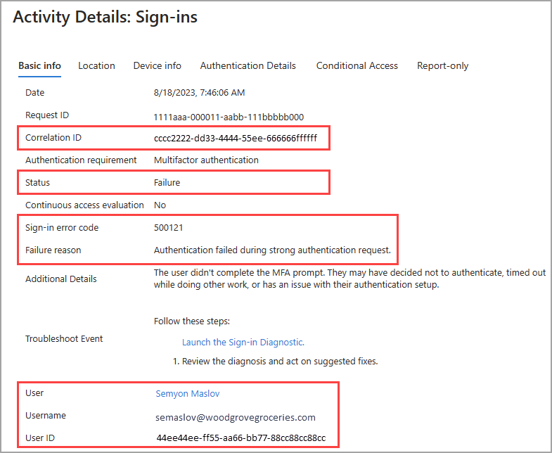
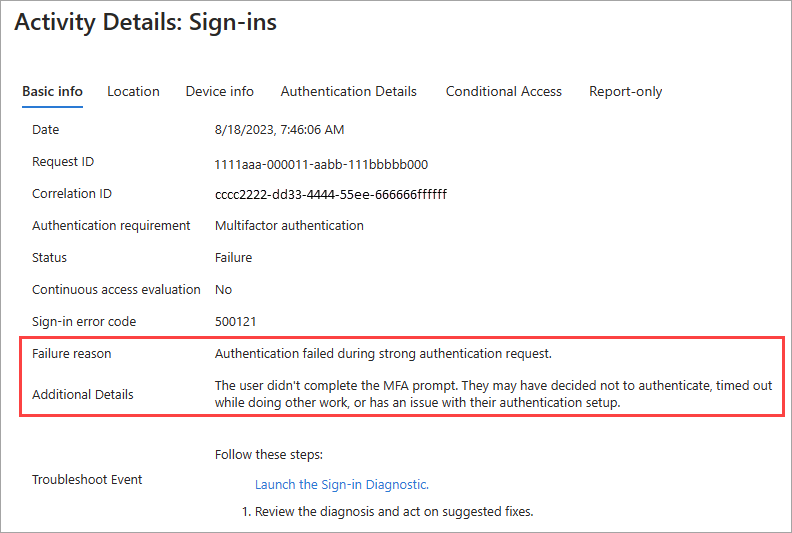

# How to troubleshoot Microsoft Entra sign-in errors

The Microsoft Entra sign-in logs enable you to find answers to questions around managing access to the applications in your organization, including:

- What is the sign-in pattern of a user?
- How many users have users signed in over a week?
- What’s the status of these sign-ins?

In addition, the sign-in logs can also help you troubleshoot sign-in failures for users in your organization. In this guide, you learn how to isolate a sign-in failure in the sign-ins report, and use it to understand the root cause of the failure. Some common sign-in errors are also described.

## Prerequisites

You need:

- A working Microsoft Entra tenant with the appropriate Microsoft Entra license associated with it.
    - For a full list of license requirements, see [Microsoft Entra monitoring and health licensing](../../fundamentals/licensing.md#microsoft-entra-monitoring-and-health).
- [Reports Reader](../../identity/role-based-access-control/permissions-reference.md#reports-reader) is the least privileged role required to access the activity logs.
- In addition, any user can access their own sign-ins from https://mysignins.microsoft.com.

## Gather sign-in details

1. Sign in to the [Microsoft Entra admin center](https://entra.microsoft.com) as at least a [Reports Reader](../role-based-access-control/permissions-reference.md#reports-reader).
1. Browse to **Entra ID** > **Monitoring & health** > **Sign-in logs**.
1. Use the filters to narrow down the results
    - Search by username if you're troubleshooting a specific user.
    - Search by application if you're troubleshooting issues with a specific app.
    - Select **Failure** from the **Status** menu to display only failed sign-ins.
1. Select the failed sign-in you want to investigate to open the details window.
1. Explore the details on each tab. You might want to save a few details for further troubleshooting. These details are highlighted in the screenshot following the list.
    - Correlation ID
    - Sign-in error code
    - Failure reason
    - Username, User ID, and Sign-in identifier

    

## Troubleshoot sign-in errors

With sign-in details gathered, you should explore the results and troubleshoot the issue.

### Failure reason and additional details

The **Failure reason** and **Additional Details** might provide you with the details and next steps to resolve the issue. The Failure reason describes the error. The Additional Details provides more details and often tells you how to resolve the issue.

The following failure reasons and details are common:

- The failure reason **Authentication failed during the strong authentication request** doesn't provide much to troubleshoot, but the additional details field says the user didn't complete the MFA prompt. Have the user sign-in again and complete the MFA prompts.
- The failure reason **The Federation Service failed to issue an OAuth Primary Refresh Token** provides a good starting point, but the additional details briefly explain how authentication works in this scenario and tell you to make sure that device sync is enabled.
- A common failure reason is **Error validating credentials due to invalid username or password**. The user entered something incorrectly and needs to try again.

### Sign-in error codes

If you need more specifics to research, you can use the **sign-in error code** for further research.

- Enter the error code into the **[Error code lookup tool](https://login.microsoftonline.com/error)** to get the error code description and remediation information.
- Search for an error code in the **[sign-ins error codes reference](../../identity-platform/reference-error-codes.md)**.

The following error codes are associated with sign-in events, but this list isn't exhaustive:

- **50058**: User is authenticated but not yet signed in.
  - This error code appears for sign-in attempts when the user didn't complete the sign-in process.
  - Because the user didn't sign-in completely, the User field might display an Object ID or a globally unique identifier (GUID) instead of a username.
  - In some of these situations, the User ID shows up like "00000000-0000-0000".

- **90025**: An internal Microsoft Entra service hit its retry allowance to sign the user in.
  - This error often happens without the user noticing and is usually resolved automatically.
  - If it persists, have the user sign in again.

- **500121**: User didn't complete the MFA prompt.
  - This error often appears if the user hasn't completed setting up MFA.
  - Instruct the user to complete the setup process through to sign-in.

- **70046**: Session expired or reauthentication check failed.
    - This error can occur if a session token expired or if a reauthentication check failed.
    - A reauthentication check can happen if a Conditional Access policy is enabled to require reauthentication for various sign-in risk levels.

If all else fails, or the issue persists despite taking the recommended course of action, open a support request. For more information, see [how to get support for Microsoft Entra ID](~/fundamentals/how-to-get-support.md).

## Next steps

- [Sign-ins error codes reference](./concept-sign-ins.md)
- [Sign-ins report overview](concept-sign-ins.md)
- [How to use the Sign-in diagnostics](howto-use-sign-in-diagnostics.md)
