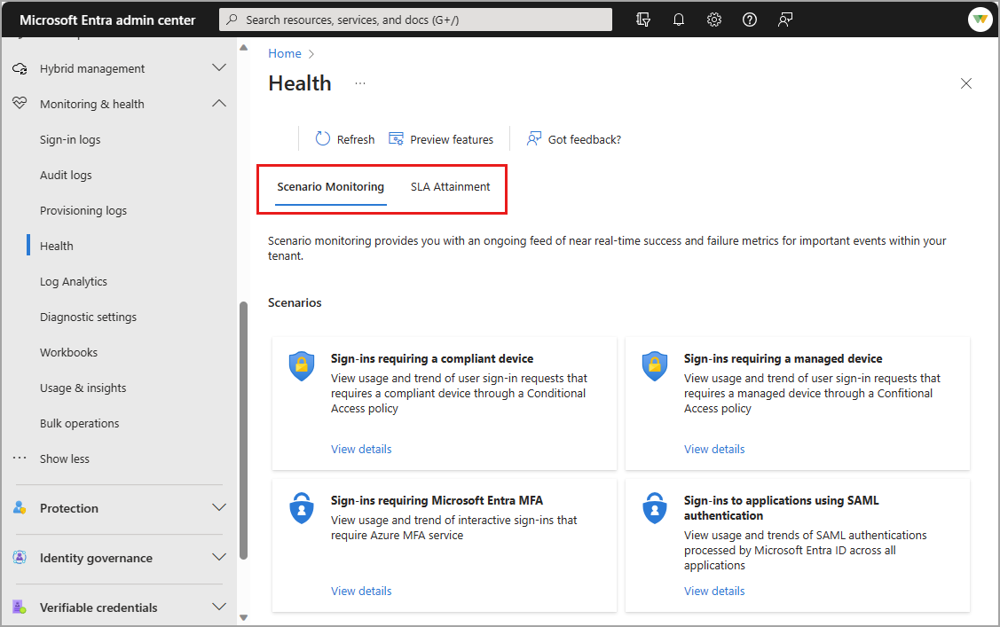
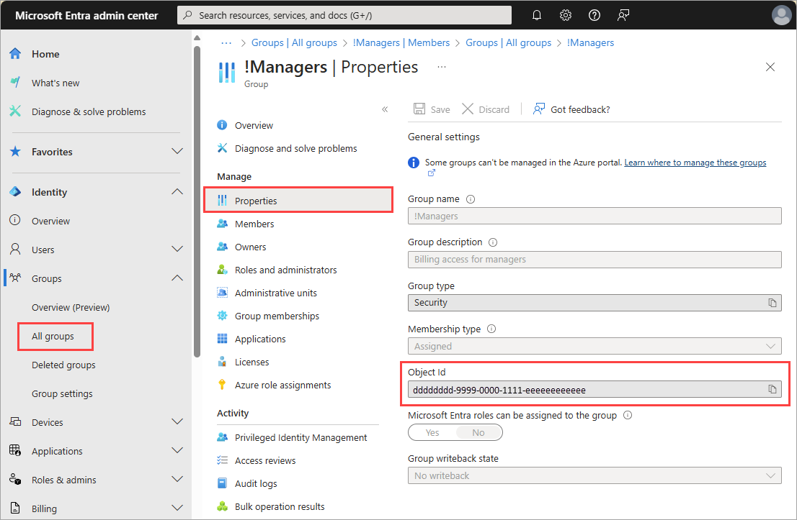

# How to use Microsoft Entra scenario health alerts (preview)

Microsoft Entra Health monitoring provides the ability to monitor the health of your Microsoft Entra tenant through a set of health metrics and intelligent alerts. Health metrics are fed into our anomaly detection service, which uses machine learning to understand the patterns for your tenant. When the anomaly detection service identifies a significant change one of the tenant-level patterns, it triggers an alert. You can also receive email notifications when a potential issue or failure condition is detected within the health scenarios. For more information on Microsoft Entra Health, see [What is Microsoft Entra Health](concept-microsoft-entra-health.md).

This article provides guidance on how to:

- Access Microsoft Entra Health.
- Configure email notifications for alerts.
- Investigate an alert.

## Prerequisites

[!INCLUDE [Microsoft Entra health](../../includes/licensing-health.md)]

### Known limitations

- Newly onboarded tenants might not have enough data to generate alerts for about 30 days.
- Currently, alerts are only available with the Microsoft Graph API.

## How to access Microsoft Entra Health

You can view the Microsoft Entra Health service level agreement (SLA) attainment report and the health monitoring signals from the Microsoft Entra admin center. You can also view these data streams, and the public preview of health monitoring alerts, using [Microsoft Graph](/graph/api//resources/serviceactivity?view=graph-rest-beta&preserve-view=true). [Enable the Scenario monitoring preview](https://entra.microsoft.com/?feature.tokencaching=true&feature.internalgraphapiversion=true#view/Microsoft_AAD_IAM/FeaturePreviewsListBlade).

1. Sign into the [Microsoft Entra admin center](https://entra.microsoft.com) as at least a [Reports Reader](../role-based-access-control/permissions-reference.md#reports-reader).

1. Browse to **Identity** > **Monitoring and health** > **Health**.

1. Select the **Scenario Monitoring** tab.

    

1. Select **View details** for the scenario you wish to investigate.

    

The default view is the last seven days, but you can adjust the date range to 24 hours, seven days, or one month. The data is updated every 15 minutes.

## Configure the email notifications

With the Microsoft Graph health monitoring alerts API, you can configure email notifications. You can run the API calls on a regular cadence (for example, daily or hourly) or you can configure email notifications for when an alert is triggered. We recommend daily monitoring of the scenario monitoring signals and alerts.

Email notifications are sent to the [Microsoft Entra group](../../fundamentals/concept-learn-about-groups.md) of your choice. We recommend sending alerts to users with the appropriate access to investigate and take action on the alerts. Not every role can take the same action, so consider including a group with the following roles: 

- [Security Reader](../role-based-access-control/permissions-reference.md#security-reader)
- [Security Administrator](../role-based-access-control/permissions-reference.md#security-administrator)
- [Intune Administrator](../role-based-access-control/permissions-reference.md#intune-administrator)
- [Conditional Access Administrator](../role-based-access-control/permissions-reference.md#conditional-access-administrator)

To configure alert notifications, you need the ID of the Microsoft Entra group you want to receive the alerts AND the scenario alert ID. You can configure different groups to receive alerts for different alert scenarios. 

### Locate the group's Object ID

1. Sign in to the [Microsoft Entra admin center](https://entra.microsoft.com) as at least a [User Administrator](../role-based-access-control/permissions-reference.md#user-administrator).
1. Browse to **Groups** > **All groups** > and select the group you want to receive the alerts.
1. Select **Properties** and copy the `Object ID` of the group. 

    

### Locate the scenario alert type

1. Sign in to [Microsoft Graph Explorer](https://developer.microsoft.com/en-us/graph/graph-explorer) as at least a [Helpdesk Administrator](../role-based-access-control/permissions-reference.md#helpdesk-administrator) and consent to the appropriate permissions.
1. Select **GET** as the HTTP method from the dropdown and set the API version to **beta**.
1. Run the following query to retrieve the list of alerts for your tenant.

    ```http
    GET https://graph.microsoft.com/beta/reports/healthMonitoring/alerts
    ```
1. Locate and save the `alertType` of the alert you want to be notified about, for example `alertType: "mfaSignInFailure`.

### Configure the email notifications

In Microsoft Graph Explorer, run the following PATCH query to configure email notifications for alerts.

- Replace `{alertType}` with the specific `alertType` you want to configure.
- Replace `Object ID of the group` with the `Object ID` of the group you want to receive the alerts.
- For more information, see [configure email notifications for alerts](/graph/api/healthmonitoring-alertconfiguration-update?view=graph-rest-beta&preserve-view=true).

```http
PATCH https://graph.microsoft.com/beta/reports/healthMonitoring/alertConfigurations/{alertType}
Content-Type: application/json
{
    "groupId": "Object ID of the group",
    "isEnabled": true
}
```

## Investigate the alert and signals

With the email notifications configured, you and your team can more effectively monitor the health of these scenarios. When you receive an alert, you typically need to investigate the following data sets:

- **Alert impact**: The portion of the response after `impacts` quantifies the scope and summarizes impacted resources. These details include the `impactCount` so you can determine how widespread the issue is.  
- **Alert signals**: The data stream, or health signal, that caused the alert. A query is provided in the response for further investigation.
- **Sign-in logs**: A query is provided in the response for further investigation into the sign-in logs where the health signal was generated. The sign-in logs provide detailed event metadata that might be used to identify a problem's root cause.
- **Scenario-specific resources**: Depending on the scenario, you might need to investigate Intune compliance policies or Conditional Access policies. In many cases, a link to related documentation is provided in the response.

### View the impacts and signals

1. In Microsoft Graph, add the following query to retrieve all alerts for your tenant.

    ```http
    GET https://graph.microsoft.com/beta/reports/healthMonitoring/alerts
    ```

1. Locate and save the `id` of the alert you want to investigate.

1. Add the following query, using `id` as the `alertId`.

    ```http
    GET https://graph.microsoft.com/beta/reports/healthMonitoring/alerts/{alertId}
    ```
For sample requests and responses, see [Health  monitoring List alert objects](/graph/api/healthmonitoring-healthmonitoringroot-list-alerts?view=graph-rest-beta&preserve-view=true).
- The portion of the response after `impacts` make up the impact summary for the alert.
- The `supportingData` portion includes the full query used to generate the alert.
- The results of the query include everything identified by the anomaly detection service, but there might be results that aren't directly related to the alert.

### View the sign-in logs

1. Sign in to the [Microsoft Entra admin center](https://entra.microsoft.com) as at least a [Reports Reader](../role-based-access-control/permissions-reference.md#reports-reader).
    - If you need to modify Conditional Access policies, you need the [Conditional Access Administrator](../role-based-access-control/permissions-reference.md#conditional-access-administrator) role.
1. Browse to **Monitoring & health** > **Sign-in logs**.
    - Adjust the time range to match the alert time frame.
    - Add a **filter** for Conditional Access.
    - Select a log entry to view the sign-in logs details and select the Conditional Access tab to see the policies that were applied.

### View the scenario-specific resources

Each alert might have a different data set to investigate. For details on each alert type, see the following articles:

- [Sign-ins requiring a compliant or managed device](scenario-health-sign-ins-compliant-device.md)
- [Sign-ins requiring multifactor authentication (MFA)](scenario-health-sign-ins-mfa.md)

## Analyze the possible root causes

After gathering all the data related to the scenario, you need to consider possible root causes and research potential solutions. Think about the seriousness of the alert. Are only a handful of users affected, or is it a widespread issue? Did a recent policy change have unintended consequences?

We recommend looking at the alerts and health monitoring data regularly to identify trends and potential issues before they become widespread problems. 

## Next steps

- [Troubleshoot sign-in problems with Conditional Access](../conditional-access/troubleshoot-conditional-access.md)
- [Use audit logs to troubleshoot Conditional Access policy changes](../conditional-access/troubleshoot-policy-changes-audit-log.md)
