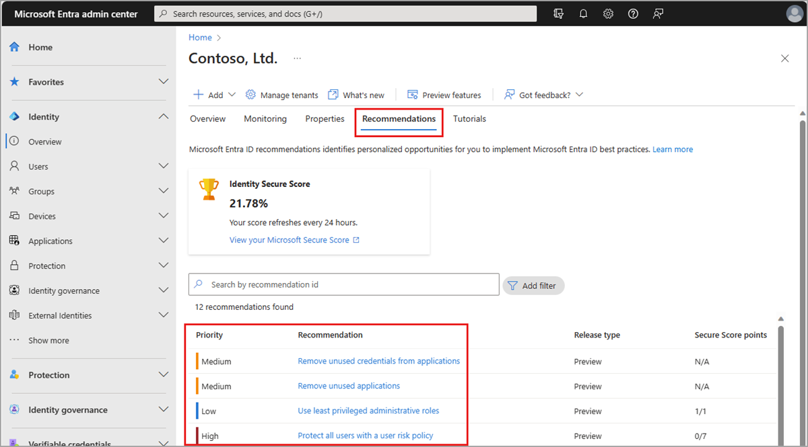
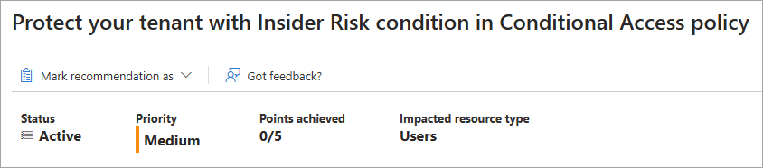
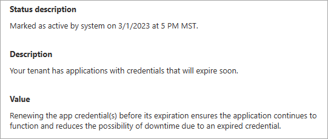
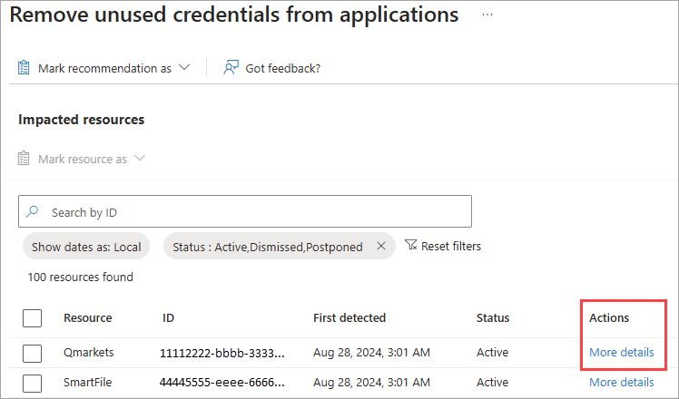
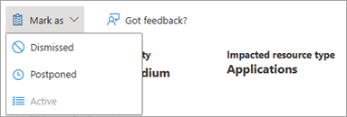

# How to use Microsoft Entra Recommendations

The Microsoft Entra recommendations feature provides you with personalized insights with actionable guidance to:

- Help you identify opportunities to implement best practices for Microsoft Entra related features.
- Improve the state of your Microsoft Entra tenant.
- Optimize the configurations for your scenarios.

This article covers how to work with Microsoft Entra recommendations. Each Microsoft Entra recommendation contains similar details such as a description, the value of addressing the recommendation, and the steps to address the recommendation. Microsoft Graph API guidance is also provided in this article.

## Prerequisites

[!INCLUDE [Recommendations roles](../../includes/recommendations-roles.md)]

## How to read a recommendation

Most recommendations follow the same pattern. You're provided information about how the recommendation works, its value, and some action steps to address the recommendation. This section provides an overview of the details provided in a recommendation, but aren't specific to one recommendation.

1. Sign in to the [Microsoft Entra admin center](https://entra.microsoft.com) as at least a [Reports Reader](../role-based-access-control/permissions-reference.md#reports-reader).
1. Browse to **Entra ID** > **Overview** > **Recommendations**.
1. Select a recommendation from the list.

    

Each recommendation provides the same set of details that explain what the recommendation is, why it's important, and how to fix it. The recommendation service runs every 24-48 hours, depending on the recommendation.



### Status

The **Status** of a recommendation can be active, completed, dismissed, or postponed. The recommendation service automatically marks a recommendation as completed when all impacted resources are addressed.

- **Active**: The recommendation has resources that need to be addressed. A dismissed, postponed, or completed recommendation can be manually changed back to active.
- **Completed**: All resources in the recommendation have been addressed. The status is updated automatically by the system when all resources are addressed according to the action plan. Recommendations can't be manually marked as completed.
- **Dismissed**: If the recommendation is irrelevant or the data is wrong, you can dismiss the recommendation. You must provide a reason for dismissing the recommendation.
- **Postponed**: If you want to address the recommendation at a later time, you can postpone it. The recommendation becomes active when the selected date occurs. You can postpone a recommendation for up to a year.

### Priority

The **Priority** of a recommendation could be low, medium, or high. These values are determined by several factors, such as security implications, health concerns, or potential breaking changes.

- **High**: Must do. Not acting will result in severe security implications or potential downtime.
- **Medium**: Should do. No severe risk if action isn't taken.
- **Low**: Might do. No security risks or health concerns if action isn't taken.

### Recommendation details

- The **Status description** tells you the date the recommendation status changed.

- The recommendation's **Value** is an explanation of why completing the recommendation benefits your organization and the value of the associated feature.

- The **Action plan** provides step-by-step instructions to implement a recommendation. The Action plan might include links to relevant documentation or direct you to other pages in the Azure portal.

- Some recommendations might include a **User impact** that describes the user experience when the recommendation is addressed.



### Impacted resources

The **Impacted resources** for a recommendation could be applications, users, or your full tenant. If the impacted resource is at the tenant level, you might need to make a global change. Not all recommendations populate the impacted resources table. For example, the "Remove unused applications" recommendation lists all applications that were identified by the recommendation service. Tenant-level recommendations, however, won't have any resources listed in the table.

For those recommendations where there are separate resources to address, the **Impacted resources** table contains a list of resources identified by the recommendation. The resource's name, ID, date it was first detected, and status are provided. The resource could be an application, user, or resource service principal, for example.

You can mark individual impacted resources as *dismissed* or *postponed*. The rules and functionality at the resource level are the same as at the recommendation level. In some recommendations, you can select the resource or the **More details** link to access the resource directly.



In the Microsoft Entra admin enter, the impacted resources are limited to a maximum of 50 resources. To view all impacted resources for a recommendation, use the following Microsoft Graph API request: `GET /directory/recommendations/{recommendationId}/impactedResources`

## How to update a recommendation and impacted resources

You can update the status of a recommendation and any related resource in the Microsoft Entra admin center or using Microsoft Graph.

### [Microsoft Entra admin center](#tab/microsoft-entra-admin-center)


1. Sign in to the [Microsoft Entra admin center](https://entra.microsoft.com) as at least a [Reports Reader](../role-based-access-control/permissions-reference.md#reports-reader).
1. Browse to **Entra ID** > **Overview** > **Recommendations**.
1. Select a recommendation from the list.
1. Follow the guidance in the **Action plan**.
1. If you need to manually change the status of a recommendation, select **Mark as** from the top of the page and select a status.

    

    - Mark a recommendation as **Dismissed** if you think the recommendation is irrelevant or the data is wrong.
        - In the panel that opens, select a dismissed reason so we can improve the service.
    - Mark a recommendation as **Postponed** if you want to address the recommendation at a later time.
        - In the panel that opens, select a date within the next year to postpone the recommendation.
        - The recommendation becomes active when the selected date occurs.
    - Mark a dismissed, postponed, or completed recommendation as **Active** to reassess the resources and resolve the issue.
    - Recommendations change to **Completed** when all impacted resources were addressed.
       - If the service identifies an active resource for a completed recommendation the next time the service runs, the recommendation automatically changes back to **Active**.
       - Completing a recommendation is the only action collected in the audit log. To view these logs, go to **Microsoft Entra ID** > **Audit logs** and filter the service to "Microsoft Entra recommendations."

1. If you need to manually change the status of an impacted resource, select the checkbox for that resource in the **Impacted resources** table and select the status from the menu.
1. Continue to monitor the recommendations in your tenant for changes.

> [!NOTE]
> You can't manually mark a recommendation as completed. The system automatically marks a recommendation as completed when all impacted resources are addressed. When the service runs, if no active resources are found, the recommendation is marked as completed.

### [Microsoft Graph API](#tab/microsoft-graph-api)
<a name='how-to-use-microsoft-graph-with-azure-active-directory-recommendations'></a>

Microsoft Entra recommendations can be viewed and managed using Microsoft Graph on the `/beta` endpoint. You can view recommendations along with their impacted resources, postpone a recommendation for later, and more. For more information, see the [Microsoft Graph documentation for recommendations](/graph/api/resources/recommendations-api-overview).

To get started, follow these instructions to work with recommendations using Microsoft Graph in Graph Explorer.

1. Sign in to [Graph Explorer](https://developer.microsoft.com/graph/graph-explorer).
1. Select **GET** as the HTTP method from the dropdown.
1. Set the API version to **beta**.

#### View all recommendations

Add the following query to retrieve all recommendations for your tenant, then select the **Run query** button.

```http
GET https://graph.microsoft.com/beta/directory/recommendations
```

All recommendations that apply to your tenant appear in the response. The impact, benefits, summary of the impacted resources, and remediation steps are provided in the response. Locate the recommendation ID for any recommendation to view the impacted resources.

#### View a specific recommendation

If you want to look for a specific recommendation, you can add a `recommendationType` to the request. This example retrieves the details of the `applicationCredentialExpiry` recommendation.

```http
GET https://graph.microsoft.com/beta/directory/recommendations?$filter=recommendationType eq 'applicationCredentialExpiry'
```

#### View impacted resources for a recommendation

Some recommendations might potentially return a long list of impacted resources. To view the list of impacted resources, you need to locate the recommendation ID. The recommendation ID appears in the response when viewing all recommendations and a specific recommendation.

To view the impacted resources for a specific recommendation, use the following query with the recommendation ID you saved.

```http
GET /directory/recommendations/{recommendationId}/impactedResources
```
---


## Related content

- [Review the Microsoft Entra recommendations overview](overview-recommendations.md)
- [Learn about Service Health notifications](/azure/service-health/service-health-portal-update)