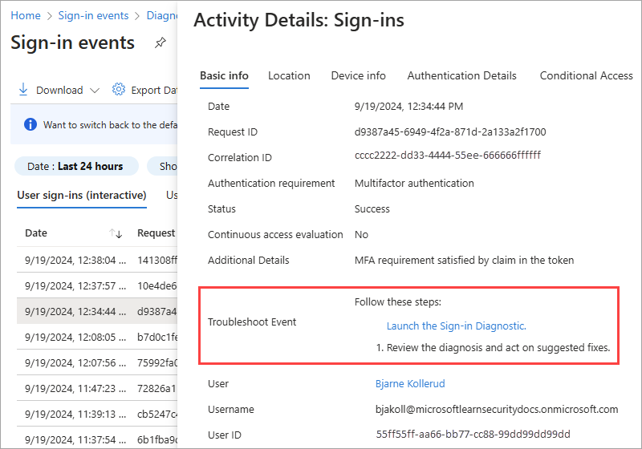

# What is the Sign-in diagnostic in Microsoft Entra ID?

Determining the reason for a failed sign-in can quickly become a challenging task. You need to analyze what happened during the sign-in attempt, and research the available recommendations to resolve the issue. Ideally, you want to resolve the issue without involving others, such as Microsoft support. If you are in a situation like this, you can use the Sign-in diagnostic in Microsoft Entra ID, a tool that helps you investigate sign-ins in Microsoft Entra ID.

This article gives you an overview of what the Sign-in diagnostic is and how you can use it to troubleshoot sign-in related errors.

## Prerequisites

- The least privileged role to use the sign-in diagnostic *from a support request* or *Diagnose and solve problems* is [Billing Administrator](../role-based-access-control/permissions-reference.md#billing-administrator).
- To use the sign-in diagnostic *from the sign-in logs*, you ALSO need [Reports Reader](../role-based-access-control/permissions-reference.md#reports-reader).
- For a full list of roles, see [Least privileged role by task](../role-based-access-control/delegate-by-task.md#monitoring-and-health---sign-in-diagnostic-tool).
- Flagged sign-in events can also be reviewed from the Sign-in diagnostic.
  - Flagged sign-in events are captured *after* a user enabled flagging during their sign-in experience.
  - For more information, see [flagged sign-ins](overview-flagged-sign-ins.md).

## How does it work?

In Microsoft Entra ID, sign-in attempts are controlled by:

- **Who** performed a sign-in attempt.
- **How** a sign-in attempt was performed.

For example, you can configure Conditional Access policies that enable administrators to configure all aspects of the tenant when they sign in from the corporate network. But the same user might be blocked when they sign in to the same account from an untrusted network.

Due to the greater flexibility of the system to respond to a sign-in attempt, you might end up in scenarios where you need to troubleshoot sign-ins. The Sign-in diagnostic tool enables diagnosis of sign-in issues by:  

- Analyzing data from sign-in events and flagged sign-ins.  
- Displaying information about what happened.  
- Providing recommendations to resolve problems.  

## How to access the Sign-in diagnostic

There are a three ways to access the Sign-in diagnostic in Microsoft Entra ID. Select a tab to learn about each method.

### [From Diagnose and Solve Problems](#tab/from-diagnose-and-solve-problems)

You can start the Sign-in diagnostic from the **Diagnose and Solve Problems** area of Microsoft Entra ID. From Diagnose and Solve Problems you can review any flagged sign-in events or search for a specific sign-in event. You can also start this process from the Conditional Access Diagnose and Solve Problems area.

1. Sign in to the [Microsoft Entra admin center](https://entra.microsoft.com) as at least a [Global Reader](../role-based-access-control/permissions-reference.md#global-reader).

1. Browse to **Diagnose & solve problems** at the top of the left-hand navigation.
    
    

    - You can also access **Diagnose & solve problems** from Conditional Access, Users, Groups, Identity Protection, and Multifactor authentication.

1. Select the **Troubleshoot** link on the **Sign-in Diagnostic** tile.

    

1. Select the **All Sign-In Events** tab to start a search.
    - In some cases, the system automatically starts looking for flagged sign-in events. If nothing is found, you're redirected to the **All Sign-In Events** tab.

1. Enter as many details as possible into the search fields.
    - **User**: Provide the name or email address of who made the sign-in attempt.
    - **Application**: Provide the application display name or application ID.
    - **correlationId** or **requestId**: These details can be found in the error report or the sign-in log details.
    - **Date and time**: Provide a date and time to find sign-in events that occurred within 48 hours.

1. Select the **Next** button.

1. Explore the results and take action as necessary.

### [From the Sign-in logs](#tab/from-the-sign-in-logs)

You can start the Sign-in diagnostic from a specific sign-in event in the Sign-in logs. When you start the process from a specific sign-in event, the diagnostics start right away. You aren't prompted to enter details first.

1. Sign in to the [Microsoft Entra admin center](https://entra.microsoft.com) as at least a [Reports Reader](../role-based-access-control/permissions-reference.md#reports-reader).

1. Browse to **Entra ID** > **Monitoring & health** > **Sign-in logs** and select a sign-in event.
    - You can filter your list to make it easier to find specific sign-in events.

1. From the Activity Details window that opens, select the **Launch the Sign-in diagnostic** link.

    

1. Explore the results and take action as necessary.

### [From a support request](#tab/from-a-support-request)

If you're in the middle of creating a support request *and* the options you selected are related to sign-in activity, you're prompted to run the Sign-in diagnostics during the support request process.

1. Browse to **Diagnose and Solve Problems**.

1. Select the appropriate fields as necessary. For example:
    - **Service type**: Microsoft Entra Sign-in and multifactor authentication
    - **Problem type**: Multifactor authentication
    - **Problem subtype**: Unable to sign-in to an application due to MFA

1. Explore the results and take action as necessary.

  

---

## How to use the diagnostic results

After the Sign-in diagnostic completes its search, a few things appear on the screen.

The **Authentication summary** lists all of the events that match the details you provided. Select the **View Columns** option in the upper-right corner of the summary to change the columns that appear.

The **Diagnostic results** describe what happened during the sign-in events.
- Scenarios could include MFA requirements from a Conditional Access policy, sign-in events that might need to have a Conditional Access policy applied, or a large number of failed sign-in attempts over the past 48 hours.
- Related content and links to troubleshooting tools might be provided.
- Read through the results to identify any actions that you can take.
- Because it's not always possible to resolve issues without more help, a recommended step might be to open a support ticket.

    

## Common scenarios

Review the tips in the following section for some common scenarios where the sign-in diagnostic can provide helpful troubleshooting information.

### Conditional Access

Conditional Access policies are used to apply the right access controls when needed to keep your organization secure. Because Conditional Access policies can be used to grant or block access to resources, they often show up in the sign-in diagnostic.

- [Blocked by Conditional Access](../conditional-access/concept-conditional-access-grant.md#block-access): Your Conditional Access policies prevented the user from signing in.

- [Failed Conditional Access](../conditional-access/troubleshoot-conditional-access.md#select-all-consequences): It's possible your Conditional Access policies are too strict. Review your configurations for complete sets of users, groups, and apps. Make sure you understand the implications of restricting access from certain types of devices.

- [Multifactor authentication (MFA) from Conditional Access](../conditional-access/concept-conditional-access-grant.md#require-multifactor-authentication): Your Conditional Access policies triggered the MFA process for the user.

- [B2B blocked sign-in due to Conditional Access](../../external-id/authentication-conditional-access.md#conditional-access-for-external-users): You have a Conditional Access policy in place to block external identities from signing in.

### Multifactor authentication

There are several multifactor authentication (MFA) related events that you can troubleshoot using the sign-in diagnostic tool.

- **MFA from other requirements**: If the results showed MFA from a requirement other than Conditional Access, you might have MFA enabled on a per-user basis. We [recommend converting per-user MFA to Conditional Access](recommendation-turn-off-per-user-mfa.md). The sign-in diagnostic provides details around the source of the MFA interruption and the result of the interaction.

- **MFA "proofup"**: MFA interrupted the sign-in attempt, so information about "proofup" is provided in the diagnostic results. This error appears when users are setting up MFA for the first time and don't complete the setup or their configuration wasn't set up ahead of time.

    

- **Correct & incorrect credentials**: Sometimes users just enter the wrong credentials. The sign-in diagnostic tool can help distinguish between human error and other issues.

- **Successful sign-in**: In some cases, you want to know if sign-in events *aren't* interrupted by Conditional Access or MFA, but they *should* be. The sign-in diagnostic tool provides details about sign-in events that should be interrupted, but aren't.

- **Account locked**: A user attempted to sign in with incorrect credentials too many times. The diagnostic results help determine where the attempts are coming from and if they're legitimate user sign-in attempts or not. Details about the apps, the number of attempts, the device used, the operating system, and the IP address are provided. For more information, see [Microsoft Entra Smart Lockout](~/identity/authentication/howto-password-smart-lockout.md).

- **Invalid username or password**: When a user attempts to sign in using an invalid username or password, the sign-in diagnostic provides details about the apps, the number of attempts, the device used, the operating system, and the IP address. This information helps determine if the user entered incorrect credentials or if the application cached an old password and is resubmitting it.

### Enterprise apps

In enterprise applications, problems might occur with the identity provider (Microsoft Entra ID) application configuration or the service provider (application service, also known as SaaS application) configuration

- **Enterprise apps service provider**: If the sign-in failed due to a problem with the service provider (application) side of the sign-in flow, the issue is resolved by fixing problems on the application service. You need to sign into the other service and change some configuration per the diagnostic guidance.

- **Enterprise apps configuration**: If the sign-in failed due to a configuration issue on the Microsoft Entra ID side of the application, you need to review and update the configuration of the application in Enterprise Applications.

### Security defaults

Sign-in events can be interrupted due to security defaults settings. Security defaults enforce best practice security for your organization. One best practice is to require MFA to be configured and used to prevent password sprays, replay attacks, and phishing attempts from being successful.

For more information, see [What are security defaults?](../../fundamentals/security-defaults.md).

### Error code insights

When an event doesn't have a contextual analysis in the sign-in diagnostic, an updated error code explanation and relevant content might be shown. The error code insights contain detailed text about the scenario, how to remediate the problem, and any content to read regarding the problem.

### Legacy authentication

This scenario involves a sign-in event that was blocked or interrupted because the client was attempting to use Legacy (or Basic) Authentication.

Preventing legacy authentication sign-in is recommended as the best practice for security. Legacy authentication protocols like POP, SMTP, IMAP, and MAPI can't enforce MFA, which makes them preferred entry points for adversaries to attack your organization.

For more information, see [How to block legacy authentication to Microsoft Entra ID with Conditional Access](../conditional-access/policy-block-legacy-authentication.md).

### B2B blocked sign-in due to Conditional Access

This diagnostic scenario detects a blocked or interrupted sign-in due to the user being from another organization. For example, a B2B sign-in, where a Conditional Access policy requires that the client's device is joined to the resource tenant.

For more information, see [Conditional Access for B2B collaboration users](../../external-id/authentication-conditional-access.md).

### Blocked by risk policy

This scenario is where risk-based Conditional Access policies block a sign-in attempt because the sign-in attempt was identified as risky.

For more information, see [How to configure and enable risk policies](../../id-protection/howto-identity-protection-configure-risk-policies.md).

### Pass through authentication

Because pass through authentication is an integration of on premises and cloud authentication technologies, it can be difficult to determine where the problem lies. This diagnostic is intended to make these scenarios easier to diagnose and resolve.

This diagnostic scenario identifies user specific sign-in issues when the authentication method being used is pass through authentication (PTA) and there's a PTA specific error. Errors due to other problems-even when PTA authentication is being used-will still be diagnosed correctly.

The diagnostic results show contextual information about the failure and the user signing in. The results could show other reasons why the sign-in failed, and recommended actions the admin can take to resolve the problem. For more information, see [Microsoft Entra Connect: Troubleshoot Pass-through Authentication](../hybrid/connect/tshoot-connect-pass-through-authentication.md).

### Seamless single sign-on

Seamless single sign-on integrates Kerberos authentication with cloud authentication. Because this scenario involves two authentication protocols, it can be difficult to understand where a failure point lies when sign-in problems occur. This diagnostic is intended to make these scenarios easier to diagnose and resolve.

This diagnostic scenario examines the context of the sign-in failure and specific failure cause. The diagnostic results could include contextual information on the sign-in attempt, and suggested actions the admin can take. For more information, see [Troubleshoot Microsoft Entra seamless single sign-on](../hybrid/connect/tshoot-connect-sso.md).

## Related content

- [Sign in diagnostics for Microsoft Entra scenarios](concept-sign-in-diagnostics-scenarios.md)
- [Learn about flagged sign-ins](overview-flagged-sign-ins.md)
- [Troubleshoot sign-in errors](howto-troubleshoot-sign-in-errors.md)