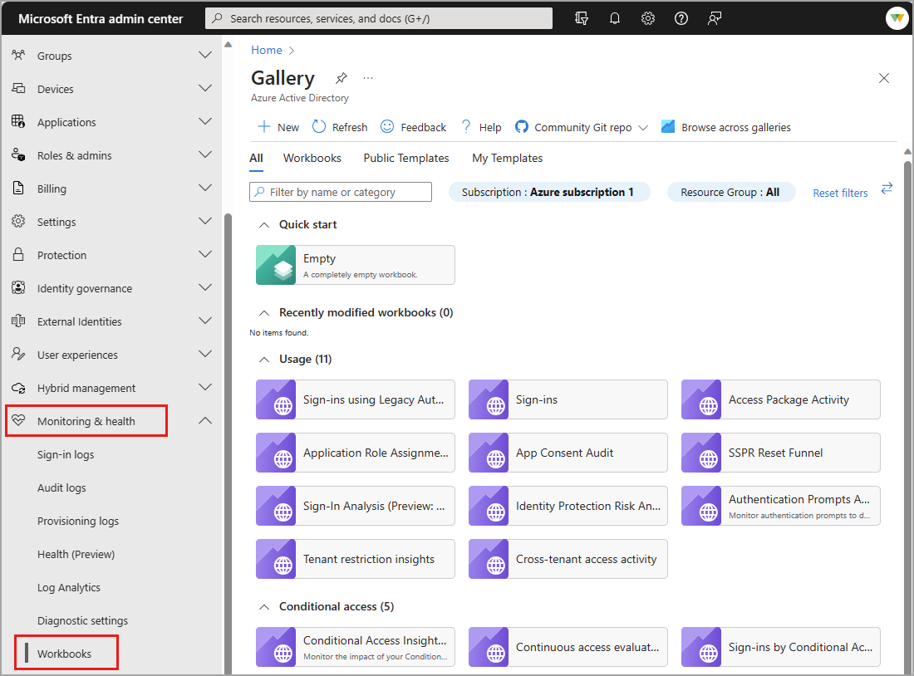
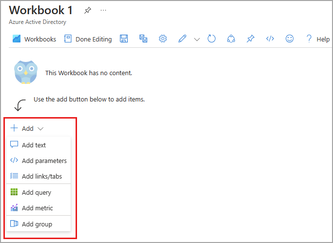
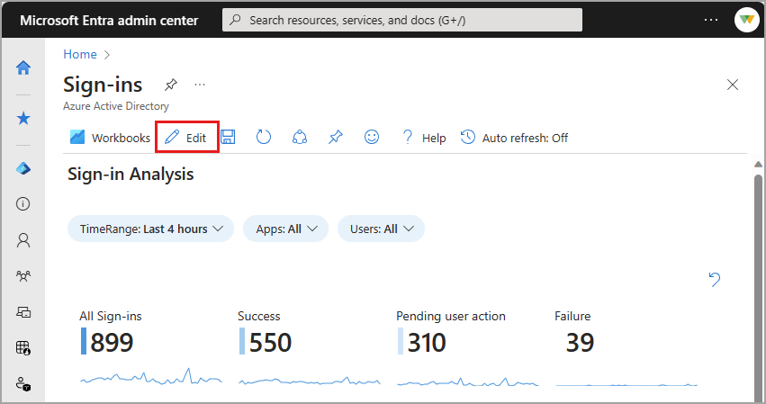
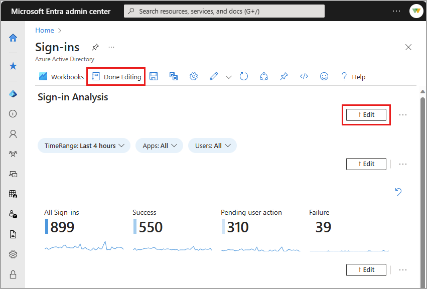

# How to use Microsoft Entra Workbooks

Workbooks are found in Microsoft Entra ID and in Azure Monitor. The concepts, processes, and best practices are the same for both types of workbooks, however, workbooks for Microsoft Entra ID cover only those identity management scenarios that are associated with Microsoft Entra ID.

When using workbooks, you can either start with an empty workbook, or use an existing template. Workbook templates enable you to quickly get started using workbooks without needing to build from scratch. 

- **Public templates** published to a [gallery](/azure/azure-monitor/visualize/workbooks-overview#the-gallery) are a good starting point when you're just getting started with workbooks.
- **Private templates** are helpful when you start building your own workbooks and want to save one as a template to serve as the foundation for multiple workbooks in your tenant.

## Prerequisites

[!INCLUDE [workbook prerequisites](../../includes/workbook-prerequisites.md)]

## Access Microsoft Entra workbooks

1. Sign in to the [Microsoft Entra admin center](https://entra.microsoft.com) as at least a [Reports Reader](../role-based-access-control/permissions-reference.md#reports-reader).
1. Browse to **Entra ID** > **Monitoring & health** > **Workbooks**.
    - **Workbooks**: All workbooks created in your tenant
    - **Public Templates**: Prebuilt workbooks for common or high priority scenarios
    - **My Templates**: Templates you created
1. Select a report or template from the list. Workbooks might take a few moments to populate.
    - Search for a template by name.
    - Select the **Browse across galleries** to view templates that aren't specific to Microsoft Entra ID.

    

## Create a new workbook

Workbooks can be created from scratch or from a template. When creating a new workbook, you can add elements as you go or use the **Advanced Editor** option to paste in the JSON representation of a workbook, copied from the [workbooks GitHub repository](https://github.com/Microsoft/Application-Insights-Workbooks/blob/master/schema/workbook.json).

To create a new workbook from scratch:

1. Browse to **Entra ID** > **Monitoring & health** > **Workbooks**.
1. Select **+ New**.
1. Select an element from the **+ Add** menu.

    For more information on the available elements, see [Creating an Azure Workbook](/azure/azure-monitor/visualize/workbooks-create-workbook).

    

To create a new workbook from a template:

1. Browse to **Entra ID** > **Monitoring & health** > **Workbooks**.
1. Select a workbook template from the Gallery.
1. Select **Edit** from the top of the page.
    - Each element of the workbook has its own **Edit** button.
    - For more information on editing workbook elements, see [Azure Workbooks Templates](/azure/azure-monitor/visualize/workbooks-templates)

    

1. Select the **Edit** button for any element. Make your changes and select **Done editing**.

    

1. When you're done editing the workbook, select the **Save** button. The **Save as** window opens.
1. Provide a **Title**, **Subscription**, **Resource Group*** and **Location**
    - You must have the ability to save a workbook for the selected Resource Group.
    - Optionally choose to save your workbook content to an [Azure Storage Account](/azure/azure-monitor/visualize/workbooks-bring-your-own-storage).
1. Select the **Apply** button.

## Next steps

- [Create interactive reports by using Monitor workbooks](/azure/azure-monitor/visualize/workbooks-overview).
- [Create custom Azure Monitor queries using Azure PowerShell](~/id-governance/entitlement-management-logs-and-reporting.md).
