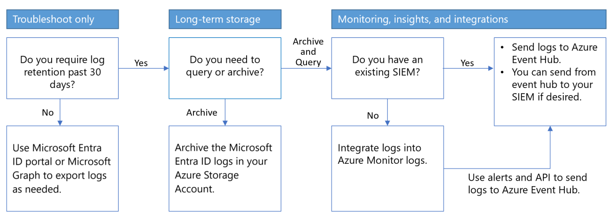

# What is Microsoft Entra monitoring and health?

The features of Microsoft Entra monitoring and health provide a comprehensive view of identity related activity in your environment. This data enables you to:

- Determine how your users utilize your apps and services.
- Detect potential risks affecting the health of your environment.
- Troubleshoot issues preventing your users from getting their work done.
- Gain insights by seeing audit events of changes to your Microsoft Entra directory.

Sign-in and audit logs comprise the activity logs behind many Microsoft Entra reports, which can be used to analyze, monitor, and troubleshoot activity in your tenant. Routing your activity logs to an analysis and monitoring solution provides greater insights into your tenant's health and security.

This article describes the types of activity logs available in Microsoft Entra ID, the reports that use the logs, and the monitoring services available to help you analyze the data. 

## Identity activity logs

Activity logs help you understand the behavior of users in your organization. There are three types of activity logs in Microsoft Entra ID:

- [**Audit logs**](concept-audit-logs.md) include the history of every task performed in your tenant.

- [**Sign-in logs**](./concept-sign-ins.md) capture the sign-in attempts of your users and client applications.

- [**Provisioning logs**](concept-provisioning-logs.md) provide information around users provisioned in your tenant through a third party service.

The activity logs can be viewed in the Azure portal or using the Microsoft Graph API. Activity logs can also be routed to various endpoints for storage or analysis. To learn about all of the options for viewing the activity logs, see [How to access activity logs](howto-access-activity-logs.md).

### Audit logs 

Audit logs provide you with records of system activities for compliance. This data enables you to address common scenarios such as:

- Someone in my tenant got access to an admin group. Who gave them access? 
- I want to know the list of users signing into a specific app because I recently onboarded the app and want to know if it’s doing well.
- I want to know how many password resets are happening in my tenant.

### Sign-in logs

The sign-in logs enable you to find answers to questions such as:

- What is the sign-in pattern of a user?
- How many users have users signed in over a week?
- What’s the status of these sign-ins?

### Provisioning logs

You can use the provisioning logs to find answers to questions like:

- What groups were successfully created in ServiceNow?
- What users were successfully removed from Adobe?
- What users from Workday were successfully created in Active Directory?

## Identity reports

Reviewing the data in the Microsoft Entra activity logs can provide helpful information for IT administrators. To streamline the process of reviewing data on key scenarios, we've created several reports on common scenarios that use the activity logs.

- [Identity Protection](~/id-protection/overview-identity-protection.md) uses sign-in data to create reports on risky users and sign-in activities.
- Activity related to your applications, such as service principal and app credential activity, are used to create reports in [Usage and insights](concept-usage-insights-report.md).
- [Microsoft Entra workbooks](overview-workbooks.md) provide a customizable way to view and analyze the activity logs. 
- Use [Microsoft Entra recommendations](overview-recommendations.md) to monitor and improve your tenant's security.
- [Microsoft Entra Health](concept-microsoft-entra-health.md) capture global service level agreement attainment and health signals for several key scenarios.

## Identity monitoring and tenant health

Reviewing Microsoft Entra activity logs is the first step in maintaining and improving the health and security of your tenant. You need to analyze the data, monitor on risky scenarios, and determine where you can make improvements. Microsoft Entra monitoring provides the necessary tools to help you make informed decisions.

Monitoring Microsoft Entra activity logs requires routing the log data to a monitoring and analysis solution. Endpoints include Azure Monitor logs, Microsoft Sentinel, or a third-party solution third-party Security Information and Event Management (SIEM) tool.

- [Stream logs to an event hub to integrate with third-party SIEM tools.](howto-stream-logs-to-event-hub.md)
- [Integrate logs with Azure Monitor logs.](./howto-integrate-activity-logs-with-azure-monitor-logs.yml)
- [Analyze logs with Azure Monitor logs and Log Analytics.](howto-analyze-activity-logs-log-analytics.md)

## Use cases

How you use the logs, reports, and monitoring services available depends on your organization's needs. To better prioritize the use cases and solutions, it might help to see how these solutions are related to each other, how they differ, and how they can be used together.

### Considerations

- **Retention** - Log retention: store audit logs and sign in logs of Microsoft Entra longer than 30 days
- **Analytics** - Logs are searchable with analytic tools
- **Operational and security insights** - Provide access to application usage, sign-in errors, self-service usage, trends, and so on.
- **SIEM integration** - Integrate and stream Microsoft Entra sign-in logs and audit logs to SIEM systems

With Microsoft Entra monitoring, you can route Microsoft Entra activity logs and retain them for long-term reporting and analysis to gain environment insights, and integrate it with SIEM tools. Use the following decision flow chart to help select an architecture.

   

For an overview of how to access, store, and analyze activity logs, see [How to access activity logs](howto-access-activity-logs.md).
