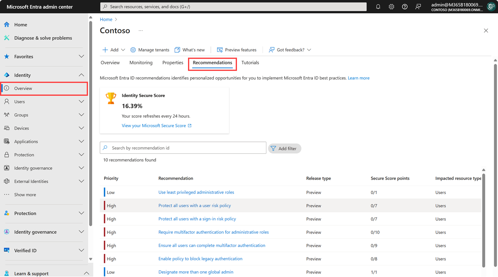
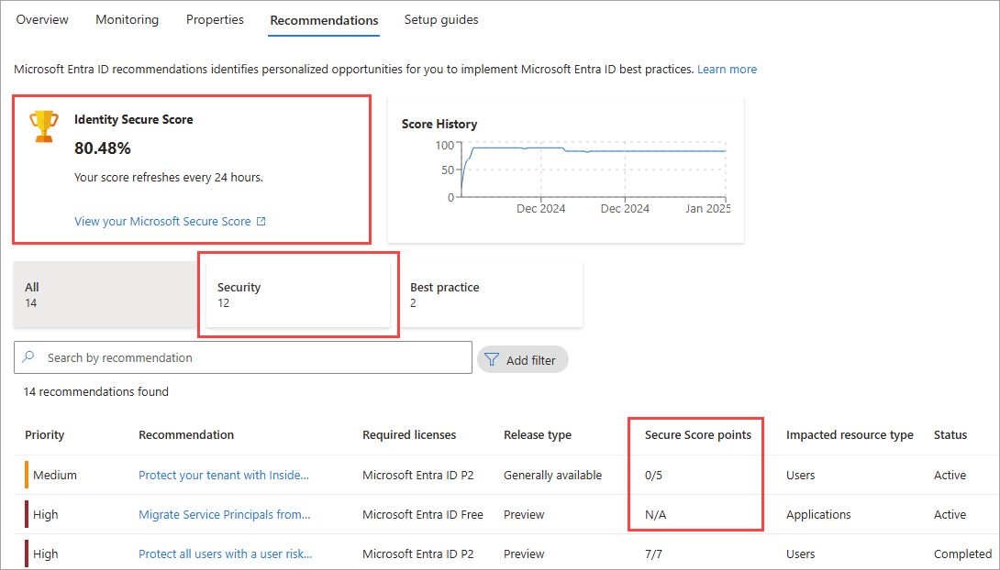

# What are Microsoft Entra recommendations?

Keeping track of all the settings and resources in your tenant can be overwhelming. The Microsoft Entra recommendations feature helps monitor the status of your tenant so you don't have to. These recommendations help ensure your tenant is in a secure and healthy state while also helping you maximize the value of the features available in Microsoft Entra ID.

Microsoft Entra recommendations now include *Identity Secure Score* recommendations. These recommendations provide similar insights into the security of your tenant. Identity Secure Score recommendations include *secure score points*, which are calculated as an overall score based on several security factors. For more information, see [What is Identity Secure Score](concept-identity-secure-score.md). 

All these Microsoft Entra recommendations provide you with personalized insights with actionable guidance to:

- Help you identify opportunities to implement best practices for Microsoft Entra related features.
- Improve the state of your Microsoft Entra tenant.
- Optimize the configurations for your scenarios.

This article gives you an overview of how you can use Microsoft Entra recommendations.

## How does it work?

On a daily basis, Microsoft Entra ID analyzes the configuration of your tenant. During this analysis, Microsoft Entra ID compares the configuration of your tenant with security best practices and recommendation data. If a recommendation is flagged as applicable to your tenant, the recommendation appears in the **Recommendations** section of the Microsoft Entra identity overview area. The recommendations are listed in order of priority so you can quickly determine where to focus first.

 

Your Identity Secure Score, which appears at the top of the page, is a numerical representation of the health of your tenant. Recommendations that apply to the Identity Secure Score are given individual scores in the table at the bottom of the page. These scores are added up to generate your Identity Secure Score. For more information, see [What is Identity Secure Score](concept-identity-secure-score.md).

Each recommendation contains a description, a summary of the value of addressing the recommendation, and a step-by-step action plan. If applicable, impacted resources associated with the recommendation are listed, so you can resolve each affected area. If a recommendation doesn't have any associated resources, the impacted resource type is *Tenant level*, so your step-by-step action plan impacts the entire tenant and not just a specific resource.

## Are Microsoft Entra recommendations related to Azure Advisor?

The Microsoft Entra recommendations feature is the Microsoft Entra specific implementation of [Azure Advisor](/azure/advisor/advisor-overview), which is a personalized cloud consultant that helps you follow best practices to optimize your Azure deployments. Azure Advisor analyzes your resource configuration and usage data to recommend solutions that can help you improve the cost effectiveness, performance, reliability, and security of your Azure resources.

Microsoft Entra recommendations use similar data to support you with the roll-out and management of Microsoft's best practices for Microsoft Entra tenants to keep your tenant in a secure and healthy state. The Microsoft Entra recommendations feature provides a holistic view into your tenant's security, health, and usage. 

## Recommendation availability and license requirements

The recommendations listed in the following table are currently available in public preview or general availability. The license requirements for recommendations in public preview are subject to change. The table provides the impacted resources and links to available documentation.

| Recommendation  | Impacted resources | Required license | Availability |
|---- |---- |---- |---- |
| [Enable Microsoft Purview Adaptive Protection and the Insider Risk condition in Conditional Access](recommendation-insider-risk-condition.md) | Users | Microsoft Entra Premium P2 | Generally available |
| [Convert per-user MFA to Conditional Access MFA](recommendation-turn-off-per-user-mfa.md) | Users | All licenses | Generally available |
| [Migrate applications from AD FS to Microsoft Entra ID](recommendation-migrate-apps-from-adfs-to-azure-ad.md) | Applications | All licenses | Generally available |
| [Migrate apps and service principals from Azure AD Graph to Microsoft Graph](recommendation-migrate-to-microsoft-graph-api.md) | Applications | All licenses | Public preview |
| [Migrate from ADAL to MSAL](recommendation-migrate-from-adal-to-msal.md) | Applications | All licenses | Generally available |
| [Migrate from MFA server to Microsoft Entra MFA](recommendation-migrate-to-microsoft-entra-mfa.md) | Tenant level | All licenses | Generally Available |
| [Migrate to Microsoft Authenticator](recommendation-migrate-to-authenticator.md) | Users | All licenses | Preview |
| [Minimize MFA prompts from known devices](recommendation-mfa-from-known-devices.md)  | Users | All licenses | Generally available |
| [Remove unused applications](recommendation-remove-unused-apps.md) | Applications | [Microsoft Entra Workload ID Premium](https://www.microsoft.com/security/business/identity-access/microsoft-entra-workload-id) | Public preview |
| [Remove unused credentials from applications](recommendation-remove-unused-credential-from-apps.md) | Applications | [Microsoft Entra Workload ID Premium](https://www.microsoft.com/security/business/identity-access/microsoft-entra-workload-id) | Public preview |
| [Renew expiring application credentials](recommendation-renew-expiring-application-credential.md) | Applications | [Microsoft Entra Workload ID Premium](https://www.microsoft.com/security/business/identity-access/microsoft-entra-workload-id) | Public preview |
| [Renew expiring service principal credentials](recommendation-renew-expiring-service-principal-credential.md) | Applications | [Microsoft Entra Workload ID Premium](https://www.microsoft.com/security/business/identity-access/microsoft-entra-workload-id) | Public preview |

Microsoft Entra only displays the recommendations that apply to your tenant, so you might not see all supported recommendations listed.
