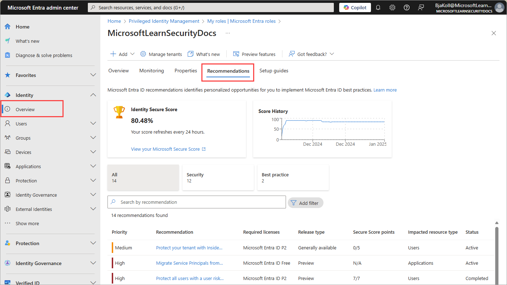

# What are Microsoft Entra recommendations?

Keeping track of all the settings and resources in your tenant can be overwhelming. The Microsoft Entra recommendations feature helps monitor the status of your tenant so you don't have to. These recommendations help ensure your tenant is in a secure and healthy state while also helping you maximize the value of the features available in Microsoft Entra ID.

Microsoft Entra recommendations now include *Identity Secure Score* recommendations. These recommendations provide similar insights into the security of your tenant. For more information, see [What is Identity Secure Score](concept-identity-secure-score.md). 

All these Microsoft Entra recommendations provide you with personalized insights with actionable guidance to:

- Help you identify opportunities to implement best practices for Microsoft Entra related features.
- Improve the state of your Microsoft Entra tenant.
- Optimize the configurations for your scenarios.

This article gives you an overview of how you can use Microsoft Entra recommendations.

## How does it work?

On a daily basis, Microsoft Entra ID analyzes the configuration of your tenant. During this analysis, Microsoft Entra ID compares the configuration of your tenant with security best practices and recommendation data. If a recommendation is flagged as applicable to your tenant, the recommendation appears in the **Recommendations** section of the Microsoft Entra identity overview area.

 

Each recommendation contains a description, a summary of the value of addressing the recommendation, and a step-by-step action plan. If applicable, impacted resources associated with the recommendation are listed, so you can resolve each affected area. If a recommendation doesn't have any associated resources, the impacted resource type is *Tenant level*, so your step-by-step action plan impacts the entire tenant and not just a specific resource.

## Recommendations overview table

The recommendations listed in the following table are currently available in public preview or general availability the types of resources addressed by the recommendation, and more. The license requirements for recommendations in public preview are subject to change. The table provides links to available documentation for those recommendations that required separate guidance.

| Recommendation | Impacted resources | Required license | Availability | Identity Secure Score | Target roles for email notifications |
| --- | --- | --- | --- | --- | --- |
| AAD Connect Deprecated | Tenant | All licenses | Preview | No | Hybrid Identity Administrator |
| [Convert per-user MFA to Conditional Access MFA](recommendation-turn-off-per-user-mfa.md) | Users | All licenses | Generally available | No | Security Administrator |
| Designate more than one Global Administrator | Users | All licenses | Generally available | Yes | Global Administrator |
| Do not allow users to grant consent to unreliable applications | | | | No | Global Administrator |
| Do not expire passwords | | | | No | Global Administrator |
| Enable password hash sync if hybrid | Tenant | All licenses | Generally available | Yes | Hybrid Identity Administrator |
| Enable policy to block legacy authentication | Users | All licenses | Generally available | Yes | Conditional Access Administrator, Security Administrator |
| Enable self-service password reset | Users | Microsoft Entra P1 | | Yes | Authentication Policy Administrator |
| Ensure all users can complete multifactor authentication | Users | | | No | Conditional Access Administrator, Security Administrator |
| Long lived credentials in applications | Applications | | Preview | No | Global Administrator |
| [Migrate applications from AD FS to Microsoft Entra ID](recommendation-migrate-apps-from-adfs-to-azure-ad.md) | Applications | All licenses | Generally available | No | Application Administrator, Authentication Administrator Hybrid Identity Administrator |
| [Migrate applications from the retiring Azure AD Graph APIs to Microsoft Graph](recommendation-migrate-to-microsoft-graph-api.md) | Applications | All licenses | Preview | No | Application Administrator |
| Migrate authentication methods off the legacy MFA & SSPR policies | | | Preview | No | Global Administrator |
| [Migrate from ADAL to MSAL](recommendation-migrate-from-adal-to-msal.md) | Applications | All licenses | Generally available | No | Application Administrator |
| [Migrate from MFA server to Microsoft Entra MFA](recommendation-migrate-to-microsoft-entra-mfa.md) | Tenant | All licenses | Generally Available | No | Global Administrator |
| [Migrate service principals from the retiring Azure AD Graph APIs to Microsoft Graph](recommendation-migrate-to-microsoft-graph-api.md) | Applications | All licenses | Preview | No | Application Administrator |
| [Migrate to Microsoft Authenticator](recommendation-migrate-to-authenticator.md) | Users | All licenses | Preview | | No |
| [Minimize MFA prompts from known devices](recommendation-mfa-from-known-devices.md) | Users | All licenses | Generally available | | No |
| MS Graph versioning | | | | No | Global Administrator |
| Optimize tenant MFA | | | | No | Security Administrator |
| Protect all users with a sign-in risk policy | Users | All licenses | Generally available | Yes | Conditional Access Administrator, Security Administrator |
| Protect all users with a user risk policy | Users | Microsoft Entra P2 | Generally available | Yes | Conditional Access Administrator, Security Administrator |
| [Protect your tenant with Insider Risk Conditional Access policy](recommendation-insider-risk-condition.md) | Users | Microsoft Entra P2 | Generally available | Yes | Conditional Access Administrator, Security Administrator |
| Remove overprivileged permissions for your applications | | | Preview | No | Global Administrator |
| [Remove unused applications](recommendation-remove-unused-apps.md) | Applications | *An external link was removed to protect your privacy.* | Preview | No | Application Administrator |
| [Remove unused credentials from applications](recommendation-remove-unused-credential-from-apps.md) | Applications | *An external link was removed to protect your privacy.* | Preview | No | Application Administrator |
| [Renew expiring application credentials](recommendation-renew-expiring-application-credential.md) | Applications | *An external link was removed to protect your privacy.* | Preview | No | Application Administrator |
| [Renew expiring service principal credentials](recommendation-renew-expiring-service-principal-credential.md) | Applications | *An external link was removed to protect your privacy.* | Preview | No | Application Administrator |
| Require MFA for administrative roles | Users | All licenses | Generally available | | Conditional Access Administrator, Security Administrator |
| Review inactive users with Access Reviews | Users | | Preview | Microsoft Entra ID Governance | Identity Governance Administrator |
| Secure and govern your apps with automatic user and group provisioning | Applications | All licenses | Preview | | Application Administrator, IT Governance Administrator |
| Use least privileged administrative roles | Users | | | | Privileged Role Administrator |
| Verify App Publisher | Applications | All licenses | Preview | | Global Administrator |

Microsoft Entra only displays the recommendations that apply to your tenant, so you might not see all supported recommendations listed.

## Identity Secure Score

Your Identity Secure Score, which appears at the top of the page, is a numerical representation of the health of your tenant. Recommendations that apply to the Identity Secure Score are given individual scores in the table at the bottom of the page. You can filter the list of recommendations to only those that apply to the Identity Secure Score using the **Security** filter card. Identity Secure Score recommendations include *secure score points*, which are calculated as an overall score based on several security factors.

These scores add up to generate your Identity Secure Score. For more information, see [What is Identity Secure Score](concept-identity-secure-score.md).

## Are Microsoft Entra recommendations related to Azure Advisor?

The Microsoft Entra recommendations feature is the Microsoft Entra specific implementation of [Azure Advisor](/azure/advisor/advisor-overview), which is a personalized cloud consultant that helps you follow best practices to optimize your Azure deployments. Azure Advisor analyzes your resource configuration and usage data to recommend solutions that can help you improve the cost effectiveness, performance, reliability, and security of your Azure resources.

Microsoft Entra recommendations use similar data to support you with the roll-out and management of Microsoft's best practices for Microsoft Entra tenants to keep your tenant in a secure and healthy state. The Microsoft Entra recommendations feature provides a holistic view into your tenant's security, health, and usage. 

## Email notifications (preview)

Microsoft Entra recommendations now generate email notifications when a new recommendation is generated. This new preview feature sends emails to a predetermined set of roles for each recommendation. For example, recommendations that are associated with the health of your tenant's applications are sent to users who have the Application Administrator role.

If your organization is using Privileged Identity Management (PIM), the recipients must be elevated to the role indicated in order to receive the email notification. If no one is actively assigned to the role, no emails are sent. For this reason, we recommend checking the recommendations regularly to ensure that you are aware of any new recommendations.