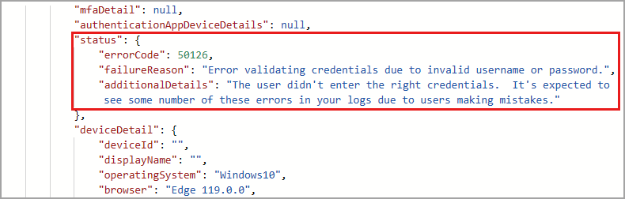

# Quickstart: Analyze a sign-in with the Microsoft Graph API 

In this Quickstart, you'll use the information in the Microsoft Entra sign-in logs to figure out what happened if a sign-in of a user failed. This quickstart shows you how to access the sign-in log using the Microsoft Graph API.

## Prerequisites

To complete the scenario in this quickstart, you need:

- **Access to a Microsoft Entra tenant**: If you don't have access to a Microsoft Entra tenant, see [Create your Azure free account today](https://azure.microsoft.com/free/?WT.mc_id=A261C142F). 
- **A test account called Isabella Simonsen**: If you don't know how to create a test account, see [Add cloud-based users](../../fundamentals/add-users.md#add-a-new-user).
- **Access to the Microsoft Graph API**: If you don't have access yet, see [Microsoft Graph authentication and authorization basics](/graph/auth/auth-concepts).

## Perform a failed sign-in

[!INCLUDE [portal update](../../includes/portal-update.md)]

The goal of this step is to create a record of a failed sign-in in the Microsoft Entra sign-in log.

1. Sign in to the [Microsoft Entra admin center](https://entra.microsoft.com) as Isabella Simonsen using an incorrect password.

1. Wait for 5 minutes to ensure that you can find a record of the sign-in entry in the logs.

## Find the failed sign-in

This section provides the steps to locate the failed sign-in attempt using the Microsoft Graph API.

1. Sign in to [Microsoft Graph Explorer](https://developer.microsoft.com/graph/graph-explorer) as a user with permissions to run a query.

1. Select **Modify permissions** to ensure you have the correct permissions. 

1. Select **GET** as the HTTP method from the dropdown.

1. Set the API version to **beta**.

1. Select **Run query**.

1. Review the query response and locate the **status** section of the response.

## Clean up resources

When no longer needed, delete the test user. If you don't know how to delete a Microsoft Entra user, see [Delete users from Microsoft Entra ID](../../fundamentals/add-users.md#delete-a-user).

## Next steps

> [!div class="nextstepaction"]
> [Integrate Microsoft Entra activity logs with Azure Monitor logs](howto-integrate-activity-logs-with-azure-monitor-logs.yml)
