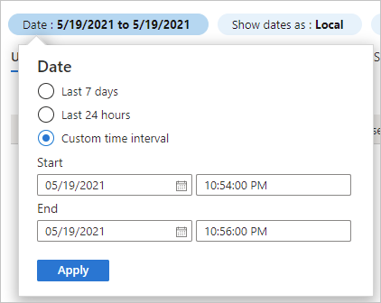

# Quickstart: Analyze sign-ins with the Microsoft Entra sign-in log 

With the information in the Microsoft Entra sign-in log, you can figure out what happened if a sign-in of a user failed. This quickstart shows how to you can locate failed sign-in using the sign-in log.

## Prerequisites

To complete the scenario in this quickstart, you need:

- A Microsoft Entra tenant with a [Premium P1 license](~/fundamentals/get-started-premium.md)
- A user with the **Reports Reader**, **Security Reader**, or **Security Administrator** role for the tenant.
- **A test account called Isabella Simonsen** - If you don't know how to create a test account, see [Add cloud-based users](~/fundamentals/add-users.md#add-a-new-user).

## Perform a failed sign-in

The goal of this step is to create a record of a failed sign-in in the Microsoft Entra sign-in log.

1. Sign in to the [Microsoft Entra admin center](https://entra.microsoft.com) as Isabella Simonsen using an incorrect password.

2. Wait for 5 minutes to ensure that you can find the event in the sign-in log.

## Find the failed sign-in

This section provides you with the steps to analyze a failed sign-in. Filter the sign-in log to remove all records that aren't relevant to your analysis. For example, set a filter to display only the records of a specific user. Then you can review the error details. The log details provide helpful information. You can also look up the error using the [sign-in error lookup tool](https://login.microsoftonline.com/error). This tool might provide you with information to troubleshoot a sign-in error. 

[!INCLUDE [portal updates](~/includes/portal-update.md)]

1. Sign in to the [Microsoft Entra admin center](https://entra.microsoft.com) as at least a [Reports Reader](~/identity/role-based-access-control/permissions-reference.md#reports-reader). 

1. Browse to **Identity** > **Monitoring & health** > **Sign-in logs**.

1. Adjust the filter to view only the records for Isabella Simonsen:

    1. Open the **Add filters**, select **User**, and then select **Apply**.
    
       

    1. In the **User** textbox, type **Isabella Simonsen**, and then select **Apply**.

1. Select the failed sign-in attempt and view the details.

1. Copy the **Sign-in error code**.

       

1. Paste the error code into the textbox of the [sign-in error lookup tool](https://login.microsoftonline.com/error), and then select **Submit**.

Review the outcome of the tool and determine whether it provides you with additional information.

## More tests

Now, that you know how to find an entry in the sign-in log by name, you should also try to find the record using the following filters:

- **Date** - Try to find Isabella using a **Start** and an **End**.

    

- **Status** - Try to find Isabella using **Status: Failure**.

    

## Clean up resources

When no longer needed, delete the test user. If you don't know how to delete a Microsoft Entra user, see [Delete users from Microsoft Entra ID](~/fundamentals/add-users.md#delete-a-user). 

## Next step

> [!div class="nextstepaction"]
> [Learn how to use the sign-in diagnostic](howto-use-sign-in-diagnostics.md)
